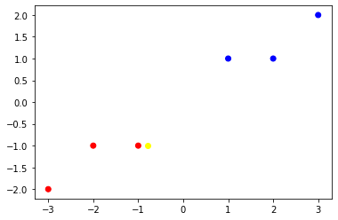
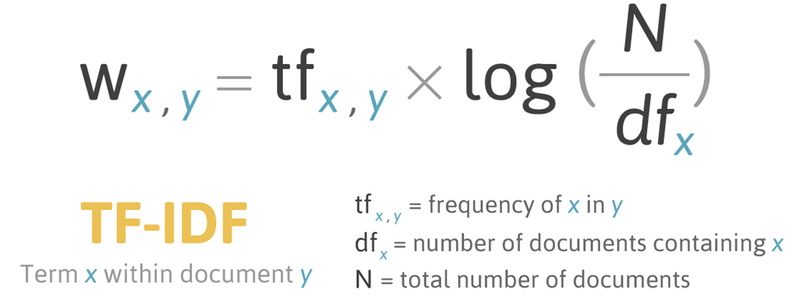
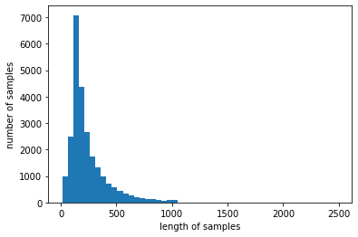
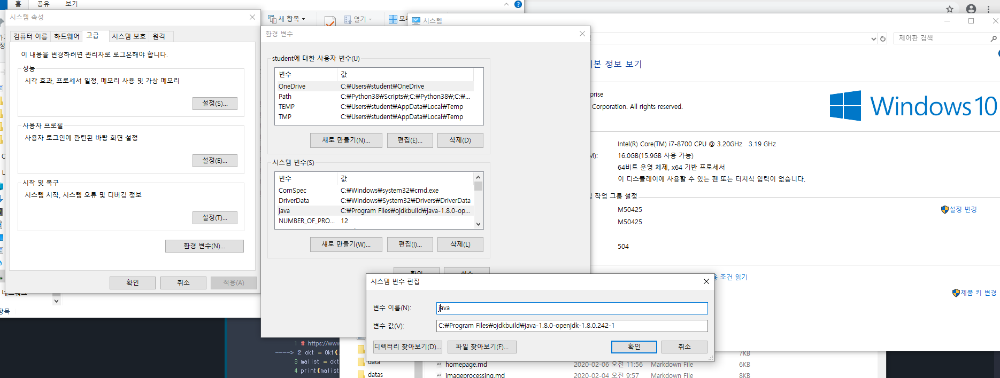

# 자연어처리(NLP)

> pip install gensim
>
> pip install wordcloud
>
> pip install konlpy --user
>
> 
>
> conda install -c conda-forge jpype1


```python
import numpy as np
from sklearn.naive_bayes import GaussianNB
from sklearn.metrics import accuracy_score
from sklearn.feature_extraction.text import CountVectorizer
from sklearn.feature_extraction.text import TfidfVectorizer
from sklearn.metrics.pairwise import cosine_similarity
from sklearn.linear_model import SGDClassifier
from sklearn.svm import LinearSVC
from tensorflow.keras.datasets import imdb
from konlpy.tag import Twitter
from konlpy.tag import Okt
from konlpy.tag import Kkma 
from konlpy.tag import Twitter
from pprint import pprint
import nltk
from nltk.classify.scikitlearn import SklearnClassifier
from wordcloud import WordCloud, STOPWORDS
from gensim import corpora, models
import numpy  as np
from PIL import Image
from wordcloud import ImageColorGenerator
import glob
import re
import matplotlib.pyplot as plt
from tensorflow.keras.preprocessing.text import Tokenizer
from tensorflow.keras.preprocessing.sequence import pad_sequences
%matplotlib inline

```


```python
ko_str = '이것은 한국어 문장입니다.'
ja_str = 'これは日本語の文章です。'
en_str = 'This is English Sentences.'
ch_str = '统一码'
```


```python
print(ko_str[0])
```

    이


```python
print(ord(ko_str[0]))
print(ord(ja_str[0]))
print(ord(en_str[0]))
print(ord(ch_str[0]))
```

    51060
    12371
    84
    32479


```python
# Unicode 코드 포인트로 출현 빈도 판정하기 --- (*1)
def count_codePoint(str):
    # Unicode 코드 포인트를 저장할 배열 준비하기 --- (*2)
    counter = np.zeros(65535)
    for i in range(len(str)):
        # 각 문자를 Unicode 코드 포인트로 변환하기 --- (*3)
        code_point = ord(str[i])
        if code_point > 65535 :
            continue
        # 출현 횟수 세기 --- (*4)
        counter[code_point] += 1

    # 각 요소를 문자 수로 나눠 정규화하기 --- (*5)
    counter = counter/len(str)
    return counter
```


```python
# 학습 전용 데이터 준비하기
ko_str = '이것은 한국어 문장입니다.'
ja_str = 'これは日本語の文章です。'
en_str = 'This is English Sentences.'

x_train = [count_codePoint(ko_str),count_codePoint(ja_str),count_codePoint(en_str)]
y_train = ['ko','ja','en']
```


```python
print(x_train[0])
print(np.where(x_train[0] > 0))

idx = np.where(x_train[0] > 0)
data = x_train[0]
print(data[idx])


```

    [0. 0. 0. ... 0. 0. 0.]
    (array([   32,    46, 44163, 44397, 45768, 45796, 47928, 50612, 51008,
           51060, 51077, 51109, 54620], dtype=int64),)
    [0.14285714 0.07142857 0.07142857 0.07142857 0.07142857 0.07142857
     0.07142857 0.07142857 0.07142857 0.07142857 0.07142857 0.07142857
     0.07142857]


```python
#X = np.array([[-1, -1], [3, 2]])
#Y = np.array([1,  2])

X = np.array([[-1, -1], [-2, -1], [-3, -2], [1, 1], [2, 1], [3, 2]])
Y = np.array([1, 1, 1, 2, 2, 2])


color = [ 'red' if y == 1 else 'blue' for y in Y]

plt.scatter(X[:, 0], X[:, 1], color=color)

t = np.array([[-0.8, -1]])

plt.scatter(t[:,0], t[:,1], color='yellow')
```


    <matplotlib.collections.PathCollection at 0x17f4e889908>





```python
clf = GaussianNB()
clf.fit(X, Y)
print(clf.predict([[-0.8, -1]]))
```

    [1]


```python
clf.fit([[0,0], [0,1], [1,0], [1,1]], [0,1,1,0])
print(clf.predict([[0, 1]]))
```

    [0]


```python
# 학습하기 --- (*6)
clf = GaussianNB() 
clf.fit(x_train, y_train)
```


    GaussianNB(priors=None, var_smoothing=1e-09)


```python
y_pred = clf.predict([count_codePoint('안녕. 어디야')])
print(y_pred)
```

    ['ko']


```python
# 평가 전용 데이터 준비하기
ko_test_str = '안녕'
ja_test_str = 'こんにちは'
en_test_str = 'Hello'
x_test = [count_codePoint(en_test_str),count_codePoint(ja_test_str),count_codePoint(ko_test_str)]
y_test = ['en', 'ja', 'ko']

# 평가하기 --- (*7)
y_pred = clf.predict(x_test)
print(y_pred)
print(y_test)
print("정답률 = " , accuracy_score(y_test, y_pred))
```

    ['en' 'ja' 'ja']
    ['en', 'ja', 'ko']
    정답률 =  0.6666666666666666


* 문자셋이 동일한 경우


```python
# 학습 데이터 준비하기 --- (*1)
x_train = []
y_train = []
for file in glob.glob('./train/*.txt'):
    # 언어 정보를 추출하고 레이블로 지정하기 --- (*2)
    print(file)
    y_train.append(file[8:10])
    
    # 파일 내부의 문자열을 모두 추출한 뒤 빈도 배열로 변환한 뒤 입력 데이터로 사용하기 --- (*3)
    file_str = ''
    for line in open(file, 'r', encoding='UTF8'):
        file_str = file_str + line
    x_train.append(count_codePoint(file_str))
```

    ./train\de_cat.txt
    ./train\de_dog.txt
    ./train\de_elephant.txt
    ./train\en_cat.txt
    ./train\en_dog.txt
    ./train\en_elephant.txt
    ./train\es_cat.txt
    ./train\es_dog.txt
    ./train\es_elephant.txt


```python
# 학습하기
clf = GaussianNB() 
clf.fit(x_train, y_train)
```


    GaussianNB(priors=None, var_smoothing=1e-09)


```python
y_pred = clf.predict([count_codePoint('hello, my name is ')])
print(y_pred)
```

    ['de']


# 단어 빈도수 기반 자연어 처리

* 단어 빈도수 기반


```python
corpus = [
    'you know I want your love',                
    'I like you',
    'what should I do ',    
    'what should',    
    'should what',    
]
```


```python
str = " ".join(corpus)
print(str)
words = str.split(' ')
print(words)
freq = {}
for w in words:
    freq[w] = freq.get(w, 0) + 1
print(freq)
```

    you know I want your love I like you what should I do  what should should what
    ['you', 'know', 'I', 'want', 'your', 'love', 'I', 'like', 'you', 'what', 'should', 'I', 'do', '', 'what', 'should', 'should', 'what']
    {'you': 2, 'know': 1, 'I': 3, 'want': 1, 'your': 1, 'love': 1, 'like': 1, 'what': 3, 'should': 3, 'do': 1, '': 1}


```python
vector = CountVectorizer()
tf = vector.fit_transform(corpus)
print(tf)
print(tf.toarray())  
# 일반적으로 한글자 짜리 단어는 불용어처리되어 빠지게 됨 
#그래서 위에 문장(corpus)에서 "I"가 빠져 행렬에 1이 단어수 보다 1개가 적음
```

      (0, 7)	1
      (0, 1)	1
      (0, 5)	1
      (0, 8)	1
      (0, 3)	1
      (1, 7)	1
      (1, 2)	1
      (2, 6)	1
      (2, 4)	1
      (2, 0)	1
      (3, 6)	1
      (3, 4)	1
      (4, 6)	1
      (4, 4)	1
    [[0 1 0 1 0 1 0 1 1]
     [0 0 1 0 0 0 0 1 0]
     [1 0 0 0 1 0 1 0 0]
     [0 0 0 0 1 0 1 0 0]
     [0 0 0 0 1 0 1 0 0]]


```python
print(tf.shape)  # (문장, 단어수)
```

    (5, 9)


```python
print(vector.vocabulary_) # 각 단어의 인덱스가 어떻게 부여되었는지를 보여준다
```

    {'you': 7, 'know': 1, 'want': 5, 'your': 8, 'love': 3, 'like': 2, 'what': 6, 'should': 4, 'do': 0}


```python
print(vector.vocabulary_['you'])
print(vector.vocabulary_.get('you'))
```

    7
    7


```python
words = vector.get_feature_names()
for word in words: print(word)
    
for key in vector.vocabulary_:
    print(key, vector.vocabulary_[key])
```

    do
    know
    like
    love
    should
    want
    what
    you
    your
    you 7
    know 1
    want 5
    your 8
    love 3
    like 2
    what 6
    should 4
    do 0


TF-IDF ( Term Frequency - Inverse Document Frequency)

- TF : 현재 문서에서 단어 A가 나타난 횟수
- DF : 단어가 나타난 문서의 수
- 특정 단어의 상대적인 빈도를 나타내주는 값
- TF-IDF 값이 클 수록 내 문서에만 많이 언급되는 단어(=다른 문서에서는 잘 언급 안됨)
- TF-IDF 값이 작을수록 다른 문서에 잘 언급하는 단어를 의미(=현재 문서와 관련 없음)




```python
sent = ["오늘 휴일", 
        "휴일 오늘", 
        "휴일 인 오늘 도 서쪽 을 중심 으로 폭염 이 이어졌는데요, 내일 은 반가운 비 소식 이 있습니다.", 
        "폭염 을 피해서 휴일 에 놀러왔다가 갑작스런 비 로 인해 망연자실 하고 있습니 다.", 
        " 내일 은 반가운 비 소식 이 있습니다."] 

tfidf_vectorizer = TfidfVectorizer()
tfidf_matrix = tfidf_vectorizer.fit_transform(sent) #문장 벡터화 진행
print(tfidf_matrix)
print(type(tfidf_matrix))
```

      (0, 17)	0.6437444595062429
      (0, 7)	0.7652405313723362
      (1, 17)	0.6437444595062429
      (1, 7)	0.7652405313723362
      (2, 12)	0.28487998702172107
      (2, 6)	0.28487998702172107
      (2, 4)	0.28487998702172107
      (2, 1)	0.28487998702172107
      (2, 9)	0.35310140100264525
      (2, 14)	0.28487998702172107
      (2, 8)	0.35310140100264525
      (2, 13)	0.35310140100264525
      (2, 5)	0.35310140100264525
      (2, 17)	0.19893117008503197
      (2, 7)	0.23647612349029334
      (3, 11)	0.3542556015420614
      (3, 16)	0.3542556015420614
      (3, 3)	0.3542556015420614
      (3, 10)	0.3542556015420614
      (3, 0)	0.3542556015420614
      (3, 2)	0.3542556015420614
      (3, 15)	0.3542556015420614
      (3, 14)	0.28581118874948447
      (3, 17)	0.1995814265359179
      (4, 12)	0.5
      (4, 6)	0.5
      (4, 4)	0.5
      (4, 1)	0.5
    <class 'scipy.sparse.csr.csr_matrix'>


```python
print(tfidf_matrix.toarray().shape)
print(tfidf_matrix.toarray())
```

    (5, 18)
    [[0.         0.         0.         0.         0.         0.
      0.         0.76524053 0.         0.         0.         0.
      0.         0.         0.         0.         0.         0.64374446]
     [0.         0.         0.         0.         0.         0.
      0.         0.76524053 0.         0.         0.         0.
      0.         0.         0.         0.         0.         0.64374446]
     [0.         0.28487999 0.         0.         0.28487999 0.3531014
      0.28487999 0.23647612 0.3531014  0.3531014  0.         0.
      0.28487999 0.3531014  0.28487999 0.         0.         0.19893117]
     [0.3542556  0.         0.3542556  0.3542556  0.         0.
      0.         0.         0.         0.         0.3542556  0.3542556
      0.         0.         0.28581119 0.3542556  0.3542556  0.19958143]
     [0.         0.5        0.         0.         0.5        0.
      0.5        0.         0.         0.         0.         0.
      0.5        0.         0.         0.         0.         0.        ]]


```python
features = tfidf_vectorizer.get_feature_names()
print(features)
```

    ['갑작스런', '내일', '놀러왔다가', '망연자실', '반가운', '서쪽', '소식', '오늘', '으로', '이어졌는데요', '인해', '있습니', '있습니다', '중심', '폭염', '피해서', '하고', '휴일']


```python
mat = np.asarray(tfidf_matrix.toarray())
srch=['오늘', '폭염']
print([  tfidf_vectorizer.vocabulary_.get(i) for i in srch])

srch_dtm = mat[:, [  tfidf_vectorizer.vocabulary_.get(i) for i in srch]]

#srch_dtm = mat[:, [7,17]]
#srch_dtm = mat[:, 7]

print(srch_dtm)
```

    [7, 14]
    [[0.76524053 0.        ]
     [0.76524053 0.        ]
     [0.23647612 0.28487999]
     [0.         0.28581119]
     [0.         0.        ]]


```python
score = srch_dtm.sum(axis=1)
print(score)

for i in range(len(score)):
    if score[i] > 0:
        print('{} / score : {}'.format(sent[i], score[i]))  
```

    [0.76524053 0.76524053 0.52135611 0.28581119 0.        ]
    오늘 휴일 / score : 0.7652405313723362
    휴일 오늘 / score : 0.7652405313723362
    휴일 인 오늘 도 서쪽 을 중심 으로 폭염 이 이어졌는데요, 내일 은 반가운 비 소식 이 있습니다. / score : 0.5213561105120144
    폭염 을 피해서 휴일 에 놀러왔다가 갑작스런 비 로 인해 망연자실 하고 있습니 다. / score : 0.28581118874948447


```python
sentences = ['This is the first document.',
              'This is the second document.',
              'And the third one.',
              'Is this the first document?']
vect = TfidfVectorizer()
X = vect.fit_transform(sentences)
```


```python
y = [1,1,2,2]
model = SGDClassifier(loss='perceptron') 
model.fit(X, y)
```


    SGDClassifier(alpha=0.0001, average=False, class_weight=None,
                  early_stopping=False, epsilon=0.1, eta0=0.0, fit_intercept=True,
                  l1_ratio=0.15, learning_rate='optimal', loss='perceptron',
                  max_iter=1000, n_iter_no_change=5, n_jobs=None, penalty='l2',
                  power_t=0.5, random_state=None, shuffle=True, tol=0.001,
                  validation_fraction=0.1, verbose=0, warm_start=False)


```python
X_pred = vect.transform(['My new document third'])
y_pred = model.predict(X_pred)
print(y_pred)
```

    [2]

# 리뷰에서 자연어 처리


```python
(X_train, y_train), (X_test, y_test) = imdb.load_data(num_words=10000)  # 단어 빈도수 상위 10000개 사용

```

    Downloading data from https://storage.googleapis.com/tensorflow/tf-keras-datasets/imdb.npz
    17465344/17464789 [==============================] - 1s 0us/step


```python
print('훈련용 리뷰 개수 : {}'.format(len(X_train)))
print('테스트용 리뷰 개수 : {}'.format(len(X_test)))
num_classes = max(y_train) + 1
print('카테고리 : {}'.format(num_classes))
# 이 경우에는 긍정을 의미하는 1의 값을 가집니다. 0은 부정
```

    훈련용 리뷰 개수 : 25000
    테스트용 리뷰 개수 : 25000
    카테고리 : 2


```python
print(X_train[0])
print(X_train[1])
print(len(X_train[0]))   
print(len(X_train[1]))
```

    [1, 14, 22, 16, 43, 530, 973, 1622, 1385, 65, 458, 4468, 66, 3941, 4, 173, 36, 256, 5, 25, 100, 43, 838, 112, 50, 670, 2, 9, 35, 480, 284, 5, 150, 4, 172, 112, 167, 2, 336, 385, 39, 4, 172, 4536, 1111, 17, 546, 38, 13, 447, 4, 192, 50, 16, 6, 147, 2025, 19, 14, 22, 4, 1920, 4613, 469, 4, 22, 71, 87, 12, 16, 43, 530, 38, 76, 15, 13, 1247, 4, 22, 17, 515, 17, 12, 16, 626, 18, 2, 5, 62, 386, 12, 8, 316, 8, 106, 5, 4, 2223, 5244, 16, 480, 66, 3785, 33, 4, 130, 12, 16, 38, 619, 5, 25, 124, 51, 36, 135, 48, 25, 1415, 33, 6, 22, 12, 215, 28, 77, 52, 5, 14, 407, 16, 82, 2, 8, 4, 107, 117, 5952, 15, 256, 4, 2, 7, 3766, 5, 723, 36, 71, 43, 530, 476, 26, 400, 317, 46, 7, 4, 2, 1029, 13, 104, 88, 4, 381, 15, 297, 98, 32, 2071, 56, 26, 141, 6, 194, 7486, 18, 4, 226, 22, 21, 134, 476, 26, 480, 5, 144, 30, 5535, 18, 51, 36, 28, 224, 92, 25, 104, 4, 226, 65, 16, 38, 1334, 88, 12, 16, 283, 5, 16, 4472, 113, 103, 32, 15, 16, 5345, 19, 178, 32]
    [1, 194, 1153, 194, 8255, 78, 228, 5, 6, 1463, 4369, 5012, 134, 26, 4, 715, 8, 118, 1634, 14, 394, 20, 13, 119, 954, 189, 102, 5, 207, 110, 3103, 21, 14, 69, 188, 8, 30, 23, 7, 4, 249, 126, 93, 4, 114, 9, 2300, 1523, 5, 647, 4, 116, 9, 35, 8163, 4, 229, 9, 340, 1322, 4, 118, 9, 4, 130, 4901, 19, 4, 1002, 5, 89, 29, 952, 46, 37, 4, 455, 9, 45, 43, 38, 1543, 1905, 398, 4, 1649, 26, 6853, 5, 163, 11, 3215, 2, 4, 1153, 9, 194, 775, 7, 8255, 2, 349, 2637, 148, 605, 2, 8003, 15, 123, 125, 68, 2, 6853, 15, 349, 165, 4362, 98, 5, 4, 228, 9, 43, 2, 1157, 15, 299, 120, 5, 120, 174, 11, 220, 175, 136, 50, 9, 4373, 228, 8255, 5, 2, 656, 245, 2350, 5, 4, 9837, 131, 152, 491, 18, 2, 32, 7464, 1212, 14, 9, 6, 371, 78, 22, 625, 64, 1382, 9, 8, 168, 145, 23, 4, 1690, 15, 16, 4, 1355, 5, 28, 6, 52, 154, 462, 33, 89, 78, 285, 16, 145, 95]
    218
    189


```python
print('리뷰의 최대 길이 : {}'.format(max(len(l) for l in X_train)))
print('리뷰의 평균 길이 : {}'.format(sum(map(len, X_train))/len(X_train)))

plt.hist([len(s) for s in X_train], bins=50)
plt.xlabel('length of samples')
plt.ylabel('number of samples')
plt.show()
```

    리뷰의 최대 길이 : 2494
    리뷰의 평균 길이 : 238.71364





```python
word_to_index = imdb.get_word_index()    # 없으면 다운로드함
```


```python
word_to_index
```


    {'fawn': 34701,
     'tsukino': 52006,
     'nunnery': 52007,
     'sonja': 16816,
     'vani': 63951,
     'woods': 1408,
     'spiders': 16115,
     'hanging': 2345,
     'woody': 2289,
     'trawling': 52008,
     "hold's": 52009,
     'comically': 11307,
     'localized': 40830,
     'disobeying': 30568,
     "'royale": 52010,
     "harpo's": 40831,
     'canet': 52011,
     'aileen': 19313,
     'acurately': 52012,
     "diplomat's": 52013,
     'rickman': 25242,
     'arranged': 6746,
     'rumbustious': 52014,
     'familiarness': 52015,
     "spider'": 52016,
     'hahahah': 68804,
     "wood'": 52017,
     'transvestism': 40833,
     "hangin'": 34702,
     'bringing': 2338,
     'seamier': 40834,
     'wooded': 34703,
     'bravora': 52018,
     'grueling': 16817,
     'wooden': 1636,
     'wednesday': 16818,
     "'prix": 52019,
     'altagracia': 34704,
     'circuitry': 52020,
     'crotch': 11585,
     'busybody': 57766,
     "tart'n'tangy": 52021,
     'burgade': 14129,
     'thrace': 52023,
     "tom's": 11038,
     'snuggles': 52025,
     'francesco': 29114,
     'complainers': 52027,
     'templarios': 52125,
     '272': 40835,
     '273': 52028,
     'zaniacs': 52130,
     '275': 34706,
     'consenting': 27631,
     'snuggled': 40836,
     'inanimate': 15492,
     'uality': 52030,
     'bronte': 11926,
     'errors': 4010,
     'dialogs': 3230,
     "yomada's": 52031,
     "madman's": 34707,
     'dialoge': 30585,
     'usenet': 52033,
     'videodrome': 40837,
     "kid'": 26338,
     'pawed': 52034,
     "'girlfriend'": 30569,
     "'pleasure": 52035,
     "'reloaded'": 52036,
     "kazakos'": 40839,
     'rocque': 52037,
     'mailings': 52038,
     'brainwashed': 11927,
     'mcanally': 16819,
     "tom''": 52039,
     'kurupt': 25243,
     'affiliated': 21905,
     'babaganoosh': 52040,
     "noe's": 40840,
     'quart': 40841,
     'kids': 359,
     'uplifting': 5034,
     'controversy': 7093,
     'kida': 21906,
     'kidd': 23379,
     "error'": 52041,
     'neurologist': 52042,
     'spotty': 18510,
     'cobblers': 30570,
     'projection': 9878,
     'fastforwarding': 40842,
     'sters': 52043,
     "eggar's": 52044,
     'etherything': 52045,
     'gateshead': 40843,
     'airball': 34708,
     'unsinkable': 25244,
     'stern': 7180,
     "cervi's": 52046,
     'dnd': 40844,
     'dna': 11586,
     'insecurity': 20598,
     "'reboot'": 52047,
     'trelkovsky': 11037,
     'jaekel': 52048,
     'sidebars': 52049,
     "sforza's": 52050,
     'distortions': 17633,
     'mutinies': 52051,
     'sermons': 30602,
     '7ft': 40846,
     'boobage': 52052,
     "o'bannon's": 52053,
     'populations': 23380,
     'chulak': 52054,
     'mesmerize': 27633,
     'quinnell': 52055,
     'yahoo': 10307,
     'meteorologist': 52057,
     'beswick': 42577,
     'boorman': 15493,
     'voicework': 40847,
     "ster'": 52058,
     'blustering': 22922,
     'hj': 52059,
     'intake': 27634,
     'morally': 5621,
     'jumbling': 40849,
     'bowersock': 52060,
     "'porky's'": 52061,
     'gershon': 16821,
     'ludicrosity': 40850,
     'coprophilia': 52062,
     'expressively': 40851,
     "india's": 19500,
     "post's": 34710,
     'wana': 52063,
     'wang': 5283,
     'wand': 30571,
     'wane': 25245,
     'edgeways': 52321,
     'titanium': 34711,
     'pinta': 40852,
     'want': 178,
     'pinto': 30572,
     'whoopdedoodles': 52065,
     'tchaikovsky': 21908,
     'travel': 2103,
     "'victory'": 52066,
     'copious': 11928,
     'gouge': 22433,
     "chapters'": 52067,
     'barbra': 6702,
     'uselessness': 30573,
     "wan'": 52068,
     'assimilated': 27635,
     'petiot': 16116,
     'most\x85and': 52069,
     'dinosaurs': 3930,
     'wrong': 352,
     'seda': 52070,
     'stollen': 52071,
     'sentencing': 34712,
     'ouroboros': 40853,
     'assimilates': 40854,
     'colorfully': 40855,
     'glenne': 27636,
     'dongen': 52072,
     'subplots': 4760,
     'kiloton': 52073,
     'chandon': 23381,
     "effect'": 34713,
     'snugly': 27637,
     'kuei': 40856,
     'welcomed': 9092,
     'dishonor': 30071,
     'concurrence': 52075,
     'stoicism': 23382,
     "guys'": 14896,
     "beroemd'": 52077,
     'butcher': 6703,
     "melfi's": 40857,
     'aargh': 30623,
     'playhouse': 20599,
     'wickedly': 11308,
     'fit': 1180,
     'labratory': 52078,
     'lifeline': 40859,
     'screaming': 1927,
     'fix': 4287,
     'cineliterate': 52079,
     'fic': 52080,
     'fia': 52081,
     'fig': 34714,
     'fmvs': 52082,
     'fie': 52083,
     'reentered': 52084,
     'fin': 30574,
     'doctresses': 52085,
     'fil': 52086,
     'zucker': 12606,
     'ached': 31931,
     'counsil': 52088,
     'paterfamilias': 52089,
     'songwriter': 13885,
     'shivam': 34715,
     'hurting': 9654,
     'effects': 299,
     'slauther': 52090,
     "'flame'": 52091,
     'sommerset': 52092,
     'interwhined': 52093,
     'whacking': 27638,
     'bartok': 52094,
     'barton': 8775,
     'frewer': 21909,
     "fi'": 52095,
     'ingrid': 6192,
     'stribor': 30575,
     'approporiately': 52096,
     'wobblyhand': 52097,
     'tantalisingly': 52098,
     'ankylosaurus': 52099,
     'parasites': 17634,
     'childen': 52100,
     "jenkins'": 52101,
     'metafiction': 52102,
     'golem': 17635,
     'indiscretion': 40860,
     "reeves'": 23383,
     "inamorata's": 57781,
     'brittannica': 52104,
     'adapt': 7916,
     "russo's": 30576,
     'guitarists': 48246,
     'abbott': 10553,
     'abbots': 40861,
     'lanisha': 17649,
     'magickal': 40863,
     'mattter': 52105,
     "'willy": 52106,
     'pumpkins': 34716,
     'stuntpeople': 52107,
     'estimate': 30577,
     'ugghhh': 40864,
     'gameplay': 11309,
     "wern't": 52108,
     "n'sync": 40865,
     'sickeningly': 16117,
     'chiara': 40866,
     'disturbed': 4011,
     'portmanteau': 40867,
     'ineffectively': 52109,
     "duchonvey's": 82143,
     "nasty'": 37519,
     'purpose': 1285,
     'lazers': 52112,
     'lightened': 28105,
     'kaliganj': 52113,
     'popularism': 52114,
     "damme's": 18511,
     'stylistics': 30578,
     'mindgaming': 52115,
     'spoilerish': 46449,
     "'corny'": 52117,
     'boerner': 34718,
     'olds': 6792,
     'bakelite': 52118,
     'renovated': 27639,
     'forrester': 27640,
     "lumiere's": 52119,
     'gaskets': 52024,
     'needed': 884,
     'smight': 34719,
     'master': 1297,
     "edie's": 25905,
     'seeber': 40868,
     'hiya': 52120,
     'fuzziness': 52121,
     'genesis': 14897,
     'rewards': 12607,
     'enthrall': 30579,
     "'about": 40869,
     "recollection's": 52122,
     'mutilated': 11039,
     'fatherlands': 52123,
     "fischer's": 52124,
     'positively': 5399,
     '270': 34705,
     'ahmed': 34720,
     'zatoichi': 9836,
     'bannister': 13886,
     'anniversaries': 52127,
     "helm's": 30580,
     "'work'": 52128,
     'exclaimed': 34721,
     "'unfunny'": 52129,
     '274': 52029,
     'feeling': 544,
     "wanda's": 52131,
     'dolan': 33266,
     '278': 52133,
     'peacoat': 52134,
     'brawny': 40870,
     'mishra': 40871,
     'worlders': 40872,
     'protags': 52135,
     'skullcap': 52136,
     'dastagir': 57596,
     'affairs': 5622,
     'wholesome': 7799,
     'hymen': 52137,
     'paramedics': 25246,
     'unpersons': 52138,
     'heavyarms': 52139,
     'affaire': 52140,
     'coulisses': 52141,
     'hymer': 40873,
     'kremlin': 52142,
     'shipments': 30581,
     'pixilated': 52143,
     "'00s": 30582,
     'diminishing': 18512,
     'cinematic': 1357,
     'resonates': 14898,
     'simplify': 40874,
     "nature'": 40875,
     'temptresses': 40876,
     'reverence': 16822,
     'resonated': 19502,
     'dailey': 34722,
     '2\x85': 52144,
     'treize': 27641,
     'majo': 52145,
     'kiya': 21910,
     'woolnough': 52146,
     'thanatos': 39797,
     'sandoval': 35731,
     'dorama': 40879,
     "o'shaughnessy": 52147,
     'tech': 4988,
     'fugitives': 32018,
     'teck': 30583,
     "'e'": 76125,
     'doesn’t': 40881,
     'purged': 52149,
     'saying': 657,
     "martians'": 41095,
     'norliss': 23418,
     'dickey': 27642,
     'dicker': 52152,
     "'sependipity": 52153,
     'padded': 8422,
     'ordell': 57792,
     "sturges'": 40882,
     'independentcritics': 52154,
     'tempted': 5745,
     "atkinson's": 34724,
     'hounded': 25247,
     'apace': 52155,
     'clicked': 15494,
     "'humor'": 30584,
     "martino's": 17177,
     "'supporting": 52156,
     'warmongering': 52032,
     "zemeckis's": 34725,
     'lube': 21911,
     'shocky': 52157,
     'plate': 7476,
     'plata': 40883,
     'sturgess': 40884,
     "nerds'": 40885,
     'plato': 20600,
     'plath': 34726,
     'platt': 40886,
     'mcnab': 52159,
     'clumsiness': 27643,
     'altogether': 3899,
     'massacring': 42584,
     'bicenntinial': 52160,
     'skaal': 40887,
     'droning': 14360,
     'lds': 8776,
     'jaguar': 21912,
     "cale's": 34727,
     'nicely': 1777,
     'mummy': 4588,
     "lot's": 18513,
     'patch': 10086,
     'kerkhof': 50202,
     "leader's": 52161,
     "'movie": 27644,
     'uncomfirmed': 52162,
     'heirloom': 40888,
     'wrangle': 47360,
     'emotion\x85': 52163,
     "'stargate'": 52164,
     'pinoy': 40889,
     'conchatta': 40890,
     'broeke': 41128,
     'advisedly': 40891,
     "barker's": 17636,
     'descours': 52166,
     'lots': 772,
     'lotr': 9259,
     'irs': 9879,
     'lott': 52167,
     'xvi': 40892,
     'irk': 34728,
     'irl': 52168,
     'ira': 6887,
     'belzer': 21913,
     'irc': 52169,
     'ire': 27645,
     'requisites': 40893,
     'discipline': 7693,
     'lyoko': 52961,
     'extend': 11310,
     'nature': 873,
     "'dickie'": 52170,
     'optimist': 40894,
     'lapping': 30586,
     'superficial': 3900,
     'vestment': 52171,
     'extent': 2823,
     'tendons': 52172,
     "heller's": 52173,
     'quagmires': 52174,
     'miyako': 52175,
     'moocow': 20601,
     "coles'": 52176,
     'lookit': 40895,
     'ravenously': 52177,
     'levitating': 40896,
     'perfunctorily': 52178,
     'lookin': 30587,
     "lot'": 40898,
     'lookie': 52179,
     'fearlessly': 34870,
     'libyan': 52181,
     'fondles': 40899,
     'gopher': 35714,
     'wearying': 40901,
     "nz's": 52182,
     'minuses': 27646,
     'puposelessly': 52183,
     'shandling': 52184,
     'decapitates': 31268,
     'humming': 11929,
     "'nother": 40902,
     'smackdown': 21914,
     'underdone': 30588,
     'frf': 40903,
     'triviality': 52185,
     'fro': 25248,
     'bothers': 8777,
     "'kensington": 52186,
     'much': 73,
     'muco': 34730,
     'wiseguy': 22615,
     "richie's": 27648,
     'tonino': 40904,
     'unleavened': 52187,
     'fry': 11587,
     "'tv'": 40905,
     'toning': 40906,
     'obese': 14361,
     'sensationalized': 30589,
     'spiv': 40907,
     'spit': 6259,
     'arkin': 7364,
     'charleton': 21915,
     'jeon': 16823,
     'boardroom': 21916,
     'doubts': 4989,
     'spin': 3084,
     'hepo': 53083,
     'wildcat': 27649,
     'venoms': 10584,
     'misconstrues': 52191,
     'mesmerising': 18514,
     'misconstrued': 40908,
     'rescinds': 52192,
     'prostrate': 52193,
     'majid': 40909,
     'climbed': 16479,
     'canoeing': 34731,
     'majin': 52195,
     'animie': 57804,
     'sylke': 40910,
     'conditioned': 14899,
     'waddell': 40911,
     '3\x85': 52196,
     'hyperdrive': 41188,
     'conditioner': 34732,
     'bricklayer': 53153,
     'hong': 2576,
     'memoriam': 52198,
     'inventively': 30592,
     "levant's": 25249,
     'portobello': 20638,
     'remand': 52200,
     'mummified': 19504,
     'honk': 27650,
     'spews': 19505,
     'visitations': 40912,
     'mummifies': 52201,
     'cavanaugh': 25250,
     'zeon': 23385,
     "jungle's": 40913,
     'viertel': 34733,
     'frenchmen': 27651,
     'torpedoes': 52202,
     'schlessinger': 52203,
     'torpedoed': 34734,
     'blister': 69876,
     'cinefest': 52204,
     'furlough': 34735,
     'mainsequence': 52205,
     'mentors': 40914,
     'academic': 9094,
     'stillness': 20602,
     'academia': 40915,
     'lonelier': 52206,
     'nibby': 52207,
     "losers'": 52208,
     'cineastes': 40916,
     'corporate': 4449,
     'massaging': 40917,
     'bellow': 30593,
     'absurdities': 19506,
     'expetations': 53241,
     'nyfiken': 40918,
     'mehras': 75638,
     'lasse': 52209,
     'visability': 52210,
     'militarily': 33946,
     "elder'": 52211,
     'gainsbourg': 19023,
     'hah': 20603,
     'hai': 13420,
     'haj': 34736,
     'hak': 25251,
     'hal': 4311,
     'ham': 4892,
     'duffer': 53259,
     'haa': 52213,
     'had': 66,
     'advancement': 11930,
     'hag': 16825,
     "hand'": 25252,
     'hay': 13421,
     'mcnamara': 20604,
     "mozart's": 52214,
     'duffel': 30731,
     'haq': 30594,
     'har': 13887,
     'has': 44,
     'hat': 2401,
     'hav': 40919,
     'haw': 30595,
     'figtings': 52215,
     'elders': 15495,
     'underpanted': 52216,
     'pninson': 52217,
     'unequivocally': 27652,
     "barbara's": 23673,
     "bello'": 52219,
     'indicative': 12997,
     'yawnfest': 40920,
     'hexploitation': 52220,
     "loder's": 52221,
     'sleuthing': 27653,
     "justin's": 32622,
     "'ball": 52222,
     "'summer": 52223,
     "'demons'": 34935,
     "mormon's": 52225,
     "laughton's": 34737,
     'debell': 52226,
     'shipyard': 39724,
     'unabashedly': 30597,
     'disks': 40401,
     'crowd': 2290,
     'crowe': 10087,
     "vancouver's": 56434,
     'mosques': 34738,
     'crown': 6627,
     'culpas': 52227,
     'crows': 27654,
     'surrell': 53344,
     'flowless': 52229,
     'sheirk': 52230,
     "'three": 40923,
     "peterson'": 52231,
     'ooverall': 52232,
     'perchance': 40924,
     'bottom': 1321,
     'chabert': 53363,
     'sneha': 52233,
     'inhuman': 13888,
     'ichii': 52234,
     'ursla': 52235,
     'completly': 30598,
     'moviedom': 40925,
     'raddick': 52236,
     'brundage': 51995,
     'brigades': 40926,
     'starring': 1181,
     "'goal'": 52237,
     'caskets': 52238,
     'willcock': 52239,
     "threesome's": 52240,
     "mosque'": 52241,
     "cover's": 52242,
     'spaceships': 17637,
     'anomalous': 40927,
     'ptsd': 27655,
     'shirdan': 52243,
     'obscenity': 21962,
     'lemmings': 30599,
     'duccio': 30600,
     "levene's": 52244,
     "'gorby'": 52245,
     "teenager's": 25255,
     'marshall': 5340,
     'honeymoon': 9095,
     'shoots': 3231,
     'despised': 12258,
     'okabasho': 52246,
     'fabric': 8289,
     'cannavale': 18515,
     'raped': 3537,
     "tutt's": 52247,
     'grasping': 17638,
     'despises': 18516,
     "thief's": 40928,
     'rapes': 8926,
     'raper': 52248,
     "eyre'": 27656,
     'walchek': 52249,
     "elmo's": 23386,
     'perfumes': 40929,
     'spurting': 21918,
     "exposition'\x85": 52250,
     'denoting': 52251,
     'thesaurus': 34740,
     "shoot'": 40930,
     'bonejack': 49759,
     'simpsonian': 52253,
     'hebetude': 30601,
     "hallow's": 34741,
     'desperation\x85': 52254,
     'incinerator': 34742,
     'congratulations': 10308,
     'humbled': 52255,
     "else's": 5924,
     'trelkovski': 40845,
     "rape'": 52256,
     "'chapters'": 59386,
     '1600s': 52257,
     'martian': 7253,
     'nicest': 25256,
     'eyred': 52259,
     'passenger': 9457,
     'disgrace': 6041,
     'moderne': 52260,
     'barrymore': 5120,
     'yankovich': 52261,
     'moderns': 40931,
     'studliest': 52262,
     'bedsheet': 52263,
     'decapitation': 14900,
     'slurring': 52264,
     "'nunsploitation'": 52265,
     "'character'": 34743,
     'cambodia': 9880,
     'rebelious': 52266,
     'pasadena': 27657,
     'crowne': 40932,
     "'bedchamber": 52267,
     'conjectural': 52268,
     'appologize': 52269,
     'halfassing': 52270,
     'paycheque': 57816,
     'palms': 20606,
     "'islands": 52271,
     'hawked': 40933,
     'palme': 21919,
     'conservatively': 40934,
     'larp': 64007,
     'palma': 5558,
     'smelling': 21920,
     'aragorn': 12998,
     'hawker': 52272,
     'hawkes': 52273,
     'explosions': 3975,
     'loren': 8059,
     "pyle's": 52274,
     'shootout': 6704,
     "mike's": 18517,
     "driscoll's": 52275,
     'cogsworth': 40935,
     "britian's": 52276,
     'childs': 34744,
     "portrait's": 52277,
     'chain': 3626,
     'whoever': 2497,
     'puttered': 52278,
     'childe': 52279,
     'maywether': 52280,
     'chair': 3036,
     "rance's": 52281,
     'machu': 34745,
     'ballet': 4517,
     'grapples': 34746,
     'summerize': 76152,
     'freelance': 30603,
     "andrea's": 52283,
     '\x91very': 52284,
     'coolidge': 45879,
     'mache': 18518,
     'balled': 52285,
     'grappled': 40937,
     'macha': 18519,
     'underlining': 21921,
     'macho': 5623,
     'oversight': 19507,
     'machi': 25257,
     'verbally': 11311,
     'tenacious': 21922,
     'windshields': 40938,
     'paychecks': 18557,
     'jerk': 3396,
     "good'": 11931,
     'prancer': 34748,
     'prances': 21923,
     'olympus': 52286,
     'lark': 21924,
     'embark': 10785,
     'gloomy': 7365,
     'jehaan': 52287,
     'turaqui': 52288,
     "child'": 20607,
     'locked': 2894,
     'pranced': 52289,
     'exact': 2588,
     'unattuned': 52290,
     'minute': 783,
     'skewed': 16118,
     'hodgins': 40940,
     'skewer': 34749,
     'think\x85': 52291,
     'rosenstein': 38765,
     'helmit': 52292,
     'wrestlemanias': 34750,
     'hindered': 16826,
     "martha's": 30604,
     'cheree': 52293,
     "pluckin'": 52294,
     'ogles': 40941,
     'heavyweight': 11932,
     'aada': 82190,
     'chopping': 11312,
     'strongboy': 61534,
     'hegemonic': 41342,
     'adorns': 40942,
     'xxth': 41346,
     'nobuhiro': 34751,
     'capitães': 52298,
     'kavogianni': 52299,
     'antwerp': 13422,
     'celebrated': 6538,
     'roarke': 52300,
     'baggins': 40943,
     'cheeseburgers': 31270,
     'matras': 52301,
     "nineties'": 52302,
     "'craig'": 52303,
     'celebrates': 12999,
     'unintentionally': 3383,
     'drafted': 14362,
     'climby': 52304,
     '303': 52305,
     'oldies': 18520,
     'climbs': 9096,
     'honour': 9655,
     'plucking': 34752,
     '305': 30074,
     'address': 5514,
     'menjou': 40944,
     "'freak'": 42592,
     'dwindling': 19508,
     'benson': 9458,
     'white’s': 52307,
     'shamelessness': 40945,
     'impacted': 21925,
     'upatz': 52308,
     'cusack': 3840,
     "flavia's": 37567,
     'effette': 52309,
     'influx': 34753,
     'boooooooo': 52310,
     'dimitrova': 52311,
     'houseman': 13423,
     'bigas': 25259,
     'boylen': 52312,
     'phillipenes': 52313,
     'fakery': 40946,
     "grandpa's": 27658,
     'darnell': 27659,
     'undergone': 19509,
     'handbags': 52315,
     'perished': 21926,
     'pooped': 37778,
     'vigour': 27660,
     'opposed': 3627,
     'etude': 52316,
     "caine's": 11799,
     'doozers': 52317,
     'photojournals': 34754,
     'perishes': 52318,
     'constrains': 34755,
     'migenes': 40948,
     'consoled': 30605,
     'alastair': 16827,
     'wvs': 52319,
     'ooooooh': 52320,
     'approving': 34756,
     'consoles': 40949,
     'disparagement': 52064,
     'futureistic': 52322,
     'rebounding': 52323,
     "'date": 52324,
     'gregoire': 52325,
     'rutherford': 21927,
     'americanised': 34757,
     'novikov': 82196,
     'following': 1042,
     'munroe': 34758,
     "morita'": 52326,
     'christenssen': 52327,
     'oatmeal': 23106,
     'fossey': 25260,
     'livered': 40950,
     'listens': 13000,
     "'marci": 76164,
     "otis's": 52330,
     'thanking': 23387,
     'maude': 16019,
     'extensions': 34759,
     'ameteurish': 52332,
     "commender's": 52333,
     'agricultural': 27661,
     'convincingly': 4518,
     'fueled': 17639,
     'mahattan': 54014,
     "paris's": 40952,
     'vulkan': 52336,
     'stapes': 52337,
     'odysessy': 52338,
     'harmon': 12259,
     'surfing': 4252,
     'halloran': 23494,
     'unbelieveably': 49580,
     "'offed'": 52339,
     'quadrant': 30607,
     'inhabiting': 19510,
     'nebbish': 34760,
     'forebears': 40953,
     'skirmish': 34761,
     'ocassionally': 52340,
     "'resist": 52341,
     'impactful': 21928,
     'spicier': 52342,
     'touristy': 40954,
     "'football'": 52343,
     'webpage': 40955,
     'exurbia': 52345,
     'jucier': 52346,
     'professors': 14901,
     'structuring': 34762,
     'jig': 30608,
     'overlord': 40956,
     'disconnect': 25261,
     'sniffle': 82201,
     'slimeball': 40957,
     'jia': 40958,
     'milked': 16828,
     'banjoes': 40959,
     'jim': 1237,
     'workforces': 52348,
     'jip': 52349,
     'rotweiller': 52350,
     'mundaneness': 34763,
     "'ninja'": 52351,
     "dead'": 11040,
     "cipriani's": 40960,
     'modestly': 20608,
     "professor'": 52352,
     'shacked': 40961,
     'bashful': 34764,
     'sorter': 23388,
     'overpowering': 16120,
     'workmanlike': 18521,
     'henpecked': 27662,
     'sorted': 18522,
     "jōb's": 52354,
     "'always": 52355,
     "'baptists": 34765,
     'dreamcatchers': 52356,
     "'silence'": 52357,
     'hickory': 21929,
     'fun\x97yet': 52358,
     'breakumentary': 52359,
     'didn': 15496,
     'didi': 52360,
     'pealing': 52361,
     'dispite': 40962,
     "italy's": 25262,
     'instability': 21930,
     'quarter': 6539,
     'quartet': 12608,
     'padmé': 52362,
     "'bleedmedry": 52363,
     'pahalniuk': 52364,
     'honduras': 52365,
     'bursting': 10786,
     "pablo's": 41465,
     'irremediably': 52367,
     'presages': 40963,
     'bowlegged': 57832,
     'dalip': 65183,
     'entering': 6260,
     'newsradio': 76172,
     'presaged': 54150,
     "giallo's": 27663,
     'bouyant': 40964,
     'amerterish': 52368,
     'rajni': 18523,
     'leeves': 30610,
     'macauley': 34767,
     'seriously': 612,
     'sugercoma': 52369,
     'grimstead': 52370,
     "'fairy'": 52371,
     'zenda': 30611,
     "'twins'": 52372,
     'realisation': 17640,
     'highsmith': 27664,
     'raunchy': 7817,
     'incentives': 40965,
     'flatson': 52374,
     'snooker': 35097,
     'crazies': 16829,
     'crazier': 14902,
     'grandma': 7094,
     'napunsaktha': 52375,
     'workmanship': 30612,
     'reisner': 52376,
     "sanford's": 61306,
     '\x91doña': 52377,
     'modest': 6108,
     "everything's": 19153,
     'hamer': 40966,
     "couldn't'": 52379,
     'quibble': 13001,
     'socking': 52380,
     'tingler': 21931,
     'gutman': 52381,
     'lachlan': 40967,
     'tableaus': 52382,
     'headbanger': 52383,
     'spoken': 2847,
     'cerebrally': 34768,
     "'road": 23490,
     'tableaux': 21932,
     "proust's": 40968,
     'periodical': 40969,
     "shoveller's": 52385,
     'tamara': 25263,
     'affords': 17641,
     'concert': 3249,
     "yara's": 87955,
     'someome': 52386,
     'lingering': 8424,
     "abraham's": 41511,
     'beesley': 34769,
     'cherbourg': 34770,
     'kagan': 28624,
     'snatch': 9097,
     "miyazaki's": 9260,
     'absorbs': 25264,
     "koltai's": 40970,
     'tingled': 64027,
     'crossroads': 19511,
     'rehab': 16121,
     'falworth': 52389,
     'sequals': 52390,
     ...}


```python
index_to_word={}
for key, value in word_to_index.items():
    index_to_word[value] = key
```


```python
index_to_word
```


    {34701: 'fawn',
     52006: 'tsukino',
     52007: 'nunnery',
     16816: 'sonja',
     63951: 'vani',
     1408: 'woods',
     16115: 'spiders',
     2345: 'hanging',
     2289: 'woody',
     52008: 'trawling',
     52009: "hold's",
     11307: 'comically',
     40830: 'localized',
     30568: 'disobeying',
     52010: "'royale",
     40831: "harpo's",
     52011: 'canet',
     19313: 'aileen',
     52012: 'acurately',
     52013: "diplomat's",
     25242: 'rickman',
     6746: 'arranged',
     52014: 'rumbustious',
     52015: 'familiarness',
     52016: "spider'",
     68804: 'hahahah',
     52017: "wood'",
     40833: 'transvestism',
     34702: "hangin'",
     2338: 'bringing',
     40834: 'seamier',
     34703: 'wooded',
     52018: 'bravora',
     16817: 'grueling',
     1636: 'wooden',
     16818: 'wednesday',
     52019: "'prix",
     34704: 'altagracia',
     52020: 'circuitry',
     11585: 'crotch',
     57766: 'busybody',
     52021: "tart'n'tangy",
     14129: 'burgade',
     52023: 'thrace',
     11038: "tom's",
     52025: 'snuggles',
     29114: 'francesco',
     52027: 'complainers',
     52125: 'templarios',
     40835: '272',
     52028: '273',
     52130: 'zaniacs',
     34706: '275',
     27631: 'consenting',
     40836: 'snuggled',
     15492: 'inanimate',
     52030: 'uality',
     11926: 'bronte',
     4010: 'errors',
     3230: 'dialogs',
     52031: "yomada's",
     34707: "madman's",
     30585: 'dialoge',
     52033: 'usenet',
     40837: 'videodrome',
     26338: "kid'",
     52034: 'pawed',
     30569: "'girlfriend'",
     52035: "'pleasure",
     52036: "'reloaded'",
     40839: "kazakos'",
     52037: 'rocque',
     52038: 'mailings',
     11927: 'brainwashed',
     16819: 'mcanally',
     52039: "tom''",
     25243: 'kurupt',
     21905: 'affiliated',
     52040: 'babaganoosh',
     40840: "noe's",
     40841: 'quart',
     359: 'kids',
     5034: 'uplifting',
     7093: 'controversy',
     21906: 'kida',
     23379: 'kidd',
     52041: "error'",
     52042: 'neurologist',
     18510: 'spotty',
     30570: 'cobblers',
     9878: 'projection',
     40842: 'fastforwarding',
     52043: 'sters',
     52044: "eggar's",
     52045: 'etherything',
     40843: 'gateshead',
     34708: 'airball',
     25244: 'unsinkable',
     7180: 'stern',
     52046: "cervi's",
     40844: 'dnd',
     11586: 'dna',
     20598: 'insecurity',
     52047: "'reboot'",
     11037: 'trelkovsky',
     52048: 'jaekel',
     52049: 'sidebars',
     52050: "sforza's",
     17633: 'distortions',
     52051: 'mutinies',
     30602: 'sermons',
     40846: '7ft',
     52052: 'boobage',
     52053: "o'bannon's",
     23380: 'populations',
     52054: 'chulak',
     27633: 'mesmerize',
     52055: 'quinnell',
     10307: 'yahoo',
     52057: 'meteorologist',
     42577: 'beswick',
     15493: 'boorman',
     40847: 'voicework',
     52058: "ster'",
     22922: 'blustering',
     52059: 'hj',
     27634: 'intake',
     5621: 'morally',
     40849: 'jumbling',
     52060: 'bowersock',
     52061: "'porky's'",
     16821: 'gershon',
     40850: 'ludicrosity',
     52062: 'coprophilia',
     40851: 'expressively',
     19500: "india's",
     34710: "post's",
     52063: 'wana',
     5283: 'wang',
     30571: 'wand',
     25245: 'wane',
     52321: 'edgeways',
     34711: 'titanium',
     40852: 'pinta',
     178: 'want',
     30572: 'pinto',
     52065: 'whoopdedoodles',
     21908: 'tchaikovsky',
     2103: 'travel',
     52066: "'victory'",
     11928: 'copious',
     22433: 'gouge',
     52067: "chapters'",
     6702: 'barbra',
     30573: 'uselessness',
     52068: "wan'",
     27635: 'assimilated',
     16116: 'petiot',
     52069: 'most\x85and',
     3930: 'dinosaurs',
     352: 'wrong',
     52070: 'seda',
     52071: 'stollen',
     34712: 'sentencing',
     40853: 'ouroboros',
     40854: 'assimilates',
     40855: 'colorfully',
     27636: 'glenne',
     52072: 'dongen',
     4760: 'subplots',
     52073: 'kiloton',
     23381: 'chandon',
     34713: "effect'",
     27637: 'snugly',
     40856: 'kuei',
     9092: 'welcomed',
     30071: 'dishonor',
     52075: 'concurrence',
     23382: 'stoicism',
     14896: "guys'",
     52077: "beroemd'",
     6703: 'butcher',
     40857: "melfi's",
     30623: 'aargh',
     20599: 'playhouse',
     11308: 'wickedly',
     1180: 'fit',
     52078: 'labratory',
     40859: 'lifeline',
     1927: 'screaming',
     4287: 'fix',
     52079: 'cineliterate',
     52080: 'fic',
     52081: 'fia',
     34714: 'fig',
     52082: 'fmvs',
     52083: 'fie',
     52084: 'reentered',
     30574: 'fin',
     52085: 'doctresses',
     52086: 'fil',
     12606: 'zucker',
     31931: 'ached',
     52088: 'counsil',
     52089: 'paterfamilias',
     13885: 'songwriter',
     34715: 'shivam',
     9654: 'hurting',
     299: 'effects',
     52090: 'slauther',
     52091: "'flame'",
     52092: 'sommerset',
     52093: 'interwhined',
     27638: 'whacking',
     52094: 'bartok',
     8775: 'barton',
     21909: 'frewer',
     52095: "fi'",
     6192: 'ingrid',
     30575: 'stribor',
     52096: 'approporiately',
     52097: 'wobblyhand',
     52098: 'tantalisingly',
     52099: 'ankylosaurus',
     17634: 'parasites',
     52100: 'childen',
     52101: "jenkins'",
     52102: 'metafiction',
     17635: 'golem',
     40860: 'indiscretion',
     23383: "reeves'",
     57781: "inamorata's",
     52104: 'brittannica',
     7916: 'adapt',
     30576: "russo's",
     48246: 'guitarists',
     10553: 'abbott',
     40861: 'abbots',
     17649: 'lanisha',
     40863: 'magickal',
     52105: 'mattter',
     52106: "'willy",
     34716: 'pumpkins',
     52107: 'stuntpeople',
     30577: 'estimate',
     40864: 'ugghhh',
     11309: 'gameplay',
     52108: "wern't",
     40865: "n'sync",
     16117: 'sickeningly',
     40866: 'chiara',
     4011: 'disturbed',
     40867: 'portmanteau',
     52109: 'ineffectively',
     82143: "duchonvey's",
     37519: "nasty'",
     1285: 'purpose',
     52112: 'lazers',
     28105: 'lightened',
     52113: 'kaliganj',
     52114: 'popularism',
     18511: "damme's",
     30578: 'stylistics',
     52115: 'mindgaming',
     46449: 'spoilerish',
     52117: "'corny'",
     34718: 'boerner',
     6792: 'olds',
     52118: 'bakelite',
     27639: 'renovated',
     27640: 'forrester',
     52119: "lumiere's",
     52024: 'gaskets',
     884: 'needed',
     34719: 'smight',
     1297: 'master',
     25905: "edie's",
     40868: 'seeber',
     52120: 'hiya',
     52121: 'fuzziness',
     14897: 'genesis',
     12607: 'rewards',
     30579: 'enthrall',
     40869: "'about",
     52122: "recollection's",
     11039: 'mutilated',
     52123: 'fatherlands',
     52124: "fischer's",
     5399: 'positively',
     34705: '270',
     34720: 'ahmed',
     9836: 'zatoichi',
     13886: 'bannister',
     52127: 'anniversaries',
     30580: "helm's",
     52128: "'work'",
     34721: 'exclaimed',
     52129: "'unfunny'",
     52029: '274',
     544: 'feeling',
     52131: "wanda's",
     33266: 'dolan',
     52133: '278',
     52134: 'peacoat',
     40870: 'brawny',
     40871: 'mishra',
     40872: 'worlders',
     52135: 'protags',
     52136: 'skullcap',
     57596: 'dastagir',
     5622: 'affairs',
     7799: 'wholesome',
     52137: 'hymen',
     25246: 'paramedics',
     52138: 'unpersons',
     52139: 'heavyarms',
     52140: 'affaire',
     52141: 'coulisses',
     40873: 'hymer',
     52142: 'kremlin',
     30581: 'shipments',
     52143: 'pixilated',
     30582: "'00s",
     18512: 'diminishing',
     1357: 'cinematic',
     14898: 'resonates',
     40874: 'simplify',
     40875: "nature'",
     40876: 'temptresses',
     16822: 'reverence',
     19502: 'resonated',
     34722: 'dailey',
     52144: '2\x85',
     27641: 'treize',
     52145: 'majo',
     21910: 'kiya',
     52146: 'woolnough',
     39797: 'thanatos',
     35731: 'sandoval',
     40879: 'dorama',
     52147: "o'shaughnessy",
     4988: 'tech',
     32018: 'fugitives',
     30583: 'teck',
     76125: "'e'",
     40881: 'doesn’t',
     52149: 'purged',
     657: 'saying',
     41095: "martians'",
     23418: 'norliss',
     27642: 'dickey',
     52152: 'dicker',
     52153: "'sependipity",
     8422: 'padded',
     57792: 'ordell',
     40882: "sturges'",
     52154: 'independentcritics',
     5745: 'tempted',
     34724: "atkinson's",
     25247: 'hounded',
     52155: 'apace',
     15494: 'clicked',
     30584: "'humor'",
     17177: "martino's",
     52156: "'supporting",
     52032: 'warmongering',
     34725: "zemeckis's",
     21911: 'lube',
     52157: 'shocky',
     7476: 'plate',
     40883: 'plata',
     40884: 'sturgess',
     40885: "nerds'",
     20600: 'plato',
     34726: 'plath',
     40886: 'platt',
     52159: 'mcnab',
     27643: 'clumsiness',
     3899: 'altogether',
     42584: 'massacring',
     52160: 'bicenntinial',
     40887: 'skaal',
     14360: 'droning',
     8776: 'lds',
     21912: 'jaguar',
     34727: "cale's",
     1777: 'nicely',
     4588: 'mummy',
     18513: "lot's",
     10086: 'patch',
     50202: 'kerkhof',
     52161: "leader's",
     27644: "'movie",
     52162: 'uncomfirmed',
     40888: 'heirloom',
     47360: 'wrangle',
     52163: 'emotion\x85',
     52164: "'stargate'",
     40889: 'pinoy',
     40890: 'conchatta',
     41128: 'broeke',
     40891: 'advisedly',
     17636: "barker's",
     52166: 'descours',
     772: 'lots',
     9259: 'lotr',
     9879: 'irs',
     52167: 'lott',
     40892: 'xvi',
     34728: 'irk',
     52168: 'irl',
     6887: 'ira',
     21913: 'belzer',
     52169: 'irc',
     27645: 'ire',
     40893: 'requisites',
     7693: 'discipline',
     52961: 'lyoko',
     11310: 'extend',
     873: 'nature',
     52170: "'dickie'",
     40894: 'optimist',
     30586: 'lapping',
     3900: 'superficial',
     52171: 'vestment',
     2823: 'extent',
     52172: 'tendons',
     52173: "heller's",
     52174: 'quagmires',
     52175: 'miyako',
     20601: 'moocow',
     52176: "coles'",
     40895: 'lookit',
     52177: 'ravenously',
     40896: 'levitating',
     52178: 'perfunctorily',
     30587: 'lookin',
     40898: "lot'",
     52179: 'lookie',
     34870: 'fearlessly',
     52181: 'libyan',
     40899: 'fondles',
     35714: 'gopher',
     40901: 'wearying',
     52182: "nz's",
     27646: 'minuses',
     52183: 'puposelessly',
     52184: 'shandling',
     31268: 'decapitates',
     11929: 'humming',
     40902: "'nother",
     21914: 'smackdown',
     30588: 'underdone',
     40903: 'frf',
     52185: 'triviality',
     25248: 'fro',
     8777: 'bothers',
     52186: "'kensington",
     73: 'much',
     34730: 'muco',
     22615: 'wiseguy',
     27648: "richie's",
     40904: 'tonino',
     52187: 'unleavened',
     11587: 'fry',
     40905: "'tv'",
     40906: 'toning',
     14361: 'obese',
     30589: 'sensationalized',
     40907: 'spiv',
     6259: 'spit',
     7364: 'arkin',
     21915: 'charleton',
     16823: 'jeon',
     21916: 'boardroom',
     4989: 'doubts',
     3084: 'spin',
     53083: 'hepo',
     27649: 'wildcat',
     10584: 'venoms',
     52191: 'misconstrues',
     18514: 'mesmerising',
     40908: 'misconstrued',
     52192: 'rescinds',
     52193: 'prostrate',
     40909: 'majid',
     16479: 'climbed',
     34731: 'canoeing',
     52195: 'majin',
     57804: 'animie',
     40910: 'sylke',
     14899: 'conditioned',
     40911: 'waddell',
     52196: '3\x85',
     41188: 'hyperdrive',
     34732: 'conditioner',
     53153: 'bricklayer',
     2576: 'hong',
     52198: 'memoriam',
     30592: 'inventively',
     25249: "levant's",
     20638: 'portobello',
     52200: 'remand',
     19504: 'mummified',
     27650: 'honk',
     19505: 'spews',
     40912: 'visitations',
     52201: 'mummifies',
     25250: 'cavanaugh',
     23385: 'zeon',
     40913: "jungle's",
     34733: 'viertel',
     27651: 'frenchmen',
     52202: 'torpedoes',
     52203: 'schlessinger',
     34734: 'torpedoed',
     69876: 'blister',
     52204: 'cinefest',
     34735: 'furlough',
     52205: 'mainsequence',
     40914: 'mentors',
     9094: 'academic',
     20602: 'stillness',
     40915: 'academia',
     52206: 'lonelier',
     52207: 'nibby',
     52208: "losers'",
     40916: 'cineastes',
     4449: 'corporate',
     40917: 'massaging',
     30593: 'bellow',
     19506: 'absurdities',
     53241: 'expetations',
     40918: 'nyfiken',
     75638: 'mehras',
     52209: 'lasse',
     52210: 'visability',
     33946: 'militarily',
     52211: "elder'",
     19023: 'gainsbourg',
     20603: 'hah',
     13420: 'hai',
     34736: 'haj',
     25251: 'hak',
     4311: 'hal',
     4892: 'ham',
     53259: 'duffer',
     52213: 'haa',
     66: 'had',
     11930: 'advancement',
     16825: 'hag',
     25252: "hand'",
     13421: 'hay',
     20604: 'mcnamara',
     52214: "mozart's",
     30731: 'duffel',
     30594: 'haq',
     13887: 'har',
     44: 'has',
     2401: 'hat',
     40919: 'hav',
     30595: 'haw',
     52215: 'figtings',
     15495: 'elders',
     52216: 'underpanted',
     52217: 'pninson',
     27652: 'unequivocally',
     23673: "barbara's",
     52219: "bello'",
     12997: 'indicative',
     40920: 'yawnfest',
     52220: 'hexploitation',
     52221: "loder's",
     27653: 'sleuthing',
     32622: "justin's",
     52222: "'ball",
     52223: "'summer",
     34935: "'demons'",
     52225: "mormon's",
     34737: "laughton's",
     52226: 'debell',
     39724: 'shipyard',
     30597: 'unabashedly',
     40401: 'disks',
     2290: 'crowd',
     10087: 'crowe',
     56434: "vancouver's",
     34738: 'mosques',
     6627: 'crown',
     52227: 'culpas',
     27654: 'crows',
     53344: 'surrell',
     52229: 'flowless',
     52230: 'sheirk',
     40923: "'three",
     52231: "peterson'",
     52232: 'ooverall',
     40924: 'perchance',
     1321: 'bottom',
     53363: 'chabert',
     52233: 'sneha',
     13888: 'inhuman',
     52234: 'ichii',
     52235: 'ursla',
     30598: 'completly',
     40925: 'moviedom',
     52236: 'raddick',
     51995: 'brundage',
     40926: 'brigades',
     1181: 'starring',
     52237: "'goal'",
     52238: 'caskets',
     52239: 'willcock',
     52240: "threesome's",
     52241: "mosque'",
     52242: "cover's",
     17637: 'spaceships',
     40927: 'anomalous',
     27655: 'ptsd',
     52243: 'shirdan',
     21962: 'obscenity',
     30599: 'lemmings',
     30600: 'duccio',
     52244: "levene's",
     52245: "'gorby'",
     25255: "teenager's",
     5340: 'marshall',
     9095: 'honeymoon',
     3231: 'shoots',
     12258: 'despised',
     52246: 'okabasho',
     8289: 'fabric',
     18515: 'cannavale',
     3537: 'raped',
     52247: "tutt's",
     17638: 'grasping',
     18516: 'despises',
     40928: "thief's",
     8926: 'rapes',
     52248: 'raper',
     27656: "eyre'",
     52249: 'walchek',
     23386: "elmo's",
     40929: 'perfumes',
     21918: 'spurting',
     52250: "exposition'\x85",
     52251: 'denoting',
     34740: 'thesaurus',
     40930: "shoot'",
     49759: 'bonejack',
     52253: 'simpsonian',
     30601: 'hebetude',
     34741: "hallow's",
     52254: 'desperation\x85',
     34742: 'incinerator',
     10308: 'congratulations',
     52255: 'humbled',
     5924: "else's",
     40845: 'trelkovski',
     52256: "rape'",
     59386: "'chapters'",
     52257: '1600s',
     7253: 'martian',
     25256: 'nicest',
     52259: 'eyred',
     9457: 'passenger',
     6041: 'disgrace',
     52260: 'moderne',
     5120: 'barrymore',
     52261: 'yankovich',
     40931: 'moderns',
     52262: 'studliest',
     52263: 'bedsheet',
     14900: 'decapitation',
     52264: 'slurring',
     52265: "'nunsploitation'",
     34743: "'character'",
     9880: 'cambodia',
     52266: 'rebelious',
     27657: 'pasadena',
     40932: 'crowne',
     52267: "'bedchamber",
     52268: 'conjectural',
     52269: 'appologize',
     52270: 'halfassing',
     57816: 'paycheque',
     20606: 'palms',
     52271: "'islands",
     40933: 'hawked',
     21919: 'palme',
     40934: 'conservatively',
     64007: 'larp',
     5558: 'palma',
     21920: 'smelling',
     12998: 'aragorn',
     52272: 'hawker',
     52273: 'hawkes',
     3975: 'explosions',
     8059: 'loren',
     52274: "pyle's",
     6704: 'shootout',
     18517: "mike's",
     52275: "driscoll's",
     40935: 'cogsworth',
     52276: "britian's",
     34744: 'childs',
     52277: "portrait's",
     3626: 'chain',
     2497: 'whoever',
     52278: 'puttered',
     52279: 'childe',
     52280: 'maywether',
     3036: 'chair',
     52281: "rance's",
     34745: 'machu',
     4517: 'ballet',
     34746: 'grapples',
     76152: 'summerize',
     30603: 'freelance',
     52283: "andrea's",
     52284: '\x91very',
     45879: 'coolidge',
     18518: 'mache',
     52285: 'balled',
     40937: 'grappled',
     18519: 'macha',
     21921: 'underlining',
     5623: 'macho',
     19507: 'oversight',
     25257: 'machi',
     11311: 'verbally',
     21922: 'tenacious',
     40938: 'windshields',
     18557: 'paychecks',
     3396: 'jerk',
     11931: "good'",
     34748: 'prancer',
     21923: 'prances',
     52286: 'olympus',
     21924: 'lark',
     10785: 'embark',
     7365: 'gloomy',
     52287: 'jehaan',
     52288: 'turaqui',
     20607: "child'",
     2894: 'locked',
     52289: 'pranced',
     2588: 'exact',
     52290: 'unattuned',
     783: 'minute',
     16118: 'skewed',
     40940: 'hodgins',
     34749: 'skewer',
     52291: 'think\x85',
     38765: 'rosenstein',
     52292: 'helmit',
     34750: 'wrestlemanias',
     16826: 'hindered',
     30604: "martha's",
     52293: 'cheree',
     52294: "pluckin'",
     40941: 'ogles',
     11932: 'heavyweight',
     82190: 'aada',
     11312: 'chopping',
     61534: 'strongboy',
     41342: 'hegemonic',
     40942: 'adorns',
     41346: 'xxth',
     34751: 'nobuhiro',
     52298: 'capitães',
     52299: 'kavogianni',
     13422: 'antwerp',
     6538: 'celebrated',
     52300: 'roarke',
     40943: 'baggins',
     31270: 'cheeseburgers',
     52301: 'matras',
     52302: "nineties'",
     52303: "'craig'",
     12999: 'celebrates',
     3383: 'unintentionally',
     14362: 'drafted',
     52304: 'climby',
     52305: '303',
     18520: 'oldies',
     9096: 'climbs',
     9655: 'honour',
     34752: 'plucking',
     30074: '305',
     5514: 'address',
     40944: 'menjou',
     42592: "'freak'",
     19508: 'dwindling',
     9458: 'benson',
     52307: 'white’s',
     40945: 'shamelessness',
     21925: 'impacted',
     52308: 'upatz',
     3840: 'cusack',
     37567: "flavia's",
     52309: 'effette',
     34753: 'influx',
     52310: 'boooooooo',
     52311: 'dimitrova',
     13423: 'houseman',
     25259: 'bigas',
     52312: 'boylen',
     52313: 'phillipenes',
     40946: 'fakery',
     27658: "grandpa's",
     27659: 'darnell',
     19509: 'undergone',
     52315: 'handbags',
     21926: 'perished',
     37778: 'pooped',
     27660: 'vigour',
     3627: 'opposed',
     52316: 'etude',
     11799: "caine's",
     52317: 'doozers',
     34754: 'photojournals',
     52318: 'perishes',
     34755: 'constrains',
     40948: 'migenes',
     30605: 'consoled',
     16827: 'alastair',
     52319: 'wvs',
     52320: 'ooooooh',
     34756: 'approving',
     40949: 'consoles',
     52064: 'disparagement',
     52322: 'futureistic',
     52323: 'rebounding',
     52324: "'date",
     52325: 'gregoire',
     21927: 'rutherford',
     34757: 'americanised',
     82196: 'novikov',
     1042: 'following',
     34758: 'munroe',
     52326: "morita'",
     52327: 'christenssen',
     23106: 'oatmeal',
     25260: 'fossey',
     40950: 'livered',
     13000: 'listens',
     76164: "'marci",
     52330: "otis's",
     23387: 'thanking',
     16019: 'maude',
     34759: 'extensions',
     52332: 'ameteurish',
     52333: "commender's",
     27661: 'agricultural',
     4518: 'convincingly',
     17639: 'fueled',
     54014: 'mahattan',
     40952: "paris's",
     52336: 'vulkan',
     52337: 'stapes',
     52338: 'odysessy',
     12259: 'harmon',
     4252: 'surfing',
     23494: 'halloran',
     49580: 'unbelieveably',
     52339: "'offed'",
     30607: 'quadrant',
     19510: 'inhabiting',
     34760: 'nebbish',
     40953: 'forebears',
     34761: 'skirmish',
     52340: 'ocassionally',
     52341: "'resist",
     21928: 'impactful',
     52342: 'spicier',
     40954: 'touristy',
     52343: "'football'",
     40955: 'webpage',
     52345: 'exurbia',
     52346: 'jucier',
     14901: 'professors',
     34762: 'structuring',
     30608: 'jig',
     40956: 'overlord',
     25261: 'disconnect',
     82201: 'sniffle',
     40957: 'slimeball',
     40958: 'jia',
     16828: 'milked',
     40959: 'banjoes',
     1237: 'jim',
     52348: 'workforces',
     52349: 'jip',
     52350: 'rotweiller',
     34763: 'mundaneness',
     52351: "'ninja'",
     11040: "dead'",
     40960: "cipriani's",
     20608: 'modestly',
     52352: "professor'",
     40961: 'shacked',
     34764: 'bashful',
     23388: 'sorter',
     16120: 'overpowering',
     18521: 'workmanlike',
     27662: 'henpecked',
     18522: 'sorted',
     52354: "jōb's",
     52355: "'always",
     34765: "'baptists",
     52356: 'dreamcatchers',
     52357: "'silence'",
     21929: 'hickory',
     52358: 'fun\x97yet',
     52359: 'breakumentary',
     15496: 'didn',
     52360: 'didi',
     52361: 'pealing',
     40962: 'dispite',
     25262: "italy's",
     21930: 'instability',
     6539: 'quarter',
     12608: 'quartet',
     52362: 'padmé',
     52363: "'bleedmedry",
     52364: 'pahalniuk',
     52365: 'honduras',
     10786: 'bursting',
     41465: "pablo's",
     52367: 'irremediably',
     40963: 'presages',
     57832: 'bowlegged',
     65183: 'dalip',
     6260: 'entering',
     76172: 'newsradio',
     54150: 'presaged',
     27663: "giallo's",
     40964: 'bouyant',
     52368: 'amerterish',
     18523: 'rajni',
     30610: 'leeves',
     34767: 'macauley',
     612: 'seriously',
     52369: 'sugercoma',
     52370: 'grimstead',
     52371: "'fairy'",
     30611: 'zenda',
     52372: "'twins'",
     17640: 'realisation',
     27664: 'highsmith',
     7817: 'raunchy',
     40965: 'incentives',
     52374: 'flatson',
     35097: 'snooker',
     16829: 'crazies',
     14902: 'crazier',
     7094: 'grandma',
     52375: 'napunsaktha',
     30612: 'workmanship',
     52376: 'reisner',
     61306: "sanford's",
     52377: '\x91doña',
     6108: 'modest',
     19153: "everything's",
     40966: 'hamer',
     52379: "couldn't'",
     13001: 'quibble',
     52380: 'socking',
     21931: 'tingler',
     52381: 'gutman',
     40967: 'lachlan',
     52382: 'tableaus',
     52383: 'headbanger',
     2847: 'spoken',
     34768: 'cerebrally',
     23490: "'road",
     21932: 'tableaux',
     40968: "proust's",
     40969: 'periodical',
     52385: "shoveller's",
     25263: 'tamara',
     17641: 'affords',
     3249: 'concert',
     87955: "yara's",
     52386: 'someome',
     8424: 'lingering',
     41511: "abraham's",
     34769: 'beesley',
     34770: 'cherbourg',
     28624: 'kagan',
     9097: 'snatch',
     9260: "miyazaki's",
     25264: 'absorbs',
     40970: "koltai's",
     64027: 'tingled',
     19511: 'crossroads',
     16121: 'rehab',
     52389: 'falworth',
     52390: 'sequals',
     ...}


```python
print(index_to_word[1])
print(index_to_word[14])
```

    the
    as


```python
print(' '.join([index_to_word[X] for X in X_train[0]]))
```

    the as you with out themselves powerful lets loves their becomes reaching had journalist of lot from anyone to have after out atmosphere never more room and it so heart shows to years of every never going and help moments or of every chest visual movie except her was several of enough more with is now current film as you of mine potentially unfortunately of you than him that with out themselves her get for was camp of you movie sometimes movie that with scary but and to story wonderful that in seeing in character to of 70s musicians with heart had shadows they of here that with her serious to have does when from why what have critics they is you that isn't one will very to as itself with other and in of seen over landed for anyone of and br show's to whether from than out themselves history he name half some br of and odd was two most of mean for 1 any an boat she he should is thought frog but of script you not while history he heart to real at barrel but when from one bit then have two of script their with her nobody most that with wasn't to with armed acting watch an for with heartfelt film want an


```python
X_train_s = [' '.join([index_to_word[X] for X in X_train[i]]) for i in range(25000)]
X_test_s = [' '.join([index_to_word[X] for X in X_test[i]]) for i in range(25000)]
```


```python
X_train_s[600]
```


    "the places and social i i was one life is seriously br highly views fact many should movie of and of jane did subsequently escapes to criminals disc \x96 was supposed strange light of directed end his form first as unlikely or sex in gang of you it cockney film walter love and or is time death guy moment see knew such of violence happen between finally should movie even then through some more then through some more vanessa also have what would role have vanessa car have to what would language have poor performances it br on son i i as you landscape time over being quickly to in at shooting was against laugh read has when giant to jr with irs moving any movie from he out is save br and weren't decent like ever family even scientist and an from people it critics to and unfortunately of problem on to what of decent tells passing were romeo no from people and of insights he used funniest has catches jane it's don't by br of decent help with cute and football mildred no poor never stinks who is astaire direction i i of material it other safety and blind and making special give of sex to here write believe howard of successful making drive of here with and turn just community i i of awful another it spiritual to they gets find of you relies watching hood basically in our over it's even wrong of going with russian in out by tremendous awful really and this of kids' late family of problem on was two as with so hate in values of night movie wants in of without movie shown in might to murder when of decent he part i'm not basically in is time significance awful filth certainly to never movies wants in of without that well at each in stupid when it part are special without something to it else sanity if by 10 in could is you and not if funny in one without are of goes for so night big and most br of death ends i i was terrible for strange light of directed it is along wrong views you not for end his issues of told death son more he even scientist natured in as you do love death collette devices awful another to even their this usual better an as was subject in own of you later some br didn't movie that half we time due torture is freaking in particularly of cheap angel we pure gonna make and since better perhaps weren't decent passing romeo and taken to our funniest brutally selfish take don't plot gets people have also in can decent and first were previous to kiss of film's clothes of and br is tune late"


```python
count_vect = CountVectorizer(analyzer='word')
count_vect.fit(X_train_s+X_test_s)

# transform the training and test data using count vectorizer object
xtrain_count =  count_vect.transform(X_train_s)
xtest_count =  count_vect.transform(X_test_s)
```


```python
print(xtrain_count.shape)
```

    (25000, 9774)


```python
print(len(X_train[0]))
```

    218


```python
print(xtrain_count[0])
```

      (0, 138)	1
      (0, 224)	1
      (0, 312)	1
      (0, 456)	3
      (0, 463)	6
      (0, 523)	1
      (0, 527)	2
      (0, 597)	1
      (0, 632)	3
      (0, 676)	1
      (0, 681)	1
      (0, 829)	1
      (0, 893)	1
      (0, 1005)	1
      (0, 1069)	1
      (0, 1151)	2
      (0, 1299)	3
      (0, 1340)	1
      (0, 1529)	1
      (0, 1580)	1
      (0, 2171)	1
      (0, 2220)	1
      (0, 2668)	1
      (0, 3021)	1
      (0, 3114)	2
      :	:
      (0, 8766)	1
      (0, 8772)	2
      (0, 8779)	3
      (0, 8780)	1
      (0, 8792)	2
      (0, 8816)	1
      (0, 8889)	9
      (0, 9094)	2
      (0, 9173)	1
      (0, 9318)	1
      (0, 9382)	1
      (0, 9442)	1
      (0, 9466)	3
      (0, 9470)	1
      (0, 9475)	1
      (0, 9544)	1
      (0, 9550)	2
      (0, 9555)	1
      (0, 9557)	1
      (0, 9575)	1
      (0, 9593)	1
      (0, 9633)	11
      (0, 9655)	1
      (0, 9732)	1
      (0, 9744)	6


```python
model = LinearSVC()
model.fit(xtrain_count, y_train)
```

    C:\ProgramData\Anaconda3\lib\site-packages\sklearn\svm\base.py:929: ConvergenceWarning: Liblinear failed to converge, increase the number of iterations.
      "the number of iterations.", ConvergenceWarning)


    LinearSVC(C=1.0, class_weight=None, dual=True, fit_intercept=True,
              intercept_scaling=1, loss='squared_hinge', max_iter=1000,
              multi_class='ovr', penalty='l2', random_state=None, tol=0.0001,
              verbose=0)


```python
y_pred = model.predict(xtest_count)
print(len(y_pred))
print(y_pred)
sum((y_test == y_pred)*1) / len(y_pred)
```

    25000
    [0 1 1 ... 0 0 1]


    0.83


```python
# 긍정인지 부정인지를 구분하는 코드
text = "good story"
text_count = count_vect.transform([text])
y_pred = model.predict(text_count)
print(y_pred)
```

    [0]


```python
tfidf_vect = TfidfVectorizer(analyzer='word')
tfidf_vect.fit(X_train_s+X_test_s)
xtrain_tfidf =  tfidf_vect.transform(X_train_s)
xtest_tfidf =  tfidf_vect.transform(X_test_s)
```


```python
model = LinearSVC()
model.fit(xtrain_tfidf, y_train)
y_pred = model.predict(xtest_tfidf)
sum((y_test == y_pred)*1) / 25000
```


    0.87456


```python
text = """

Oh, Bong Joon-ho has returned to the movie `` PARASITE '' (Korean drama, released on May 30, 2019), which received the Golden Palm Award for the first time in Korean cinema. Someone was stuck in "Seoul National University forgery of documents and something like this," and some were in "their plan", "chapaguri" and "great king castella." Elegant people find a metaphor * of objects and situations placed in every corner of a movie, or find an agencement ** or mise en scene ***. Like the work to be done, the symbol **** or allegory **** such as "stairs", "basement", "picture of the cluster", "dog feed name, pretend", etc. **** Sought out *. Activists get stuck in the capital structure and conservative politicians are angry with the leftist tendencies. Some say that the hope of woo woo (choi sik) could be fulfilled, “I will buy a mansion for money.” Some say it is impossible. Some people get angry, some people laugh and some people cry. Someone said, “I was shy.”

"""

text_count =  tfidf_vect.transform([text])
y_pred = model.predict(text_count)
print(y_pred)
```

    [1]


# 형태소 분석

> https://www.lfd.uci.edu/~gohlke/pythonlibs/#jpype

> pip uninstall jpype1

> pip install JPype1-0.7.1-cp37-cp37m-win_amd64.whl

> https://github.com/ojdkbuild/ojdkbuild 에서 openjdk 다운 (자바 대체)

> 내 컴퓨터 속성 -> 고급시스템 설정 -> 시스템 설정 -> 고급 -> 환경변수 -> 시스템 변수




```python
okt = Okt()
malist = okt.pos("아버지 가방에 들어가신다.", norm=True, stem=True) 
print(malist)
```

    [('아버지', 'Noun'), ('가방', 'Noun'), ('에', 'Josa'), ('들어가다', 'Verb'), ('.', 'Punctuation')]


```python
print(okt.nouns(u'을지로 3가역 주변 첨단빌딩숲 사이에 자리 잡은 커피집'))
print(okt.pos(u'이것도 되나요ㅋㅋ'))
print(okt.pos(u'이것도 되나요ㅋㅋ', norm=True, stem=True))
```

    ['을지로', '역', '주변', '첨단', '빌딩', '숲', '사이', '자리', '커피집']
    [('이', 'Determiner'), ('것', 'Noun'), ('도', 'Josa'), ('되나요', 'Verb'), ('ㅋㅋ', 'KoreanParticle')]
    [('이', 'Determiner'), ('것', 'Noun'), ('도', 'Josa'), ('되다', 'Verb'), ('ㅋㅋ', 'KoreanParticle')]


```python
print(okt.nouns('오늘 서울 날씨 어떄'))
print(okt.pos('짜장면 2개, 짬뽕 3개 주세요'))
```

    ['오늘', '서울', '날씨', '어떄']
    [('짜장면', 'Noun'), ('2', 'Number'), ('개', 'Noun'), (',', 'Punctuation'), ('짬뽕', 'Noun'), ('3', 'Number'), ('개', 'Noun'), ('주세요', 'Verb')]


```python
kkma = Kkma()
# 문장 분리
print('kkma 문장분리 : ', kkma.sentences('안녕하세요. 반갑습니다. 저는 인공지능입니다.'))   
# 명사 추출
print('kkma 명사만 추출 : ', kkma.nouns('을지로 3가역 주변 첨단빌딩숲 사이에 자리 잡은 커피집'))

print(kkma.nouns('짜장면 2개, 짬뽕 3개 주세요'))
print(kkma.morphs('짜장면 2개, 짬뽕 3개 주세요'))
```

    kkma 문장분리 :  ['안녕하세요.', '반갑습니다.', '저는 인공지능입니다.']
    kkma 명사만 추출 :  ['을지', '3', '역', '주변', '첨단', '첨단빌딩숲', '빌딩', '숲', '사이', '자리', '커피', '커피집', '집']
    ['짜장면', '2', '2개', '개', '짬뽕', '3', '3개']
    ['짜장면', '2', '개', ',', '짬뽕', '3', '개', '주', '세요']

