```python
from keras.models import Sequential
from keras.layers import Dense
from keras.layers import Flatten
from keras.layers.convolutional import Conv2D
from keras.layers.convolutional import MaxPooling2D
from keras.layers import Activation, Dropout, Flatten, Dense
import keras
import tensorflow as tf
import numpy as np
from numpy  import expand_dims
import cv2
from matplotlib import pyplot as plt
from keras.preprocessing.image import ImageDataGenerator, array_to_img, img_to_array, load_img
np.random.seed(15)
```

# 1. Data Augmentation


dataset 이 너무 적은 경우 overfitting 문제가 발생함


keras에서는 dta augmentation을 통해 해결


- Translations
- Rotations
- Changes in scale
- Shearing
- Horizontal (and in some cases, vertical) flips


Type #1: existing dataset을 사용해 학습 dataset를 재구성함


  Type #2: In-place/on-the-fly data augmentation - keras에서 구현
   batch 수 만큼 ImageDataGenerator로 실시간 생성 후 원본 제외하고 생성된 데이터 셋으로 학습


잘못된 방식


## keras로 이미지 읽기

```python
img = tf.keras.preprocessing.image.load_img('dog.jpg')  # 이미지 객체임
data = tf.keras.preprocessing.image.img_to_array(img)   # data 만 추출
sample = expand_dims(data,0)  
print(sample.shape)
```

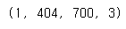

## opencv 사용해 이미지 loaidng

```python
data = cv2.imread('dog.jpg')
data = cv2.cvtColor(data, cv2.COLOR_BGR2RGB)
sample = expand_dims(data,0)
print(sample.shape)
```


## 수평, 수직 이동

```python
generator = tf.keras.preprocessing.image.ImageDataGenerator(    
    width_shift_range = 0.2) 
obj = generator.flow(sample, batch_size=1)   
```

```python
# 할때마다 다른 이미지 나온다.
image = obj.next()
print(image.shape)
print(image.dtype)
#print(image)
print(image[0].shape)
#plt.imshow(image[0].astype('uint8') )  #  plt로 할때는 0~1사이로  혹은 타입을 uint8로 
plt.imshow(image[0]/255)  #  plt로 할때는 0~1사이로  혹은 타입을 uint8로 
```

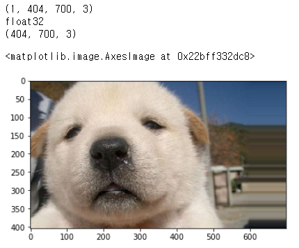

```python
generator = tf.keras.preprocessing.image.ImageDataGenerator(    
    width_shift_range = 0.2, rescale=1./255)   # rescale 해주면 정규화하고, imshow할때 type변한 필유없다.
obj = generator.flow(sample, batch_size=1)   
```

```python
image = obj.next()
plt.imshow(image[0] )
```

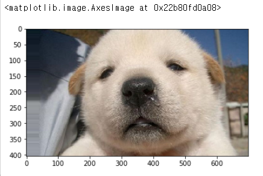

```python
fig = plt.figure(figsize=(20,20))
for i in range(9) :
    plt.subplot(3,3,i+1)
    image = obj.next()
    plt.imshow(image[0])   
```

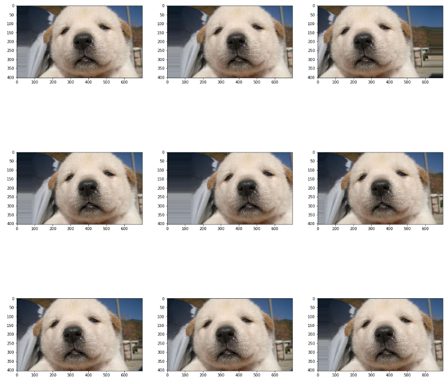

## flip

```python
generator = tf.keras.preprocessing.image.ImageDataGenerator( 
    horizontal_flip = True, vertical_flip = True,
    rescale=1./255)
obj = generator.flow(sample, batch_size=1)   

fig = plt.figure(figsize=(20,20))
for i in range(9) :
    plt.subplot(3,3,i+1)
    image = obj.next()
    plt.imshow(image[0])   
```

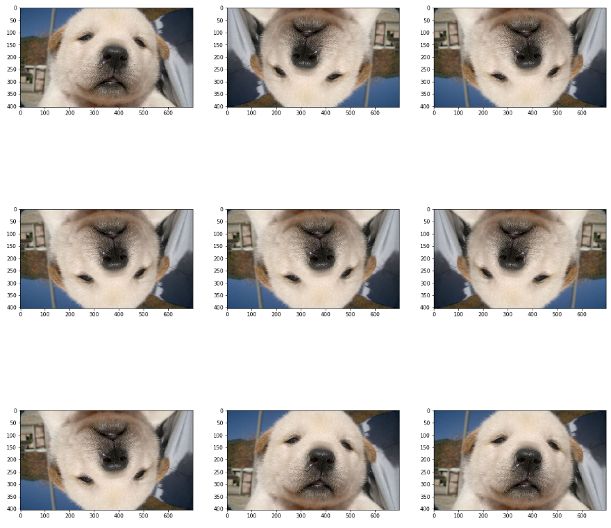

## rotation

```python
generator = tf.keras.preprocessing.image.ImageDataGenerator( 
    rotation_range=90,
    rescale=1./255)
obj = generator.flow(sample, batch_size=1)   

fig = plt.figure(figsize=(20,20))
for i in range(9) :
    plt.subplot(3,3,i+1)
    image = obj.next()
    plt.imshow(image[0])   
    
```

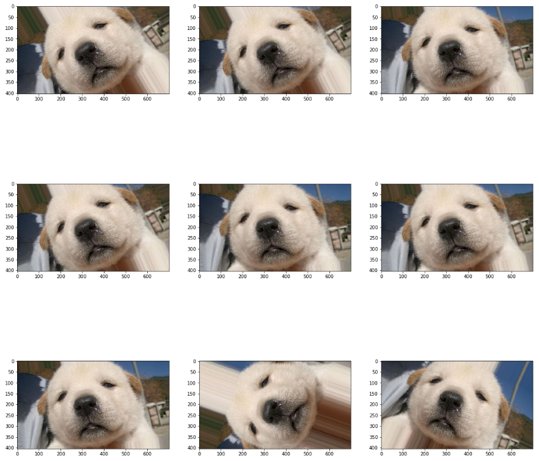

## brightness

```python
generator = tf.keras.preprocessing.image.ImageDataGenerator( 
    brightness_range=[0.2, 1.0],       
    rescale=1./255)
obj = generator.flow(sample, batch_size=1)   

fig = plt.figure(figsize=(20,20))
for i in range(9) :
    plt.subplot(3,3,i+1)
    image = obj.next()
    plt.imshow(image[0])   
```

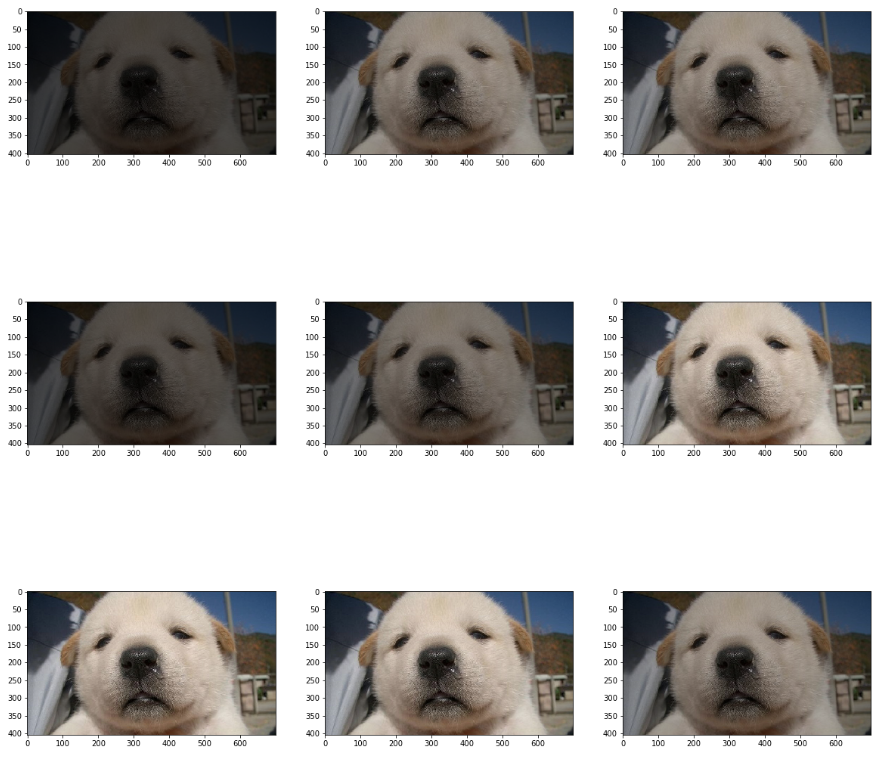

## zoom

```python
generator = tf.keras.preprocessing.image.ImageDataGenerator( 
    zoom_range=[0.2, 1.2],   
    rescale=1./255)
obj = generator.flow(sample, batch_size=1)   

fig = plt.figure(figsize=(20,20))
for i in range(9) :
    plt.subplot(3,3,i+1)
    image = obj.next()
    plt.imshow(image[0])   
```

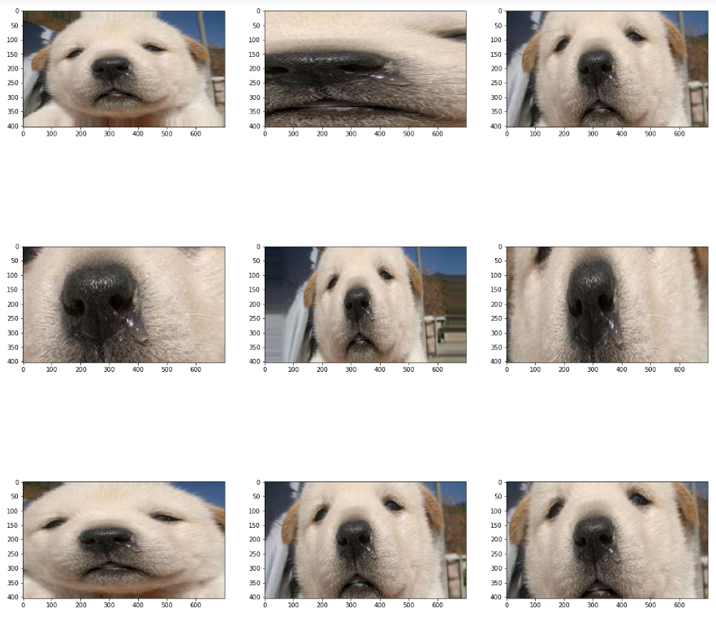

## 한꺼번에 적용하기

```python
generator = tf.keras.preprocessing.image.ImageDataGenerator( 
    width_shift_range = 0.2,
    zoom_range=[0.5, 1.0],   
    horizontal_flip = True, vertical_flip = True,
    rotation_range=90,
    rescale=1./255)
obj = generator.flow(sample, batch_size=1)   

fig = plt.figure(figsize=(20,20))
for i in range(9) :
    plt.subplot(3,3,i+1)
    image = obj.next()
    plt.imshow(image[0])   
```

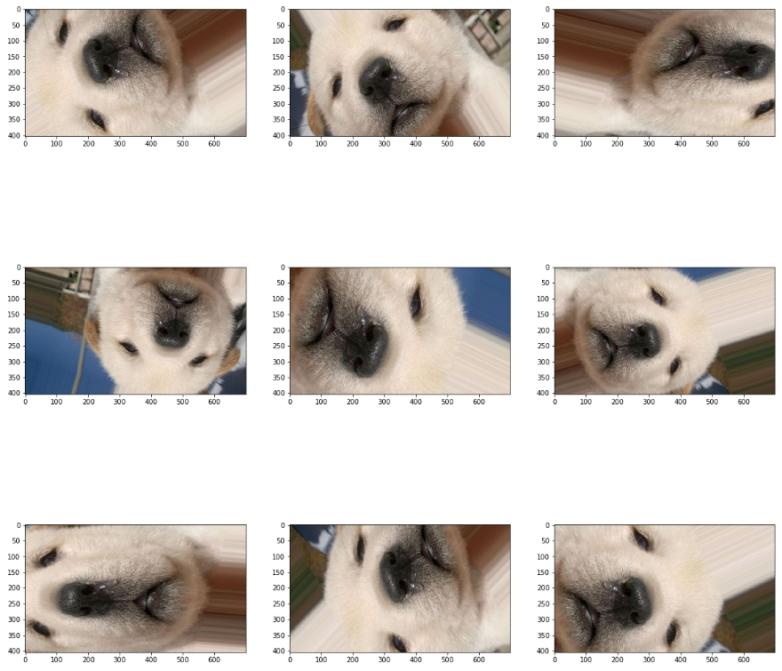

## 파일로 저장하기

```python

obj = generator.flow(sample, batch_size=1, save_to_dir='tmp',  # 폴더는 생성되어 있어야 함
    save_prefix="image", save_format="jpg")    

for i in range(0, 5):
    obj.next()    
```

# 2.  디렉토리로 부터 augmentation

```python
#augsample/c1/2개 이미지
#augsample/c2/6개 이미지    
#augsample/c3/1개 이미지    

obj = generator.flow_from_directory(
    'hard_handwriting_shape',
    target_size = (150, 150),   # 읽어드릴 이미지, 이미지 크기를 맞춰야 하기 때문에 생략시 256x256
    batch_size = 4,   # 8개 이미지 중에서 한번에 생성할 이미지 수 
    class_mode = 'categorical' )  # # binary(label)  |  categorical(one-hot)
```

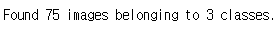

```python
iterations = 2

for i, (img, label) in enumerate(obj):
    n_img = len(label)    # 폴더에 있는 이미지 갯수 만큼 리턴한다.
    print(label)
    print(img.shape)
    if i is iterations - 1:
        break      
# 결과를 보면 lable은 1,1,1,0 처럼 꼭 c1과 c2에서 규일하게 생성되는것은 아니다.
```

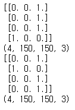

## 저장하기

```python
obj = generator.flow_from_directory(
    'hard_handwriting_shape',
    target_size = (150, 150),   # 읽어드릴 이미지, 이미지 크기를 맞춰야 하기 때문에 생략시 256x256
    batch_size = 4,   # 8개 이미지 중에서 최대4개 만들어냄
    class_mode = 'binary',
    save_prefix="image", save_format="jpg",save_to_dir='tmp')

iterations = 2

for i, (img, label) in enumerate(obj):
    n_img = len(label)    # 폴더에 있는 이미지 갯수 만큼 리턴한다.
    print(label)
    print(img.shape)
    if i is iterations - 1:
        break
# tmp 폴더하나에 8개이미지 출력됙다.  class별로 저정할수 없나?( 좀더 찾아바야함)
```


#  2. 도형 

```python
np.random.seed(5)


# 데이터셋 불러오기
data_aug_gen = ImageDataGenerator(rescale=1./255, 
                                  rotation_range=15,
                                  width_shift_range=0.1,
                                  height_shift_range=0.1,
                                  shear_range=0.5,
                                  zoom_range=[0.8, 2.0],
                                  horizontal_flip=True,
                                  vertical_flip=True,
                                  fill_mode='nearest')
                                   
img = load_img('hard_handwriting_shape/train/triangle/triangle001.png')
x = img_to_array(img)
x = x.reshape((1,) + x.shape)
i = 0

# 이 for는 무한으로 반복되기 때문에 우리가 원하는 반복횟수를 지정하여, 지정된 반복횟수가 되면 빠져나오도록 해야합니다.
for batch in data_aug_gen.flow(x, batch_size=1, save_to_dir='tmp', save_prefix='tri', save_format='png'):
    i += 1
    if i > 30: 
        break
        
```

```python
train_datagen = ImageDataGenerator(rescale=1./255, 
                                   rotation_range=10,
                                   width_shift_range=0.2,
                                   height_shift_range=0.2,
                                   shear_range=0.7,
                                   zoom_range=[0.9, 2.2],
                                   horizontal_flip=True,
                                   vertical_flip=True,
                                   fill_mode='nearest')

train_generator = train_datagen.flow_from_directory(
        'hard_handwriting_shape/train',
        target_size=(24, 24),
        batch_size=3,
        class_mode='categorical')

test_datagen = ImageDataGenerator(rescale=1./255)

test_generator = test_datagen.flow_from_directory(
        'hard_handwriting_shape/test',
        target_size=(24, 24),    
        batch_size=3,
        class_mode='categorical', shuffle=False)
```

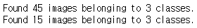

```python
model = Sequential()
model.add(Conv2D(32, kernel_size=(3, 3),
                 activation='relu',
                 input_shape=(24,24,3)))
model.add(Conv2D(64, (3, 3), activation='relu'))
model.add(MaxPooling2D(pool_size=(2, 2)))
model.add(Flatten())
model.add(Dense(128, activation='relu'))
model.add(Dense(3, activation='softmax'))

# 모델 엮기
model.compile(loss='categorical_crossentropy', optimizer='adam', metrics=['accuracy'])
```

```python
# 모델 학습시키기
model.fit_generator(
        train_generator,
        steps_per_epoch=15 * 100,
        epochs=20, #200
        validation_data=test_generator,
        validation_steps=5)
```

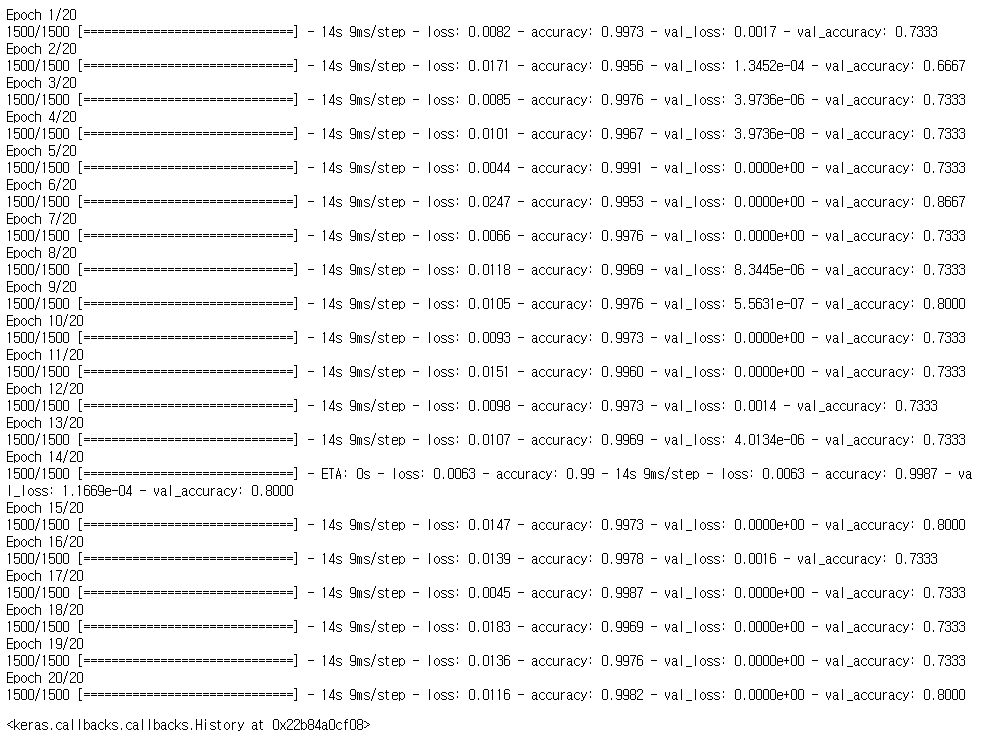

```python
# 모델 예측하기
print("-- Predict --")
output = model.predict_generator( test_generator, steps = 5)    # batch 사이즈가 3 , 15개가 생성됨
print(output)

T = test_generator.classes
print(T)
p = np.argmax(output, axis=1)
print(p)

sum((T == p)*1) / len(T)
```

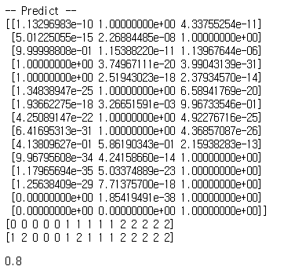

```python
plt.imshow(output, cmap="gray")
plt.show()
plt.imshow(output.T, cmap="gray")
plt.show()
```

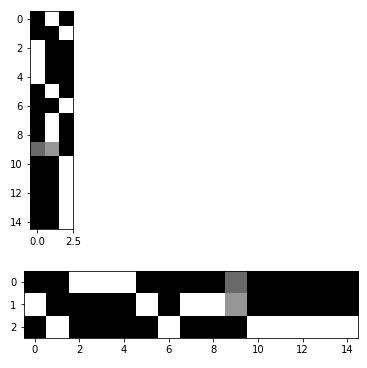

```python
# 모델 평가하기
scores = model.evaluate_generator(test_generator, steps = 5)
print(scores[1])
```

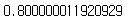

```python
labels = ['C', 'R', 'T']
idx = [0,1,2,3,4,5,6,7,8,9,10,11,12,13,14]

plt.figure(figsize=(20, 20))

cc = 3
rr = int(len(idx) / cc)+1

for k in range(len(idx)) :
    i = idx[k]             
    c = "blue" if p[i] == T[i] else "red"    
    plt.subplot(rr, cc, k+1)
    plt.bar(labels, output[i], color=c)
    plt.xlabel("true:{}->  predict:{} {:2.0f}%".format(labels[int(T[i])], labels[p[i]], 100*np.max(output[i], axis=0)), color = c)
```

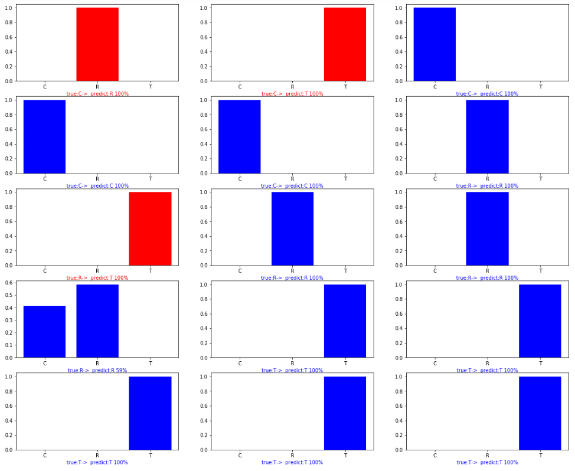

```python
test_generator = train_datagen.flow_from_directory(
        'hard_handwriting_shape/test',
        target_size=(24, 24),
        batch_size=15,
        class_mode='binary', shuffle=False)
X, T = test_generator.next()
output = model.predict(X)
p = np.argmax(output, axis=1)
idx[0]
#idx = [0,1,2,3,4,5,6,7,8,9,10,11,12,13,14]
plt.figure(figsize=(20, 20))
cc = 3
rr = int(len(idx) / cc)+1

for k in range(len(idx)) :        
    i = idx[k]             
    c = "blue" if p[i] == T[i] else "red"       
    plt.subplot(rr, cc, k+1)
    #  left and right limits, and the bottom and top limits. extent=[x최소, x최대, y최소, y최대]
    plt.imshow(X[i,:,:,0], extent=[0, 0.8, 0.5, 0.9], aspect='auto', zorder=10, cmap="gray")
    plt.ylim(0.0, 1.0)  
    plt.bar(labels, output[i], color=c)
    plt.xlabel("true:{}->  predict:{} {:2.0f}%".format(labels[int(T[i])], labels[p[i]], 100*np.max(output[i], axis=0)), color = c)
    
#plt.savefig('fig1.png')
```

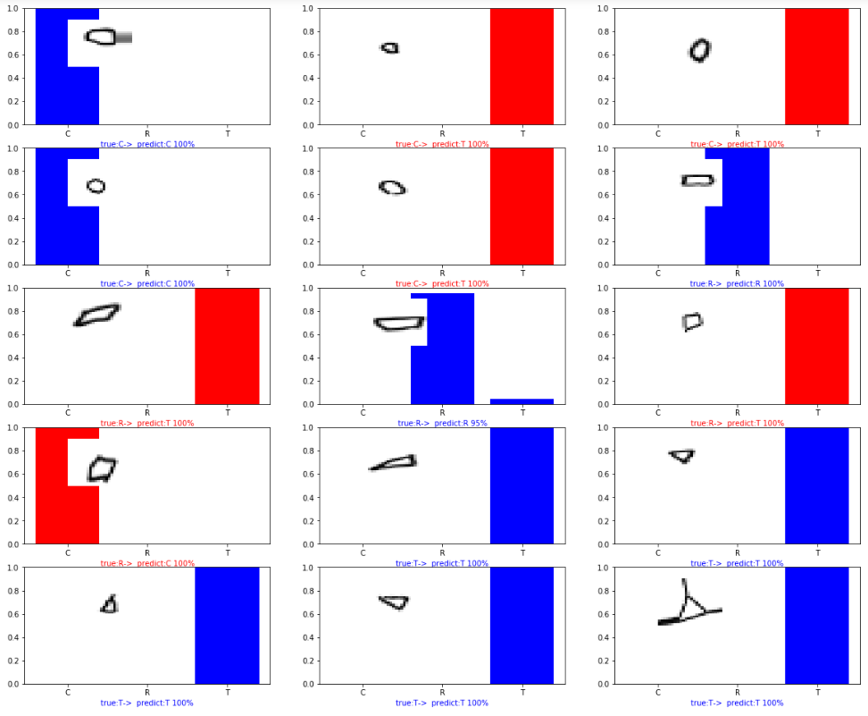

