# 이미지 day1

## RGB

```python
import numpy as np
import matplotlib.pyplot as plt
from PIL import Image
%matplotlib inline
import cv2
```

```python
a = np.asarray([
    [0,0,0,0],
    [127,127,127,127],
    [200,200,200,200],
    [255,255,255,255],
], dtype='uint8')

plt.imshow(a, cmap='gray')
```

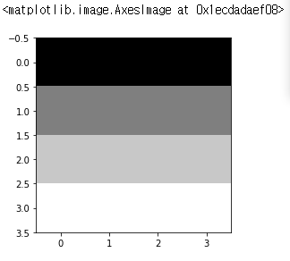

```python
b = a + 5
plt.imshow(b, cmap='gray')
print(b)
```

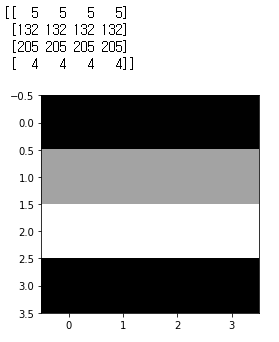

```python
r = np.asarray([
    [255,255,255,255],
    [0,0,0,0],
    [0,0,0,0],
    [255,255,255,255],
], dtype='uint8')

g = np.asarray([
    [0,0,0,0],
    [255,255,255,255],
    [0,0,0,0],
    [255,255,255,255],
], dtype='uint8')

b = np.asarray([
    [0,0,0,0],
    [0,0,0,0],
    [255,255,255,255],
    [0,0,0,0],
], dtype='uint8')

colors = np.dstack([r, g, b])
print(colors.shape)
plt.imshow(colors)
plt.show()
plt.imshow(r, cmap="gray")
plt.show()
```

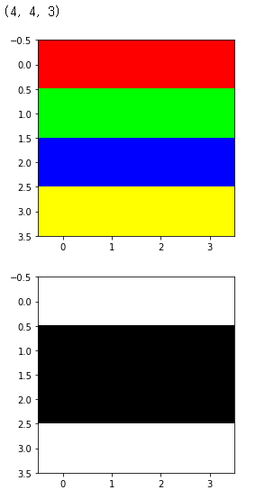

```python
z = np.zeros((4,4), dtype = 'uint8')

rr = np.dstack([r,z,z])
gg = np.dstack([z,g,z])
bb = np.dstack([z,z,b])

plt.imshow(rr)
plt.show()
plt.imshow(gg)
plt.show()
plt.imshow(bb)
plt.show()
```

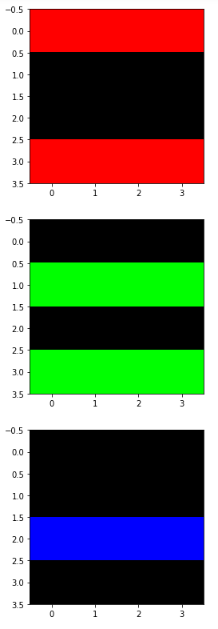

```python
all = np.hstack([np.dstack([r,g,b]),rr,gg,bb])
plt.imshow(all)
```

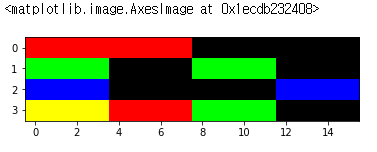

```python
img = cv2.imread("yellow.jpg") # 사진 다운받아서 해라
print(type(img))
print(img.shape)
plt.imshow(img)
```


```python
b = img[:,:,0]
print(b.shape)
g = img[:,:,1]
r = img[:,:,2]
rgb = np.dstack([r,g,b])
plt.imshow(rgb)
```

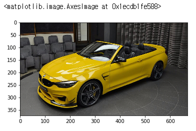

```python
b = img[:,:,0]
print(b.shape)
g = img[:,:,1]+30
r = img[:,:,2]+30
rgb = np.dstack([r,g,b])
plt.imshow(rgb)
```

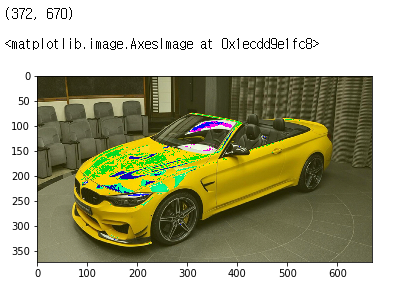

```python
rgb = cv2.cvtColor(img, cv2.COLOR_BGR2RGB) 
plt.imshow(rgb)
cv2.imwrite("result.jpg", rgb)
```

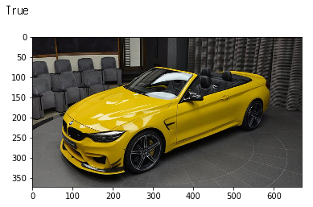


## 이미지에서 얼굴(살색)찾기

```python
img = cv2.imread("sana.jpg")
print(img.shape)
hsv = cv2.cvtColor(img, cv2.COLOR_BGR2HSV) 
h = hsv[:,:,0]
s = hsv[:,:,1]
v = hsv[:,:,2]
result = img.copy()
print(result.shape)
print(result.shape[0])
plt.imshow(img)
b = img[:,:,0]
print(b.shape)
g = img[:,:,1]
r = img[:,:,2]
rgb = np.dstack([r,g,b])
plt.imshow(rgb)
```

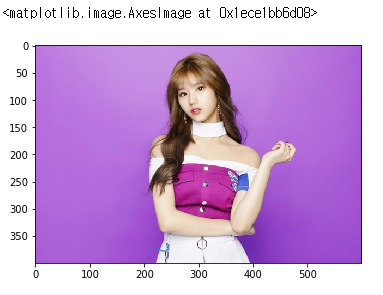

## 배경과 얼굴 분류

```python
for r in range(h.shape[0]):
    for c in range(h.shape[1]):
        if h[r, c] >= 0 and h[r, c] <= 20:
            result[r, c, 0] = img[r,c,0]
            result[r, c, 1] = img[r,c,1]
            result[r, c, 2] = img[r,c,2]
        else:
            result[r, c, 0] = col
            result[r, c, 1] = col;
            result[r, c, 2] = col;
plt.imshow(cv2.cvtColor(result, cv2.COLOR_BGR2RGB))

# Lower = np.array([0.48,80], dtype="uint8")
# upper = np.array([20,255,255], dtype="uint8")
```


```python
img = cv2.imread("sana.jpg")
print(img.shape)
hsv = cv2.cvtColor(img, cv2.COLOR_BGR2HSV) 
h = hsv[:,:,0]
s = hsv[:,:,1]
v = hsv[:,:,2]
result1 = img.copy()
print(result.shape)
print(result.shape[0])

for r in range(h.shape[0]):
    for c in range(h.shape[1]):
        if h[r, c] >= 0 and h[r, c] <= 20:
            result1[r, c, 0] = 255
            result1[r, c, 1] = 255;
            result1[r, c, 2] = 255;
        else:
            result1[r, c, 0] = 0
            result1[r, c, 1] = 0;
            result1[r, c, 2] = 0;
plt.imshow(cv2.cvtColor(result1, cv2.COLOR_BGR2RGB))

# Lower = np.array([0.48,80], dtype="uint8")
# upper = np.array([20,255,255], dtype="uint8")
```

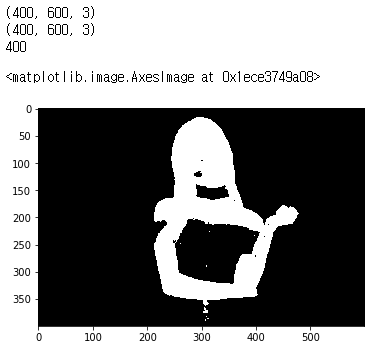

```python
all1 = np.hstack([rgb, cv2.cvtColor(result, cv2.COLOR_BGR2RGB), cv2.cvtColor(result1, cv2.COLOR_BGR2RGB)])
plt.imshow(all1)
```

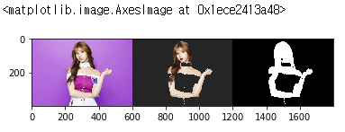

```python
img = cv2.imread("sana.jpg")
print(img.shape)
hsv = cv2.cvtColor(img, cv2.COLOR_BGR2HSV) 
h = hsv[:,:,0]
s = hsv[:,:,1]
v = hsv[:,:,2]
result = img.copy()
mask = img.copy()
print(result.shape)
print(result.shape[0])

for r in range(h.shape[0]):
    for c in range(h.shape[1]):
        if h[r, c] >= 0 and h[r, c] <= 20:
            result[r, c, 0] = img[r,c,0]    #result[r, c, :] = img[r, c, :]로 줄일수있음
            result[r, c, 1] = img[r,c,1]
            result[r, c, 2] = img[r,c,2]
            mask[r, c, 0] = 255             #mask[r,c,;] = 255 로 줄일수있음
            mask[r, c, 1] = 255
            mask[r, c, 2] = 255
        else:
            result[r, c, 0] = 0             #result[r, c, :] = 0로 줄일수있음
            result[r, c, 1] = 0;
            result[r, c, 2] = 0;
            mask[r, c, 0] = 0              #mask[r,c,;] = 0 로 줄일수있음
            mask[r, c, 1] = 0
            mask[r, c, 2] = 0
            
all = np.hstack([img, mask, result])
            
plt.imshow(cv2.cvtColor(all, cv2.COLOR_BGR2RGB))
```

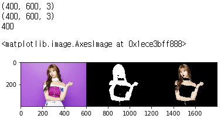

```python
img = cv2.imread("sana.jpg")
print(img.shape)
hsv = cv2.cvtColor(img, cv2.COLOR_BGR2HSV) 
h = hsv[:,:,0]
s = hsv[:,:,1]
v = hsv[:,:,2]
result = img.copy()
mask = img.copy()
print(result.shape)
print(result.shape[0])

for r in range(h.shape[0]):
    for c in range(h.shape[1]):
        if h[r, c] >= 0 and h[r, c] <= 20:
            result[r, c, :] = img[r, c, :]
            mask[r,c,:] = 255
        else:
            result[r, c, :] = 0
            mask[r,c,:] = 0
            
all = np.hstack([img, mask, result])
            
plt.imshow(cv2.cvtColor(all, cv2.COLOR_BGR2RGB))
```

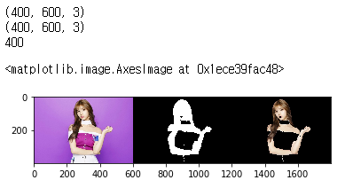

```python
train = cv2.imread("patch.png")
print(train.shape)
b,g,r = cv2.split(train)
#b = img[:,:,0]
#g = img[:,:,1]
#r = img[:,:,2]     
#위의 3줄과 비교했을 때 b,g,r = cv2.split(train) 같은 느낌 하지만 간결

plt.hist(b.ravel(), 256, [0, 256], color='b');
plt.hist(g.ravel(), 256, [0, 256], color='g');
plt.hist(r.ravel(), 256, [0, 256], color='r');
```

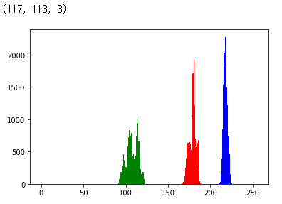

```python
h,s,v = cv2.split(cv2.cvtColor(train, cv2.COLOR_BGR2HSV))
plt.hist(h.ravel(), 256, [0, 256], color='b');
plt.hist(s.ravel(), 256, [0, 256], color='g');
plt.hist(v.ravel(), 256, [0, 256], color='r');
```


```python
h,s,v = cv2.split(cv2.cvtColor(train, cv2.COLOR_BGR2HSV))
plt.hist(h.ravel(), 256, [0, 256], color='b');
plt.hist(s.ravel(), 256, [0, 256], color='g');
plt.hist(v.ravel(), 256, [0, 256], color='r');
```

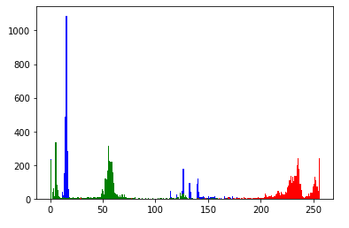

## 크로마키 제외하기

```python
train = cv2.imread("patch3.png")
print(train.shape)
b,g,r = cv2.split(train)
plt.hist(b.ravel(), 256, [0, 256], color='b');
plt.hist(g.ravel(), 256, [0, 256], color='g');
plt.hist(r.ravel(), 256, [0, 256], color='r');
```

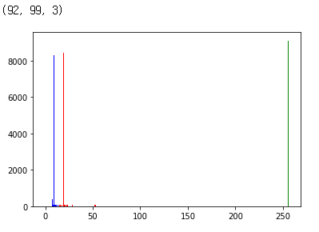

```python
train = cv2.imread("patch3.png")
print(train.shape)
b,g,r = cv2.split(train)
hb = plt.hist(b.ravel(), 256, [0, 256], color='b');
hg = plt.hist(g.ravel(), 256, [0, 256], color='g');
hr = plt.hist(r.ravel(), 256, [0, 256], color='r');
maxb = (np.where(hb[0] == np.max(hb[0])))[0][0]
maxg = (np.where(hg[0] == np.max(hg[0])))[0][0]
maxr = (np.where(hr[0] == np.max(hr[0])))[0][0]
print(maxb)
print(maxg)
print(maxr)

test = cv2.imread("z.jpg")
for r in range(test.shape[0]):
    for c in range(test.shape[1]):
        if np.array_equal(test[r,c,:], [maxb, maxg, maxr]):
            test[r, c, :] = [0,0,0]    
plt.imshow(cv2.cvtColor(test, cv2.COLOR_BGR2RGB))
```

