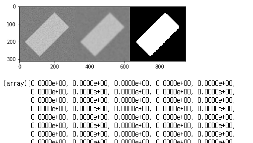

```python
import scipy.stats as sp
import numpy as np
import matplotlib.pyplot as plt
%matplotlib inline
import cv2
from PIL import ImageFont, ImageDraw, Image

def imshow(tit, image):
    plt.title(tit)
    if len(image.shape) == 3:
        plt.imshow(cv2.cvtColor(image, cv2.COLOR_BGR2RGB))
    else:
        plt.imshow(image, cmap="gray")
    plt.show()
```

# 이진화 (배경화면과 구분하는것)


```python
image = cv2.imread('Lena.png', 0)
imshow("image", image)
```


```python
thr, mask = cv2.threshold(image, 180, 255, cv2.THRESH_BINARY)
imshow("binary", mask)
```


```python
print('Threshold used:', thr)

plt.imshow(image, cmap='gray')
plt.imshow(mask, cmap='gray')
```


```python
image = cv2.imread('circle.png', 0)
img_blur = cv2.GaussianBlur(image, (11, 11), 0)
_,binary = cv2.threshold(img_blur, 127, 255, cv2.THRESH_BINARY)
imshow("", img_blur)
imshow("", binary)
```


```python
image = cv2.imread('boxnoise.png', 0)
img_blur = cv2.GaussianBlur(image, (21, 21), 0)
_, binary = cv2.threshold(img_blur, 128, 255, cv2.THRESH_BINARY)
imshow("", np.hstack([image, img_blur, binary]))
```


```python
_, binary = cv2.(img_blur, 0, 200, cv2.THRESH_BINARY + cv2.THRESH_OTSU)
imshow("", np.hstack([image, img_blur, binary]))

plt.hist(image.ravel(), 256, [0, 256], color = 'r')
```




```python
image = cv2.imread('ocr-text.png', 0)
print(image.shape)
_, binary = cv2.threshold(image, 0, 255, cv2.THRESH_BINARY + cv2.THRESH_OTSU)
imshow("", binary)
plt.hist(image.ravel(), 256, [0, 256], color = 'r')
```


```python
image = cv2.imread('text.jpg', 0)
img_blur = cv2.GaussianBlur(image, (3, 3), 0)
_, binary = cv2.threshold(image, 128, 255, cv2.THRESH_BINARY)
imshow("", binary)
```


```python
image = cv2.imread('text.jpg', 0)
#img_blur = cv2.GaussianBlur(image, (3, 3), 0)
binary = cv2.adaptiveThreshold(image, 255, 
            cv2.ADAPTIVE_THRESH_GAUSSIAN_C, 
            cv2.THRESH_BINARY, 21, 5)
imshow("", binary)
```


```python
image = cv2.imread('grid.jpg', 0)
thr, mask = cv2.threshold(image, 100, 1, cv2.THRESH_BINARY)
adapt_mask = cv2.adaptiveThreshold(image, 255, 
            cv2.ADAPTIVE_THRESH_GAUSSIAN_C, 
            cv2.THRESH_BINARY, 15, 4)
imshow("binary", mask)
imshow("adaptive", adapt_mask)
```


```python
image = cv2.imread('mart.jpg', 0)
img_blur = cv2.medianBlur(image, 7)
binary = cv2.adaptiveThreshold(img_blur, 255, 
            cv2.ADAPTIVE_THRESH_GAUSSIAN_C, 
            cv2.THRESH_BINARY, 21, 5)
imshow("", binary)

cv2.imwrite("output.jpg", binary)
```


# 외각선


```python
image = cv2.imread('shape4.png', 0)
thr, mask = cv2.threshold(image, 0, 256, cv2.THRESH_BINARY + cv2.THRESH_OTSU)
imshow("", mask)

contours, _ = cv2.findContours(mask, cv2.RETR_EXTERNAL, cv2.CHAIN_APPROX_SIMPLE)
image = cv2.imread('shape4.png')
cv2.drawContours(image, contours, -1, (0, 0, 255), 2)

imshow("", image)
```


```python
image = cv2.imread('shape3.png')
gray = cv2.cvtColor(image, cv2.COLOR_BGR2GRAY)
thr, mask = cv2.threshold(gray, 0, 255, cv2.THRESH_BINARY + cv2.THRESH_OTSU)
mask = 255 - mask
imshow("", mask)
contours, _ = cv2.findContours(mask, cv2.RETR_EXTERNAL, cv2.CHAIN_APPROX_SIMPLE)

print(f"shape = {len(contours)}")

for con in contours:
    print(f"shape = {len(con)}")
    #x = con[1][0][0]
    #y = con[1][0][1]         x,y를 p로 합침
    p = tuple(con[1][0])
    cv2.drawContours(img, [con], -1, (0, 0, 255), 2)
    cv2.circle(img, (p), 5, (255,0,0), -1)
imshow("", img)
```


```python
img = cv2.imread('shape3.png')
gray = cv2.cvtColor(img, cv2.COLOR_BGR2GRAY) 
thr, mask = cv2.threshold(gray, 0, 255,
        cv2.THRESH_BINARY+cv2.THRESH_OTSU)
mask = 255 - mask
imshow("", mask)
contours, _ = cv2.findContours(mask, 
    cv2.RETR_EXTERNAL, cv2.CHAIN_APPROX_SIMPLE)

print(  f"shape = {len(contours)}"  )

for con in contours :
    print(  f"shape = {len(con)}"  )
    x = con[1][0][0]
    y = con[1][0][1]    
    cv2.drawContours(img, [con], -1, (0, 0, 255), 2)
    cv2.circle(img, (x,y), 5, (255,0,0), -1)
imshow("", img)
```


```python
image = cv2.imread('shape3.png')
gray = cv2.cvtColor(image, cv2.COLOR_BGR2GRAY)
thr, mask = cv2.threshold(gray, 0, 255, cv2.THRESH_BINARY + cv2.THRESH_OTSU)
mask = 255 - mask
imshow("", mask)
contours, _ = cv2.findContours(mask, cv2.RETR_EXTERNAL, cv2.CHAIN_APPROX_SIMPLE)

print(f"shape = {len(contours)}")

for con in contours:
    
    peri = cv2.arcLength(con, True)  #contour길이를 구하는 함수 ,True는 폐곡선을 만든다는의미
    approx = cv2.approxPolyDP(con, 0.02 * peri, True)    #
    
    print(f"shape = {len(con)} length = {peri}   approx={len(approx)}")
    #x = con[1][0][0]
    #y = con[1][0][1]         x,y를 p로 합침
    p = tuple(con[1][0])
    cv2.drawContours(img, [approx], -1, (0, 0, 255), 2)
    cv2.circle(img, (p), 5, (255,0,0), -1)
imshow("", img)
```


```python
img = cv2.imread("shape3.png")
imgPIL = Image.fromarray(cv2.cvtColor(img, cv2.COLOR_BGR2RGB)) # bgr -> rgb


font = ImageFont.truetype("HMKMMAG.TTF", 45)

draw = ImageDraw.Draw(imgPIL)
draw.text((130, 30), "사각형", font=font, fill=(255, 0, 0))
draw.text((450, 10), "사각형", font=font, fill=(255, 0, 0))
draw.text((710, 10), "삼각형", font=font, fill=(255, 0, 0))
draw.text((90, 225), "원", font=font, fill=(255, 0, 0))
draw.text((240, 245), "삼각형", font=font, fill=(255, 0, 0))
draw.text((520, 255), "오각형", font=font, fill=(255, 0, 0))
imgPIL.save("out1.jpg")
```


```python
font = cv2.FONT_HERSHEY_COMPLEX

img = cv2.imread('shape3.png')
gray = cv2.cvtColor(img, cv2.COLOR_BGR2GRAY) 
thr, mask = cv2.threshold(gray, 0, 255,
        cv2.THRESH_BINARY+cv2.THRESH_OTSU)
mask = 255 - mask
imshow("", mask)
contours, _ = cv2.findContours(mask, 
    cv2.RETR_EXTERNAL, cv2.CHAIN_APPROX_SIMPLE)

print(  f"shape = {len(contours)}"  )

for con in contours:
    
    peri = cv2.arcLength(con, True)  #contour길이를 구하는 함수 ,True는 폐곡선을 만든다는의미
    approx = cv2.approxPolyDP(con, 0.02 * peri, True)    #
    
    print(f"shape = {len(con)} length = {peri}   approx={len(approx)}")
    #x = con[1][0][0]
    #y = con[1][0][1]         x,y를 p로 합침
    p = tuple(con[1][0])
    cv2.drawContours(img, [approx], -1, (0, 0, 255), 2)
    cv2.circle(img, (p), 5, (255,0,0), -1)
    
    area = cv2.contourArea(cnt)    
    
    if len(approx) == 3:
        cv2.putText(img, "Triangle", p, font, 1, (0))
    elif len(approx) == 4:
        cv2.putText(img, "Rectangle", p, font, 1, (0))
    elif len(approx) == 5:
        cv2.putText(img, "Pentagon", p, font, 1, (0))
    elif 6 < len(approx) < 15:
        cv2.putText(img, "Ellipse", p, font, 1, (0))
    else:
        cv2.putText(img, "Circle", p, font, 1, (0))

        
imshow("", img)
```


```python
img = cv2.imread('card.png')
gray = cv2.cvtColor(img, cv2.COLOR_BGR2GRAY) 
thr, mask = cv2.threshold(gray, 0, 255,
        cv2.THRESH_BINARY+cv2.THRESH_OTSU)
mask = 255 - mask
imshow("", mask)
contours, _ = cv2.findContours(mask, 
    cv2.RETR_EXTERNAL, cv2.CHAIN_APPROX_SIMPLE)

print(  f"shape = {len(contours)}"  )

for con in contours :    
    
    peri = cv2.arcLength(con, True)
    approx = cv2.approxPolyDP(con, 0.02 * peri, True)
    
    print(  f"shape={len(con)}  length={peri}  approx={len(approx)} "  )    
    #x = con[1][0][0]
    #y = con[1][0][1]    
    p = tuple(con[1][0])
    cv2.drawContours(img, [approx], -1, (255, 0, 255), 2)
    cv2.circle(img, p, 5, (255,0,0), -1)
imshow("", img)
```


```python
img = cv2.imread('mart2.jpg')
gray = cv2.cvtColor(img, cv2.COLOR_BGR2GRAY) 
thr, mask = cv2.threshold(gray, 0, 255,
        cv2.THRESH_BINARY+cv2.THRESH_OTSU)

imshow("", mask)

cv2.imwrite("output2.png", mask)
```


```python
image = cv2.imread('water_coins.jpg')
gray = cv2.cvtColor(image, cv2.COLOR_BGR2GRAY) 
_, binary = cv2.threshold(gray, 128, 255, cv2.THRESH_BINARY)
binary = 255 - binary
imshow("", binary)
eroded = cv2.morphologyEx(binary, cv2.MORPH_ERODE, (3, 3), iterations = 10)
imshow("", eroded)
dilated = cv2.morphologyEx(binary, cv2.MORPH_DILATE, (5, 5), iterations = 20)
imshow("", dilated)

# 침식후 팽창 (자글자글한 테두리 제거하기)
opened = cv2.morphologyEx(binary, cv2.MORPH_OPEN, cv2.getStructuringElement(cv2.MORPH_ELLIPSE, (5, 5)), iterations = 5)
imshow("", opened)
# 팽창후 침식 (구멍매꾸기)
closed = cv2.morphologyEx(binary, cv2.MORPH_CLOSE, cv2.getStructuringElement(cv2.MORPH_ELLIPSE, (5, 5)), iterations = 5)
imshow("", closed)
```


```python
frame = cv2.imread('coin.png')
roi = frame.copy()
gray = cv2.cvtColor(frame, cv2.COLOR_BGR2GRAY)
gray_blur = cv2.GaussianBlur(gray, (7, 7), 0)
thresh = cv2.adaptiveThreshold(gray_blur, 255, 
                               cv2.ADAPTIVE_THRESH_GAUSSIAN_C, 
                               cv2.THRESH_BINARY_INV, 45, 6)
imshow("", thresh)
```


```python
kernel = np.ones((3, 3),np.uint8)
closing = cv2.morphologyEx(thresh, cv2.MORPH_CLOSE, kernel, iterations=5)
imshow("", closing)
```


```python
cont_img = closing.copy()
contours, _ = cv2.findContours(cont_img, cv2.RETR_EXTERNAL, cv2.CHAIN_APPROX_SIMPLE)
# fingContours 함수는 이미지가 변환되기 때문에 copy해서 한다
for cnt in contours:
    area = cv2.contourArea(cnt)
    if area < 2000 or area > 4000:
        continue
    if len(cnt) < 5:
        continue
    ellipse = cv2. fitEllipse(cnt)
    cv2.ellipse(roi, ellipse, (0, 255, 0), 2)
    
imshow("out", thresh)
imshow("out", cont_img)
imshow("out", roi)
```


```python
frame = cv2.imread('coin.png')
roi = frame.copy()
gray = cv2.cvtColor(frame, cv2.COLOR_BGR2GRAY)
gray_blur = cv2.GaussianBlur(gray, (7, 7), 0)
thresh = cv2.adaptiveThreshold(gray_blur, 255, 
                               cv2.ADAPTIVE_THRESH_GAUSSIAN_C, 
                               cv2.THRESH_BINARY_INV, 45, 6)
imshow("", thresh)

kernel = np.ones((3, 3),np.uint8)
closing = cv2.morphologyEx(thresh, cv2.MORPH_CLOSE, kernel, iterations=5)
imshow("", closing)

cont_img = closing.copy()
contours, _ = cv2.findContours(cont_img, cv2.RETR_EXTERNAL, cv2.CHAIN_APPROX_SIMPLE)
# fingContours 함수는 이미지가 변환되기 때문에 copy해서 한다
for cnt in contours:
    area = cv2.contourArea(cnt)
    if area < 2000 or area > 4000:
        continue
    if len(cnt) < 5:
        continue
    ellipse = cv2. fitEllipse(cnt)
    cv2.ellipse(roi, ellipse, (0, 255, 0), 2)
    
imshow("out", thresh)
imshow("out", cont_img)
imshow("out", roi)
```


# 내가 해본 실습


```python
img = cv2.imread('mart2.jpg')
gray = cv2.cvtColor(img, cv2.COLOR_BGR2GRAY) 
gray = cv2.medianBlur(gray, 21)
thr, mask = cv2.threshold(gray, 0, 255,
        cv2.THRESH_BINARY+cv2.THRESH_OTSU)
imshow("", mask)

contours, _ = cv2.findContours(mask, 
    cv2.RETR_EXTERNAL, cv2.CHAIN_APPROX_SIMPLE)

print(  f"shape = {len(contours)}"  )

for con in contours :    
    
    peri = cv2.arcLength(con, True)
    approx = cv2.approxPolyDP(con, 0.02 * peri, True)
    
    print(  f"shape={len(con)}  length={peri}  approx={len(approx)} "  )      
    p = tuple(con[0][0])
    cv2.drawContours(img, [approx], -1, (255, 0, 255), 50)
imshow("", img)


```


# 답안


```python
img = cv2.imread('mart2.jpg')
gray = cv2.cvtColor(img, cv2.COLOR_BGR2GRAY) 
gray = cv2.medianBlur(gray, 21)
thr, mask = cv2.threshold(gray, 0, 255,
        cv2.THRESH_BINARY+cv2.THRESH_OTSU)
imshow("", mask)

kernel = np.ones((5, 5),np.uint8)
closing = cv2.morphologyEx(mask, cv2.MORPH_CLOSE, kernel, iterations=5)
imshow("", closing)

contours, _ = cv2.findContours(closing, 
    cv2.RETR_EXTERNAL, cv2.CHAIN_APPROX_SIMPLE)

print(len(contours))
print(  f"shape = {len(contours)}"  )

maxArea = 0

for i in range(len(contours)):
    con = contours[i]
    peri = cv2.arcLength(con, True)
    area = cv2.contourArea(con)
    approx = cv2.approxPolyDP(con, 0.02 * peri, True)
    print(  f"shape={len(con)}  length={peri}  approx={len(approx)} "  )      
    if area > maxArea  :
        maxArea = area
        maxContour = approx
        
cv2.drawContours(img, [maxContour], -1, (255, 0, 255), 50)
imshow("", img)
cv2.imwrite("output3.jpg", img)
```


