install

>pip install imutils
>
>pip install pyzbar
>
>pip install qrcode


```python
import cv2, numpy as np
import math
import time
import random
from matplotlib import pyplot as plt
%matplotlib inline
import imutils
import qrcode
from pyzbar.pyzbar import decode
from bokeh.plotting import figure
from bokeh.io import output_notebook, show, push_notebook


output_notebook()


def imshow(tit, image) :
    plt.title(tit)    
    if len(image.shape) == 3 :
        plt.imshow(cv2.cvtColor(image, cv2.COLOR_BGR2RGB))
    else :
        plt.imshow(image, cmap="gray")
    plt.show()
    
    
def create_win(frames, scale=1.0) :    
    global myImage
    
    all = []
    for f in frames :
        if len(f.shape ) !=  3 : f = cv2.cvtColor(f, cv2.COLOR_GRAY2BGR)
        all.append(f)
    frame = np.vstack(all)
    
    fr=cv2.cvtColor(frame, cv2.COLOR_BGR2RGBA) # because Bokeh expects a RGBA image
    fr=cv2.flip(fr, -1) # because Bokeh flips vertically
    width=fr.shape[1]
    height=fr.shape[0]    

    p = figure(x_range=(0,width), y_range=(0,height), output_backend="webgl", width=int(width*scale), height=int(height*scale))    
    myImage = p.image_rgba(image=[fr], x=0, y=0, dw=width, dh=height)
    show(p, notebook_handle=True)   
    
    
def update_win(frames) :
    
    all = []
    for f in frames :
        if len(f.shape ) !=  3 : f = cv2.cvtColor(f, cv2.COLOR_GRAY2BGR)
        all.append(f)
    frame = np.vstack(all)
    
    fr=cv2.cvtColor(frame, cv2.COLOR_BGR2RGBA)
    fr=cv2.flip(fr, -1)
    myImage.data_source.data['image']=[fr]
    push_notebook()
    time.sleep(0.05)
```


<div class="bk-root">
    <a href="https://bokeh.pydata.org" target="_blank" class="bk-logo bk-logo-small bk-logo-notebook"></a>
    <span id="1001">Loading BokehJS ...</span>
</div>


# harris corner


```python
src = cv2.imread('building.jpg', cv2.IMREAD_GRAYSCALE)

#  block 크기, 소벨크기,    k=0.04~0.06     R=Det() - kTr() 
harris = cv2.cornerHarris(src, 3, 3, 0.04)  
print(harris.dtype)
print(harris.shape)

print(np.min(harris))
print(np.max(harris))

plt.hist(harris.ravel())
```

    float32
    (600, 868)
    -0.005183762
    0.010007294


    (array([8.70000e+01, 4.70000e+02, 7.58900e+03, 5.10984e+05, 1.43100e+03,
            1.69000e+02, 5.10000e+01, 1.30000e+01, 4.00000e+00, 2.00000e+00]),
     array([-0.00518376, -0.00366466, -0.00214555, -0.00062645,  0.00089266,
             0.00241177,  0.00393087,  0.00544998,  0.00696908,  0.00848819,
             0.01000729], dtype=float32),
     <a list of 10 Patch objects>)


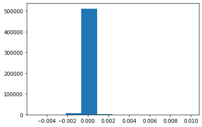


```python
harris_norm = cv2.normalize(harris, None, 0, 255, cv2.NORM_MINMAX, cv2.CV_8U)
print(harris_norm.dtype)
imshow("norm",harris_norm)
```

    uint8


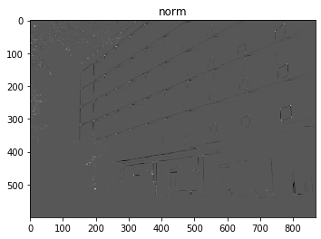


```python
dst = cv2.cvtColor(src, cv2.COLOR_GRAY2BGR)

for y in range(harris_norm.shape[0]):
        for x in range(harris_norm.shape[1]):
            if harris_norm[y, x] > 120:
                    cv2.circle(dst, (x, y), 5, (0, 0, 255), 2)

imshow('src', src)
imshow('harris_norm', harris_norm)
imshow('dst', dst)
```


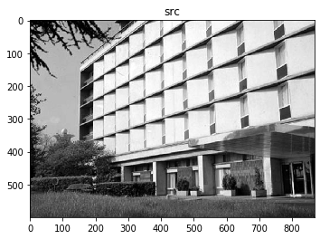


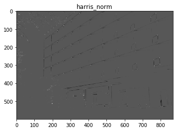


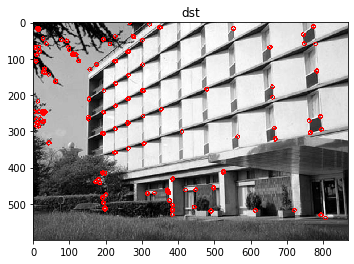


```python
src = cv2.imread('corner.png', cv2.IMREAD_GRAYSCALE)

#  block 크기, 소벨크기,    k=0.04~0.06     R=Det() - kTr() 
harris = cv2.cornerHarris(src, 3, 3, 0.04)  
print(harris.dtype)

harris_norm = cv2.normalize(harris, None, 0, 255, cv2.NORM_MINMAX, cv2.CV_8U)
print(harris_norm.dtype)

dst = cv2.cvtColor(src, cv2.COLOR_GRAY2BGR)

for y in range(harris_norm.shape[0]):
        for x in range(harris_norm.shape[1]):
            if harris_norm[y, x] > 120:
                    cv2.circle(dst, (x, y), 5, (0, 0, 255), 2)

imshow('src', src)
imshow('harris_norm', harris_norm)
imshow('dst', dst)
```

    float32
    uint8


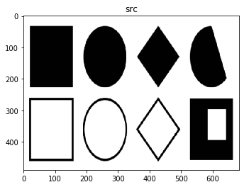


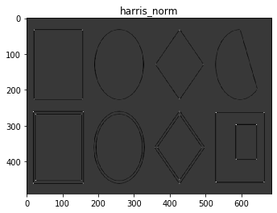


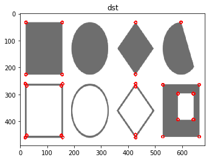


```python
src = cv2.imread('chessBoard.jpg', cv2.IMREAD_GRAYSCALE)
#src = cv2.imread('corner.png', cv2.IMREAD_GRAYSCALE)
dst = cv2.GaussianBlur(dst, (11,11),0)

#  block 크기, 소벨크기,    k=0.04~0.06     R=Det() - kTr() 
harris = cv2.cornerHarris(src, 3, 3, 0.04)  
print(harris.dtype)

harris_norm = cv2.normalize(harris, None, 0, 255, cv2.NORM_MINMAX, cv2.CV_8U)
print(harris_norm.dtype)

dst = cv2.cvtColor(src, cv2.COLOR_GRAY2BGR)

for y in range(harris_norm.shape[0]):
        for x in range(harris_norm.shape[1]):
            if harris_norm[y, x] > 128:
                    cv2.circle(dst, (x, y), 5, (0, 0, 255), 2)

imshow('src', src)
imshow('harris_norm', harris_norm)
imshow('dst', dst)
```

    float32
    uint8


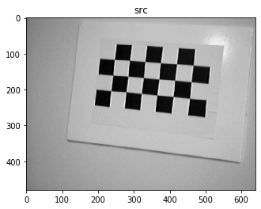


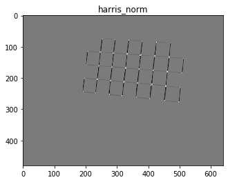


```python
src = cv2.imread('chessBoard.jpg', cv2.IMREAD_GRAYSCALE)
src = cv2.GaussianBlur(src, (15,15),0)

#  block 크기, 소벨크기,    k=0.04~0.06     R=Det() - kTr() 
harris = cv2.cornerHarris(src, 3, 3, 0.04)  
print(harris.dtype)

harris_norm = cv2.normalize(harris, None, 0, 255, cv2.NORM_MINMAX, cv2.CV_8U)

imshow('harris_norm', harris_norm)

```

    float32


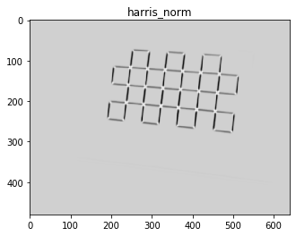


```python
dst = cv2.cvtColor(src, cv2.COLOR_GRAY2BGR)

for y in range(harris_norm.shape[0]):
        for x in range(harris_norm.shape[1]):
            if harris_norm[y, x] > 210:
                    cv2.circle(dst, (x, y), 5, (0, 0, 255), 2)

imshow('src', src)
imshow('harris_norm', harris_norm)
imshow('dst', dst)
```


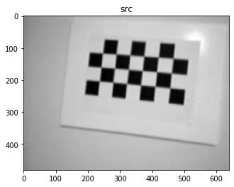


# for 문장 안쓰고 하는법


```python
gray = cv2.imread('building.jpg', 0)
img = cv2.imread('building.jpg')
dst = cv2.cornerHarris(gray, 5, 3, 0.04)
img[dst>0.01*dst.max()] = [0,0,255]
imshow('dst', img)
```


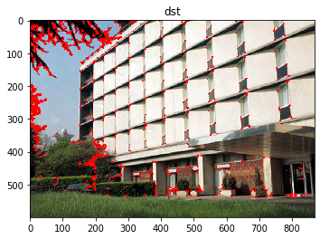


# 해리스코너 보다 빠름


```python
#src = cv2.imread('building.jpg', cv2.IMREAD_GRAYSCALE)
#src = cv2.imread('corner.png', cv2.IMREAD_GRAYSCALE)
src = cv2.imread('chessBoard.jpg', cv2.IMREAD_GRAYSCALE)
fast = cv2.FastFeatureDetector_create(50)  # 작아지면 코너 많이 검출딤, 원에서도 검출되지만 중첨되서 검출될수 있음.
keypoints = fast.detect(src)   # key point = 특징점의 개수
print(len(keypoints))

print(keypoints[0].pt)
#x = keypoints[0].pt[0]
#y = keypoints[0].pt[1]

x, y = keypoints[0].pt

dst = cv2.cvtColor(src, cv2.COLOR_GRAY2BGR)
for kp in keypoints:
        pt = (int(kp.pt[0]), int(kp.pt[1]))
        cv2.circle(dst, pt, 5, (0, 0, 255), 2)

imshow('src', src)
imshow('dst', dst)
cv2.imwrite("out.png", dst)
```

    92
    (254.0, 75.0)


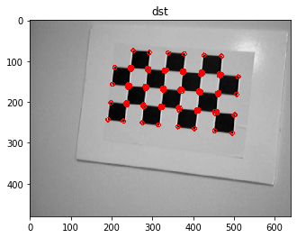

    True


```python
mask = np.zeros(src.shape, dtype = 'uint8')
print(mask.shape)
for kp in keypoints:
        pt = (int(kp.pt[0]), int(kp.pt[1]))
        cv2.circle(mask, pt, 10, (255, 255, 255), -1)
imshow("",mask)
```

    (480, 640)


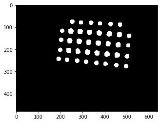


```python
contours, _ = cv2.findContours(mask, cv2.RETR_TREE,
                cv2.CHAIN_APPROX_SIMPLE)

print(len(contours))

src = cv2.imread('chessboard.jpg')
points = []
for con in contours :
    M = cv2.moments(con, True)
    #print(M)
    cx  = int(M['m10'] / M['m00'])
    cy  = int(M['m01'] / M['m00'])    
    cv2.circle(src, (cx,cy ), 10, (0,0, 255), 3)          
    points.append([cx, cy ])
imshow("", src)
print(points)
```

    38


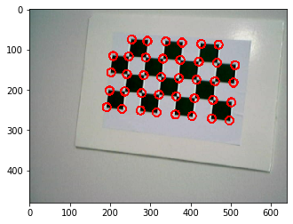


    [[497, 276], [453, 271], [404, 265], [363, 261], [316, 256], [276, 251], [230, 247], [192, 243], [502, 231], [456, 225], [410, 221], [365, 216], [322, 212], [279, 208], [237, 204], [199, 202], [507, 182], [461, 179], [415, 175], [371, 171], [327, 168], [284, 164], [242, 161], [203, 157], [511, 139], [466, 133], [421, 130], [375, 126], [332, 123], [289, 120], [208, 116], [247, 117], [470, 88], [427, 86], [379, 83], [339, 80], [293, 79], [254, 75]]


```python
src = cv2.imread('acronet.png')
gray = cv2.imread('acronet.png', cv2.IMREAD_GRAYSCALE)

fast = cv2.FastFeatureDetector_create(50)  # 작아지면 코너 많이 검출딤, 원에서도 검출되지만 중첨되서 검출될수 있음.
keypoints = fast.detect(gray)   # key point = 특징점의 개수

for kp in keypoints:
        pt = (int(kp.pt[0]), int(kp.pt[1]))
        cv2.circle(src, pt, 5, (0, 0, 255), 2)
        
imshow("",src)
```


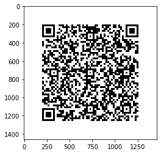


```python
src = cv2.imread('acronet.png', cv2.IMREAD_GRAYSCALE)

harris = cv2.cornerHarris(src, 3, 3, 0.04)  
harris_norm = cv2.normalize(harris, None, 0, 255, cv2.NORM_MINMAX, cv2.CV_8U)

dst = cv2.cvtColor(src, cv2.COLOR_GRAY2BGR)

for y in range(harris_norm.shape[0]):
        for x in range(harris_norm.shape[1]):
            if harris_norm[y, x] > 120:
                    cv2.circle(dst, (x, y), 5, (0, 0, 255), 2)

imshow('src', src)
imshow('harris_norm', harris_norm)
imshow('dst', dst)
```


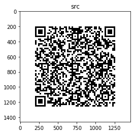


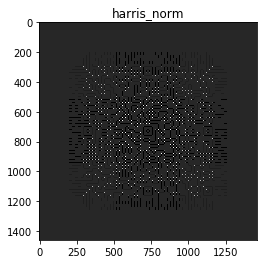


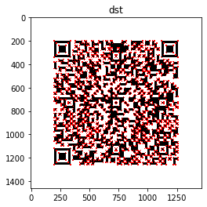


# qrcode 만들기


```python
qr = qrcode.QRCode(version = 2,
     error_correction = qrcode.constants.ERROR_CORRECT_H,
     box_size = 20,
     border = 10)

#url = 'https://www.naver.com'
url = 'https://search.naver.com/search.naver?sm=top_hty&fbm=0&ie=utf8&query=%EC%84%9C%EC%9A%B8%EB%82%A0%EC%94%A8'
qr.add_data(url)

qr.make()

img = qr.make_image(fill_color="black", back_color="white")

plt.imshow(img, cmap="gray")

img.save("qrcode.png")
```


```python
img.save("acronet.png")
img = cv2.imread("acronet.png")
img = np.hstack([img, img, img])
cv2.imwrite("3.png", img)
imshow("", img)
```


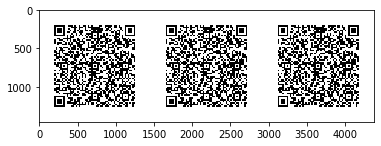


```python
image = cv2.imread('qrcode.png')
#image = cv2.imread('3.png')
#image = cv2.imread('barqr.png')
qrDecoder = cv2.QRCodeDetector()
data,bbox,rectifiedImage = qrDecoder.detectAndDecode(image)

print(data)

imshow("", rectifiedImage )
```

    https://search.naver.com/search.naver?sm=top_hty&fbm=0&ie=utf8&query=%EC%84%9C%EC%9A%B8%EB%82%A0%EC%94%A8


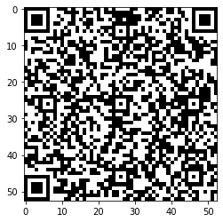


```python
image = cv2.imread('qrcode2.png')  # 부분부분 조굼 삭제한  qr코드
#image = cv2.imread('3.png')
#image = cv2.imread('barqr.png')
qrDecoder = cv2.QRCodeDetector()
data,bbox,rectifiedImage = qrDecoder.detectAndDecode(image)

print(data)

imshow("", rectifiedImage )
```

    https://search.naver.com/search.naver?sm=top_hty&fbm=0&ie=utf8&query=%EC%84%9C%EC%9A%B8%EB%82%A0%EC%94%A8


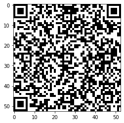


```python
from pyzbar.pyzbar import decode

#image = cv2.imread('acronet.png')
#image = cv2.GaussianBlur(image, (51,51), 0)  #어디까지 가능한지 테스트
image = cv2.imread('barqr.jpg')
code = decode(image)
print(code)

for barcode in code:
    (x, y, w, h) = barcode.rect
    cv2.rectangle(image, (x, y), (x + w, y + h), (0, 0, 255), 2)
 
    barcodeData = barcode.data.decode("utf-8")
    barcodeType = barcode.type
 
    text = "{} ({})".format(barcodeData, barcodeType)
    cv2.putText(image, text, (x, y - 10), cv2.FONT_HERSHEY_SIMPLEX,
        1.5, (0, 0, 255), 2) 
imshow("", image)
```

    [Decoded(data=b'http://pyimg.co/dl4cv', type='QRCODE', rect=Rect(left=331, top=225, width=103, height=103), polygon=[Point(x=331, y=225), Point(x=331, y=327), Point(x=434, y=328), Point(x=433, y=225)]), Decoded(data=b'https://www.pyimagesearch.com/', type='QRCODE', rect=Rect(left=89, top=66, width=119, height=120), polygon=[Point(x=89, y=66), Point(x=89, y=185), Point(x=208, y=186), Point(x=207, y=66)]), Decoded(data=b'https://openmv.io/', type='QRCODE', rect=Rect(left=441, top=70, width=122, height=122), polygon=[Point(x=441, y=71), Point(x=441, y=191), Point(x=563, y=192), Point(x=562, y=70)]), Decoded(data=b'0100000000020183', type='DATABAR', rect=Rect(left=292, top=786, width=181, height=94), polygon=[Point(x=292, y=787), Point(x=292, y=879), Point(x=473, y=880), Point(x=473, y=786)]), Decoded(data=b'DL4CV', type='CODE39', rect=Rect(left=294, top=632, width=177, height=98), polygon=[Point(x=294, y=633), Point(x=294, y=729), Point(x=471, y=730), Point(x=471, y=632)]), Decoded(data=b'OpenMV', type='CODE93', rect=Rect(left=267, top=486, width=229, height=92), polygon=[Point(x=267, y=487), Point(x=267, y=577), Point(x=496, y=578), Point(x=496, y=486)]), Decoded(data=b'guru', type='CODE128', rect=Rect(left=295, top=371, width=173, height=56), polygon=[Point(x=295, y=371), Point(x=295, y=427), Point(x=468, y=426), Point(x=468, y=372)])]


>https://visualstudio.microsoft.com/ko/downloads/ 
>
>visualstudio 2019 community 다운로드
>
> 데스크탑 개발용 체크
>
>

# ORB


```python
src = cv2.imread('box_in_scene.png', cv2.IMREAD_GRAYSCALE)
#src = cv2.imread('corner.png', cv2.IMREAD_GRAYSCALE)
orb = cv2.ORB_create()
keypoints = orb.detect(src)
keypoints, desc = orb.compute(src, keypoints)


print('len(keypoints):', len(keypoints))
print('desc.shape:', desc.shape)

keypoints = keypoints[0:1]

dst = cv2.drawKeypoints(src, keypoints, None, (-1, -1, -1),
                       cv2.DrawMatchesFlags_DRAW_RICH_KEYPOINTS)

imshow("", dst)
print(desc[0])
```

    len(keypoints): 500
    desc.shape: (500, 32)


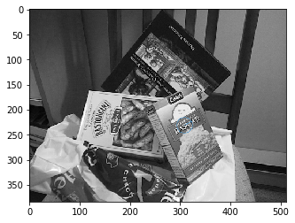


    [ 93  89 127 161 134  90 182 224 108  96 119 162  95  30 163  41  51 213
     164 243  85 181  45 110 254 167  99  71 229  59  45  71]


```python
print(type(keypoints[0]))
print(type(desc))    # 포인트갯수x 32바이트
print(keypoints1[171].pt)   # 171번째 점


imshow('src', src)
imshow('dst', dst)
```

    <class 'cv2.KeyPoint'>
    <class 'numpy.ndarray'>
    (56.400001525878906, 134.40000915527344)


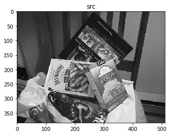


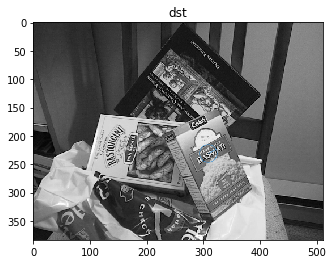


```python
src1 = cv2.imread('box.png', cv2.IMREAD_GRAYSCALE)
src2 = cv2.imread('box_in_scene.png', cv2.IMREAD_GRAYSCALE)


orb = cv2.ORB_create()
keypoints1, desc1 = orb.detectAndCompute(src1, None)
keypoints2, desc2 = orb.detectAndCompute(src2, None)

print('desc1.shape:', desc1.shape)     #(키포인트 갯수, 바이트)
print('desc2.shape:', desc2.shape)

dst1 = cv2.drawKeypoints(src1, keypoints1, None, (-1, -1, -1),
                       cv2.DrawMatchesFlags_DRAW_RICH_KEYPOINTS)

dst2 = cv2.drawKeypoints(src2, keypoints2, None, (-1, -1, -1),
                       cv2.DrawMatchesFlags_DRAW_RICH_KEYPOINTS)

imshow("",dst1)
imshow("",dst2)


matcher = cv2.BFMatcher_create(cv2.NORM_HAMMING)
matches = matcher.match(desc1, desc2)

print(len(matches))

print(matches[0].queryIdx)
print(matches[0].trainIdx)
print(matches[0].distance)

print(keypoints1[matches[0].queryIdx].pt)
print(keypoints2[matches[0].trainIdx].pt)
    
for m in matches:
    print(f"{m.queryIdx - m.trainIdx / m.distance}")


dst = cv2.drawMatches(src1, keypoints1, src2, keypoints2, matches, None)

imshow('dst', dst)
cv2.imwrite("orb.png", dst)

matches = sorted(matches, key=lambda x : x.distance)
good_matches = matches[:20]

dst3 = cv2.drawMatches(src1, keypoints1, src2, keypoints2, good_matches, None)

imshow('dst2',dst3)
cv2.imwrite("orb2.png", dst3)
```

    desc1.shape: (453, 32)
    desc2.shape: (500, 32)


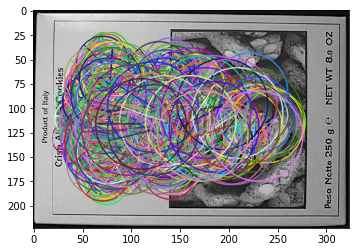


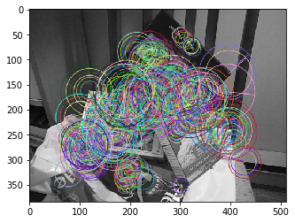


    453
    0
    487
    86.0
    (83.0, 78.0)
    (343.9854736328125, 186.32545471191406)
    -5.662790697674419
    -3.1643835616438354
    -2.909090909090909
    -0.7471264367816093
    2.4634146341463414
    0.8701298701298699
    5.2073170731707314
    5.636363636363637
    1.506849315068493
    7.7368421052631575
    7.987654320987654
    4.578947368421052
    5.9324324324324325
    10.986486486486486
    13.75
    9.573170731707318
    14.588235294117647
    13.647887323943662
    16.848837209302324
    16.614285714285714
    16.121951219512194
    17.797619047619047
    17.243243243243242
    16.87142857142857
    23.160493827160494
    20.595238095238095
    25.05263157894737
    26.151898734177216
    22.28787878787879
    25.63855421686747
    23.375
    25.826666666666668
    30.821428571428573
    26.430555555555557
    30.91025641025641
    28.057142857142857
    32.0253164556962
    31.166666666666668
    35.943661971830984
    34.7037037037037
    37.220588235294116
    32.916666666666664
    38.45679012345679
    35.892307692307696
    42.734939759036145
    38.43421052631579
    42.642857142857146
    44.67088607594937
    44.951219512195124
    48.130434782608695
    47.328947368421055
    49.848101265822784
    48.16883116883117
    52.12820512820513
    52.506024096385545
    48.68354430379747
    50.17910447761194
    51.43589743589744
    56.77777777777778
    57.87012987012987
    58.94186046511628
    58.50617283950617
    56.9
    58.58536585365854
    63.770270270270274
    62.67777777777778
    64.86764705882354
    60.5
    65.3855421686747
    63.44871794871795
    64.54166666666667
    69.44186046511628
    66.64935064935065
    70.36904761904762
    71.92
    73.7375
    71.10526315789474
    71.24096385542168
    72.1891891891892
    73.32203389830508
    74.09638554216868
    79.71951219512195
    77.85507246376811
    81.75
    81.2
    81.1
    83.01408450704226
    83.1891891891892
    86.71428571428571
    84.48275862068965
    84.9375
    86.86842105263158
    89.97014925373135
    89.10975609756098
    93.31645569620254
    89.51612903225806
    92.54411764705883
    95.80722891566265
    97.34666666666666
    98.34883720930233
    95.77906976744185
    100.34615384615384
    99.64197530864197
    99.65822784810126
    101.56818181818181
    99.55
    102.45901639344262
    101.9493670886076
    105.77777777777777
    107.22950819672131
    104.17777777777778
    106.47222222222223
    106.87878787878788
    108.23076923076923
    113.61176470588235
    111.8735632183908
    112.21126760563381
    115.83529411764705
    117.484375
    115.94666666666667
    116.45945945945945
    119.42105263157895
    117.52380952380952
    119.43529411764706
    123.97142857142858
    121.41333333333333
    122.43373493975903
    122.9
    127.05555555555556
    124.96296296296296
    124.3013698630137
    130.0731707317073
    125.4342105263158
    128.8505747126437
    132.56410256410257
    129.87654320987653
    129.74358974358975
    136.02941176470588
    135.9102564102564
    137.42857142857142
    139.9787234042553
    138.4090909090909
    141.5
    141.4268292682927
    140.3625
    140.18072289156626
    143.61702127659575
    145.57471264367817
    144.53846153846155
    146.63768115942028
    143.54054054054055
    148.47560975609755
    148.37333333333333
    150.5375
    152.19736842105263
    152.50632911392404
    153.37142857142857
    152.25974025974025
    155.28358208955223
    153.30985915492957
    159.44444444444446
    156.72826086956522
    156.05714285714285
    160.08860759493672
    160.984375
    159.2625
    164.57894736842104
    166.29166666666666
    167.98387096774192
    167.9879518072289
    163.62666666666667
    170.25641025641025
    170.8987341772152
    169.35714285714286
    168.71604938271605
    173.34177215189874
    174.31578947368422
    174.55434782608697
    172.90140845070422
    175.77464788732394
    178.9367088607595
    176.41095890410958
    178.8360655737705
    180.47435897435898
    179.25
    182.6951219512195
    182.5194805194805
    184.06756756756758
    183.79710144927537
    186.70212765957447
    187.35294117647058
    185.87654320987653
    189.22535211267606
    188.16923076923078
    188.3452380952381
    193.3764705882353
    191.1917808219178
    195.10714285714286
    193.98507462686567
    198.1098901098901
    197.67857142857142
    199.93617021276594
    201.19354838709677
    199.5194805194805
    202.7012987012987
    199.8433734939759
    204.32051282051282
    203.24590163934425
    203.30555555555554
    208.2741935483871
    204.17073170731706
    210.53571428571428
    211.04545454545453
    212.33333333333334
    213.84810126582278
    212.82666666666665
    215.5211267605634
    210.5857142857143
    212.20731707317074
    214.77777777777777
    217.28169014084506
    218.7887323943662
    216.75581395348837
    222.36764705882354
    223.87058823529412
    223.5108695652174
    223.41333333333333
    224.14705882352942
    221.63768115942028
    226.50632911392404
    224.96629213483146
    225.71764705882353
    226.65822784810126
    228.59016393442624
    227.7625
    232.1290322580645
    235.1772151898734
    235.4857142857143
    237.23684210526315
    235.45454545454547
    237.69444444444446
    234.43055555555554
    240.7536231884058
    239.7710843373494
    242.1764705882353
    244.38372093023256
    243.1764705882353
    245.671875
    243.0
    245.58333333333334
    247.2
    247.875
    248.98684210526315
    247.41463414634146
    250.41333333333333
    254.52941176470588
    253.18987341772151
    251.3918918918919
    254.47674418604652
    258.4578313253012
    255.77464788732394
    257.7042253521127
    259.77027027027026
    262.2261904761905
    259.3777777777778
    262.4047619047619
    263.42028985507244
    266.4320987654321
    263.0886075949367
    263.5897435897436
    269.8888888888889
    267.5432098765432
    271.4691358024691
    271.86567164179104
    268.025
    274.33846153846156
    275.0
    276.6578947368421
    271.7846153846154
    278.12820512820514
    279.2027027027027
    280.9759036144578
    279.97777777777776
    282.46666666666664
    276.68333333333334
    282.9148936170213
    285.43333333333334
    286.94520547945206
    285.8709677419355
    288.1585365853659
    283.31081081081084
    289.8867924528302
    291.59090909090907
    286.6025641025641
    292.75409836065575
    293.92857142857144
    295.44897959183675
    296.859649122807
    296.07142857142856
    298.1384615384615
    297.2181818181818
    300.04545454545456
    299.11764705882354
    302.34567901234567
    303.38461538461536
    304.125
    299.61971830985914
    306.1578947368421
    307.94666666666666
    308.3095238095238
    309.29333333333335
    309.8181818181818
    306.953125
    311.9866666666667
    309.8695652173913
    314.32835820895525
    313.8863636363636
    315.1621621621622
    312.5762711864407
    317.2560975609756
    317.9047619047619
    319.6923076923077
    319.97777777777776
    320.6375
    321.0
    322.5416666666667
    323.8936170212766
    325.43037974683546
    326.82456140350877
    326.49333333333334
    327.79487179487177
    329.1714285714286
    330.6578947368421
    330.2
    332.53333333333336
    332.6164383561644
    333.5263157894737
    333.8550724637681
    334.5111111111111
    338.78333333333336
    338.57894736842104
    337.87179487179486
    341.04
    336.0
    342.73015873015873
    344.09375
    342.96875
    344.675
    345.8333333333333
    348.4266666666667
    342.88524590163934
    350.3818181818182
    347.40983606557376
    346.0153846153846
    353.14864864864865
    354.35849056603774
    348.1034482758621
    356.6029411764706
    356.1111111111111
    355.28125
    355.3809523809524
    352.6607142857143
    359.90277777777777
    362.4375
    358.2241379310345
    360.758064516129
    359.10169491525426
    366.0943396226415
    364.75925925925924
    367.9672131147541
    363.1764705882353
    367.7692307692308
    370.1666666666667
    367.75
    370.58181818181816
    374.9846153846154
    370.1917808219178
    375.98387096774195
    377.53731343283584
    373.4078947368421
    378.77777777777777
    379.7111111111111
    377.66129032258067
    376.6507936507937
    380.55405405405406
    379.4142857142857
    379.9054054054054
    386.5
    381.2676056338028
    380.375
    388.7037037037037
    389.57894736842104
    387.2647058823529
    386.19444444444446
    389.2236842105263
    392.62857142857143
    395.9836065573771
    390.037037037037
    396.45588235294116
    395.7647058823529
    395.1142857142857
    399.9375
    396.6578947368421
    397.61764705882354
    402.38961038961037
    403.33734939759034
    405.95180722891564
    402.13698630136986
    405.61971830985914
    405.44776119402985
    405.1090909090909
    409.89473684210526
    407.75
    412.93023255813955
    410.0
    409.21794871794873
    414.8732394366197
    416.15492957746477
    413.55056179775283
    415.328125
    415.0163934426229
    418.57971014492756
    419.36559139784947
    416.41333333333336
    417.71232876712327
    424.3521126760563
    422.175
    423.632183908046
    422.972602739726
    420.75
    426.54545454545456
    425.5857142857143
    425.31944444444446
    431.9024390243902
    429.05194805194805
    434.2535211267606
    428.98148148148147
    433.8375
    431.5584415584416
    436.34615384615387
    434.65822784810126
    438.77777777777777
    437.0967741935484
    441.84057971014494
    443.76666666666665
    438.88
    444.5882352941176
    441.9156626506024
    444.875
    448.3
    445.80232558139534
    445.75
    446.925


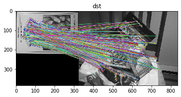


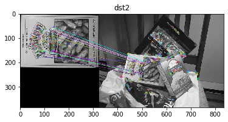

    True


```python
src1 = cv2.imread('book3.jpg', cv2.IMREAD_GRAYSCALE)
src2 = cv2.imread('book3_1.jpg', cv2.IMREAD_GRAYSCALE)
    
orb = cv2.ORB_create()
keypoints1, desc1 = orb.detectAndCompute(src1, None)
keypoints2, desc2 = orb.detectAndCompute(src2, None)

dst1 = cv2.drawKeypoints(src1, keypoints1, None, (-1, -1, -1),
                       cv2.DrawMatchesFlags_DRAW_RICH_KEYPOINTS)
dst2 = cv2.drawKeypoints(src2, keypoints2, None, (-1, -1, -1),
                       cv2.DrawMatchesFlags_DRAW_RICH_KEYPOINTS)

matcher = cv2.BFMatcher_create(cv2.NORM_HAMMING)
matches = matcher.match(desc1, desc2)

matches = sorted(matches, key=lambda x: x.distance)
good_matches = matches[:50]

dst3 = cv2.drawMatches(src1, keypoints1, src2, keypoints2, good_matches, None)

imshow('dst3', dst3)
cv2.imwrite("orb3.png", dst3)
```


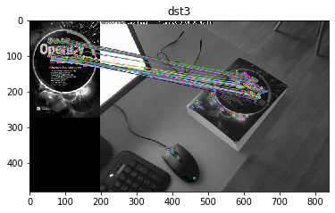

    True


# 오늘 이해할것 바로 아래것 ↓


```python
src1 = cv2.imread('book3.jpg', cv2.IMREAD_GRAYSCALE)
src2 = cv2.imread('book3_1.jpg', cv2.IMREAD_GRAYSCALE)
    
orb = cv2.ORB_create()
keypoints1, desc1 = orb.detectAndCompute(src1, None)
keypoints2, desc2 = orb.detectAndCompute(src2, None)

matcher = cv2.BFMatcher_create(cv2.NORM_HAMMING)
matches = matcher.match(desc1, desc2)

matches = sorted(matches, key=lambda x: x.distance)
good_matches = matches[:50]

dst3 = cv2.drawMatches(src1, keypoints1, src2, keypoints2, good_matches, None)

imshow('dst3', dst3)
cv2.imwrite("orb3.png", dst3)
```


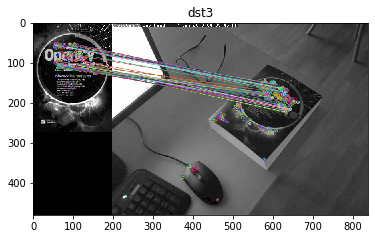

    True


# 스티치


```python
#iles = ["img1.jpg", "img2.jpg", "img3.jpg" ]
files = ["left.jpeg", "right.jpeg"]
imgs = []
for file in files:
    img = cv2.imread(file)
    imgs.append(img)
    
stitcher = cv2.Stitcher_create()
status, dst = stitcher.stitch(imgs)
cv2.imwrite('result.jpg', dst)
imshow('dst', dst)
```

