# db

> 터미널 창 하나에서 python manage.py runserver
>
> 터미널 창 하나더 실행해서 pip install django_extensions
>
> 그리고 python manage.py createsuperuser
>
> 그다음
>
>  

## 홈페이지 접속

> http://localhost:8000/admin/

> 들어가서 위에서 만든 유저네임과 패스워드를 쳐서 들어감

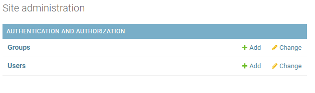

> user를 누르면


> ADD USER를 클릭

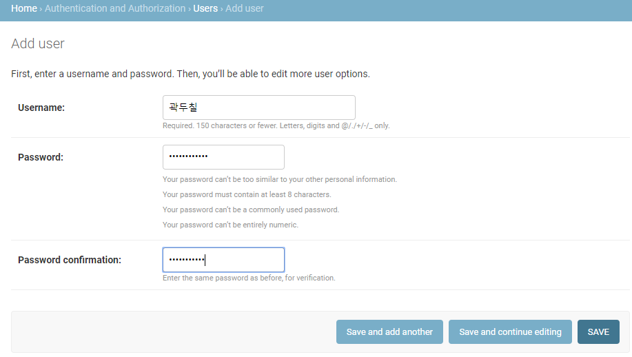

> save

## sqlite 다운

> https://sqlitebrowser.org/dl/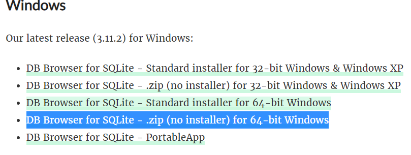splite 다운

## sqlite 사용

### 이메일 넣기


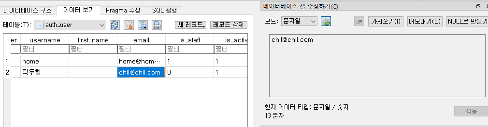

> 이메일이 없는데 이런식으로 써줄수있음

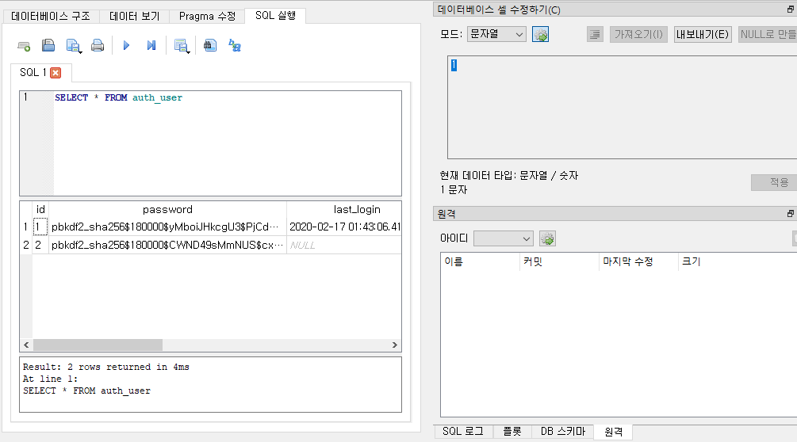


### 데이터 넣기

```sqlite
SELECT * FROM auth_user
```

```sqlite
CREATE TABLE userTBL -- 회원 테이블 
( userID CHAR(8) NOT NULL PRIMARY KEY, -- 사용자 아이디(PK) 
  userName VARCHAR(10) NOT NULL, -- 이름 
  birthYear INT NOT NULL, -- 출생 연도 
  addr CHAR(2) NOT NULL, -- 지역(경기, 서울, 경남 식으로 2글자만 입력) 
  mobile1 CHAR(3), -- 휴대폰의 국번(011, 016, 017, 018, 019, 010 등) 
  mobile2 CHAR(8), -- 휴대폰의 나머지 번호(하이픈 제외) 
  height SMALLINT, -- 키 
  mDate DATE -- 회원 가입일
);
CREATE TABLE buyTBL -- 구매 테이블 
( num INT AUTO_INCREMENT NOT NULL PRIMARY KEY, -- 순번(PK) 
  userID CHAR(8) NOT NULL, -- 아이디(FK) 
  prodName CHAR(6) NOT NULL, -- 물품 
  groupName CHAR(4), -- 분류 
  price INT NOT NULL, -- 단가 
  amount SMALLINT NOT NULL, -- 수량 
  FOREIGN KEY (userID) REFERENCES userTBL (userID)
);
```

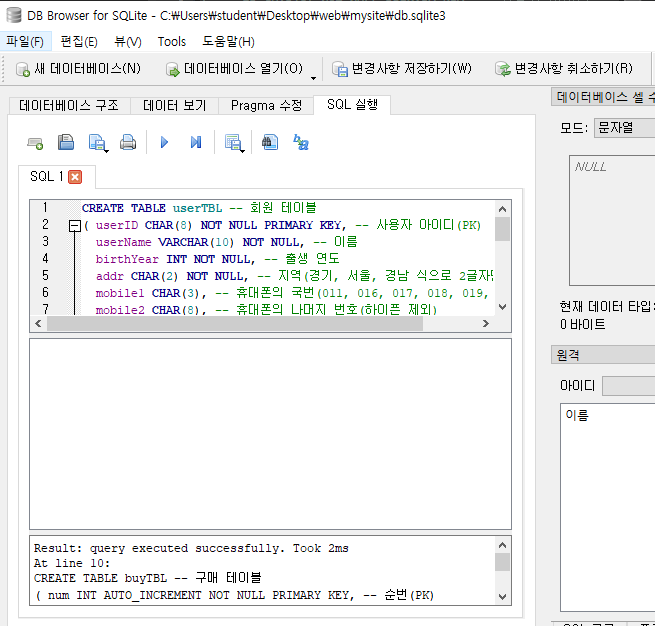

실행하면

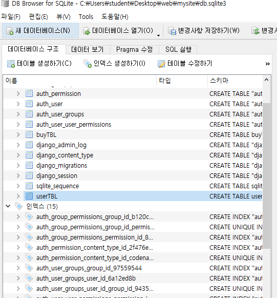

생성됨

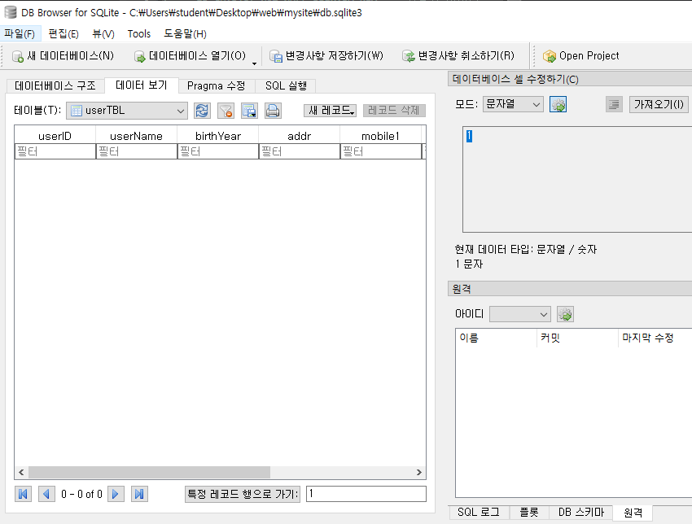

아무것도 없음

```sqlite
INSERT INTO userTBL VALUES
('KHD', '강호동', '1970', ' 경북', '011', '22222222', 182, '2017-7-7');
```


데이터가 들어간것을 확인할수있다


이렇게 하면 에러가 나게된다. 중첩이 되면 안되기 떄문에 

```sqlite
INSERT INTO buyTBL (num, userID, prodName, price, amount) VALUES
(1, 'KHD', '운동화', 30. 2);
```

```sqlite
INSERT INTO buyTBL (num, userID, prodName, price, amount) VALUES
(2, 'KHD', '노트북', 1000. 1);
```


생성을 해준다


생성완료

```sqlite
INSERT INTO userTBL VALUES ('KKJ', '김국진', 1965, '서울', '019', '33333333', 171, '2009-9-9');
INSERT INTO userTBL VALUES ('KYM', '김용만', 1967, '서울', '010', '44444444', 177, '2015-5-5');
INSERT INTO userTBL VALUES ('KJD', '김제동', 1974, '경남', NULL , NULL, 173, '2013-3-3');
INSERT INTO userTBL VALUES ('NHS', '남희석', 1971, '충남', '016', '66666666', 180, '2017-4-4');
INSERT INTO userTBL VALUES ('SDY', '신동엽', 1971, '경기', NULL, NULL, 176, '2008-10-10');
INSERT INTO userTBL VALUES ('LHJ', '이휘재', 1972, '경기', '011', '88888888', 180, '2006-4-4');
INSERT INTO userTBL VALUES ('LKK', '이경규', 1960, '경남', '018', '99999999', 170, '2004-12-12');
INSERT INTO userTBL VALUES ('PSH', '박수홍', 1970, '서울', '010', '00000000', 183, '2012-5-5');
```

```sqlite
INSERT INTO buyTBL VALUES (3, 'KYM', '모니터', '전자', 200, 1);
INSERT INTO buyTBL VALUES (4, 'PSH', '모니터', '전자', 200, 5);
INSERT INTO buyTBL VALUES (5, 'KHD', '청바지', '의류', 50, 3);
INSERT INTO buyTBL VALUES (6, 'PSH', '메모리', '전자', 80, 10);
INSERT INTO buyTBL VALUES (7, 'KJD', '책', '서적', 15, 5);
INSERT INTO buyTBL VALUES (8, 'LHJ', '책', '서적', 15, 2);
INSERT INTO buyTBL VALUES (9, 'LHJ', '청바지', '의류', 50, 1);
INSERT INTO buyTBL VALUES (10, 'PSH', '운동화', NULL, 30, 2);
INSERT INTO buyTBL VALUES (11, 'LHJ', '책', '서적', 15, 1);
INSERT INTO buyTBL VALUES (12, 'PSH', '운동화', NULL, 30, 2);
```

위 코드를 실행

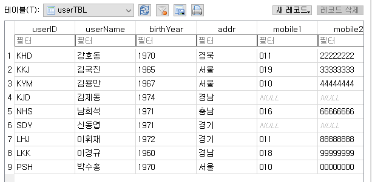

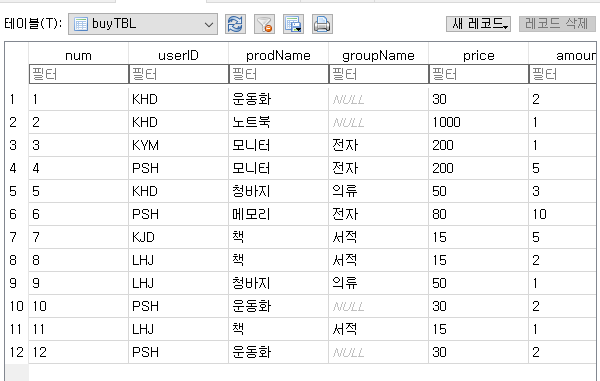

생성이 됨

### 지역별 인원수 구하기

```sqlite
SELECT addr, count(*) from userTBL
GROUP by addr
```


### user별 구매금액

```sqlite
SELECT userID, sum(price*amount)

from buyTBL

group by userID
```

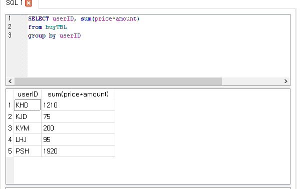

### join

```sqlite
SELECT * from userTBL, buyTBL
where userTBL.userID = buyTBL.userID
```


### user별 수량과 구매금액

```sqlite
SELECT userTBL.userID, username, sum(amount), sum(amount*price)
from userTBL, buyTBL
where userTBL.userID = buyTBL.userID
group by userTBL.userID, username
```


### user별 수량과 구매금액 2

```sqlite
SELECT u.userID, username, sum(amount), sum(amount*price) as total
from userTBL u, buyTBL b
where u.userID = b.userID
group by u.userID, username
```


### 지역별 구매총합

```sqlite
SELECT addr, sum(amount), sum(amount*price) total, count(*)
from userTBL u, buyTBL b
where u.userID = b.userID
group by u.userID, username
order by total
```


### 지역별 구매총합 >170

```sqlite
SELECT addr, sum(amount), sum(amount*price) total, count(*)
from userTBL u, buyTBL b
where u.userID = b.userID
group by u.userID, username
having total > 170
order by total
```

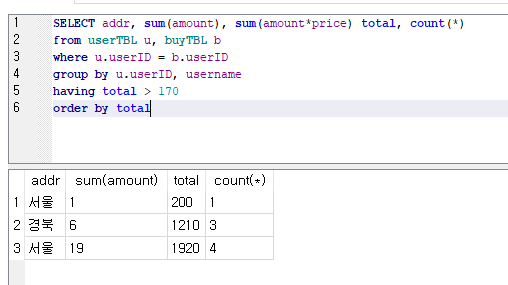


## django db  (ORM)

### mysite 폴더

#### settings.py

```python
"""
Django settings for mysite project.

Generated by 'django-admin startproject' using Django 3.0.3.

For more information on this file, see
https://docs.djangoproject.com/en/3.0/topics/settings/

For the full list of settings and their values, see
https://docs.djangoproject.com/en/3.0/ref/settings/
"""

import os

# Build paths inside the project like this: os.path.join(BASE_DIR, ...)
BASE_DIR = os.path.dirname(os.path.dirname(os.path.abspath(__file__)))


# Quick-start development settings - unsuitable for production
# See https://docs.djangoproject.com/en/3.0/howto/deployment/checklist/

# SECURITY WARNING: keep the secret key used in production secret!
SECRET_KEY = 'kwznv_of4)-p6&x@xfw8882^tmrdv6gvqocldqp^oln#bdbyon'

# SECURITY WARNING: don't run with debug turned on in production!
DEBUG = True

ALLOWED_HOSTS = []


# Application definition

INSTALLED_APPS = [
    'django.contrib.admin',
    'django.contrib.auth',
    'django.contrib.contenttypes',
    'django.contrib.sessions',
    'django.contrib.messages',
    'django.contrib.staticfiles',
    'django_extensions',
    'myapp'
]

MIDDLEWARE = [
    'django.middleware.security.SecurityMiddleware',
    'django.contrib.sessions.middleware.SessionMiddleware',
    'django.middleware.common.CommonMiddleware',
    'django.middleware.csrf.CsrfViewMiddleware',
    'django.contrib.auth.middleware.AuthenticationMiddleware',
    'django.contrib.messages.middleware.MessageMiddleware',
    'django.middleware.clickjacking.XFrameOptionsMiddleware',
]

ROOT_URLCONF = 'mysite.urls'

TEMPLATES = [
    {
        'BACKEND': 'django.template.backends.django.DjangoTemplates',
        'DIRS': ['templates'],
        'APP_DIRS': True,
        'OPTIONS': {
            'context_processors': [
                'django.template.context_processors.debug',
                'django.template.context_processors.request',
                'django.contrib.auth.context_processors.auth',
                'django.contrib.messages.context_processors.messages',
            ],
        },
    },
]

WSGI_APPLICATION = 'mysite.wsgi.application'


# Database
# https://docs.djangoproject.com/en/3.0/ref/settings/#databases

DATABASES = {
    'default': {
        'ENGINE': 'django.db.backends.sqlite3',
        'NAME': os.path.join(BASE_DIR, 'db.sqlite3'),
    }
}


# Password validation
# https://docs.djangoproject.com/en/3.0/ref/settings/#auth-password-validators

AUTH_PASSWORD_VALIDATORS = [
    {
        'NAME': 'django.contrib.auth.password_validation.UserAttributeSimilarityValidator',
    },
    {
        'NAME': 'django.contrib.auth.password_validation.MinimumLengthValidator',
    },
    {
        'NAME': 'django.contrib.auth.password_validation.CommonPasswordValidator',
    },
    {
        'NAME': 'django.contrib.auth.password_validation.NumericPasswordValidator',
    },
]


# Internationalization
# https://docs.djangoproject.com/en/3.0/topics/i18n/

LANGUAGE_CODE = 'en-us'

TIME_ZONE = 'UTC'

USE_I18N = True

USE_L10N = True

USE_TZ = True


# Static files (CSS, JavaScript, Images)
# https://docs.djangoproject.com/en/3.0/howto/static-files/

STATIC_URL = '/static/'
STATICFILES_DIRS = [os.path.join(BASE_DIR, 'static'),]
```


'django_extensions', 'myapp' 추가

### myapp 폴더

#### models.py

```python
from django.db import models
from django.utils import timezone

class User(models.Model):
    userid = models.CharField(max_length=10, primary_key=True)
    name = models.CharField(max_length=10)
    age = models.IntegerField()
    hobby = models.CharField(max_length=20)
    
    def __str__(self):
        #return self.userid + "/" + self.name + "/" +self.age
        return f"{self.userid} / {self.name} / {self.age}"
```

#### admin.py

```python
from django.contrib import admin
from myapp.models import User


admin.site.register(User)

# Register your models here.
```

#### apps.py

```python
from django.apps import AppConfig


class MyappConfig(AppConfig):
    name = 'myapp'
```

#### views.py

```python
from django.shortcuts import render, redirect
from django.http import HttpResponse
from django.views.decorators.csrf import csrf_exempt
from django.conf import settings
import face
import json
from myapp.models import User


def index(request):
    return HttpResponse("Hello DJango!!!")

def test(request):
    data = {"s":{"img":"test.png"},"list":[1, 2, 3, 4, 5]}
    return render(request, 'template.html', data)

def login(request):
    id = request.GET["id"]
    pwd = request.GET["pwd"]
    if id == pwd:
        request.session["user"] = id
        return redirect("/service")    
    return redirect("/static/login.html")

def logout(request):
    request.session["user"] = ""
    #request.session.pop("user")
    return redirect("/static/login.html")

def service(req):
    if req.session.get("user", "") == "":
        return redirect("/static/login.html")   # 위2 줄은 보안을 위해 해야함 
    html = "Main Service<br>" + req.session.get("user") + "님 감사합니다<a href=/logout>logout</a>"
    return HttpResponse(html)


@csrf_exempt
def uploadimage(request):   

    file = request.FILES['file1']
    filename = file._name    
    fp = open(settings.BASE_DIR + "/static/" + filename, "wb")
    for chunk in file.chunks() :
        fp.write(chunk)
    fp.close()
    
    result = face.facerecognition(settings.BASE_DIR + "/known.bin", settings.BASE_DIR + "/static/" + filename)
    print(result)
    if result != "" : 
        request.session["user"] = result[0]    
        return redirect("/service")
    return redirect("/static/login.html")


def listUser(request) :
    if request.method == "GET" :
        userid = request.GET.get("userid", "")
        if userid != "":
            User.objects.all().get(userid=userid).delete()
            return redirect("/listuser")
    
        q = request.GET.get("q", "")
        data = User.objects.all()
        if q != "":
            data = data.filter(name__contains=q)
        return render(request, 'template2.html', {"data": data})
    else:
        userid = request.POST["userid"]
        name = request.POST["name"]
        age = request.POST["age"]
        hobby = request.POST["hobby"]
        #u = User(userid=userid, name=name, age=age, hobby=hobby)
        #u.save()
        #User.objects.create()
        User.objects.create(userid=userid, name=name, age=age, hobby=hobby)
        return redirect("/listuser")
```

#### urls.py

```python
from django.urls import path
from . import views

urlpatterns = [
    path('', views.index),
    path('test', views.test),
    path('login', views.login),
    path('service', views.service),
    path('logout', views.logout),
    path('uploadimage', views.uploadimage),
    path('listuser', views.listUser),
]
```


### templates 폴더

#### template2.html

```html
<script src="http://code.jquery.com/jquery-1.11.3.min.js"></script>
user list<button id="add">+</button><br>



이름 {{d.name}}  나이 {{d.age}} <a href="listuser?userid={{d.userid}}"> 삭제</a> <br>




<form action="listuser">
    <input type="text" name="q">
    <input type="submit" value="검색">
</form>
<div id="layer">
<form action="listuser" method="post">
    
    <input type="text" name="userid">
    <input type="text" name="name">
    <input type="text" name="age">
    <input type="text" name="hobby">
    <input type="submit" value="Add">
</form>
</div>

<script>
    $("#layer").hide()
    $("#add").click(function() {$("#layer").toggle()});
</script>
```

### 결과물

> locahost:8000/listuser 로 들어가면
>
> 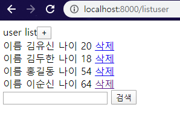
>
> 이렇게 나온다
>
> 추가하고 싶다면 
>
> 
>
> 이렇게 하면됨
>
> 
>
> 삭제 누르면 삭제됨
>
> 

### terminal

#### 생성

python manage.py makemigrations myapp

python manage.py migrate

실행하면

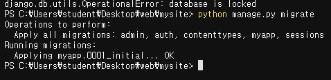


users가 생긴것을 볼수있다

ADD USER 해서


python manage.py shell

#### data 불러오기

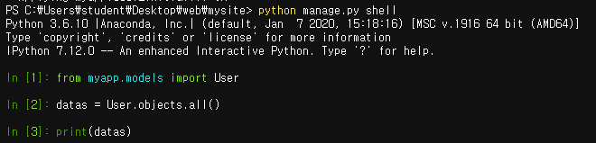

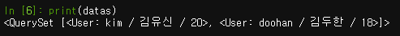

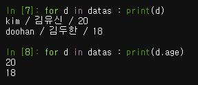

#### data 추가하기


#### data 변경하기

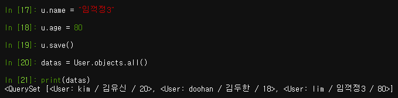

#### data 삭제하기


> quit로 나오기

### Django 전용 python 해석기

pip install django==2.0

pip install django-extensions

settings.py에  django_extensions 추가

python manage.py shell_plus --notebook

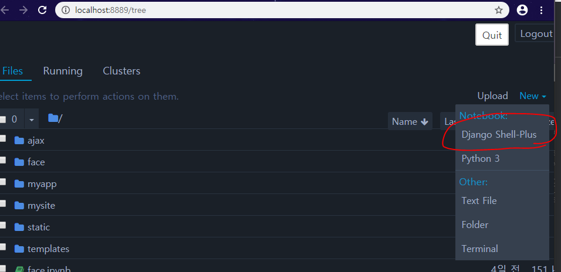

Django shell-plus가 생성되어 있음

```python
from myapp.models import User
from django.db.models import Q
```

#### data 불러오기

```python
data = User.objects.all()

for d in data:
    print(d)
```

```
kim / 김유신 / 20
doohan / 김두한 / 18
```

#### n번째 데이터 나이와 이름 불러오기

```python
print(data[0].age)
print(data[0].name)
```

```
20
김유신
```

#### 나이가 n이상인 데이터 불러오기

```python
for d in data:
    if d.age > 19: 
        print(d)
```

```
kim / 김유신 / 20
```

#### 필터

```python
print(data.filter(age=20))
```

```
<QuerySet [<User: kim / 김유신 / 20>]>
```

```python
print(data.filter(age__gte=18))   # 18살 보다 크거나 같은
```

```
<QuerySet [<User: kim / 김유신 / 20>, <User: doohan / 김두한 / 18>]>
```

```python
print(data.filter(name="김두한"))   # name이 김두한
```

```
<QuerySet [<User: doohan / 김두한 / 18>]>
```

```python
print(data.filter(name="김유신",age__gte=18))   # 이름이 김유신이고 나이가 18살보다 크거나 같은
print(data.filter(name="김유신").filter(age__gte=18))   #같은 방법임
```

```
<QuerySet [<User: kim / 김유신 / 20>]>
<QuerySet [<User: kim / 김유신 / 20>]>
```

```python
data.filter(name__contains="김")  # name에 '김'을 가지고 있으면
```

```
<QuerySet [<User: kim / 김유신 / 20>, <User: doohan / 김두한 / 18>]>
```

```python
data.filter(name__icontains="김")   # 영문검색할때 대소문자 무시
```

```
<QuerySet [<User: kim / 김유신 / 20>, <User: doohan / 김두한 / 18>]>
```

```python
data.filter(Q(age__gte=20) | Q(name__contains="유"))
```

```
<QuerySet [<User: kim / 김유신 / 20>]>
```