# django

> pip install django  로 설치

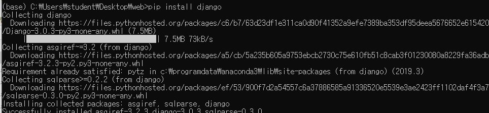

> django-admin start 

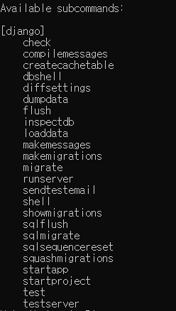

> django-admin start project mysite   # mysite라는 폴더 생성
>
> cd mysite
>
> python manage.py runserver        # 서버실행
>
> 다시 나와서
>
> python manage.py startapp myapp      # myapp폴더 생성
>
> myapp -> urls.py 생성

> python manage.py migrate  #db 생성코드

* 참고 얼굴인식을 하려면 python 3.6을써야함

  > conda create -n py36 python=3.6 anaconda
  >
  > conda activate py36
  >
  > pip install opencv-python
  >
  > pip install imutils
  >
  > dlib
  >
  > https://pypi.org/simple/dlib/   에서 
  >
  > dlib-19.8.1-cp36-cp36m-win_amd64.whl 다운
  >
  > pip install dlib-19.8.1-cp36-cp36m-win_amd64.whl
  >
  > pip install --no-dependencies face_recognition
  >
  > pip install git+https://github.com/ageitgey/face_recognition_models


## mysite

### urls.py

```python
"""mysite URL Configuration

The `urlpatterns` list routes URLs to views. For more information please see:
    https://docs.djangoproject.com/en/3.0/topics/http/urls/
Examples:
Function views
    1. Add an import:  from my_app import views
    2. Add a URL to urlpatterns:  path('', views.home, name='home')
Class-based views
    1. Add an import:  from other_app.views import Home
    2. Add a URL to urlpatterns:  path('', Home.as_view(), name='home')
Including another URLconf
    1. Import the include() function: from django.urls import include, path
    2. Add a URL to urlpatterns:  path('blog/', include('blog.urls'))
"""
from django.contrib import admin
from django.urls import path, include

urlpatterns = [
    path('', include('myapp.urls')),
    path('admin/', admin.site.urls),
]
```

### ajax 추가 후 urls.py

```python
"""mysite URL Configuration

The `urlpatterns` list routes URLs to views. For more information please see:
    https://docs.djangoproject.com/en/3.0/topics/http/urls/
Examples:
Function views
    1. Add an import:  from my_app import views
    2. Add a URL to urlpatterns:  path('', views.home, name='home')
Class-based views
    1. Add an import:  from other_app.views import Home
    2. Add a URL to urlpatterns:  path('', Home.as_view(), name='home')
Including another URLconf
    1. Import the include() function: from django.urls import include, path
    2. Add a URL to urlpatterns:  path('blog/', include('blog.urls'))
"""
from django.contrib import admin
from django.urls import path, include

urlpatterns = [
    path('ajax/', include('ajax.urls')),
    path('', include('myapp.urls')),
    path('admin/', admin.site.urls),
]
```


### settings.py

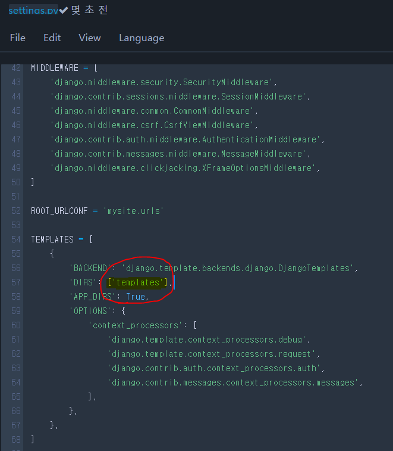

> ['templates'] 추가


## myapp

### urls.py


```python
from django.urls import path
from . import views

urlpatterns = [
    path('', views.index),
    path('test', views.test),
    path('login', views.login),
    path('service', views.service),
    path('logout', views.logout),
    path('uploadimage', views.uploadimage),
]
```


### views.py

```python
from django.shortcuts import render, redirect
from django.http import HttpResponse
from django.views.decorators.csrf import csrf_exempt
from django.conf import settings
import face


def index(request):
    return HttpResponse("Hello DJango!!!")

def test(request):
    data = {"s":{"img":"test.png"},"list":[1, 2, 3, 4, 5]}
    return render(request, 'template.html', data)

def login(request):
    id = request.GET["id"]
    pwd = request.GET["pwd"]
    if id == pwd:
        request.session["user"] = id
        return redirect("/service")    
    return redirect("/static/login.html")

def logout(request):
    request.session["user"] = ""
    #request.session.pop("user")
    return redirect("/static/login.html")

def service(req):
    if req.session.get("user", "") == "":
        return redirect("/static/login.html")   # 위2 줄은 보안을 위해 해야함 
    html = "Main Service<br>" + req.session.get("user") + "님 감사합니다<a href=/logout>logout</a>"
    return HttpResponse(html)


@csrf_exempt
def uploadimage(request):   

    file = request.FILES['file1']
    filename = file._name    
    fp = open(settings.BASE_DIR + "/static/" + filename, "wb")
    for chunk in file.chunks() :
        fp.write(chunk)
    fp.close()
    
    result = face.facerecognition(settings.BASE_DIR + "/known.bin", settings.BASE_DIR + "/static/" + filename)
    print(result)
    if result != "" : 
        request.session["user"] = result[0]    
        return redirect("/service")
    return redirect("/static/login.html")
```

## face.py

- 얼굴인식을 위해서는 face.py가 필요 

```python
from imutils import face_utils
import numpy as np
import imutils
import dlib
import cv2
import matplotlib.pyplot as plt
import face_recognition
import os
from imutils import paths
import pickle


def facerecognition(model, file) :
    data = pickle.loads(open(model, "rb").read())
    image = cv2.imread(file)
    boxes = face_recognition.face_locations(image)
    encodings = face_recognition.face_encodings(image, boxes)
 
    names = []
    for encoding in encodings:
        matches = face_recognition.compare_faces(data["encodings"], encoding)
        name = "Unknown"
        if True in matches:
            matchedIdxs = [i for (i, b) in enumerate(matches) if b]
            counts = {} 
            for i in matchedIdxs:
                name = data["names"][i]
                counts[name] = counts.get(name, 0) + 1 
            name = max(counts, key=counts.get)
        names.append(name)                             
    return names
  
facerecognition("known.bin", "sana.jpg")
```

## face폴더

face폴더를 만든후 안에 각각의 폴더(이름별로)에 여러 사진을 집어넣은후 

```python
from imutils import face_utils
import numpy as np
import imutils
import dlib
import cv2
import matplotlib.pyplot as plt
import face_recognition
import os
from imutils import paths
import pickle

def imshow(tit, image) :
    plt.title(tit)    
    if len(image.shape) == 3 :
        plt.imshow(cv2.cvtColor(image, cv2.COLOR_BGR2RGB))
    else :
        plt.imshow(image, cmap="gray")
    plt.show()
    
    
imagePaths = list(paths.list_images("face"))  #face폴더 안에 사진들 넣어줘야함
 
knownEncodings = []
knownNames = []

for (i, imagePath) in enumerate(imagePaths):    
    name = imagePath.split(os.path.sep)[-2]
    print(f"{name}   -   {imagePath}") 
    image = cv2.imread(imagePath)
    boxes = face_recognition.face_locations(image)
    encodings = face_recognition.face_encodings(image, boxes) 

    for encoding in encodings:        
        knownEncodings.append(encoding)
        knownNames.append(name)
        

data = {"encodings": knownEncodings, "names": knownNames}
f = open("known.bin", "wb")
f.write(pickle.dumps(data))
f.close()    
```

* 이렇게 known.bin에 학습을 시켜줘야함


## templates

> templates 폴더 생성
>
> 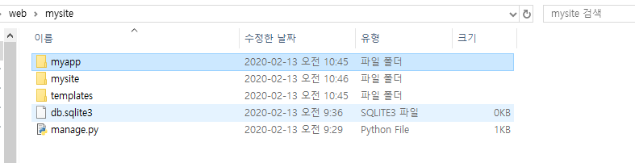

### template.html

```html
안녕   TEST<br>

입력데이터 = {{s.img}}  <br>



    {{l}} <br>


```

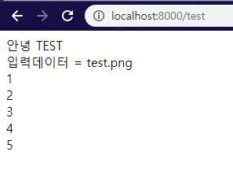

### ajax 폴더

#### calc.html

밑에 ajax 참고

#### login.html

밑에 ajax 참고

#### upload.html

밑에 ajax 참고

#### runpython.html

밑에 ajax 참고

## static

> static폴더 생성
>
> 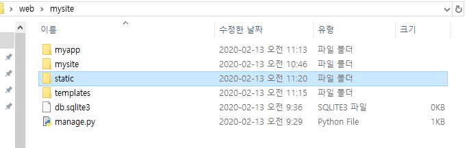

> setting.py 에서
>
> 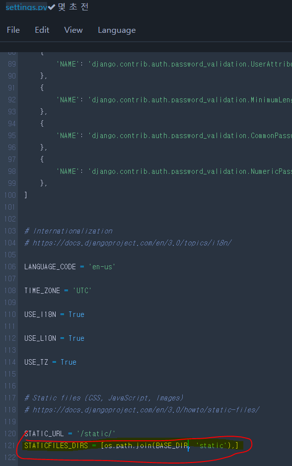
>
> STATICFILES_DIRS = [os.path.join(BASE_DIR, 'static'),]      추가

### login.html

```html
<meta charset="utf-8">
<form action=/login method=get>
    
    id <input type=text  name=id> <br>
    pwd<input type=text  name=pwd> <br>
    <input type=submit  value="로그인">
</form>

<form action = "/uploadimage" method = "POST"  enctype = "multipart/form-data">
    <input type = "file" name = "file1"/><br>
    <input type = "submit" value = "얼굴인증"/>
</form>
```


## ajax

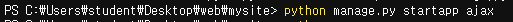

> ajax 폴더를 만들어 주고  서버실행
>
> mysite-urls에 path('ajax/', include('ajax.urls')) 추가
>
> ajax폴더에 my app에서 urls.py  복사

### urls.py

```python
from django.urls import path
from . import views

urlpatterns = [
    path('', views.index),
    path('calcform', views.calcForm),
    path('calc', views.calc),
    path('loginform', views.loginForm),
    path('login', views.login),
    path('uploadform', views.uploadForm),
    path('upload', views.upload),
    path('runpythonform', views.runpythonForm),
    path('runpython', views.runpython),
]
```

### views.py

```python
from django.shortcuts import render
from django.http import HttpResponse, JsonResponse
from django.views.decorators.csrf import csrf_exempt
from django.conf import settings
import sys
from io import StringIO

def index(request) :
    return HttpResponse("Hello ajax~~~")

def calcForm(request) :
    return render(request, "ajax/calc.html")

def calc(request) :
    op1 = int(request.GET["op1"])
    op2 = int(request.GET["op2"])
    result = op1 + op2
    return JsonResponse({'error':0, 'result':result})

def loginForm(request) :
    return render(request, "ajax/login.html")

def login(request):
    id = request.GET["id"]
    pwd = request.GET["pwd"]
    if id == pwd :
        request.session["user"] = id
        return JsonResponse({'error': 0})
    return JsonResponse({'error': -1, 'message': 'id/pwd를 확인해주세요'})


def uploadForm(request) :
    return render(request, "ajax/upload.html")

def upload(request) :
    file = request.FILES['file1']
    filename = file._name
    fp = open(settings.BASE_DIR + "/static/" + filename, "wb")
    for chunk in file.chunks() :
        fp.write(chunk)
    fp.close()
    return HttpResponse("upload~")

def runpythonForm(request) :
    return render(request, "ajax/runpython.html")

glo = {}
loc = {}

def runpython(request) :
    code = request.GET["code"]

    original_stdout = sys.stdout
    sys.stdout = StringIO()
    exec(code, glo, loc)
    contents = sys.stdout.getvalue()
    sys.stdout = original_stdout
    contents = contents.replace("\n", "<br>")

    contents = "<font color=red>result</font><br>" + contents
    return HttpResponse(contents)
```


- 밑에 html들의 위치는 이곳이 아닌 templates-ajax 임

### calc.html

> templates.폴더에 ajax폴더 하나 만들고 calc.html 만들기
>
> html파일은 다 ajax폴더 안에 넣어놔야함

```html
<script src="http://code.jquery.com/jquery-1.11.3.min.js"></script>
<script src="http://code.jquery.com/jquery-migrate-1.2.1.min.js"></script>


<input type=text name=op1 id="op1" value="5">  + <input type=text name=op2 id="op2">
<button id="btnCalc">=</button> <input type=text name="result" id="result">


<script>
    /*
    op1 = document.getElementById("op1");
    op1.value = 20;
    alert(op1.value);

    $("#op1").val(40);
    alert(  $("#op1").val()  );
    */

    $("#btnCalc").click( function() {

        /*
        op1 = parseInt($("#op1").val());
        op2 = parseInt($("#op2").val());
        $("#result").val(op1+op2);
        */

        var param = {op1:$("#op1").val(), op2:$("#op2").val()};
        $.get("/ajax/calc", param, function(data) {
            alert(JSON.stringify(data));
            //console.log(JSON.stringify(data));
            $("#result").val(data.result);
        });
    
    });


</script>
```

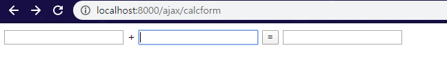

이런식으로 나옴


### login.html

```html
<script src="http://code.jquery.com/jquery-1.11.3.min.js"></script>
<script src="http://code.jquery.com/jquery-migrate-1.2.1.min.js"></script>

아이디 <input type=text name=id id="id" > <br>
암호   <input type=password name=pwd id="pwd"> <br>
<button id="btnCalc">로그인</button>

<script>
     $("#btnCalc").click( function() {
           var param = {id:$("#id").val(), pwd:$("#pwd").val()};
           $.get("/ajax/login", param, function(data) {
             console.log(JSON.stringify(data));
             if ( data.error == 0) location.href = "/ajax"
             else {
                $("#id").focus();
                $("#id").val("");
                $("#pwd").val("");
                alert(data.message);
             }
           });
     });
</script>
```

> id =  pwd 맞을경우
>
> 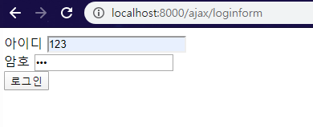
>
> 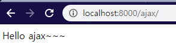
>
> 
>
> id != pwd 틀릴경우
>
> 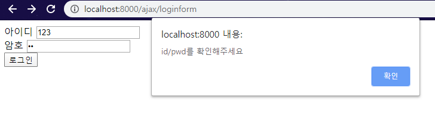

### upload.html

```html
<html>
<head>
  <meta charset="utf-8">
  <meta name="viewport" content="width=device-width, initial-scale=1.0">
</head>

<style>
  .progress { position:relative; width:400px; border: 1px solid #ddd; padding: 1px; border-radius: 3px; }
  .bar { background-color: #B4F5B4; width:0%; height:20px; border-radius: 3px; }
  .percent { position:absolute; display:inline-block; top:3px; left:48%; }
</style>

<script src="https://code.jquery.com/jquery-3.3.1.min.js"></script>
<script src="http://malsup.github.com/jquery.form.js"></script>


// http://127.0.0.1:8000/ajax/upload
<form action="upload" enctype="multipart/form-data" method="POST">
    
      <input name="title" value="테스트1"/>
      <input name="contents" value="테스트 자료입니다."/>
      <input type="file" name="file1"/>
      <input type="submit" value="upload">
</form>


<div class="progress">
    <div class="bar"></div>
    <div class="percent">0%</div>
</div>
<div id="status"></div>

    
<script>
$(function() {
    var bar = $('.bar');
    var percent = $('.percent');
    var status = $('#status');
    $('form').ajaxForm({
        beforeSend: function() {
            status.empty();
            var percentVal = '0%';
            bar.width(percentVal);
            percent.html(percentVal);
        },
        uploadProgress: function(event, position, total, percentComplete) {
            var percentVal = percentComplete + '%';
            bar.width(percentVal);
            percent.html(percentVal);
        },
        complete: function(xhr) {
           status.html("성공")
        },
       error:function(e){
          status.html("실패")
       }

    });
});

 </script>
```

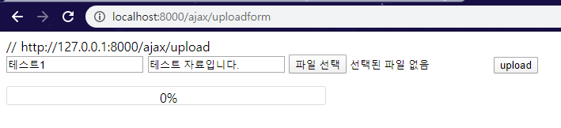

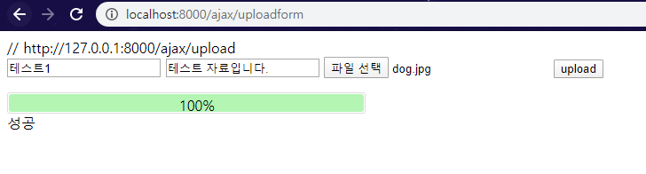

업로드되면 mysite-staticdp 저장

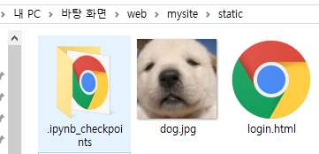

### runpython.html

```html
<script src="http://code.jquery.com/jquery-1.11.3.min.js"></script>
<script src="http://code.jquery.com/jquery-migrate-1.2.1.min.js"></script>


<button id="btnAdd">add cell</button>
<div id="cells" >
<div id="cell">
<textarea rows="10" cols="40" id="code"> </textarea>
<button id="btnRun">실행</button>
<div id="result"> result </div>
</div>
</div>
<script>
     $("#btnRun").click( function() {
           var param = {code:$("#code").val()};
           $.get("/ajax/runpython", param, function(data) {
              $("#result").html(data)
           });
     });
     $("#btnAdd").click( function() {
        $("#cells").append($("#cell").clone())
      });

</script>
```

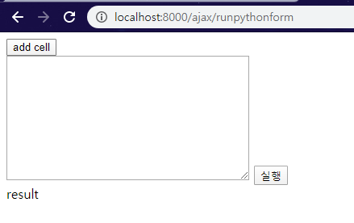

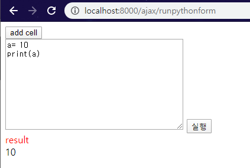

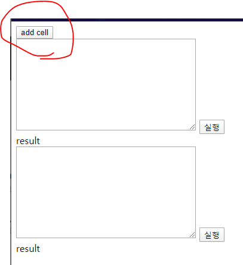

셀추가도 가능


# aws 연결하기

aws 연결해서 위의 설치과정을 거친후 접속

압축해서 올린다음 unzip 파일이름.zip

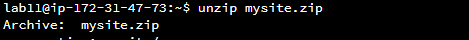

> cd mysite
>
> python.py runserver 0.0.0.0:8991

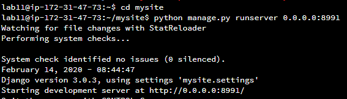

서버 열때 포트번호 100더한것을 사용하였음