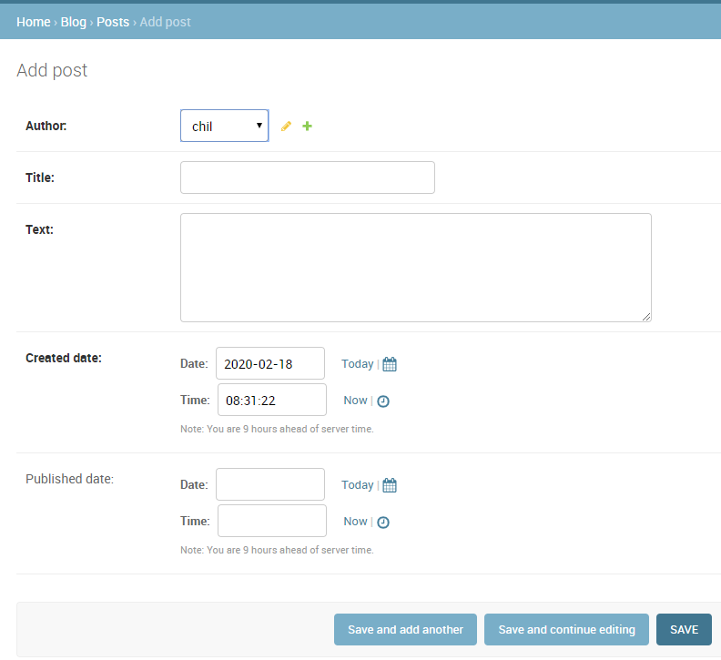

# db

> 터미널 창 하나에서 python manage.py runserver
>
> 터미널 창 하나더 실행해서 pip install django_extensions
>
> 그리고 python manage.py createsuperuser
>
> 그다음
>
>  

## 홈페이지 접속

> http://localhost:8000/admin/

> 들어가서 위에서 만든 유저네임과 패스워드를 쳐서 들어감


> user를 누르면


> ADD USER를 클릭


> save

## sqlite 다운

> https://sqlitebrowser.org/dl/splite 다운

## sqlite 사용

### 이메일 넣기


> 이메일이 없는데 이런식으로 써줄수있음


### 데이터 넣기

```sqlite
SELECT * FROM auth_user
```

```sqlite
CREATE TABLE userTBL -- 회원 테이블 
( userID CHAR(8) NOT NULL PRIMARY KEY, -- 사용자 아이디(PK) 
  userName VARCHAR(10) NOT NULL, -- 이름 
  birthYear INT NOT NULL, -- 출생 연도 
  addr CHAR(2) NOT NULL, -- 지역(경기, 서울, 경남 식으로 2글자만 입력) 
  mobile1 CHAR(3), -- 휴대폰의 국번(011, 016, 017, 018, 019, 010 등) 
  mobile2 CHAR(8), -- 휴대폰의 나머지 번호(하이픈 제외) 
  height SMALLINT, -- 키 
  mDate DATE -- 회원 가입일
);
CREATE TABLE buyTBL -- 구매 테이블 
( num INT AUTO_INCREMENT NOT NULL PRIMARY KEY, -- 순번(PK) 
  userID CHAR(8) NOT NULL, -- 아이디(FK) 
  prodName CHAR(6) NOT NULL, -- 물품 
  groupName CHAR(4), -- 분류 
  price INT NOT NULL, -- 단가 
  amount SMALLINT NOT NULL, -- 수량 
  FOREIGN KEY (userID) REFERENCES userTBL (userID)
);
```


실행하면


생성됨


아무것도 없음

```sqlite
INSERT INTO userTBL VALUES
('KHD', '강호동', '1970', ' 경북', '011', '22222222', 182, '2017-7-7');
```


데이터가 들어간것을 확인할수있다


이렇게 하면 에러가 나게된다. 중첩이 되면 안되기 떄문에 

```sqlite
INSERT INTO buyTBL (num, userID, prodName, price, amount) VALUES
(1, 'KHD', '운동화', 30. 2);
```

```sqlite
INSERT INTO buyTBL (num, userID, prodName, price, amount) VALUES
(2, 'KHD', '노트북', 1000. 1);
```


생성을 해준다


생성완료

```sqlite
INSERT INTO userTBL VALUES ('KKJ', '김국진', 1965, '서울', '019', '33333333', 171, '2009-9-9');
INSERT INTO userTBL VALUES ('KYM', '김용만', 1967, '서울', '010', '44444444', 177, '2015-5-5');
INSERT INTO userTBL VALUES ('KJD', '김제동', 1974, '경남', NULL , NULL, 173, '2013-3-3');
INSERT INTO userTBL VALUES ('NHS', '남희석', 1971, '충남', '016', '66666666', 180, '2017-4-4');
INSERT INTO userTBL VALUES ('SDY', '신동엽', 1971, '경기', NULL, NULL, 176, '2008-10-10');
INSERT INTO userTBL VALUES ('LHJ', '이휘재', 1972, '경기', '011', '88888888', 180, '2006-4-4');
INSERT INTO userTBL VALUES ('LKK', '이경규', 1960, '경남', '018', '99999999', 170, '2004-12-12');
INSERT INTO userTBL VALUES ('PSH', '박수홍', 1970, '서울', '010', '00000000', 183, '2012-5-5');
```

```sqlite
INSERT INTO buyTBL VALUES (3, 'KYM', '모니터', '전자', 200, 1);
INSERT INTO buyTBL VALUES (4, 'PSH', '모니터', '전자', 200, 5);
INSERT INTO buyTBL VALUES (5, 'KHD', '청바지', '의류', 50, 3);
INSERT INTO buyTBL VALUES (6, 'PSH', '메모리', '전자', 80, 10);
INSERT INTO buyTBL VALUES (7, 'KJD', '책', '서적', 15, 5);
INSERT INTO buyTBL VALUES (8, 'LHJ', '책', '서적', 15, 2);
INSERT INTO buyTBL VALUES (9, 'LHJ', '청바지', '의류', 50, 1);
INSERT INTO buyTBL VALUES (10, 'PSH', '운동화', NULL, 30, 2);
INSERT INTO buyTBL VALUES (11, 'LHJ', '책', '서적', 15, 1);
INSERT INTO buyTBL VALUES (12, 'PSH', '운동화', NULL, 30, 2);
```

위 코드를 실행


생성이 됨

### 지역별 인원수 구하기

```sqlite
SELECT addr, count(*) from userTBL
GROUP by addr
```


### user별 구매금액

```sqlite
SELECT userID, sum(price*amount)

from buyTBL

group by userID
```


### join

```sqlite
SELECT * from userTBL, buyTBL
where userTBL.userID = buyTBL.userID
```


### user별 수량과 구매금액

```sqlite
SELECT userTBL.userID, username, sum(amount), sum(amount*price)
from userTBL, buyTBL
where userTBL.userID = buyTBL.userID
group by userTBL.userID, username
```


### user별 수량과 구매금액 2

```sqlite
SELECT u.userID, username, sum(amount), sum(amount*price) as total
from userTBL u, buyTBL b
where u.userID = b.userID
group by u.userID, username
```


### 지역별 구매총합

```sqlite
SELECT addr, sum(amount), sum(amount*price) total, count(*)
from userTBL u, buyTBL b
where u.userID = b.userID
group by u.userID, username
order by total
```


### 지역별 구매총합 >170

```sqlite
SELECT addr, sum(amount), sum(amount*price) total, count(*)
from userTBL u, buyTBL b
where u.userID = b.userID
group by u.userID, username
having total > 170
order by total
```


## django db  (ORM)

### mysite 폴더

#### settings.py

```python
"""
Django settings for mysite project.

Generated by 'django-admin startproject' using Django 3.0.3.

For more information on this file, see
https://docs.djangoproject.com/en/3.0/topics/settings/

For the full list of settings and their values, see
https://docs.djangoproject.com/en/3.0/ref/settings/
"""

import os

# Build paths inside the project like this: os.path.join(BASE_DIR, ...)
BASE_DIR = os.path.dirname(os.path.dirname(os.path.abspath(__file__)))


# Quick-start development settings - unsuitable for production
# See https://docs.djangoproject.com/en/3.0/howto/deployment/checklist/

# SECURITY WARNING: keep the secret key used in production secret!
SECRET_KEY = 'kwznv_of4)-p6&x@xfw8882^tmrdv6gvqocldqp^oln#bdbyon'

# SECURITY WARNING: don't run with debug turned on in production!
DEBUG = True

ALLOWED_HOSTS = []


# Application definition

INSTALLED_APPS = [
    'django.contrib.admin',
    'django.contrib.auth',
    'django.contrib.contenttypes',
    'django.contrib.sessions',
    'django.contrib.messages',
    'django.contrib.staticfiles',
    'django_extensions',
    'myapp'
]

MIDDLEWARE = [
    'django.middleware.security.SecurityMiddleware',
    'django.contrib.sessions.middleware.SessionMiddleware',
    'django.middleware.common.CommonMiddleware',
    'django.middleware.csrf.CsrfViewMiddleware',
    'django.contrib.auth.middleware.AuthenticationMiddleware',
    'django.contrib.messages.middleware.MessageMiddleware',
    'django.middleware.clickjacking.XFrameOptionsMiddleware',
]

ROOT_URLCONF = 'mysite.urls'

TEMPLATES = [
    {
        'BACKEND': 'django.template.backends.django.DjangoTemplates',
        'DIRS': ['templates'],
        'APP_DIRS': True,
        'OPTIONS': {
            'context_processors': [
                'django.template.context_processors.debug',
                'django.template.context_processors.request',
                'django.contrib.auth.context_processors.auth',
                'django.contrib.messages.context_processors.messages',
            ],
        },
    },
]

WSGI_APPLICATION = 'mysite.wsgi.application'


# Database
# https://docs.djangoproject.com/en/3.0/ref/settings/#databases

DATABASES = {
    'default': {
        'ENGINE': 'django.db.backends.sqlite3',
        'NAME': os.path.join(BASE_DIR, 'db.sqlite3'),
    }
}


# Password validation
# https://docs.djangoproject.com/en/3.0/ref/settings/#auth-password-validators

AUTH_PASSWORD_VALIDATORS = [
    {
        'NAME': 'django.contrib.auth.password_validation.UserAttributeSimilarityValidator',
    },
    {
        'NAME': 'django.contrib.auth.password_validation.MinimumLengthValidator',
    },
    {
        'NAME': 'django.contrib.auth.password_validation.CommonPasswordValidator',
    },
    {
        'NAME': 'django.contrib.auth.password_validation.NumericPasswordValidator',
    },
]


# Internationalization
# https://docs.djangoproject.com/en/3.0/topics/i18n/

LANGUAGE_CODE = 'en-us'

TIME_ZONE = 'UTC'

USE_I18N = True

USE_L10N = True

USE_TZ = True


# Static files (CSS, JavaScript, Images)
# https://docs.djangoproject.com/en/3.0/howto/static-files/

STATIC_URL = '/static/'
STATICFILES_DIRS = [os.path.join(BASE_DIR, 'static'),]
```


'django_extensions', 'myapp' 추가

### myapp 폴더

#### models.py

```python
from django.db import models
from django.utils import timezone

class User(models.Model):
    userid = models.CharField(max_length=10, primary_key=True)
    name = models.CharField(max_length=10)
    age = models.IntegerField()
    hobby = models.CharField(max_length=20)
    
    def __str__(self):
        #return self.userid + "/" + self.name + "/" +self.age
        return f"{self.userid} / {self.name} / {self.age}"
```

#### admin.py

```python
from django.contrib import admin
from myapp.models import User


admin.site.register(User)

# Register your models here.
```

#### apps.py

```python
from django.apps import AppConfig


class MyappConfig(AppConfig):
    name = 'myapp'
```

#### views.py

```python
from django.shortcuts import render, redirect
from django.http import HttpResponse
from django.views.decorators.csrf import csrf_exempt
from django.conf import settings
import face
import json
from myapp.models import User


def index(request):
    return HttpResponse("Hello DJango!!!")

def test(request):
    data = {"s":{"img":"test.png"},"list":[1, 2, 3, 4, 5]}
    return render(request, 'template.html', data)

def login(request):
    id = request.GET["id"]
    pwd = request.GET["pwd"]
    if id == pwd:
        request.session["user"] = id
        return redirect("/service")    
    return redirect("/static/login.html")

def logout(request):
    request.session["user"] = ""
    #request.session.pop("user")
    return redirect("/static/login.html")

def service(req):
    if req.session.get("user", "") == "":
        return redirect("/static/login.html")   # 위2 줄은 보안을 위해 해야함 
    html = "Main Service<br>" + req.session.get("user") + "님 감사합니다<a href=/logout>logout</a>"
    return HttpResponse(html)


@csrf_exempt
def uploadimage(request):   

    file = request.FILES['file1']
    filename = file._name    
    fp = open(settings.BASE_DIR + "/static/" + filename, "wb")
    for chunk in file.chunks() :
        fp.write(chunk)
    fp.close()
    
    result = face.facerecognition(settings.BASE_DIR + "/known.bin", settings.BASE_DIR + "/static/" + filename)
    print(result)
    if result != "" : 
        request.session["user"] = result[0]    
        return redirect("/service")
    return redirect("/static/login.html")


def listUser(request) :
    if request.method == "GET" :
        userid = request.GET.get("userid", "")
        if userid != "":
            User.objects.all().get(userid=userid).delete()
            
            #User.objects.all().filter(userid=userid)[0].delete()  #무조건 1번째가 필터, 조건에 맞는게 없을순있다.
            
            return redirect("/listuser")
    
        q = request.GET.get("q", "")
        data = User.objects.all()
        if q != "":
            data = data.filter(name__contains=q)
        return render(request, 'template2.html', {"data": data})
    else:
        userid = request.POST["userid"]
        name = request.POST["name"]
        age = request.POST["age"]
        hobby = request.POST["hobby"]
        #u = User(userid=userid, name=name, age=age, hobby=hobby)
        #u.save()
        #User.objects.create()
        User.objects.create(userid=userid, name=name, age=age, hobby=hobby)
        return redirect("/listuser")
```

#### urls.py

```python
from django.urls import path
from . import views

urlpatterns = [
    path('', views.index),
    path('test', views.test),
    path('login', views.login),
    path('service', views.service),
    path('logout', views.logout),
    path('uploadimage', views.uploadimage),
    path('listuser', views.listUser),
]
```


### templates 폴더

#### template2.html

```html
<script src="http://code.jquery.com/jquery-1.11.3.min.js"></script>
user list<button id="add">+</button><br>



이름 {{d.name}}  나이 {{d.age}} <a href="listuser?userid={{d.userid}}"> 삭제</a> <br>




<form action="listuser">
    <input type="text" name="q">
    <input type="submit" value="검색">
</form>
<div id="layer">
<form action="listuser" method="post">
    
    <input type="text" name="userid">
    <input type="text" name="name">
    <input type="text" name="age">
    <input type="text" name="hobby">
    <input type="submit" value="Add">
</form>
</div>

<script>
    $("#layer").hide()
    $("#add").click(function() {$("#layer").toggle()});
</script>
```

### 결과물

> locahost:8000/listuser 로 들어가면
>
> 
>
> 이렇게 나온다
>
> 추가하고 싶다면 
>
> 
>
> 이렇게 하면됨
>
> 
>
> 삭제 누르면 삭제됨
>
> 

### terminal

#### 생성

python manage.py makemigrations myapp

python manage.py migrate

실행하면


users가 생긴것을 볼수있다

ADD USER 해서


python manage.py shell

#### data 불러오기


#### data 추가하기


#### data 변경하기


#### data 삭제하기


> quit로 나오기

### Django 전용 python 해석기

pip install django==2.0

pip install django-extensions

settings.py에  django_extensions 추가

python manage.py shell_plus --notebook


Django shell-plus가 생성되어 있음

```python
from myapp.models import User
from django.db.models import Q
```

#### data 불러오기

```python
data = User.objects.all()

for d in data:
    print(d)
```

```
kim / 김유신 / 20
doohan / 김두한 / 18
```

#### n번째 데이터 나이와 이름 불러오기

```python
print(data[0].age)
print(data[0].name)
```

```
20
김유신
```

#### 나이가 n이상인 데이터 불러오기

```python
for d in data:
    if d.age > 19: 
        print(d)
```

```
kim / 김유신 / 20
```

#### 필터

```python
print(data.filter(age=20))
```

```
<QuerySet [<User: kim / 김유신 / 20>]>
```

```python
print(data.filter(age__gte=18))   # 18살 보다 크거나 같은
```

```
<QuerySet [<User: kim / 김유신 / 20>, <User: doohan / 김두한 / 18>]>
```

```python
print(data.filter(name="김두한"))   # name이 김두한
```

```
<QuerySet [<User: doohan / 김두한 / 18>]>
```

```python
print(data.filter(name="김유신",age__gte=18))   # 이름이 김유신이고 나이가 18살보다 크거나 같은
print(data.filter(name="김유신").filter(age__gte=18))   #같은 방법임
```

```
<QuerySet [<User: kim / 김유신 / 20>]>
<QuerySet [<User: kim / 김유신 / 20>]>
```

```python
data.filter(name__contains="김")  # name에 '김'을 가지고 있으면
```

```
<QuerySet [<User: kim / 김유신 / 20>, <User: doohan / 김두한 / 18>]>
```

```python
data.filter(name__icontains="김")   # 영문검색할때 대소문자 무시
```

```
<QuerySet [<User: kim / 김유신 / 20>, <User: doohan / 김두한 / 18>]>
```

```python
data.filter(Q(age__gte=20) | Q(name__contains="유"))
```

```
<QuerySet [<User: kim / 김유신 / 20>]>
```

# -------------------------------------------------------------------

## django db  (ORM) 이용하는 blog 

### terminal

> python manage.py startapp blog         -> blog 생성
>
> python manage.py makemigrations
>
> python manage.py migrate

### mysite 폴더

#### settings.py

```python
"""
Django settings for mysite project.

Generated by 'django-admin startproject' using Django 3.0.3.

For more information on this file, see
https://docs.djangoproject.com/en/3.0/topics/settings/

For the full list of settings and their values, see
https://docs.djangoproject.com/en/3.0/ref/settings/
"""

import os

# Build paths inside the project like this: os.path.join(BASE_DIR, ...)
BASE_DIR = os.path.dirname(os.path.dirname(os.path.abspath(__file__)))


# Quick-start development settings - unsuitable for production
# See https://docs.djangoproject.com/en/3.0/howto/deployment/checklist/

# SECURITY WARNING: keep the secret key used in production secret!
SECRET_KEY = 'kwznv_of4)-p6&x@xfw8882^tmrdv6gvqocldqp^oln#bdbyon'

# SECURITY WARNING: don't run with debug turned on in production!
DEBUG = True

ALLOWED_HOSTS = []


# Application definition

INSTALLED_APPS = [
    'django.contrib.admin',
    'django.contrib.auth',
    'django.contrib.contenttypes',
    'django.contrib.sessions',
    'django.contrib.messages',
    'django.contrib.staticfiles',
    'django_extensions',
    'myapp',
    'blog'
]

MIDDLEWARE = [
    'django.middleware.security.SecurityMiddleware',
    'django.contrib.sessions.middleware.SessionMiddleware',
    'django.middleware.common.CommonMiddleware',
    'django.middleware.csrf.CsrfViewMiddleware',
    'django.contrib.auth.middleware.AuthenticationMiddleware',
    'django.contrib.messages.middleware.MessageMiddleware',
    'django.middleware.clickjacking.XFrameOptionsMiddleware',
]

ROOT_URLCONF = 'mysite.urls'

TEMPLATES = [
    {
        'BACKEND': 'django.template.backends.django.DjangoTemplates',
        'DIRS': ['templates'],
        'APP_DIRS': True,
        'OPTIONS': {
            'context_processors': [
                'django.template.context_processors.debug',
                'django.template.context_processors.request',
                'django.contrib.auth.context_processors.auth',
                'django.contrib.messages.context_processors.messages',
            ],
        },
    },
]

WSGI_APPLICATION = 'mysite.wsgi.application'


# Database
# https://docs.djangoproject.com/en/3.0/ref/settings/#databases

DATABASES = {
    'default': {
        'ENGINE': 'django.db.backends.sqlite3',
        'NAME': os.path.join(BASE_DIR, 'db.sqlite3'),
    }
}


# Password validation
# https://docs.djangoproject.com/en/3.0/ref/settings/#auth-password-validators

AUTH_PASSWORD_VALIDATORS = [
    {
        'NAME': 'django.contrib.auth.password_validation.UserAttributeSimilarityValidator',
    },
    {
        'NAME': 'django.contrib.auth.password_validation.MinimumLengthValidator',
    },
    {
        'NAME': 'django.contrib.auth.password_validation.CommonPasswordValidator',
    },
    {
        'NAME': 'django.contrib.auth.password_validation.NumericPasswordValidator',
    },
]


# Internationalization
# https://docs.djangoproject.com/en/3.0/topics/i18n/

LANGUAGE_CODE = 'en-us'

TIME_ZONE = 'UTC'

USE_I18N = True

USE_L10N = True

USE_TZ = True


# Static files (CSS, JavaScript, Images)
# https://docs.djangoproject.com/en/3.0/howto/static-files/

STATIC_URL = '/static/'
STATICFILES_DIRS = [os.path.join(BASE_DIR, 'static'),]
```


blog 추가

#### urls.py

```python
"""mysite URL Configuration

The `urlpatterns` list routes URLs to views. For more information please see:
    https://docs.djangoproject.com/en/3.0/topics/http/urls/
Examples:
Function views
    1. Add an import:  from my_app import views
    2. Add a URL to urlpatterns:  path('', views.home, name='home')
Class-based views
    1. Add an import:  from other_app.views import Home
    2. Add a URL to urlpatterns:  path('', Home.as_view(), name='home')
Including another URLconf
    1. Import the include() function: from django.urls import include, path
    2. Add a URL to urlpatterns:  path('blog/', include('blog.urls'))
"""
from django.contrib import admin
from django.urls import path, include

urlpatterns = [
    path('blog/', include('blog.urls')),
    path('ajax/', include('ajax.urls')),
    path('', include('myapp.urls')),
    path('admin/', admin.site.urls),
]
```


### blog 폴더

#### views.py

```python
from django.shortcuts import render, get_object_or_404,redirect
from django.http import HttpResponse
from blog.models import Post
from django.views.generic import View
from django.contrib.auth import authenticate
from django.contrib.auth.models import User
from django.forms import Form
from django.forms import CharField, Textarea, ValidationError


def list(request) :
    username = request.session["username"]
    user = User.objects.get(username=username)
    data = Post.objects.all().filter(author=user)
    context = {"data":data, "username":username}
    return render(request, "blog/list.html", context)

def detail(request, pk) :
    p = get_object_or_404(Post, pk=pk)
    return render(request, "blog/detail.html", {"d":p})


class PostEditView(View) :
    def get(self, request, pk):
        if pk == 0 :
            form = PostForm()
        else :
            post = get_object_or_404(Post, pk=pk)
            form = PostForm(initial={'title': post.title, 'text': post.text})
        return render(request, "blog/edit.html", {"form":form})
    
    def post(self, request, pk):
        form = PostForm(request.POST)
        
        if form.is_valid():
            if pk == 0:     # 신규작성모드
                username = request.session["username"]
                user = User.objects.get(username=username)
                Post.objects.create(title=form['title'].value(), text=form['text'].value(), author=user)
            else :     # 수정작성모드
                post = get_object_or_404(Post, pk=pk)
                post.title = form['title'].value()
                post.text = form['text'].value()
                post.publish()
            return redirect("list")
        return render(request, "blog/edit.html", {"form": form})

def validator(value) :
    if len(value) < 5 : raise  ValidationError("길이가 너무 짧아요");

class PostForm(Form):
    title = CharField(label='제목', max_length=20, validators=[validator])
    text = CharField(label="내용", widget=Textarea)

class LoginView(View) :
    def get(self, request):
        return render(request, "blog/login.html")

    def post(self, request):
        username = request.POST.get("username")
        password = request.POST.get("password")

        user = authenticate(username=username, password=password)
        if user == None :
            return redirect("login")   #경로명이 아닌 이름
        request.session["username"] = username
        return redirect("list")   #경로명이 아닌 이름
```

#### views.py 2 (위랑 코드가 조금 다름)

```python
from django.shortcuts import render, get_object_or_404,redirect
from django.http import HttpResponse
from blog.models import Post
from django.views.generic import View
from django.contrib.auth import authenticate
from django.contrib.auth.models import User
from django.forms import Form
from django.forms import CharField, Textarea, ValidationError
from django import forms


def list(request) :
    username = request.session["username"]
    user = User.objects.get(username=username)
    data = Post.objects.all().filter(author=user)
    context = {"data":data, "username":username}
    return render(request, "blog/list.html", context)

def detail(request, pk) :
    p = get_object_or_404(Post, pk=pk)
    return render(request, "blog/detail.html", {"d":p})


class PostEditView(View) :
    def get(self, request, pk):
        if pk == 0 :
            form = PostForm()
        else :
            post = get_object_or_404(Post, pk=pk)
            form = PostForm(instance=post)
        return render(request, "blog/edit.html", {"form":form})

    def post(self, request, pk):

        username = request.session["username"]
        user = User.objects.get(username=username)

        if pk == 0:
            form = PostForm(request.POST)
        else:
            post = get_object_or_404(Post, pk=pk)
            form = PostForm(request.POST, instance=post)

        if form.is_valid():
            post = form.save(commit=False)
            if pk == 0:
                post.author = user
                post.save()
            else :
                post.publish()
            return redirect("list")
        return render(request, "blog/edit.html", {"form": form})

def validator(value) :
    if len(value) < 5 : raise  ValidationError("길이가 너무 짧아요");


class PostForm(forms.ModelForm):
    class Meta:
        model = Post
        fields = ['title', 'text']


class LoginView(View) :
    def get(self, request):
        return render(request, "blog/login.html")

    def post(self, request):
        username = request.POST.get("username")
        password = request.POST.get("password")

        user = authenticate(username=username, password=password)
        if user == None :
            return redirect("login")
        request.session["username"] = username
        return redirect("list")
```

#### models.py

```python
from django.db import models
from django.utils import timezone


# Create your models here.

class Post(models.Model):
    author = models.ForeignKey('auth.User', on_delete=models.CASCADE)
    title = models.CharField(max_length=200)
    text = models.TextField()  # 글자수에 제한 없는 텍스트
    created_date = models.DateTimeField(
        default=timezone.now)  # 날짜와 시간
    published_date = models.DateTimeField(
        blank=True, null=True) #  필드가 폼에서 빈 채로 저장되는 것을 허용

    def publish(self):
        self.published_date = timezone.now()
        self.save()

    def __str__(self):
        return self.title
```

#### apps.py

```python
from django.apps import AppConfig


class BlogConfig(AppConfig):
    name = 'blog'
```

#### admin.py

```python
from django.contrib import admin
from blog.models import Post


admin.site.register(Post)

# Register your models here.
```

#### urls.py

```python
from django.urls import path
from . import views

 
urlpatterns = [
    #path('', views.index),
    #path('<name>/', views.index2),
    #path('<int:pk>/detail', views.index3),

    path('login/', views.LoginView.as_view(), name="login"),
    path('list/', views.list, name="list"),
    path('<int:pk>/detail/', views.detail, name='detail'),
    path('<int:pk>/edit/', views.PostEditView.as_view(), name="edit"),
]
```


### templates 폴더

#### blog 폴더 생성

##### list.html

```html



<a href="">Add </a> <br>

<a href=""> {{d.title}} </a> <br>



```

##### base.html

```html
<font color="skyblue"><h1>come on!!!!!!</h1> </font><br>
 로그인 사용자:{{username}}<br>






<br><br><br>
copy right..... <br>
서울특별시 ........
```

##### detail.html

```html


게시물 보기 <br>



{{d.title}}  <br>
{{d.text|linebreaks}}

<a href="">수정 </a>



```

##### login.html

```html
<form action="" method=post>
   
   username <input type=text  name=username >  <br>
   password <input type=password  name=password >  <br>
   <input type=submit value="로그인">
</form>
```

##### edit.html

```html
<script src="http://code.jquery.com/jquery-1.11.3.min.js"></script>
<script src="http://code.jquery.com/jquery-migrate-1.2.1.min.js"></script>

 <style>
      .bg { background-color: #eeeeee; }
      .bd { border: 1px solid #666666; }
 </style>


<h1>  수정하기 </h1>

<h1>  신규작성</h1>



<form method=post>
   
   	{{ form.as_p }}

   <input type="submit" value="작성" >

</form>

<script>
   $("#id_title").addClass('bg bd');
</script>
```

## 다른버전

### blog 폴더

#### views.py 다른 버전

```python
from django.shortcuts import render, get_object_or_404,redirect
from django.http import HttpResponse
from django.views.generic import View
from django.contrib.auth import authenticate
from django.contrib.auth.models import User
from django.forms import Form
from django.forms import CharField, Textarea, ValidationError
from django import forms
#from blog.forms import PostForm
from . import forms
from . import models

def list(request) :
    username = request.session["username"]
    user = User.objects.get(username=username)
    data = models.Post.objects.all().filter(author=user)
    context = {"data":data, "username":username}
    return render(request, "blog/list.html", context)

def detail(request, pk) :
    p = get_object_or_404(models.Post, pk=pk)
    return render(request, "blog/detail.html", {"d":p})


class PostEditView(View) :
    def get(self, request, pk):
        if pk == 0 :
            form = forms.PostForm()
        else :
            post = get_object_or_404(models.Post, pk=pk)
            form = forms.PostForm(instance=post)
        return render(request, "blog/edit.html", {"form":form})

    def post(self, request, pk):

        username = request.session["username"]
        user = User.objects.get(username=username)

        if pk == 0:
            form = forms.PostForm(request.POST)
        else:
            post = get_object_or_404(models.Post, pk=pk)
            form = forms.PostForm(request.POST, instance=post)

        if form.is_valid():
            post = form.save(commit=False)
            if pk == 0:
                post.author = user
                post.save()
            else :
                post.publish()
            return redirect("list")
        return render(request, "blog/edit.html", {"form": form})


class LoginView(View) :
    def get(self, request):
        return render(request, "blog/login.html")

    def post(self, request):
        username = request.POST.get("username")
        password = request.POST.get("password")

        user = authenticate(username=username, password=password)
        if user == None :
            return redirect("login")
        request.session["username"] = username
        return redirect("list")
```

#### forms.py (views.py  다른 버전과만 이어지는 것)

```python
from blog.models import Post
from django.forms import ValidationError
from django import forms


def validator(value) :
    if len(value) < 5 : raise  ValidationError("길이가 너무 짧아요");

class PostForm(forms.ModelForm):
    class Meta:
        model = Post
        fields = ['title', 'text']

    def __init__(self, *args, **kwargs):
        super(PostForm, self).__init__(*args, **kwargs)
        self.fields['title'].validators = [validator]
```

### templates 폴더

#### list.html 다른버전

```html



<a href="">Add </a> <br>

<a href=""> {{d.title}} </a> <br>



```


### Django 전용 python 해석기

#### Post 레코드 생성

```python
from blog.models import Post
from django.contrib.auth.models import User
```

```python
p = Post(title="오늘 점심 메뉴", text="머지?")
```

```python
u = User.objects.all().get(username='chil')
print(u)
p = Post(title="오늘 점심 메뉴", text="머지?", author=u)
p.save()
```

```
chil
```

```python
p.title = "오늘 점심 메뉴~~~"
p.publish()    # 현재 날싸시간으로 바꾸고 저장
```

```python
print(p.title)
```

```
오늘 점심 메뉴~~~
```

```python
Post.objects.create(title="오늘 저녁 메뉴", text="머지?", author=u)
```

```
<Post: 오늘 저녁 메뉴>
```

```python
from django.contrib.auth import authenticate
user = authenticate(username = "home", password = "abcd1234")
print(user)
if user == None : print(user)
```

```
home
```

```python
from django.contrib.auth import authenticate
user = authenticate(username = "chil", password = "zxcv1234")
print(user)
if user == None : print(user)
```

```
chil
```


### 결과물

> http://localhost:8000/blog/ 로들어가면
>
> 
>
> http://localhost:8000/blog/login/    로그인 화면
>
> 
>
> 아이디와 비밀번호를 치고 들어가면
>
> http://localhost:8000/blog/list/ 로 가게됨
>
> 
>
> 내가 쓴 글들이 보인다. 저중에서 하나를 클릭해보면
>
> 
>
> 이런식으로 뜨고 수정 할 수 있다.
>
> loalhost:8000/blog/(숫자)/edit/ 로 들어가진다
>
> 
>
> 
>
> 
>
> 수정하는 문장이 너무 짧으면 이렇게 뜬다 5글자 이상으로 views.py에 설정 해둠 
>
> 
>
> 수정하고 난 모습
>
> 

### 번외

> 터미널에서 아래코드를 치고
>
> python manage.py startapp blog         -> blog 생성
>
> python manage.py makemigrations
>
> python manage.py migrate
>
> http://localhost:8000/admin/ 으로 들어가면 
>
> 
>
> 블로그가 만들어져있다.
>
> 
>
> add post를 누르면
>
> 
>
> author에서 유저를 선택하고 쓴후 save하면 블로그에 글이 올라간다

# -------------------------------------------------------------------

## 게시판 만들기

> python manage.py startapp myboard  로 myboard 폴더 생성
>
> blog폴더에서 위의 5개 파이썬 파일 복사 template

### terminal

> python manage.py startapp myboard         -> myboard 생성
>
> python manage.py makemigrations
>
> python manage.py migrate

### mysite 폴더

#### settings.py

```python
"""
Django settings for mysite project.

Generated by 'django-admin startproject' using Django 3.0.3.

For more information on this file, see
https://docs.djangoproject.com/en/3.0/topics/settings/

For the full list of settings and their values, see
https://docs.djangoproject.com/en/3.0/ref/settings/
"""

import os

# Build paths inside the project like this: os.path.join(BASE_DIR, ...)
BASE_DIR = os.path.dirname(os.path.dirname(os.path.abspath(__file__)))


# Quick-start development settings - unsuitable for production
# See https://docs.djangoproject.com/en/3.0/howto/deployment/checklist/

# SECURITY WARNING: keep the secret key used in production secret!
SECRET_KEY = 'kwznv_of4)-p6&x@xfw8882^tmrdv6gvqocldqp^oln#bdbyon'

# SECURITY WARNING: don't run with debug turned on in production!
DEBUG = True

ALLOWED_HOSTS = []


# Application definition

INSTALLED_APPS = [
    'django.contrib.admin',
    'django.contrib.auth',
    'django.contrib.contenttypes',
    'django.contrib.sessions',
    'django.contrib.messages',
    'django.contrib.staticfiles',
    'django_extensions',
    'myapp',
    'blog',
    'myboard',
]

MIDDLEWARE = [
    'django.middleware.security.SecurityMiddleware',
    'django.contrib.sessions.middleware.SessionMiddleware',
    'django.middleware.common.CommonMiddleware',
    'django.middleware.csrf.CsrfViewMiddleware',
    'django.contrib.auth.middleware.AuthenticationMiddleware',
    'django.contrib.messages.middleware.MessageMiddleware',
    'django.middleware.clickjacking.XFrameOptionsMiddleware',
]

ROOT_URLCONF = 'mysite.urls'

TEMPLATES = [
    {
        'BACKEND': 'django.template.backends.django.DjangoTemplates',
        'DIRS': ['templates'],
        'APP_DIRS': True,
        'OPTIONS': {
            'context_processors': [
                'django.template.context_processors.debug',
                'django.template.context_processors.request',
                'django.contrib.auth.context_processors.auth',
                'django.contrib.messages.context_processors.messages',
            ],
        },
    },
]

WSGI_APPLICATION = 'mysite.wsgi.application'


# Database
# https://docs.djangoproject.com/en/3.0/ref/settings/#databases

DATABASES = {
    'default': {
        'ENGINE': 'django.db.backends.sqlite3',
        'NAME': os.path.join(BASE_DIR, 'db.sqlite3'),
    }
}


# Password validation
# https://docs.djangoproject.com/en/3.0/ref/settings/#auth-password-validators

AUTH_PASSWORD_VALIDATORS = [
    {
        'NAME': 'django.contrib.auth.password_validation.UserAttributeSimilarityValidator',
    },
    {
        'NAME': 'django.contrib.auth.password_validation.MinimumLengthValidator',
    },
    {
        'NAME': 'django.contrib.auth.password_validation.CommonPasswordValidator',
    },
    {
        'NAME': 'django.contrib.auth.password_validation.NumericPasswordValidator',
    },
]


# Internationalization
# https://docs.djangoproject.com/en/3.0/topics/i18n/

LANGUAGE_CODE = 'en-us'

TIME_ZONE = 'UTC'

USE_I18N = True

USE_L10N = True

USE_TZ = True


# Static files (CSS, JavaScript, Images)
# https://docs.djangoproject.com/en/3.0/howto/static-files/

STATIC_URL = '/static/'
STATICFILES_DIRS = [os.path.join(BASE_DIR, 'static'),]
```


myboard 추가

#### urls.py

```python
"""mysite URL Configuration

The `urlpatterns` list routes URLs to views. For more information please see:
    https://docs.djangoproject.com/en/3.0/topics/http/urls/
Examples:
Function views
    1. Add an import:  from my_app import views
    2. Add a URL to urlpatterns:  path('', views.home, name='home')
Class-based views
    1. Add an import:  from other_app.views import Home
    2. Add a URL to urlpatterns:  path('', Home.as_view(), name='home')
Including another URLconf
    1. Import the include() function: from django.urls import include, path
    2. Add a URL to urlpatterns:  path('blog/', include('blog.urls'))
"""
from django.contrib import admin
from django.urls import path, include

urlpatterns = [
    path('myboard/', include('myboard.urls')),
    path('blog/', include('blog.urls')),
    path('ajax/', include('ajax.urls')),
    path('', include('myapp.urls')),
    path('admin/', admin.site.urls),
]
```

### myboard 폴더

#### views.py

```python
from django.shortcuts import render, get_object_or_404,redirect
from django.http import HttpResponse
from django.views.generic import View
from django.contrib.auth.models import User
from django.core.paginator import Paginator

from . import forms
from . import models
from . import apps

class BoardView(View) :
    def get(self, request, category, pk, mode):
        if  mode == 'add' :
            form = forms.BoardForm()
        elif mode == 'list' :
            username = request.session["username"]
            user = User.objects.get(username=username)
            data = models.Board.objects.all().filter(category=category)
            
            context = {"data": data, "username": username, "category": category}
            return render(request, apps.APP + "/list.html", context)
        elif mode ==  "detail" :
            p = get_object_or_404(models.Board, pk=pk)
            p.cnt += 1
            p.save()
            return render(request, apps.APP +"/detail.html", {"d": p,"category":category})
        elif mode == "edit" :
            board = get_object_or_404(models.Board, pk=pk)
            form = forms.BoardForm(instance=board)
        else :
            return HttpResponse("error page")

        return render(request, apps.APP +"/edit.html", {"form":form})

    def post(self, request, category, pk, mode):

        username = request.session["username"]
        user = User.objects.get(username=username)

        if pk == 0:
            form = forms.BoardForm(request.POST)
        else:
            board = get_object_or_404(models.Board, pk=pk)
            form = forms.BoardForm(request.POST, instance=board)

        if form.is_valid():
            board = form.save(commit=False)
            if pk == 0:
                board.author = user
            board.category = category
            board.save()
            return redirect("myboard", category, 0, 'list')
        return render(request, apps.APP + "/edit.html", {"form": form})
```

#### models.py

```python
from django.db import models
from django.utils import timezone


# Create your models here.

class Board(models.Model):
    author = models.ForeignKey('auth.User', on_delete=models.CASCADE)
    title = models.CharField(max_length=200)
    text = models.TextField()  # 글자수에 제한 없는 텍스트
    created_date = models.DateTimeField(
        default=timezone.now)  # 날짜와 시간
    cnt = models.IntegerField(default=0)
    image = models.CharField(max_length=200, null=True, blank=True)
    category = models.CharField(max_length=10, default='common')


    def __str__(self):
        return self.title
```

#### apps.py

```python
from django.apps import AppConfig


APP = "myboard"

class MyboardConfig(AppConfig):
    name = 'myboard'
```

#### admin.py

```python
from django.contrib import admin
from . import models


admin.site.register(models.Board)
```

#### urls.py

```python
from django.urls import path
from . import views
from django.shortcuts import redirect


urlpatterns = [
    path('<category>/<int:pk>/<mode>/', views.BoardView.as_view(), name="myboard"),
    path('', lambda request: redirect('myboard', 'common', 0, 'list')),

]
```

#### forms.py

```python
from django.forms import ValidationError
from django import forms
from . import models


def validator(value) :
    if len(value) < 5 : raise  ValidationError("길이가 너무 짧아요");

class BoardForm(forms.ModelForm):
    class Meta:
        model = models.Board
        fields = ['title', 'text']

    def __init__(self, *args, **kwargs):
        super(BoardForm, self).__init__(*args, **kwargs)
        self.fields['title'].validators = [validator]
```


### templates 폴더

#### myboard 폴더 생성

##### list.html

```html



<a href="">글쓰기
<style type="text/css"> 
a { text-decoration:none } 
</style> 
</a> <br><br>

&middot;<a href=""> {{d.title}} 조회수 {{d.cnt}} 
<style type="text/css"> 
a { text-decoration:none } 
</style> 
</a> <br>



```

##### base.html

```html
<font color="skyblue"><h1>게시판 만들기</h1> </font><br>
 로그인 사용자:{{username}}<br>

<a href="/myboard/data/0/list"> 자료실 </a>
<a href="/myboard/common/0/list"> 일반게시판 </a>
<a href="/myboard/etc/0/list"> 기타 </a> <br>






<br><br><br>
<hr color = 'black'>
copy right..... <br>
서울특별시 ........
```

##### detail.html

```html


게시물 보기 <br>



{{d.title}}  <br>
{{d.text|linebreaks}}

<a href="">수정 </a>



```

##### login.html

```html
<form action="" method=post>
   
   username <input type=text  name=username >  <br>
   password <input type=password  name=password >  <br>
   <input type=submit value="로그인">
</form>
```

##### edit.html

```html
<script src="http://code.jquery.com/jquery-1.11.3.min.js"></script>
<script src="http://code.jquery.com/jquery-migrate-1.2.1.min.js"></script>

 <style>
      .bg { background-color: #eeeeee; }
      .bd { border: 1px solid #666666; }
 </style>


<h1>  수정하기 </h1>

<h1>  신규작성</h1>



<form method=post>
   
   	{{ form.as_p }}

   <input type="submit" value="작성" >

</form>

<script>
   $("#id_title").addClass('bg bd');
</script>
```

## 결과물

- 자료실


- 일반게시판


- 글쓰기


- 쓴 글을 누르면 수정 할수있음


- 기타


# -------------------------------------------------------------------

## 페이지 추가

### myboard 폴더

#### views.py

```python
from django.shortcuts import render, get_object_or_404,redirect
from django.http import HttpResponse
from django.views.generic import View
from django.contrib.auth.models import User
from django.core.paginator import Paginator
from django.urls import reverse

from . import forms
from . import models
from . import apps
from django.urls import resolve


def page(request):
    datas = [{"id":1, "name":"홍길동1"},
            {"id":2, "name":"홍길동2"},
            {"id":3, "name":"홍길동3"},
            {"id":4, "name":"홍길동4"},
            {"id":5, "name":"홍길동5"},
            {"id":6, "name":"홍길동6"},
            {"id":7, "name":"홍길동7"},
            ]
    page = request.GET.get("page", 1)
    
    p = Paginator(datas, 3)
    subs = p.page(page)  #(page-1)*3:page*3
    
    return render(request, "myboard/page,html", {"datas":subs})


class BoardView(View) :
    def get(self, request, category, pk, mode):
        if  mode == 'add' :
            form = forms.BoardForm()
        elif mode == 'list' :
            username = request.session["username"]
            user = User.objects.get(username=username)
            data = models.Board.objects.all().filter(category=category)
            
            page = request.GET.get("page", 1)
            p = Paginator(data, 3)
            subs = p.page(page)  #(page-1)*3:page*3
            
            context = {"datas": subs, "username": username, "category": category}
            
            return render(request, apps.APP + "/list.html", context)
        elif mode ==  "detail" :
            p = get_object_or_404(models.Board, pk=pk)
            p.cnt += 1
            p.save()
            return render(request, apps.APP +"/detail.html", {"d": p,"category":category})
        elif mode == "edit" :
            board = get_object_or_404(models.Board, pk=pk)
            form = forms.BoardForm(instance=board)
        else :
            return HttpResponse("error page")

        return render(request, apps.APP +"/edit.html", {"form":form})

    def post(self, request, category, pk, mode):

        username = request.session["username"]
        user = User.objects.get(username=username)

        if pk == 0:
            form = forms.BoardForm(request.POST)
        else:
            board = get_object_or_404(models.Board, pk=pk)
            form = forms.BoardForm(request.POST, instance=board)

        if form.is_valid():
            board = form.save(commit=False)
            if pk == 0:
                board.author = user
            board.category = category
            board.save()
            return redirect("myboard", category, 0, 'list')
        return render(request, apps.APP + "/edit.html", {"form": form})
```

page 추가

### templates 폴더

#### myboard 폴더

##### page.html 추가

```html


   {{data.id}}  / {{data.name}}  <br>




        
          <a href="?page={{ datas.previous_page_number }}">&laquo;</a>
        
          <span>&laquo;</span>
        

        
          
            <span>{{ i }} </span>
          
            <a href="?page={{ i }}">{{ i }}</a>
          
        
        
            <a href="?page={{ datas.next_page_number }}">&raquo;</a>
        
            <span>&raquo;</span>
        
    
```

##### list.html

```html



<a href="">글쓰기
<style type="text/css"> 
a { text-decoration:none } 
</style> 
</a> <br><br>

&middot;<a href=""> {{d.title}} 조회수 {{d.cnt}} 
<style type="text/css"> 
a { text-decoration:none } 
</style> 
</a> <br>



        
          <a href="?page={{ datas.previous_page_number }}">&laquo;</a>
        
          <span>&laquo;</span>
        

        
          
            <span>{{ i }} </span>
          
            <a href="?page={{ i }}">{{ i }}</a>
          
        
        
            <a href="?page={{ datas.next_page_number }}">&raquo;</a>
        
            <span>&raquo;</span>
        
    


```

##### edit.html

```html
<script src="http://code.jquery.com/jquery-1.11.3.min.js"></script>
<script src="http://code.jquery.com/jquery-migrate-1.2.1.min.js"></script>

 <style>
      .bg { background-color: #eeeeee; }
      .bd { border: 1px solid #666666; }
 </style>


<h1>  수정하기 </h1>

<h1>  신규작성</h1>



<form method=post>
   
   	{{ form.as_p }}

   <input type="submit" value="작성" >
    
    <input type="hidden" name="page" value="2">

</form>

<script>
   $("#id_title").addClass('bg bd');
</script>
```

## 결과물


아래에 페이지를 만들수있다

# -------------------------------------------------------------------

## get & del

### myboard 폴더

#### views.py

```python
from django.shortcuts import render, get_object_or_404,redirect
from django.http import HttpResponse, JsonResponse
from django.views.generic import View
from django.contrib.auth.models import User
from django.core.paginator import Paginator
from django.urls import reverse

from . import forms
from . import models
from . import apps
from django.urls import resolve


def page(request):
    datas = [{"id":1, "name":"홍길동1"},
            {"id":2, "name":"홍길동2"},
            {"id":3, "name":"홍길동3"},
            {"id":4, "name":"홍길동4"},
            {"id":5, "name":"홍길동5"},
            {"id":6, "name":"홍길동6"},
            {"id":7, "name":"홍길동7"},
            ]
    page = request.GET.get("page", 1)
    p = Paginator(datas, 3)
    subs = p.page(page)  #(page-1)*3:page*3
    return render(request, "myboard/page,html", {"datas":subs})

def ajaxdel(request):
    pk = request.GET.get('pk')
    board = models.Board.objects.get(pk=pk)
    #board.delete()
    return JsonResponse({'error':'0'})

def ajaxget(request):
    page = request.GET.get("page",1)
    
    datas = models.Board.objects.all().filter(category='common')
    page = int(page)
    subs = datas[(page-1)*3:(page)*3]
    
    datas = {"datas" : [{"pk":data.pk, "title":data.title, "cnt":data.cnt} for data in subs]}
    
    return JsonResponse(datas, json_dumps_params = {'ensure_ascii':False})   # 한글깨지는거 바꿔줌
    #p = Paginator(datas, 3)
    #subs = p.page(page)


class BoardView(View) :
    def get(self, request, category, pk, mode):
        if  mode == 'add' :
            form = forms.BoardForm()
        elif mode == 'list' :
            username = request.session["username"]
            user = User.objects.get(username=username)
            data = models.Board.objects.all().filter(category=category)
            
            page = request.GET.get("page", 1)
            p = Paginator(data, 3)
            subs = p.page(page)  #(page-1)*3:page*3
            
            context = {"datas": subs, "username": username, "category": category}
            
            return render(request, apps.APP + "/list.html", context)
        elif mode ==  "detail" :
            p = get_object_or_404(models.Board, pk=pk)
            p.cnt += 1
            p.save()
            return render(request, apps.APP +"/detail.html", {"d": p,"category":category})
        elif mode == "edit" :
            board = get_object_or_404(models.Board, pk=pk)
            form = forms.BoardForm(instance=board)
        else :
            return HttpResponse("error page")

        return render(request, apps.APP +"/edit.html", {"form":form})

    def post(self, request, category, pk, mode):

        username = request.session["username"]
        user = User.objects.get(username=username)

        if pk == 0:
            form = forms.BoardForm(request.POST)
        else:
            board = get_object_or_404(models.Board, pk=pk)
            form = forms.BoardForm(request.POST, instance=board)

        if form.is_valid():
            board = form.save(commit=False)
            if pk == 0:
                board.author = user
            board.category = category
            board.save()
            return redirect("myboard", category, 0, 'list')
        return render(request, apps.APP + "/edit.html", {"form": form})
```


## 결과물


## jquerytest.html (static 폴더안)

### getPage & deleteBoard

```html
<head>
  <meta charset="UTF-8">
</head>

<script src="http://code.jquery.com/jquery-1.11.3.min.js"></script>
<script src="http://code.jquery.com/jquery-migrate-1.2.1.min.js"></script>


<button id="btnMore">More</button>


<div id="view">
    <div id="item">
    <a href=list?id=4> <span id=title>제목~~</span> </a>
        조회수 <span id=cnt> 0 </span>
        <a id='del' href=javascript:deleteBoard(1)>지우기</a>
        <br>
    <div>
</div>
    
<script>
    //$("#view").append("<a href=fds>데이터2</a><br>")
    //$("#view").append("<a href=fds>데이터2</a><br>")
    //$("#title").html("제목1")
    //$("#cnt").text("10")
    
    
    //item = $("#item").clone()
    //$("#title", item).html("제목1")    // 전체문서가 아니라 서브노드인 item에서 "title"을 찾으라는 것
    //$("#cnt", item).text("10")
    
    //$("#view").append(item)
    
    
    //$("del").attr("href", "javascript:deleteBoard"(6));
    
    
    
    
  //$("#item").hide();    // 저위에있는 제목~~~~~을 숨기는것
   
   var page = 1
   
   function deleteBoard(pk){
       //alert(pk);
       $.get("/myboard/ajaxdel", {pk:pk}, function(json) {
           //alert(json.error);
           $("#item_" + pk).remove();
       });
   }
   function getPage(page) {
		//json = {"datas": [{"pk": 1, "title": "\uac00\ub098\ub2e4\ub77c\ub9c8\ubc14\uc0ac\uc544", "cnt": 8}, {"pk": 2, "title": "\ud504\ub85c\uc81d\ud2b8?", "cnt": 6}, {"pk": 3, "title": "\uc22b\uc790\uac00 \uc624\ub974\ub098", "cnt": 4}]}
       
       $.get("/myboard/ajaxget", {page:page}, function(json) {
        console.log(JSON.stringify(json));
           if ( json.datas.length == 0) alert("마지막페이지 입니다.");
           for (i = 0; i < json.datas.length; i++) {		
            //console.log( json.datas[i].title);
			item = $("#item").clone();
            item.attr("id", "item_" + json.datas[i].pk);
			item.show(); // 숨긴것을 상속받기때문에 show를 통해 보여준다
			$("#title", item).html(json.datas[i].title);
			$("#cnt", item).text(json.datas[i].cnt);      
            $("#del", item).attr("href", "javascript:deleteBoard("+json.datas[i].pk+")");
			$("#view").append(item);   					
		}
       });
       
          
   }    
   $("#btnMore").click( function() {  
			page++;
			getPage(page);
   });
   
   getPage(page);
    
    $.get("/myboard/ajaxget", {page:1}, function(json) {
        console.log(JSON.stringify(json));
    });
    

</script>
```

## 결과물

첫화면


더이상 불러올 게시물이 없을경우


지우기


잘 없어짐을 볼수있다