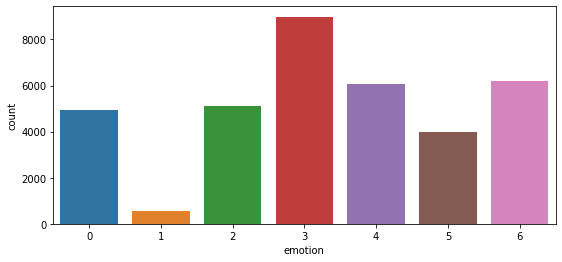
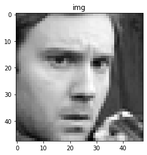
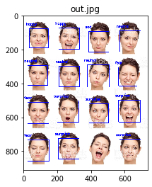

# Emotion expression


```python
import numpy as np
import pandas as pd
from matplotlib import pyplot as plt
%matplotlib inline
from matplotlib.colors import ListedColormap
import seaborn as sns
import cv2
from keras.preprocessing.image import ImageDataGenerator
import matplotlib.pyplot as plt
import numpy as np
from keras.preprocessing import image
import sys
from keras.models import load_model
from keras.layers import Activation, Convolution2D, Dropout, Conv2D
from keras.layers import AveragePooling2D, BatchNormalization
from keras.layers import GlobalAveragePooling2D
from keras.models import Sequential
from keras.layers import Flatten
from keras.models import Model
from keras.layers import Input
from keras.layers import MaxPooling2D
from keras.layers import SeparableConv2D
from keras import layers


def imshow(tit, image) :
    plt.title(tit)    
    if len(image.shape) == 3 :
        plt.imshow(cv2.cvtColor(image, cv2.COLOR_BGR2RGB))
    else :
        plt.imshow(image, cmap="gray")
    plt.show()
```

    Using TensorFlow backend.


```python
df = pd.read_csv("fer2013.csv")
df.head()

#  0=Angry, 1=Disgust, 2=Fear, 3=Happy, 4=Sad, 5=Surprise, 6=Neutral**
```


<div>
<style scoped>
    .dataframe tbody tr th:only-of-type {
        vertical-align: middle;
    }

    .dataframe tbody tr th {
        vertical-align: top;
    }
    
    .dataframe thead th {
        text-align: right;
    }
</style>
<table border="1" class="dataframe">
  <thead>
    <tr style="text-align: right;">
      <th></th>
      <th>emotion</th>
      <th>pixels</th>
      <th>Usage</th>
    </tr>
  </thead>
  <tbody>
    <tr>
      <th>0</th>
      <td>0</td>
      <td>70 80 82 72 58 58 60 63 54 58 60 48 89 115 121...</td>
      <td>Training</td>
    </tr>
    <tr>
      <th>1</th>
      <td>0</td>
      <td>151 150 147 155 148 133 111 140 170 174 182 15...</td>
      <td>Training</td>
    </tr>
    <tr>
      <th>2</th>
      <td>2</td>
      <td>231 212 156 164 174 138 161 173 182 200 106 38...</td>
      <td>Training</td>
    </tr>
    <tr>
      <th>3</th>
      <td>4</td>
      <td>24 32 36 30 32 23 19 20 30 41 21 22 32 34 21 1...</td>
      <td>Training</td>
    </tr>
    <tr>
      <th>4</th>
      <td>6</td>
      <td>4 0 0 0 0 0 0 0 0 0 0 0 3 15 23 28 48 50 58 84...</td>
      <td>Training</td>
    </tr>
  </tbody>
</table>
</div>


```python
df.shape
```


    (35887, 3)


```python
plt.figure(figsize=(9,4))
sns.countplot(x='emotion', data=df)
```


    <matplotlib.axes._subplots.AxesSubplot at 0x2a1703277f0>





```python
image_size=(48,48)
```


```python
pixels = df['pixels'].tolist() # Converting the relevant column element into a list for each row
width, height = 48, 48
faces = []
for pixel_sequence in pixels:
  face = [int(pixel) for pixel in pixel_sequence.split(' ')] # Splitting the string by space character as a list
  face = np.asarray(face).reshape(width, height) #converting the list to numpy array in size of 48*48
  face = cv2.resize(face.astype('uint8'),image_size) #resize the image to have 48 cols (width) and 48 rows (height)
  faces.append(face.astype('float32')) #makes the list of each images of 48*48 and their pixels in numpyarray form
  
faces = np.asarray(faces) #converting the list into numpy array
faces = np.expand_dims(faces, -1) #Expand the shape of an array -1=last dimension
```


```python
emotions = pd.get_dummies(df['emotion']).to_numpy()
```


```python
print(faces.shape)
print(emotions.shape)
img = faces[0,:,:,0]
imshow("img", img)
```

    (35887, 48, 48, 1)
    (35887, 7)





```python
x = faces.astype('float32')
x = x / 255.0 #Dividing the pixels by 255 for normalization

# Scaling the pixels value in range(-1,1)
x = x - 0.5
x = x * 2.0
```


```python
num_samples = x.shape[0]
print(num_samples)                 
```

    35887


```python
num_samples, num_classes = emotions.shape
num_train_samples = int((1 - 0.2)*num_samples)

# Traning data
train_x = x[:num_train_samples]
train_y = emotions[:num_train_samples]

# Validation data
val_x = x[num_train_samples:]
val_y = emotions[num_train_samples:]

train_data = (train_x, train_y)
val_data = (val_x, val_y)
```


```python
print('Training Pixels',train_x.shape)
print('Training labels',train_y.shape)

print('Validation Pixels',val_x.shape)
print('Validation labels',val_y.shape)
```

    Training Pixels (28709, 48, 48, 1)
    Training labels (28709, 7)
    Validation Pixels (7178, 48, 48, 1)
    Validation labels (7178, 7)


```python
input_shape=(48, 48, 1)
num_classes = 7
```


```python
model = Sequential()
model.add(Convolution2D(filters=16, kernel_size=(7, 7), padding='same',
                            name='image_array', input_shape=input_shape))
model.add(BatchNormalization())
model.add(Convolution2D(filters=16, kernel_size=(7, 7), padding='same'))
model.add(BatchNormalization())
model.add(Activation('relu'))
model.add(AveragePooling2D(pool_size=(2, 2), padding='same'))
model.add(Dropout(.5))

model.add(Convolution2D(filters=32, kernel_size=(5, 5), padding='same'))
model.add(BatchNormalization())
model.add(Convolution2D(filters=32, kernel_size=(5, 5), padding='same'))
model.add(BatchNormalization())
model.add(Activation('relu'))
model.add(AveragePooling2D(pool_size=(2, 2), padding='same'))
model.add(Dropout(.5))

model.add(Convolution2D(filters=64, kernel_size=(3, 3), padding='same'))
model.add(BatchNormalization())
model.add(Convolution2D(filters=64, kernel_size=(3, 3), padding='same'))
model.add(BatchNormalization())
model.add(Activation('relu'))
model.add(AveragePooling2D(pool_size=(2, 2), padding='same'))
model.add(Dropout(.5))

model.add(Convolution2D(filters=128, kernel_size=(3, 3), padding='same'))
model.add(BatchNormalization())
model.add(Convolution2D(filters=128, kernel_size=(3, 3), padding='same'))
model.add(BatchNormalization())
model.add(Activation('relu'))
model.add(AveragePooling2D(pool_size=(2, 2), padding='same'))
model.add(Dropout(.5))

model.add(Convolution2D(filters=256, kernel_size=(3, 3), padding='same'))
model.add(BatchNormalization())
model.add(Convolution2D(filters=num_classes, kernel_size=(3, 3), padding='same'))

model.add(GlobalAveragePooling2D())
model.add(Activation('softmax',name='predictions'))
```


```python
model.summary()
```

    Model: "sequential_1"
    _________________________________________________________________
    Layer (type)                 Output Shape              Param #   
    =================================================================
    image_array (Conv2D)         (None, 48, 48, 16)        800       
    _________________________________________________________________
    batch_normalization_1 (Batch (None, 48, 48, 16)        64        
    _________________________________________________________________
    conv2d_1 (Conv2D)            (None, 48, 48, 16)        12560     
    _________________________________________________________________
    batch_normalization_2 (Batch (None, 48, 48, 16)        64        
    _________________________________________________________________
    activation_1 (Activation)    (None, 48, 48, 16)        0         
    _________________________________________________________________
    average_pooling2d_1 (Average (None, 24, 24, 16)        0         
    _________________________________________________________________
    dropout_1 (Dropout)          (None, 24, 24, 16)        0         
    _________________________________________________________________
    conv2d_2 (Conv2D)            (None, 24, 24, 32)        12832     
    _________________________________________________________________
    batch_normalization_3 (Batch (None, 24, 24, 32)        128       
    _________________________________________________________________
    conv2d_3 (Conv2D)            (None, 24, 24, 32)        25632     
    _________________________________________________________________
    batch_normalization_4 (Batch (None, 24, 24, 32)        128       
    _________________________________________________________________
    activation_2 (Activation)    (None, 24, 24, 32)        0         
    _________________________________________________________________
    average_pooling2d_2 (Average (None, 12, 12, 32)        0         
    _________________________________________________________________
    dropout_2 (Dropout)          (None, 12, 12, 32)        0         
    _________________________________________________________________
    conv2d_4 (Conv2D)            (None, 12, 12, 64)        18496     
    _________________________________________________________________
    batch_normalization_5 (Batch (None, 12, 12, 64)        256       
    _________________________________________________________________
    conv2d_5 (Conv2D)            (None, 12, 12, 64)        36928     
    _________________________________________________________________
    batch_normalization_6 (Batch (None, 12, 12, 64)        256       
    _________________________________________________________________
    activation_3 (Activation)    (None, 12, 12, 64)        0         
    _________________________________________________________________
    average_pooling2d_3 (Average (None, 6, 6, 64)          0         
    _________________________________________________________________
    dropout_3 (Dropout)          (None, 6, 6, 64)          0         
    _________________________________________________________________
    conv2d_6 (Conv2D)            (None, 6, 6, 128)         73856     
    _________________________________________________________________
    batch_normalization_7 (Batch (None, 6, 6, 128)         512       
    _________________________________________________________________
    conv2d_7 (Conv2D)            (None, 6, 6, 128)         147584    
    _________________________________________________________________
    batch_normalization_8 (Batch (None, 6, 6, 128)         512       
    _________________________________________________________________
    activation_4 (Activation)    (None, 6, 6, 128)         0         
    _________________________________________________________________
    average_pooling2d_4 (Average (None, 3, 3, 128)         0         
    _________________________________________________________________
    dropout_4 (Dropout)          (None, 3, 3, 128)         0         
    _________________________________________________________________
    conv2d_8 (Conv2D)            (None, 3, 3, 256)         295168    
    _________________________________________________________________
    batch_normalization_9 (Batch (None, 3, 3, 256)         1024      
    _________________________________________________________________
    conv2d_9 (Conv2D)            (None, 3, 3, 7)           16135     
    _________________________________________________________________
    global_average_pooling2d_1 ( (None, 7)                 0         
    _________________________________________________________________
    predictions (Activation)     (None, 7)                 0         
    =================================================================
    Total params: 642,935
    Trainable params: 641,463
    Non-trainable params: 1,472
    _________________________________________________________________


```python
batch_size = 32
num_epochs = 200
verbose = 1
num_classes = 7 
```


```python
data_generator = ImageDataGenerator(
                        featurewise_center=False,
                        featurewise_std_normalization=False,
                        rotation_range=10,
                        width_shift_range=0.1,
                        height_shift_range=0.1,
                        zoom_range=.1,
                        horizontal_flip=True)
```


```python
model.compile(optimizer='adam', loss='categorical_crossentropy', metrics=['accuracy'])

```


```python
train_faces, train_emotions = train_data
history=model.fit_generator(data_generator.flow(train_faces, train_emotions,
         batch_size), epochs=1, verbose=1,  validation_data=val_data)
```

    Epoch 1/1
    898/898 [==============================] - 184s 205ms/step - loss: 1.7701 - accuracy: 0.2930 - val_loss: 1.6127 - val_accuracy: 0.3628


```python
model.save("emotion_temp.h5")
score = model.evaluate(val_x, val_y, verbose=1)
print('Test loss:', score[0])
print('Test accuracy:', score[1]*100)
```

    7178/7178 [==============================] - 8s 1ms/step
    Test loss: 1.6127456248254954
    Test accuracy: 36.277514696121216


```python
def load_detection_model(model_path):
    detection_model = cv2.CascadeClassifier(model_path)
    return detection_model

def detect_faces(detection_model, gray_image_array):
    return detection_model.detectMultiScale(gray_image_array, 1.3, 5)

def draw_bounding_box(face_coordinates, image_array, color):
    x, y, w, h = face_coordinates
    cv2.rectangle(image_array, (x, y), (x + w, y + h), color, 2)

def apply_offsets(face_coordinates, offsets):
    x, y, width, height = face_coordinates
    x_off, y_off = offsets
    return (x - x_off, x + width + x_off, y - y_off, y + height + y_off)

def draw_text(coordinates, image_array, text, color, x_offset=0, y_offset=0,
                                                font_scale=0.5, thickness=2):
    x, y = coordinates[:2]
    cv2.putText(image_array, text, (x + x_offset, y + y_offset),
                cv2.FONT_HERSHEY_SIMPLEX,
                font_scale, color, thickness, cv2.LINE_AA)
    
def preprocess_input(x, v2=True):
    x = x.astype('float32')
    x = x / 255.0
    if v2:
        x = x - 0.5
        x = x * 2.0
    return x
```


```python
image_path = "tes.jpg"
detection_model_path = 'haarcascade_frontalface_alt2.xml'
emotion_model_path = 'fer2013_big_XCEPTION.54-0.66.hdf5'
#emotion_model_path = "emotion_temp.h5"
emotion_labels = {0:'angry',1:'disgust',2:'fear',3:'happy',4:'sad',5:'surprise',6:'neutral'}
font = cv2.FONT_HERSHEY_SIMPLEX

emotion_offsets = (0, 0)

# loading models
face_detection = load_detection_model(detection_model_path)
emotion_classifier = load_model(emotion_model_path, compile=False)
emotion_target_size = emotion_classifier.input_shape[1:3]
```


```python
# loading images
rgb_image = cv2.imread("tes.jpg")
gray_image = cv2.imread("tes.jpg",0)
```


```python
faces = detect_faces(face_detection, gray_image)

for face_coordinates in faces:   
    
    x1, x2, y1, y2 = apply_offsets(face_coordinates, emotion_offsets)
    gray_face = gray_image[y1:y2, x1:x2]

    gray_face = cv2.resize(gray_face, (emotion_target_size))

    gray_face = preprocess_input(gray_face, True)
    gray_face = np.expand_dims(gray_face, 0) # 앞에 1차원 추가    
    gray_face = np.expand_dims(gray_face, -1) # 뒤에 1차원 추가
    
    emotion_label_arg = np.argmax(emotion_classifier.predict(gray_face))
    emotion_text = emotion_labels[emotion_label_arg]
    
    color = (255, 0, 0)

    draw_bounding_box(face_coordinates, rgb_image, color)
    draw_text(face_coordinates, rgb_image, emotion_text, color, -20, -20, 0.7, 2)

cv2.imwrite('out.jpg', rgb_image)
imshow("out.jpg", rgb_image)
```




