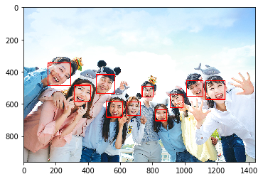
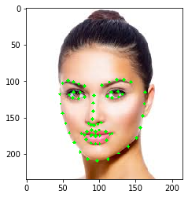
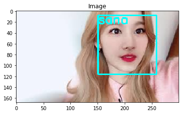

# 감정인식

파이썬 버전을 낮춰야 함

> conda create -n py36 python=3.6 anaconda
>
> conda activate py36
>
> pip install opencv-python
>
> pip install imutils
>
> dlib
>
> https://pypi.org/simple/dlib/   에서 
>
>  dlib-19.8.1-cp36-cp36m-win_amd64.whl 다운
>
> pip install dlib-19.8.1-cp36-cp36m-win_amd64.whl
>
> pip install --no-dependencies face_recognition
>
> pip install git+https://github.com/ageitgey/face_recognition_models

```python
from imutils import face_utils
import numpy as np
import imutils
import dlib
import cv2
import matplotlib.pyplot as plt
import face_recognition
import os
from imutils import paths


def imshow(tit, image) :
    plt.title(tit)    
    if len(image.shape) == 3 :
        plt.imshow(cv2.cvtColor(image, cv2.COLOR_BGR2RGB))
    else :
        plt.imshow(image, cmap="gray")
    plt.show()
```

# 얼굴인식


```python
img = cv2.imread("group2.jpg")

face_locations = face_recognition.face_locations(img, model="cnn")     #cnn 쓰면 오래걸림
print("I found {} face(s) in this photograph.".format(len(face_locations)))

for face_location in face_locations:    
    top, right, bottom, left = face_location
    cv2.rectangle(img, (left, top),  (right, bottom), (0, 0, 255), 3)  
imshow("", img) 
```

    I found 10 face(s) in this photograph.




# face landmark

```python
# http://dlib.net/files/shape_predictor_68_face_landmarks.dat.bz2
predictor = dlib.shape_predictor("shape_predictor_68_face_landmarks.dat")
detector = dlib.get_frontal_face_detector()
```

```python
frame = cv2.imread("face.jpg")
gray = cv2.cvtColor(frame, cv2.COLOR_BGR2GRAY)
rects = detector(gray, 0)  
print("Number of faces detected: {}".format(len(rects)))
for r in rects :
    print(r)
```

    Number of faces detected: 1
    [(22, 50) (280, 308)]


```python
print(rects[0])
shape = predictor(gray, rects[0])
print(shape)
shape = face_utils.shape_to_np(shape)
print(shape)
```

```
[(37, 79) (162, 203)]
<dlib.dlib.full_object_detection object at 0x000001D1E46B8EA0>
[[ 46 118]
 [ 47 131]
 [ 50 144]
 [ 54 158]
 [ 59 171]
 [ 66 184]
 [ 74 197]
 [ 84 207]
 [ 97 209]
 [112 207]
 [127 199]
 [140 190]
 [151 178]
 [157 164]
 [160 148]
 [162 131]
 [163 115]
 [ 50 103]
 [ 57  99]
 [ 65 101]
 [ 72 104]
 [ 80 107]
 [104 106]
 [114 101]
 [124  98]
 [134  98]
 [144 101]
 [ 93 120]
 [ 92 130]
 [ 92 141]
 [ 91 152]
 [ 85 158]
 [ 89 160]
 [ 93 161]
 [ 98 159]
 [103 157]
 [ 59 119]
 [ 65 115]
 [ 74 115]
 [ 80 122]
 [ 72 124]
 [ 64 123]
 [111 121]
 [117 115]
 [126 114]
 [132 118]
 [127 122]
 [118 123]
 [ 76 172]
 [ 83 169]
 [ 90 167]
 [ 95 169]
 [100 167]
 [109 169]
 [118 172]
 [110 181]
 [101 186]
 [ 95 186]
 [ 89 185]
 [ 82 180]
 [ 80 174]
 [ 90 174]
 [ 95 175]
 [101 175]
 [115 173]
 [101 175]
 [ 95 176]
 [ 89 175]]
```


```python
for k, d in enumerate(rects):
        print("Detection {}: Left: {} Top: {} Right: {} Bottom: {}".format(
            k, d.left(), d.top(), d.right(), d.bottom()))
        shape = predictor(gray, d)
        shape = face_utils.shape_to_np(shape)
        for s in shape:
            cv2.circle(frame, (s[0], s[1]), 2, (0, 255, 0), -1)
imshow('', frame)
```

    Detection 0: Left: 37 Top: 79 Right: 162 Bottom: 203



# 눈 좌표 찾아서 색 바꾸기


```python
eyel = np.mean(shape[36:42], axis=0)
eyer = np.mean(shape[42:48], axis=0)
cv2.circle(frame, (int(eyel[0]), int(eyel[1])), 2, (0, 0, 255), -1)
cv2.circle(frame, (int(eyer[0]), int(eyer[1])), 2, (0, 0, 255), -1)

imshow("", frame)      
```


```python
img = face_recognition.load_image_file("face.jpg")
face_encoding = face_recognition.face_encodings(img)
#print(face_encoding)
print(face_encoding[0].shape)
```

    (128,)


# 거리비교를 통해 동일인물확인

```python
files = os.listdir("known")

known_face_encodings = []
known_face_names = []

for filename in files:
    name, ext = os.path.splitext(filename)
    if ext == '.jpg':
        known_face_names.append(name)
        pathname = os.path.join("known", filename)
        img = face_recognition.load_image_file(pathname)
        face_encoding - face_recognition.face_encodings(img)[0]
        known_face_encodings.append(face_encoding)
```


```python
print(known_face_names)
#print(known_face_encodings[1])
```

    ['joy', 'lena']


```python
test = face_recognition.load_image_file("joy.jpg")


face_locations = face_recognition.face_locations(test)
face_encodings = face_recognition.face_encodings(test, face_locations)

face_names = []
for face_encoding in face_encodings:

    distances = face_recognition.face_distance(known_face_encodings, face_encoding)
    print(distances)
    min_value = min(distances)  

    name = "Unknown"
    if min_value < 0.6:
        index = np.argmin(distances)
        name = known_face_names[index]
print(name)
```

    [0. 0.]
    joy


```python
imagePaths = list(paths.list_images("known"))
 
knownEncodings = []
knownNames = []

for (i, imagePath) in enumerate(imagePaths):    
    name = imagePath.split(os.path.sep)[-2]
    print(f"{name}   -   {imagePath}") 
    image = cv2.imread(imagePath)
    boxes = face_recognition.face_locations(image)
    encodings = face_recognition.face_encodings(image, boxes) 

    for encoding in encodings:        
        knownEncodings.append(encoding)
        knownNames.append(name)
        
import pickle
data = {"encodings": knownEncodings, "names": knownNames}
f = open("known.bin", "wb")
f.write(pickle.dumps(data))
f.close()        
```

    known   -   known\joy.jpg
    known   -   known\lena.jpg
    irene   -   known\irene\images (1).jpg
    irene   -   known\irene\images (5).jpg
    irene   -   known\irene\images (8).jpg
    irene   -   known\irene\images (9).jpg
    irene   -   known\irene\images.jpg
    irene   -   known\irene\images6.jpg
    irene   -   known\irene\irene (2).jpg
    irene   -   known\irene\irene (3).jpg
    irene   -   known\irene\irene.jpg
    obama   -   known\obama\download (1).jpg
    obama   -   known\obama\download (2).jpg
    obama   -   known\obama\download (3).jpg
    obama   -   known\obama\download.jpg
    obama   -   known\obama\images (1).jpg
    obama   -   known\obama\images (2).jpg
    obama   -   known\obama\images (3).jpg
    obama   -   known\obama\images (4).jpg
    obama   -   known\obama\images.jpg
    sana   -   known\sana\images (2).jpg
    sana   -   known\sana\images3.jpg
    sana   -   known\sana\images5.jpg
    sana   -   known\sana\images6.jpg
    sana   -   known\sana\sana.jpg
    sana   -   known\sana\sana2.jpg
    sana   -   known\sana\sana3.jpg
    sana   -   known\sana\sana4.jpg
    sana   -   known\sana\sana5.jpg
    sana   -   known\sana\sana7.jpg
    song   -   known\song\download (4).jpg
    song   -   known\song\download.jpg
    song   -   known\song\images (1).jpg
    song   -   known\song\images (3).jpg
    trump   -   known\trump\1.jpg
    trump   -   known\trump\download (1).jpg
    trump   -   known\trump\download.jpg
    trump   -   known\trump\images (1).jpg
    trump   -   known\trump\images.jpg


```python
#print(data["encodings"])
#print(data["names"])

print(data["names"][0])
print(data["encodings"][0])

```

    known
    [-0.19577354  0.05737101  0.08239753 -0.10308313 -0.18811402 -0.05900588
     -0.10964389 -0.10897715  0.25637457 -0.19032931  0.0906534   0.00965153
     -0.22526872 -0.01936293 -0.09319458  0.14953139 -0.163698   -0.21719883
     -0.05472282 -0.05076824  0.05715754  0.02172098  0.04858763  0.0867006
     -0.11211456 -0.38629881 -0.07212236  0.00119765 -0.05134015 -0.14004448
      0.0674165   0.08271103 -0.21389028 -0.00374109 -0.05177135  0.19961858
      0.04487129 -0.09529112  0.10345527 -0.00151412 -0.2929166  -0.11144763
      0.0167275   0.24967419  0.19001055  0.01488714 -0.02843294 -0.12206628
      0.12998022 -0.30553192  0.06672019  0.19750558 -0.05607519 -0.02902635
      0.12832431 -0.1248419   0.04463046  0.13650051 -0.15113394  0.03923365
      0.04916123 -0.10608451 -0.02331531 -0.15686873  0.20386884  0.14891481
     -0.0968481  -0.16821435  0.2143009  -0.20988967 -0.10923995  0.04610657
     -0.08095508 -0.18330672 -0.35445809 -0.08340678  0.40377018  0.18064895
     -0.14975707  0.10074151 -0.10055861 -0.0372882  -0.00660001  0.2045638
     -0.00507148  0.0743148  -0.12453662  0.02365601  0.20111489  0.05088538
     -0.02308729  0.28021428  0.01295108 -0.00450895  0.03406918  0.05422085
     -0.15554565 -0.00573625 -0.18179049 -0.07769299  0.04576751 -0.02343868
     -0.03818615  0.11837738 -0.16008084  0.16246095 -0.01463929  0.00690536
      0.01462674 -0.01350015 -0.08046969 -0.08816405  0.16970831 -0.21956022
      0.16458014  0.178376    0.07612004  0.2042926   0.08125337  0.136235
      0.01560229 -0.05615885 -0.12467744 -0.04612368 -0.03833138 -0.08506584
      0.00607919  0.11312392]


```python
data = pickle.loads(open("known.bin", "rb").read())
 
image = cv2.imread("sanatest.jpg")

boxes = face_recognition.face_locations(image)
encodings = face_recognition.face_encodings(image, boxes)
 
names = []
for encoding in encodings:
    matches = face_recognition.compare_faces(data["encodings"], encoding)
    name = "Unknown"
    if True in matches:
        matchedIdxs = [i for (i, b) in enumerate(matches) if b]
        counts = {} 
        for i in matchedIdxs:
            name = data["names"][i]
            counts[name] = counts.get(name, 0) + 1 
        name = max(counts, key=counts.get)
    names.append(name)                             
for ((top, right, bottom, left), name) in zip(boxes, names):
    cv2.rectangle(image, (left, top), (right, bottom), (255, 255, 0), 2)
    y = top - 15 if top - 15 > 15 else top + 15
    cv2.putText(image, name, (left, y), cv2.FONT_HERSHEY_SIMPLEX,  0.75, (255, 255, 0), 2)
 
imshow("Image", image)
```





```python
encoding = encodings[0]
matches = face_recognition.compare_faces(data["encodings"], encoding)
print(matches)

matchedIdxs = [i for (i, b) in enumerate(matches) if b]
print(matchedIdxs)

for i in matchedIdxs:
    name = data["names"][i]
    counts[name] = counts.get(name, 0) + 1 
name = data["names"][11]
print(data["names"])
print(name)
```

    [False, False, True, True, True, True, True, True, True, True, True, False, False, False, False, False, False, False, False, False, True, True, True, True, True, True, True, True, True, True, False, False, False, False, False, False, False, False, False]
    [2, 3, 4, 5, 6, 7, 8, 9, 10, 20, 21, 22, 23, 24, 25, 26, 27, 28, 29]
    ['known', 'known', 'irene', 'irene', 'irene', 'irene', 'irene', 'irene', 'irene', 'irene', 'irene', 'obama', 'obama', 'obama', 'obama', 'obama', 'obama', 'obama', 'obama', 'obama', 'sana', 'sana', 'sana', 'sana', 'sana', 'sana', 'sana', 'sana', 'sana', 'sana', 'song', 'song', 'song', 'song', 'trump', 'trump', 'trump', 'trump', 'trump']
    obama


```python
feature = np.array(data["encodings"])
print(feature.shape)
```

    (39, 128)


```python
import pandas as pd
c = pd.factorize(data["names"])
print(c)
label = c[0]    # 0이면 라벨 1이면 name값
print(label)
```

    (array([0, 0, 1, 1, 1, 1, 1, 1, 1, 1, 1, 2, 2, 2, 2, 2, 2, 2, 2, 2, 3, 3,
           3, 3, 3, 3, 3, 3, 3, 3, 4, 4, 4, 4, 5, 5, 5, 5, 5], dtype=int64), array(['known', 'irene', 'obama', 'sana', 'song', 'trump'], dtype=object))
    [0 0 1 1 1 1 1 1 1 1 1 2 2 2 2 2 2 2 2 2 3 3 3 3 3 3 3 3 3 3 4 4 4 4 5 5 5
     5 5]

