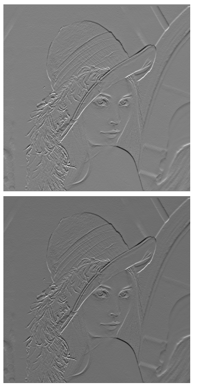
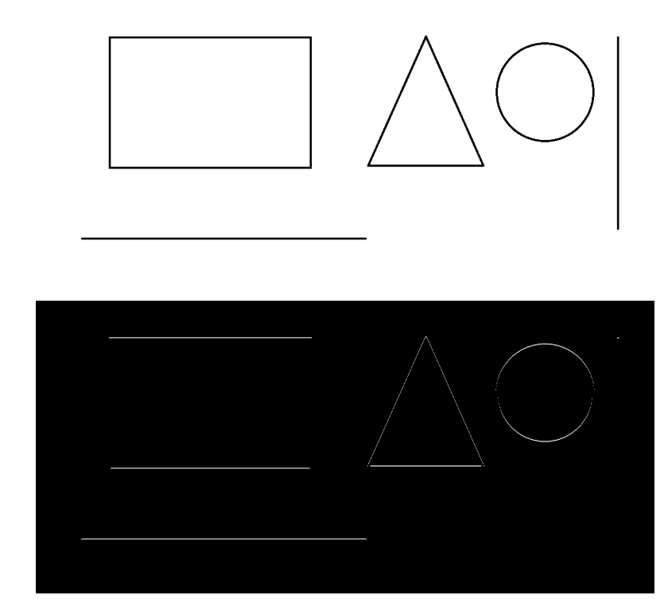
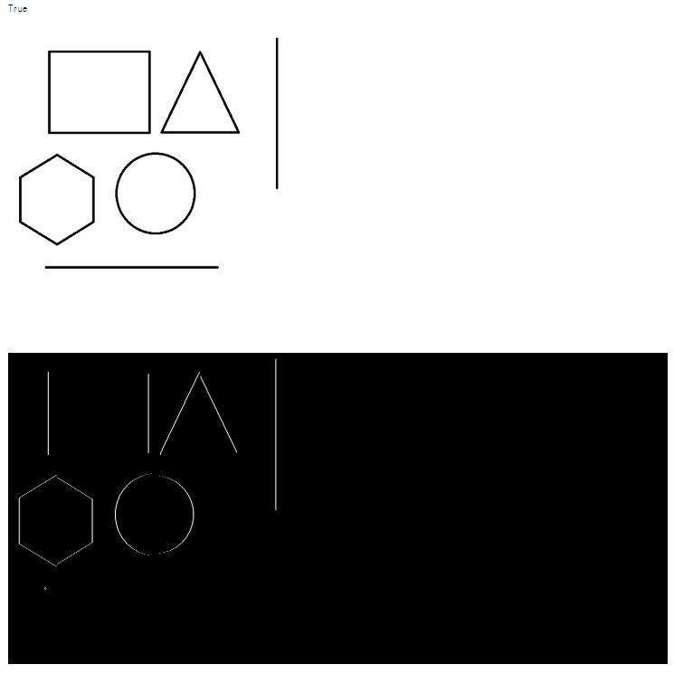
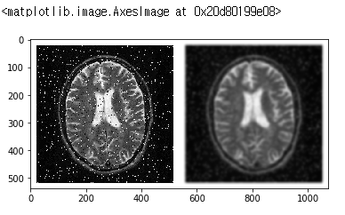
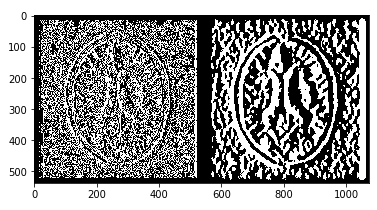
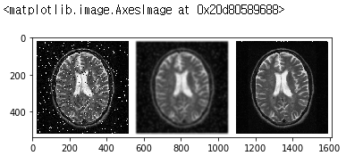

```python
import scipy.stats as sp
import numpy as np
import matplotlib.pyplot as plt
%matplotlib inline
import cv2
from PIL import ImageFont, ImageDraw, Image
```

# 패딩처리


```python
img = np.array([[1,2,3],
                [200,5,200],
                [7,8,9]],dtype="float") # uint8에서 형변환을 통해 -값이나 255 이상의 값을 보고싶으면 float으로 해줘야함
kernel = np.array([[0,0,0],
                   [1,0,-1],
                   [0,0,0]])
filtered = cv2.filter2D(img, -1, kernel)
print(filtered)
```

    [[ 0. -2.  0.]
     [ 0.  0.  0.]
     [ 0. -2.  0.]]


패딩처리 표현 이해 하기

```
5  4 5 6  5

2  1 2 3  2
5  4 5 6  5
8  7 8 9  8

5  4 5 6  5 ```

이런식으로 이해 해보자


```
e  d e f  e

b  a b c  b
e  d e f  e
h  g h i  h

e  d e f  e
  ```
 


​```python
cv2.imwrite("output.png", filtered.astype("uint8"))
img= cv2.imread("output.png")
print(img)
  ```

    [[[  0   0   0]
      [254 254 254]
      [  0   0   0]]
    
     [[  0   0   0]
      [  0   0   0]
      [  0   0   0]]
    
     [[  0   0   0]
      [254 254 254]
      [  0   0   0]]]


# numpy로 정규화 하는법


정규화는 시각화를 하기위해 하는것


```python
ma = np.max(filtered)
mm = np.min(filtered)

n = (filtered - mm) / (np.ptp(filtered)) * 255          # -2 ~ 0 -> 0 ~ 255        np.ptp(filtered) = ma - mm
print(n)


n2 = np.abs(filtered) / np.max(np.abs(filtered)) * 255              # 0-2 -> 0 ~ 255
print(n2)

norm = cv2.normalize(filtered, None, 0, 255, cv2.NORM_MINMAX).astype('uint8')
print(norm)
```

    [[255.   0. 255.]
     [255. 255. 255.]
     [255.   0. 255.]]
    [[  0. 255.   0.]
     [  0.   0.   0.]
     [  0. 255.   0.]]
    [[255   0 255]
     [255 255 255]
     [255   0 255]]


# openCV로 정규화 하는법


```python

```

# 엠보싱 필터


```python
src = cv2.imread("lena.png", cv2.IMREAD_GRAYSCALE)
src2 = src.astype('int16')

kernel = np.array([[0,+1,0],
                   [0,0,0],
                   [0,-1,0]])
filtered = cv2.filter2D(src2, -1, kernel) + 128
print(np.min(filtered))
print(np.max(filtered))
cv2.imwrite("output.png", filtered)


filtered2 = cv2.filter2D(src2, -1, kernel)
filtered2 = cv2.normalize(filtered2, None, 0, 255, cv2.NORM_MINMAX)
print(np.min(filtered2))
print(np.max(filtered2))
cv2.imwrite("output2.png", filtered2)
```

    5
    290
    0
    255

    True




```python
src = cv2.imread("shape.png", cv2.IMREAD_GRAYSCALE)
src2 = src.astype('int16')

kernel = np.array([[0,+1,0],
                   [0,0,0],
                   [0,-1,0]])
filtered = cv2.filter2D(src2, -1, kernel)
cv2.imwrite("output3.png", filtered)

```


    True




```python
src = cv2.imread("shape2.png", cv2.IMREAD_GRAYSCALE)
src2 = src.astype('int16')

kernel = np.array([[0,0,0],
                   [+1,0,-1],
                   [0,0,0]])
filtered = cv2.filter2D(src2, -1, kernel)
cv2.imwrite("output4.png", filtered)

```



# gaussianblur + 엣지필터


```python
img = cv2.imread("brain.jpeg")
gauss = cv2.GaussianBlur(img, (25,25),0)
plt.imshow(np.hstack([img, gauss]))
```



```python
out1 = cv2.Sobel(img, cv2.CV_64F, 1, 0, ksize=3)
out2 = cv2.Sobel(gauss, cv2.CV_64F, 1, 0, ksize=3)
plt.imshow(np.hstack([out1, out2]))
```




# median필터


```python
#img = cv2.imread("brain.jpeg")
#gauss = cv2.GaussianBlur(img, (25,25),0)
median = cv2.medianBlur(img, 5)
plt.imshow(np.hstack([img, gauss, median]))
```


