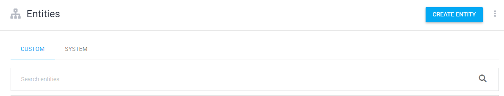

# 챗봇

> dialogflow 구글 아이디 로그인

> create intent 클릭

## orderfood

> orderfood 제목 설정

> 만든후 상단의 save  클릭

\

### orderfood_menu

> orderfood에 마우스 커서를 올리면 Add Follow-up intent나오는데 클릭

> orderfood_menu로 지정

> 체크하면 리스트로 나옴

> 위와 동일하게 menu에 커서 올려서 Add Follow-up intent 나오는데 클릭

> 여기서는 $food가 안되기 때문에 앞에서 짜장면에 대한 것을 가져와야함 

> 역시 앞에서 가져와야하기에 추가

## 바로 주문하기

> intent order2로 생성후

> create 하기

> 생성 
>
> ex)
>
> 위에것은 짜장 - 3, 짬뽕 - 5 형식
>
> 아래것은 짜장

