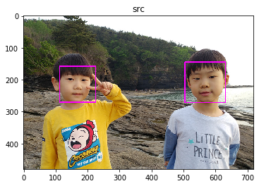
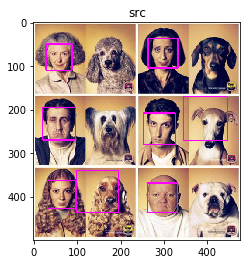
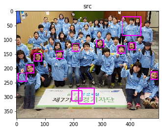
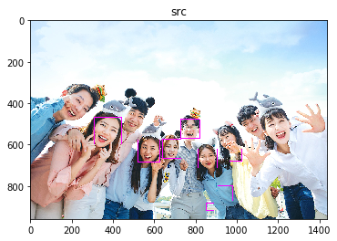
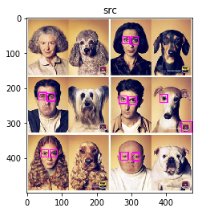
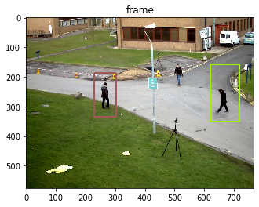
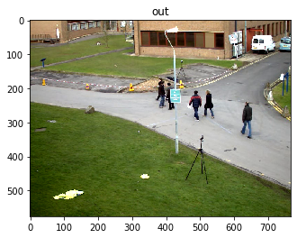
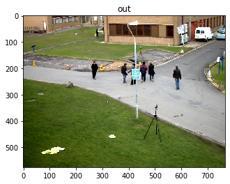
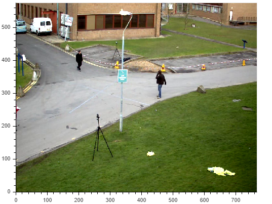
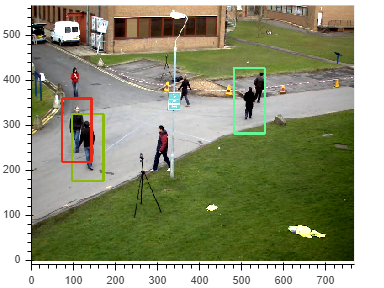

# 얼굴검출


```python
import cv2, numpy as np
import math
import time
import random
from matplotlib import pyplot as plt
%matplotlib inline
from bokeh.plotting import figure
from bokeh.io import output_notebook, show, push_notebook


output_notebook()


def imshow(tit, image) :
    plt.title(tit)    
    if len(image.shape) == 3 :
        plt.imshow(cv2.cvtColor(image, cv2.COLOR_BGR2RGB))
    else :
        plt.imshow(image, cmap="gray")
    plt.show()
    
    
def create_win(frames, scale=1.0) :    
    global myImage
    
    all = []
    for f in frames :
        if len(f.shape ) !=  3 : f = cv2.cvtColor(f, cv2.COLOR_GRAY2BGR)
        all.append(f)
    frame = np.vstack(all)
    
    fr=cv2.cvtColor(frame, cv2.COLOR_BGR2RGBA) # because Bokeh expects a RGBA image
    fr=cv2.flip(fr, -1) # because Bokeh flips vertically
    width=fr.shape[1]
    height=fr.shape[0]    

    p = figure(x_range=(0,width), y_range=(0,height), output_backend="webgl", width=int(width*scale), height=int(height*scale))    
    myImage = p.image_rgba(image=[fr], x=0, y=0, dw=width, dh=height)
    show(p, notebook_handle=True)   
    
    
def update_win(frames) :
    
    all = []
    for f in frames :
        if len(f.shape ) !=  3 : f = cv2.cvtColor(f, cv2.COLOR_GRAY2BGR)
        all.append(f)
    frame = np.vstack(all)
    
    fr=cv2.cvtColor(frame, cv2.COLOR_BGR2RGBA)
    fr=cv2.flip(fr, 0)
    myImage.data_source.data['image']=[fr]
    push_notebook()

```


<div class="bk-root">
    <a href="https://bokeh.org" target="_blank" class="bk-logo bk-logo-small bk-logo-notebook"></a>
    <span id="16979">Loading BokehJS ...</span>
</div>


```python
classifier = cv2.CascadeClassifier('haarcascade_frontalface_default.xml')
```


```python
src = cv2.imread('kids.png')
```


```python
faces = classifier.detectMultiScale(src)
```


```python
for (x, y, w, h) in faces:
    cv2.rectangle(src, (x, y), (x + w, y + h), (255, 0, 255), 2)
imshow('src', src)    
```





```python
src = cv2.imread('dog.jpg')
faces = classifier.detectMultiScale(src)

for (x, y, w, h) in faces:
    cv2.rectangle(src, (x, y), (x + w, y + h), (255, 0, 255), 2)
imshow('src', src)    
```





```python
src = cv2.imread('group.jpg')
faces = classifier.detectMultiScale(src)

for (x, y, w, h) in faces:
    cv2.rectangle(src, (x, y), (x + w, y + h), (255, 0, 255), 2)
imshow('src', src)    
```





```python
src = cv2.imread('group2.jpg')
faces = classifier.detectMultiScale(src)

for (x, y, w, h) in faces:
    cv2.rectangle(src, (x, y), (x + w, y + h), (255, 0, 255), 2)
imshow('src', src)    
```





# 눈 검출


```python
classifier = cv2.CascadeClassifier('haarcascade_eye.xml')
```


```python
src = cv2.imread('kids.png')
faces = classifier.detectMultiScale(src)

for (x, y, w, h) in faces:
    cv2.rectangle(src, (x, y), (x + w, y + h), (255, 0, 255), 2)
imshow('src', src)    
```


```python
src = cv2.imread('dog.jpg')
faces = classifier.detectMultiScale(src)

for (x, y, w, h) in faces:
    cv2.rectangle(src, (x, y), (x + w, y + h), (255, 0, 255), 2)
imshow('src', src)    
```





# 얼굴검출후 눈검출
- 눈이 아닌 다른 곳을 검출하는것을 방지


```python
face_classifier = cv2.CascadeClassifier('haarcascade_frontalface_default.xml')
eye_classifier = cv2.CascadeClassifier('haarcascade_eye.xml')

src = cv2.imread('kids.png')

faces = face_classifier.detectMultiScale(src)

for (x1, y1, w1, h1) in faces:
        cv2.rectangle(src, (x1, y1), (x1 + w1, y1 + h1), (255, 0, 255), 2)

        faceROI = src[y1:y1 + h1, x1:x1 + w1]
        eyes = eye_classifier.detectMultiScale(faceROI)

        for (x2, y2, w2, h2) in eyes:
            center = (int(x2 + w2 / 2), int(y2 + h2 / 2))
            cv2.circle(faceROI, center, int(w2 / 2), (255, 0, 0), 2, cv2.LINE_AA)

imshow('src', src)  
```


# HOG
- full body 검출


```python
hog = cv2.HOGDescriptor()
hog.setSVMDetector(cv2.HOGDescriptor_getDefaultPeopleDetector())

frame = cv2.imread("people.jpg")
detected, _ = hog.detectMultiScale(frame)

for (x, y, w, h) in detected:
        c = (random.randint(0, 255), random.randint(0, 255), random.randint(0, 255))
        cv2.rectangle(frame, (x, y), (x + w, y + h), c, 3)

imshow('frame', frame)   
```





# 동영상으로 다루는법


```python
cap = cv2.VideoCapture('vtest.avi')
```


```python
#ret, frame = cap.read()   # 첫번째 이미지 읽기
#ret, frame = cap.read()   # 두번째 이미지 읽기
#ret, frame = cap.read()   # 세번째 이미지 읽기

for i in range(20) :    #20번째 이미지
    ret, frame = cap.read()
    
imshow("out", frame)

for i in range(20) :    # 40번째 이미지
    ret, frame = cap.read()
    
imshow("out", frame)
```








```python
create_win([frame],scale=0.7)   # 크기조절
```





<div class="bk-root" id="feef45a2-cb69-4ecf-9a17-52bea89e2151" data-root-id="1213"></div>


```python
for i in range(100) :    
    ret, frame = cap.read()    # 호출할때마다 다음 프레임을 가져온다
    update_win([frame])
```

# 영상에 detecting 하기


```python
cap = cv2.VideoCapture('vtest.avi')
```


```python
for i in range(300) :
    ret, frame = cap.read()    
    if i == 0 : 
        create_win([frame], 0.5)
    if not ret:
        break

    detected, _ = hog.detectMultiScale(frame)

    for (x, y, w, h) in detected:
        c = (random.randint(0, 255), random.randint(0, 255), random.randint(0, 255))
        cv2.rectangle(frame, (x, y), (x + w, y + h), c, 3)
        
    update_win([frame])          
    
```


<div class="bk-root" id="e74c9253-64f2-4b9a-8957-c5b1fe1d198e" data-root-id="10321"></div>



# 영상에서 얼굴검출하기


```python
cap = cv2.VideoCapture('eng.mp4')  #아무영상 다운받아서 하면됨
```


```python
 :
    ret, frame = cap.read()    
    if i == 0 : 
        create_win([frame], 0.5)
    if not ret:
        break

        
    faces = classifier.detectMultiScale(frame)

    for (x, y, w, h) in faces:
        cv2.rectangle(frame, (x, y), (x + w, y + h), (255, 0, 255), 2)
        
    update_win([frame])           
```


<div class="bk-root" id="e83d45d6-e956-48e7-8e76-ce7d61f26509" data-root-id="97112"></div>


