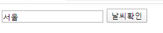

# homepage


> 홈페이지 생성


> 서버 실행후 홈페이지 폴더에 메모장 새로만들어서 이름을 index.html로변경
>
> 127.0.0.1로 접속되면 됨

1. http = 다운로드 서버라고 생각

   (완료후 연결X)

2. 대다수의 기능은 브라우저기능


> 폴더에 사진 하나 넣고 해보면됨


> br 은 앤터키에 해당함 br 안쓰면 옆으로 붙음


# web

> web.py 생성


## 이미지, 챗봇 올리기

```python
from flask import Flask, request, jsonify

app = Flask(__name__)

@app.route('/')
def home():
    html = """
    <h1>Hello</h1>
     <br>
    <iframe
    allow="microphone;"
    width="350"
    height="430"
    src="https://console.dialogflow.com/api-client/demo/embedded/aichatbot1026">
</iframe>
    """
    
    return html


if __name__ == '__main__':
    app.run(host='0.0.0.0', port=3000, debug=True)
```

> static 폴더를 만들어 정적인 파일들을 넣으면 출력됨 ex) 사진
>
> img src =/static/000.jpg 이런식으로 하면됨


## 방문자수 확인하기

```python
from flask import Flask, request, jsonify

app = Flask(__name__)
cnt = 0

@app.route('/')
def home():
    html = """
    <h1>Hello</h1>
     <br>
    <iframe
    allow="microphone;"
    width="350"
    height="430"
    src="https://console.dialogflow.com/api-client/demo/embedded/aichatbot1026">
</iframe>
    """
    return html


@app.route('/counter')
def counter():
    global cnt
    cnt += 1
    return f"{cnt}명이 방문했습니다."


if __name__ == '__main__':
    app.run(host='0.0.0.0', port=3000, debug=True)
```

> @app.route('/counter')  추가


> 이렇게 새로고침할때 마다 늘어나는것을 확인 할 수 있음

```python
from flask import Flask, request, jsonify

app = Flask(__name__)
cnt = 0

@app.route('/')
def home():
    html = """
    <h1>Hello</h1>
     <br>
    <iframe
    allow="microphone;"
    width="350"
    height="430"
    src="https://console.dialogflow.com/api-client/demo/embedded/aichatbot1026">
</iframe>
    """
    return html


@app.route('/counter')
def counter():
    global cnt
    cnt += 1
    
    """
    html = ""
    for i in str(cnt) :
        html += f""
    html += "명이 방문했습니다."
    """
    html = "".join([f"" for i in str(cnt)])
    html += "명이 방문했습니다."
    
    
    return html


if __name__ == '__main__':
    app.run(host='0.0.0.0', port=3000, debug=True)
```


> 숫자 이미지를 만들어서 이런식으로 가능


## 날씨 입력 버튼

```python
from flask import Flask, request, jsonify

app = Flask(__name__)
cnt = 0

@app.route('/')
def home():
    html = """
    <h1>Hello</h1>
     <br>
    <iframe
    allow="microphone;"
    width="350"
    height="430"
    src="https://console.dialogflow.com/api-client/demo/embedded/aichatbot1026">
</iframe>
    """
    return html


@app.route('/counter')
def counter():
    global cnt
    cnt += 1
    
    """
    html = ""
    for i in str(cnt) :
        html += f""
    html += "명이 방문했습니다."
    """
    html = "".join([f"" for i in str(cnt)])
    html += "명이 방문했습니다."
    
    return html

@app.route('/weather', methods=["POST", "GET"])
def weather():
    if request.method == "GET" :
        req = request.args
    else :
        req = request.form
        
    #req = request.args if request.method == "GET" else request.form
    city = req.get("city")
    
    return f"{city} 날씨 좋아요"


if __name__ == '__main__':
    app.run(host='0.0.0.0', port=3000, debug=True)
```


> static 폴더에 from.html을 만든다

```python
<form action=/weather method=GET>
    <input type=text>
    <input type=submit value="날씨확인">    # submit 버튼 만드는것
</form>
```


> 이렇게 뜨게됨
>
> 그래서 name=city를 추가하게 되면

```python
<form action=/weather method=GET>
    <input type=text name=city>
    <input type=submit value="날씨확인">
</form>
```




> 이렇게 도시명이 같이 나오게 된다

