# Image Processing

> 주피터 노트북 필요한 기능 설치
>
> pip install jupyter_contrib_nbextensions
>
> jupyter contrib nbextension install --user
>
> Nbextensions들어가서
>
> contrib_nbextensions_help_item,
>
> Nbextensions edit menu item,
>
> Toggle all line numbers,
>
> Variable Inspector,
>
> ExecuteTime,
>
> Live Markdown Preview,
>
> Nbextensions dashboard tab,
>
> Scratchpad 체크하기

```python
import scipy.stats as sp
import numpy as np
import matplotlib.pyplot as plt
%matplotlib inline
import cv2
from PIL import ImageFont, ImageDraw, Image
```

```python
sp.norm(0,1).pdf(0.2)  # 정규분포
```

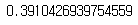

```python
train = cv2.imread("patch3.png")
print(train.shape)
b,g,r = cv2.split(train)
hb = plt.hist(b.ravel(), 256, [0, 256], color='b');
hg = plt.hist(g.ravel(), 256, [0, 256], color='g');
hr = plt.hist(r.ravel(), 256, [0, 256], color='r');
maxb = (np.where(hb[0] == np.max(hb[0])))[0][0]
maxg = (np.where(hg[0] == np.max(hg[0])))[0][0]
maxr = (np.where(hr[0] == np.max(hr[0])))[0][0]
print(maxb)
print(maxg)
print(maxr)

print(np.mean(b))
print(np.mean(g))
print(np.mean(r))

t=7
p =sp.norm(0,1).pdf((9-7)/4)
print(p)
```

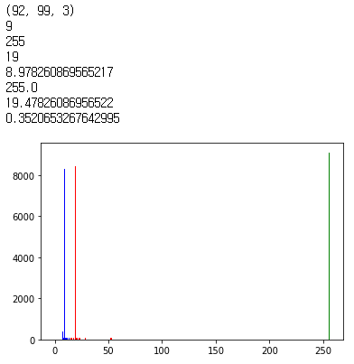

```python
test = cv2.imread("z.jpg")
norm = sp.norm(0, 1)
for r in range(test.shape[0]) :
    for c in range(test.shape[1]) :  
        prob = 0
        prob += norm.pdf((test[r,c,0]-maxb)/5)
        prob += norm.pdf((test[r,c,1]-maxg)/6)
        prob += norm.pdf((test[r,c,2]-maxr)/6)        
        if prob > 0.2 :   
            test[r, c, : ] = [0,0,0]               

plt.imshow(cv2.cvtColor(test, cv2.COLOR_BGR2RGB) ) 
```

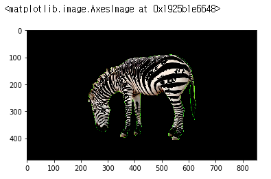

```python
img = cv2.imread("lena.png", cv2.IMREAD_GRAYSCALE)
print(img.shape)
print(type(img))
print(type(img[0,0]))
imgint = np.array(img, dtype="int")
print(type(imgint[0,0]))
img2 = img + 20
plt.imshow(np.hstack([img, img2]), cmap="gray")
```

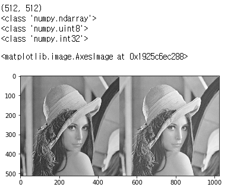

```python
a = np.array([250, 254], dtype="uint8")
b = a+ 10
print(b)
a = np.array([250, 20, 254], dtype="int")
b = a+10
print(b)
c=np.clip(b, 0 ,225)
print(c)
d= np.array(c, dtype="uint8")
print(d)

e = [1,1.0,2]
f=np.array(e)
print(type(e[0]))
print(type(e[1]))
print(type(f[0]))
print(type(f[1]))
```

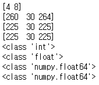

```python
img2 = img.astype(np.int)
img2 += 50
img2 = np.clip(img2, 0, 255).astype(np.uint8)

plt.imshow(img2, cmap="gray")
```

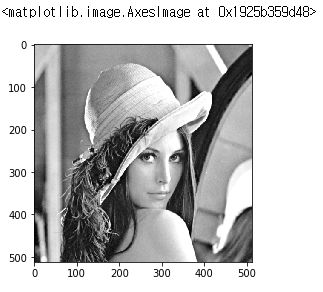

```python
img2 = img.astype(np.float32)
img2 += 0.2
img2 = np.clip(img2, 0, 255).astype(np.uint8)

plt.imshow(img2, cmap="gray")
```

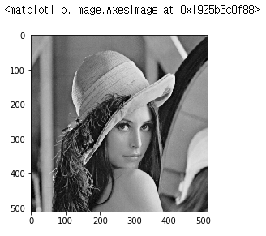

```python
lut = [x+5 for x in range(10)]
print(lut)
lut2 = [x+5 if x+5 <= 9 else 9 for x in range(10)]
print(lut2)
```

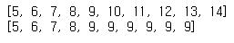


## 화소값 덧셈연산

```python
def addlut(op):
    return [x+op if x+op < 255 else 255 for x in range(256)]
print(addlut(100))
```

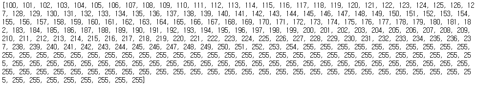

## 화소값 곱셈연산

```python
def mullut(op):
    return [x*op if x*op < 255 else 255 for x in range(256)]
print(mullut(1.5))
```

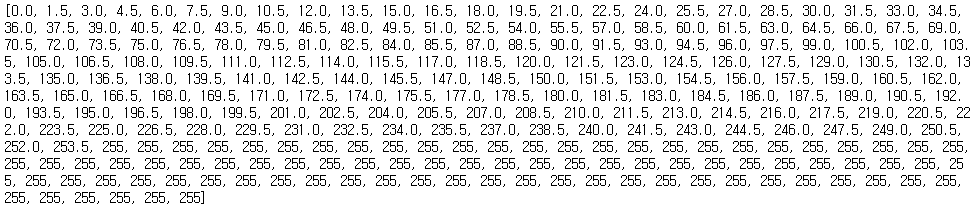

## 감마보정

```python
def mullut(op):
    return np.array([x*op if x*op < 255 else 255 
                     for x in range(256)]).astype("uint8")

src2 = cv2.LUT(img, mullut(1.2))
#print(src2)
plt.imshow(src2, cmap="gray")
plt.show()
src2 = cv2.LUT(img, mullut(2.0))
#print(src2)
plt.imshow(src2, cmap="gray")
plt.show()

all = np.hstack([cv2.LUT(img, mullut(0.7)), 
                 cv2.LUT(img, mullut(1.2)), 
                 cv2.LUT(img, mullut(2.5))])
plt.imshow(all, cmap="gray")
```

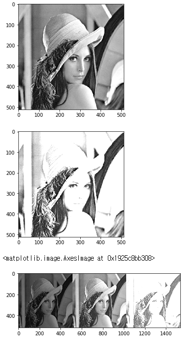

## 이진화

```python
def binarylut(t):
    return np.array([255 if x > t else 0 for x in range(256)]).astype("uint8")
print(binarylut(127))
src2 = cv2.LUT(img, binarylut(127) )
print(src2)
plt.imshow(src2, cmap="gray")
```

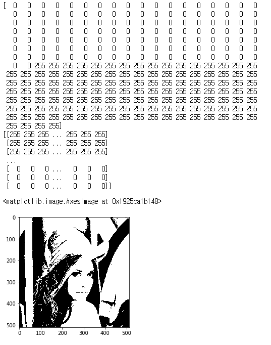

## 포스터라이징

```python
def posterlut(l):
    return np.array([int(x/l)*l for x in range(256)]).astype("uint8")
def binarylut(t):
    return np.array([255 if x > t else 0 for x in range(256)]).astype("uint8")
def binarylut(t):
    return np.array([(x > t)*255 for x in range(256)]).astype("uint8")

p = posterlut(10)
print(p)
src2 = cv2.LUT(img, posterlut(10) )
print(src2)
plt.imshow(src2, cmap="gray")
```

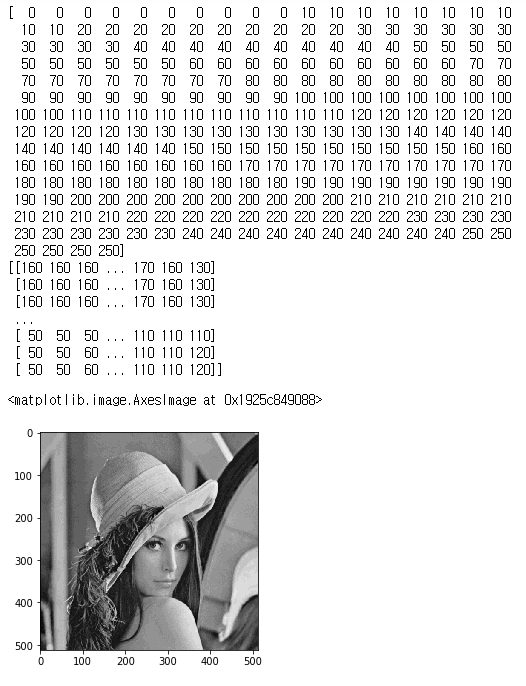

## 명암대비

```python
def inverselut() :
    return np.array([255-x for x in range(256) ]).astype("uint8")
src2 = cv2.LUT(img, inverselut() )
print(src2)
plt.imshow(src2, cmap="gray")
```

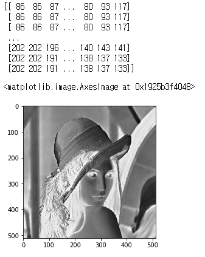

## 감마보정

```python
def gammalut(gamma) :
    invGamma = 1.0 / gamma
    return np.array([((i / 255.0) ** invGamma) * 255 for i in np.arange(0, 256)]).astype("uint8")

src2 = cv2.LUT(img, gammalut(2.2) )
print(src2)
plt.imshow(src2, cmap="gray")
```

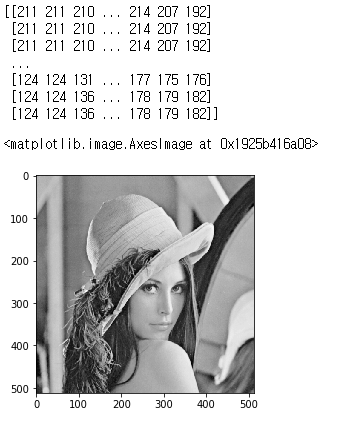

```python
img = cv2.imread("gamma.jpg")
col = cv2.LUT(img, gammalut(0.5))
cv2.putText(col,"gamma = 0.5", (1,30),
    cv2.FONT_HERSHEY_SIMPLEX, 1.2, (255, 255, 0), 2)
cv2.imwrite("g1.jpg",col)

img = cv2.imread("gamma.jpg")
col = cv2.LUT(img, gammalut(1.5))
cv2.putText(col,"gamma = 1.5", (1,30),
    cv2.FONT_HERSHEY_SIMPLEX, 1.2, (255, 255, 0), 2)
cv2.imwrite("g2.jpg",col)

img = cv2.imread("gamma.jpg")
col = cv2.LUT(img, gammalut(2.5))
cv2.putText(col,"gamma = 2.5", (1,30),
    cv2.FONT_HERSHEY_SIMPLEX, 1.2, (255, 255, 0), 2)
cv2.imwrite("g3.jpg",col)


gm = [0.5, 1.2, 2.5, 3.0]
for i in range(len(gm)):
    col = cv2.LUT(img, gammalut(gm[i]))
    cv2.putText(col,f"gamma = {gm[i]}", (1,30),
        cv2.FONT_HERSHEY_SIMPLEX, 0.7, (255, 255, 0), 2)
    cv2.imwrite(f"g{i+1}.jpg",np.hstack([img, col]))
```

```python
from PIL import Image
im1 = Image.open('g1.jpg')
im2 = Image.open('g2.jpg')
im3 = Image.open('g3.jpg')
im4 = Image.open('g4.jpg')
im1.save("out.gif", save_all=True, append_images=[im2, im3, im4], duration=1000, loop=0)
```


```python
from PIL import Image
im1 = Image.open('g1.jpg')
im2 = Image.open('g2.jpg')
im3 = Image.open('g3.jpg')
im4 = Image.open('g4.jpg')
im1.save("out2.gif", save_all=True, append_images=[im2, im3, im4], duration=500, loop=2)
```


```python
img = cv2.imread("gamma.jpg")
imgPIL = Image.fromarray(cv2.cvtColor(img, cv2.COLOR_BGR2RGB)) # bgr -> rgb


font = ImageFont.truetype("HMKMMAG.TTF", 50)

draw = ImageDraw.Draw(imgPIL)
draw.text((10, 10), "댕댕이들", font=font, fill=(255, 0, 0))
imgPIL.save("out4.jpg")
```


## 화소 영역 처리

```python
img = cv2.imread("gamma.jpg")

k=11
kernel = np.ones((k,k), np.float32) / (k*k)
print(kernel)
```

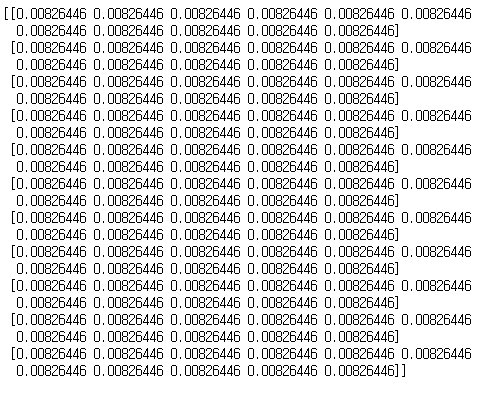

```python
filtered = cv2.filter2D(img, -1, kernel)

plt.imshow(cv2.cvtColor(filtered, cv2.COLOR_BGR2RGB))
```

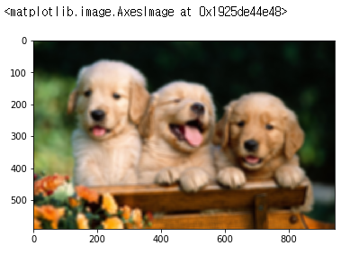

```python
img = cv2.imread("gamma.jpg", cv2.IMREAD_GRAYSCALE)
kernel = np.array([[1,0,-1],
                   [1,0,-1],
                   [1,0,-1]])
filtered = cv2.filter2D(img, -1, kernel)

plt.imshow(cv2.cvtColor(filtered, cv2.COLOR_BGR2RGB))
```

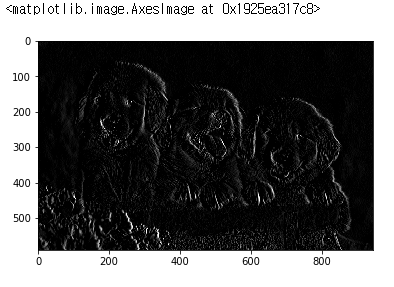

