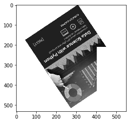
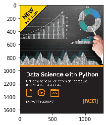
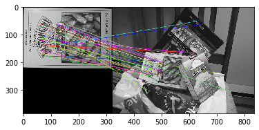
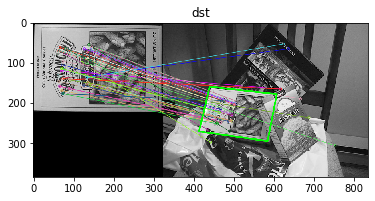
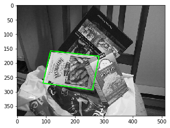
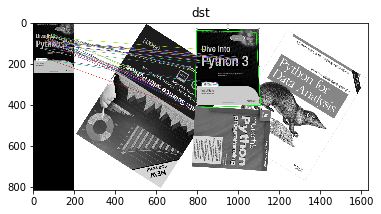
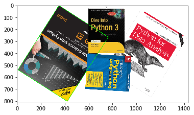

```python
import cv2, numpy as np
import math
import time
import random
from matplotlib import pyplot as plt
%matplotlib inline


def imshow(tit, image) :
    plt.title(tit)    
    if len(image.shape) == 3 :
        plt.imshow(cv2.cvtColor(image, cv2.COLOR_BGR2RGB))
    else :
        plt.imshow(image, cmap="gray")
    plt.show()
```


```python
orb = cv2.ORB_create()

matcher = cv2.BFMatcher_create(cv2.NORM_HAMMING)


images = ['book1.jpg', 'book2.jpg', 'book3.jpg', 'book4.jpg', ] 

database_kp = []
database_desc = []
for name in images :
    img = cv2.imread(name, cv2.IMREAD_GRAYSCALE)
    keypoints, desc = orb.detectAndCompute(img, None)
    database_kp.append(keypoints)
    database_desc.append(desc)
```


```python
test = cv2.imread("book4-1.jpg", cv2.IMREAD_GRAYSCALE)
keypoints, desc = orb.detectAndCompute(test, None)
```


```python
min_distance = 1000
idx = -1
for i in range(len(images)):
    matches = matcher.match(desc, database_desc[i])
    matches = sorted(matches, key=lambda x : x.distance)
    good_matches = matches[:50]
    
    distance = 0
    for d in good_matches :
        distance += d.distance
    distance /= len(good_matches)
    print(distance)
    
    if min_distance > distance:
        min_distance = distance
        idx = i
        
imshow("", test)
imshow("", cv2.imread(images[idx]))
```

    46.76
    43.18
    51.54
    43.08








# 모서리 찾기


```python
src1 = cv2.imread('box.png', cv2.IMREAD_GRAYSCALE)
src2 = cv2.imread('box_in_scene.png', cv2.IMREAD_GRAYSCALE)
    
keypoints1, desc1 = orb.detectAndCompute(src1, None)
keypoints2, desc2 = orb.detectAndCompute(src2, None)

matches = matcher.match(desc1, desc2)
matches = sorted(matches, key=lambda x : x.distance)
good_matches = matches[:50]
```


```python
dst = cv2.drawMatches(src1, keypoints1, src2, keypoints2, good_matches, None,
                     flags = cv2.DrawMatchesFlags_NOT_DRAW_SINGLE_POINTS)
imshow("", dst)
```





```python
pts1 = np.array([keypoints1[m.queryIdx].pt for m in good_matches]).reshape(-1, 1, 2).astype(np.float32)
pts2 = np.array([keypoints2[m.trainIdx].pt for m in good_matches]).reshape(-1, 1, 2).astype(np.float32)


print(pts1.shape)  # 50,1,2
print(pts2.shape)  # 50,1,2

print(pts1)
```

    (50, 1, 2)
    (50, 1, 2)
    [[[141.00482  155.52002 ]]
    
     [[139.96802   55.296005]]
    
     [[134.36931   87.09122 ]]
    
     [[ 70.84801  167.61601 ]]
    
     [[143.07841   66.35521 ]]
    
     [[127.87201   63.936005]]
    
     [[134.78401  150.33601 ]]
    
     [[ 89.85601  162.43202 ]]
    
     [[128.56322   64.28161 ]]
    
     [[ 64.28161   68.42881 ]]
    
     [[141.69601  155.52002 ]]
    
     [[ 88.128006  62.208008]]
    
     [[143.42401   65.66401 ]]
    
     [[ 74.30401  103.68001 ]]
    
     [[126.48962  155.52002 ]]
    
     [[ 63.936005  69.12001 ]]
    
     [[ 74.4      176.40001 ]]
    
     [[126.14401  155.52002 ]]
    
     [[ 64.28161  145.15202 ]]
    
     [[134.78401   72.57601 ]]
    
     [[136.8      132.      ]]
    
     [[ 74.880005 175.68001 ]]
    
     [[136.51201  127.87201 ]]
    
     [[ 65.66401  157.24802 ]]
    
     [[ 74.64961  116.12161 ]]
    
     [[ 76.032005 115.77601 ]]
    
     [[ 76.72321  134.78401 ]]
    
     [[ 60.480007  77.76001 ]]
    
     [[145.15201   58.752007]]
    
     [[136.85762  147.22562 ]]
    
     [[ 70.50241  118.19521 ]]
    
     [[ 70.50241  114.04802 ]]
    
     [[ 66.35521  157.59363 ]]
    
     [[ 80.870415  64.28161 ]]
    
     [[122.42538   98.5375  ]]
    
     [[ 62.208008 131.32802 ]]
    
     [[132.71042  149.29922 ]]
    
     [[134.78401   87.09121 ]]
    
     [[134.36931   99.53282 ]]
    
     [[ 74.64961   95.38561 ]]
    
     [[ 79.62626   77.13794 ]]
    
     [[ 92.06786  141.83427 ]]
    
     [[139.        54.      ]]
    
     [[134.40001  135.6     ]]
    
     [[ 70.84801  112.32001 ]]
    
     [[ 74.30401  138.24002 ]]
    
     [[ 67.392006  60.480007]]
    
     [[ 85.01761   64.28161 ]]
    
     [[134.36931  119.43939 ]]
    
     [[ 74.       176.      ]]]


```python
H, _ = cv2.findHomography(pts1, pts2, cv2.RANSAC)

print(H)
```

    [[ 4.85610150e-01 -1.26423343e-01  1.16639863e+02]
     [ 3.62734153e-02  4.76039278e-01  1.58710108e+02]
     [-1.20390936e-04 -1.08741047e-04  1.00000000e+00]]


```python
(h, w) = src1.shape[:2]
corners1 = np.array([[0, 0], [0, h-1], [w-1, h-1], [w-1, 0]]).reshape(-1, 1, 2).astype(np.float32)
corners2 = cv2.perspectiveTransform(corners1, H)

print(corners1)
print(corners2)
```

    [[[  0.   0.]]
    
     [[  0. 222.]]
    
     [[323. 222.]]
    
     [[323.   0.]]]
    [[[116.63986 158.71011]]
    
     [[ 90.76499 270.93124]]
    
     [[261.93488 294.67987]]
    
     [[284.5573  177.32181]]]


```python
corners3 = corners2 + np.float32([w, 0]) 

cv2.polylines(dst, [np.int32(corners3)], True, (0, 255, 0), 2, cv2.LINE_AA)

imshow('dst', dst)
```





```python
test = cv2.imread('box_in_scene.png')
cv2.polylines(test, [np.int32(corners2)], True, (0, 255, 0), 2, cv2.LINE_AA)

imshow("", test)
```





```python
src1 = cv2.imread('book2.jpg', cv2.IMREAD_GRAYSCALE)
src2 = cv2.imread('books.png', cv2.IMREAD_GRAYSCALE)
    
keypoints1, desc1 = orb.detectAndCompute(src1, None)
keypoints2, desc2 = orb.detectAndCompute(src2, None)

matches = matcher.match(desc1, desc2)
matches = sorted(matches, key=lambda x : x.distance)
good_matches = matches[:50]

dst = cv2.drawMatches(src1, keypoints1, src2, keypoints2, good_matches, None,
                     flags = cv2.DrawMatchesFlags_NOT_DRAW_SINGLE_POINTS)

pts1 = np.array([keypoints1[m.queryIdx].pt for m in good_matches]).reshape(-1, 1, 2).astype(np.float32)
pts2 = np.array([keypoints2[m.trainIdx].pt for m in good_matches]).reshape(-1, 1, 2).astype(np.float32)

H, _ = cv2.findHomography(pts1, pts2, cv2.RANSAC)

(h, w) = src1.shape[:2]
corners1 = np.array([[0, 0], [0, h-1], [w-1, h-1], [w-1, 0]]).reshape(-1, 1, 2).astype(np.float32)
corners2 = cv2.perspectiveTransform(corners1, H)

corners3 = corners2 + np.float32([w, 0]) 

cv2.polylines(dst, [np.int32(corners3)], True, (0, 255, 0), 2, cv2.LINE_AA)

imshow('dst', dst)

```





```python
def findBook(query, scene) : 
    
    src1 = cv2.cvtColor(query, cv2.COLOR_BGR2GRAY)
    src2 = cv2.cvtColor(scene, cv2.COLOR_BGR2GRAY)
    
    keypoints1, desc1 = orb.detectAndCompute(src1, None)
    keypoints2, desc2 = orb.detectAndCompute(src2, None)

    matches = matcher.match(desc1, desc2)
    matches = sorted(matches, key=lambda x: x.distance)
    good_matches = matches[:50]

    pts1 = np.array([keypoints1[m.queryIdx].pt for m in good_matches]).reshape(-1, 1, 2).astype(np.float32)
    pts2 = np.array([keypoints2[m.trainIdx].pt for m in good_matches]).reshape(-1, 1, 2).astype(np.float32)

    H, _ = cv2.findHomography(pts1, pts2, cv2.RANSAC)

    (h, w) = src1.shape[:2]
    corners1 = np.array([[0, 0], [0, h-1], [w-1, h-1], [w-1, 0]]).reshape(-1, 1, 2).astype(np.float32)
    corners2 = cv2.perspectiveTransform(corners1, H)
    
    return np.int32(corners2)


q = cv2.imread('book4.jpg')
s = cv2.imread('books.png')

corner = findBook(q, s)

cv2.polylines(s, [corner], True, (0, 255, 0), 2, cv2.LINE_AA)

imshow("", s)
```




