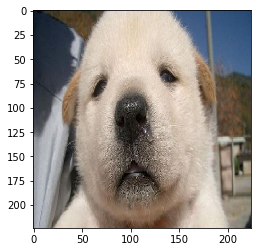

# 사전 학습된 CNN


```python
import keras
import numpy as np
from keras.applications import vgg16, inception_v3, resnet50, mobilenet
from keras.preprocessing.image import load_img
from keras.preprocessing.image import img_to_array
from keras.applications.imagenet_utils import decode_predictions
import matplotlib.pyplot as plt
from keras import models
from keras import layers
from keras import optimizers
%matplotlib inline


#https://storage.googleapis.com/download.tensorflow.org/data/ImageNetLabels.txt   
```


```python
#Load the VGG model
vgg_model = vgg16.VGG16(weights='imagenet')
#vgg_model = vgg16.VGG16(weights='imagenet', include_top=False)


#Load the Inception_V3 model
inception_model = inception_v3.InceptionV3(weights='imagenet')
#inception_model = inception_v3.InceptionV3(weights='imagenet', include_top=False)


#Load the ResNet50 model
resnet_model = resnet50.ResNet50(weights='imagenet')
#resnet_model = resnet50.ResNet50(weights='imagenet', include_top=False)
 
#Load the MobileNet model
mobilenet_model = mobilenet.MobileNet(weights='imagenet') 
#mobilenet_model = mobilenet.MobileNet(weights='imagenet', include_top=False) 
```


```python
vgg_model.summary()    # 138,357,544
#inception_model.summary() # 23,851,784
#resnet_model.summary()  # 25,636,712
#mobilenet_model.summary() # 4,253,864
```

    Model: "vgg16"
    _________________________________________________________________
    Layer (type)                 Output Shape              Param #   
    =================================================================
    input_9 (InputLayer)         (None, 224, 224, 3)       0         
    _________________________________________________________________
    block1_conv1 (Conv2D)        (None, 224, 224, 64)      1792      
    _________________________________________________________________
    block1_conv2 (Conv2D)        (None, 224, 224, 64)      36928     
    _________________________________________________________________
    block1_pool (MaxPooling2D)   (None, 112, 112, 64)      0         
    _________________________________________________________________
    block2_conv1 (Conv2D)        (None, 112, 112, 128)     73856     
    _________________________________________________________________
    block2_conv2 (Conv2D)        (None, 112, 112, 128)     147584    
    _________________________________________________________________
    block2_pool (MaxPooling2D)   (None, 56, 56, 128)       0         
    _________________________________________________________________
    block3_conv1 (Conv2D)        (None, 56, 56, 256)       295168    
    _________________________________________________________________
    block3_conv2 (Conv2D)        (None, 56, 56, 256)       590080    
    _________________________________________________________________
    block3_conv3 (Conv2D)        (None, 56, 56, 256)       590080    
    _________________________________________________________________
    block3_pool (MaxPooling2D)   (None, 28, 28, 256)       0         
    _________________________________________________________________
    block4_conv1 (Conv2D)        (None, 28, 28, 512)       1180160   
    _________________________________________________________________
    block4_conv2 (Conv2D)        (None, 28, 28, 512)       2359808   
    _________________________________________________________________
    block4_conv3 (Conv2D)        (None, 28, 28, 512)       2359808   
    _________________________________________________________________
    block4_pool (MaxPooling2D)   (None, 14, 14, 512)       0         
    _________________________________________________________________
    block5_conv1 (Conv2D)        (None, 14, 14, 512)       2359808   
    _________________________________________________________________
    block5_conv2 (Conv2D)        (None, 14, 14, 512)       2359808   
    _________________________________________________________________
    block5_conv3 (Conv2D)        (None, 14, 14, 512)       2359808   
    _________________________________________________________________
    block5_pool (MaxPooling2D)   (None, 7, 7, 512)         0         
    _________________________________________________________________
    flatten (Flatten)            (None, 25088)             0         
    _________________________________________________________________
    fc1 (Dense)                  (None, 4096)              102764544 
    _________________________________________________________________
    fc2 (Dense)                  (None, 4096)              16781312  
    _________________________________________________________________
    predictions (Dense)          (None, 1000)              4097000   
    =================================================================
    Total params: 138,357,544
    Trainable params: 138,357,544
    Non-trainable params: 0
    _________________________________________________________________


```python
filename = 'dog.jpg'
original = load_img(filename, target_size=(224, 224))
plt.imshow(original)
plt.show()

numpy_image = img_to_array(original)
plt.imshow(np.uint8(numpy_image))
plt.show()

image_batch = np.expand_dims(numpy_image, axis=0)
print('image batch size', image_batch.shape)
plt.imshow(np.uint8(image_batch[0]))
```





    image batch size (1, 224, 224, 3)


    <matplotlib.image.AxesImage at 0x292bf7a6388>


```python
processed_image = vgg16.preprocess_input(image_batch.copy())
predictions = vgg_model.predict(processed_image)
print(predictions.shape)
label_vgg = decode_predictions(predictions, top=10)
print(label_vgg)
```

    (1, 1000)
    [[('n02111500', 'Great_Pyrenees', 0.4523965), ('n02104029', 'kuvasz', 0.2312187), ('n02099712', 'Labrador_retriever', 0.15733661), ('n02112137', 'chow', 0.056725457), ('n02099601', 'golden_retriever', 0.04644576), ('n02109525', 'Saint_Bernard', 0.01886638), ('n02108551', 'Tibetan_mastiff', 0.012332549), ('n02109961', 'Eskimo_dog', 0.0026334003), ('n02088364', 'beagle', 0.0021214983), ('n02107574', 'Greater_Swiss_Mountain_dog', 0.0011332309)]]


```python
processed_image = resnet50.preprocess_input(image_batch.copy())
predictions = resnet_model.predict(processed_image)
label_resnet = decode_predictions(predictions, top=3)
label_resnet
```


    [[('n02111500', 'Great_Pyrenees', 0.5944984),
      ('n02104029', 'kuvasz', 0.16382262),
      ('n02099712', 'Labrador_retriever', 0.09665572)]]


```python
processed_image = mobilenet.preprocess_input(image_batch.copy())
predictions = mobilenet_model.predict(processed_image)
label_mobilenet = decode_predictions(predictions)
label_mobilenet
```


    [[('n02099712', 'Labrador_retriever', 0.40172878),
      ('n02099601', 'golden_retriever', 0.23730062),
      ('n02111500', 'Great_Pyrenees', 0.23020768),
      ('n02112137', 'chow', 0.07651438),
      ('n02104029', 'kuvasz', 0.038160246)]]


```python
filename = 'dog.jpg'
original = load_img(filename, target_size=(299, 299))
numpy_image = img_to_array(original)
image_batch = np.expand_dims(numpy_image, axis=0)

processed_image = inception_v3.preprocess_input(image_batch.copy())
predictions = inception_model.predict(processed_image)
label_inception = decode_predictions(predictions)
label_inception
```


    [[('n02099712', 'Labrador_retriever', 0.6189996),
      ('n02099601', 'golden_retriever', 0.21810332),
      ('n02111500', 'Great_Pyrenees', 0.033466913),
      ('n02112137', 'chow', 0.031906057),
      ('n02104029', 'kuvasz', 0.010099601)]]


```python
import cv2
img = cv2.imread("dog.jpg")
img = cv2.resize(img, (1000,1000))
cv2.putText(img, "VGG16: {}, {:.2f}".format(label_vgg[0][0][1], label_vgg[0][0][2]) , (350, 40), cv2.FONT_HERSHEY_SIMPLEX, 1, (255, 0, 0), 3)
cv2.putText(img, "MobileNet: {}, {:.2f}".format(label_mobilenet[0][0][1], label_mobilenet[0][0][2]) , (350, 75), cv2.FONT_HERSHEY_SIMPLEX, 1, (255, 0, 0), 3)
cv2.putText(img, "Inception: {}, {:.2f}".format(label_inception[0][0][1], label_inception[0][0][2]) , (350, 110), cv2.FONT_HERSHEY_SIMPLEX, 1, (255, 0, 0), 3)
cv2.putText(img, "ResNet50: {}, {:.2f}".format(label_resnet[0][0][1], label_resnet[0][0][2]) , (350, 145), cv2.FONT_HERSHEY_SIMPLEX, 1, (255, 0, 0), 3)
cv2.imwrite("out.jpg", img)
```


    True


# 일반화 시켜서 만들기


```python
from keras.preprocessing.image import ImageDataGenerator
```


```python
test_datagen = ImageDataGenerator()
test_generator = test_datagen.flow_from_directory(
        'cnntest', #디렉토리 폴더안에 폴더하나 더있어야함
        target_size=(224, 224),
        batch_size=5,  # 갯수설정
        class_mode='binary', shuffle=True)
X, _ = test_generator.next()
```

    Found 28 images belonging to 1 classes.


```python
decode_vgg = decode_predictions(
    vgg_model.predict(
        vgg16.preprocess_input(X.copy())), top=3)

decode_resnet = decode_predictions(
    resnet_model.predict(
        resnet50.preprocess_input(X.copy())), top=3)

decode_mobilenet = decode_predictions(
    mobilenet_model.predict(
        mobilenet.preprocess_input(X.copy())), top=3)
```


```python
for i in range(X.shape[0]):
    
    img = cv2.resize(X[i], (1000,1000))
    img = cv2.cvtColor(img , cv2.COLOR_RGB2BGR)
    cv2.putText(img, f"VGG16: {decode_vgg[i][0][1]} ", (50,50), cv2.FONT_HERSHEY_SIMPLEX, 1, (255, 0, 0), 3)
    cv2.putText(img, f"resnet: {decode_resnet[i][0][1]} ", (50,100), cv2.FONT_HERSHEY_SIMPLEX, 1, (255, 0, 0), 3)
    cv2.putText(img, f"mobile: {decode_mobilenet[i][0][1]} ", (50,150), cv2.FONT_HERSHEY_SIMPLEX, 1, (255, 0, 0), 3)
    cv2.imwrite(f"out_{i}.jpg", img)
```
