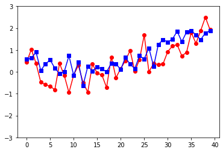
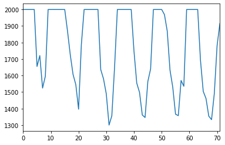

# RNN

> 일반 신경망 - 개별데이터를 독립적으로 학습
>
> 
>
> 순환 신경망 = 시계열 데이터 학습에 적합
>
> 

> 은닉층의 노드에서 활성화 함수를 통해 나온 결과값을 출력과 은닉층 노드의 다음 계산의 입력으로 보냄
>
> RNN에서는 노드를 셀(cell)이라고 하고 이전의 값을 기억하려고 하는 일종의 메모리 역활 수행
>
> 시퀀스 데이터를 만들어줘야함


# LSTM

> 예측하는데 필요한 문맥이 가까이 있고 많지 않다면 RNN은 이를 학습 가능
>
> 정보를 필요로 하는 시점과, 필요한 정보가 멀리 떨어져있다면 잘 예측할 수 없음 -> (Long-term dependency)
>
> RNN의 히든 state에 cell-state fmf cnrk
>
> state가 오래 경과하더라도 그리디언트가 비교적 전파가 잘되는 편


```python
import pandas as pd
import numpy as np
import matplotlib.pyplot as plt

from keras.models import Sequential
from keras.layers import SimpleRNN
from keras.layers import Dense, Dropout, Activation
from keras.layers import Embedding
from keras.layers import LSTM
from keras.preprocessing.text import Tokenizer

from keras.preprocessing import sequence
from keras.preprocessing.sequence import  pad_sequences
from keras.datasets import imdb

from konlpy.tag import Okt
import statsmodels.api as sm
%matplotlib inline
```

```
Using TensorFlow backend.
```


# RNN을 이용한 시계열 데이터 분석 예


```python
step = 4
N = 1000    
Tp = 800    

t=np.arange(0,N)
x=np.sin(0.02*t)+2*np.random.rand(N)
df = pd.DataFrame(x)

values=df.values
train,test = values[0:Tp,:], values[Tp:N,:]   # 800, 200개로 분할

print(train.shape)
print(test.shape)
```

    (800, 1)
    (200, 1)


```python
seq = [1,2,3,4,5,6,7]
sp = 3

seq = [1,2,3,4,5,6,7,7,7,7]
#  3개의 seq 길이를 갖도록 학습 데이터 seq 생성
#  1,2,3,4,5,6,7,0,0,0                   [1,2,3]      [4] 
#                                      [2,3,4]       [5]  
#                                       [3,4,5]       [6] 
#                                       [4,5,6]       [7] 
#                                       [5,6,7]       [7] 
#                                       [7,7,7]       [7] 
```


```python
train = np.append(train,np.repeat(train[-1,],step))  # 마지막값을 step만큼 반복
test = np.append(test,np.repeat(test[-1,],step))
```


```python
print(train.shape)
print(test.shape)
```

    (804,)
    (204,)


```python
print(train[:10])
print(train[798:])
```

    [0.0512367  0.89888906 0.87486672 1.36969566 0.87087437 0.41950665
     1.25699592 0.30188751 1.09722892 1.12342759]
    [1.05742294 1.54912272 1.54912272 1.54912272 1.54912272 1.54912272]


```python
# [1,2,3]      [4]
def convertToMatrix(data, step):
 X, Y =[], []
 for i in range(len(data)-step):
  d=i+step  
  X.append(data[i:d,])
  Y.append(data[d,])
 return np.array(X), np.array(Y)

trainX,trainY =convertToMatrix(train,step)
testX,testY =convertToMatrix(test,step)

print(trainX.shape)
print(trainY.shape)
```

    (800, 4)
    (800,)


```python
print(train[:10])
print(trainX[0])
print(trainX[1])
print(trainY[0])
print(trainY[1])
```

    [0.0512367  0.89888906 0.87486672 1.36969566 0.87087437 0.41950665
     1.25699592 0.30188751 1.09722892 1.12342759]
    [0.0512367  0.89888906 0.87486672 1.36969566]
    [0.89888906 0.87486672 1.36969566 0.87087437]
    0.870874366160523
    0.4195066541845182


```python
#3차원 shape으로 구성
trainX = np.reshape(trainX, (trainX.shape[0], 1, trainX.shape[1]))
testX = np.reshape(testX, (testX.shape[0], 1, testX.shape[1]))
print(trainX.shape)
```

    (800, 1, 4)


```python
model = Sequential()
model.add(SimpleRNN(units=32, input_shape=(1,step), activation="tanh"))
model.add(Dense(8, activation="tanh")) 
model.add(Dense(1))
model.compile(loss='mse', optimizer='adam')
model.fit(trainX,trainY, epochs=100, batch_size=16, verbose=0)
```


    <keras.callbacks.callbacks.History at 0x1dfffbf28d0>


```python
plt.plot(trainY, 'ro-', label="target")
plt.plot(model.predict(trainX), 'bs-', label="output")
```


    [<matplotlib.lines.Line2D at 0x1dfffdcac50>]


```python
plt.plot(testY[0::5], 'ro-', label="target")
plt.plot(model.predict(testX[0::5]), 'bs-', label="output") #0부터 끝까지 5씩 증가
plt.ylim([-3,3])
```


    (-3, 3)





 # "영국의 호흡기 질환으로 인한 사망자 수" 시계열 데이터분석


```python
data = sm.datasets.get_rdataset("deaths", "MASS")
df = data.data
df.tail()
```

    d:\Anaconda3\lib\site-packages\statsmodels\datasets\utils.py:192: FutureWarning: `item` has been deprecated and will be removed in a future version
      return dataset_meta["Title"].item()


<div>
<style scoped>
    .dataframe tbody tr th:only-of-type {
        vertical-align: middle;
    }


    .dataframe tbody tr th {
        vertical-align: top;
    }
    
    .dataframe thead th {
        text-align: right;
    }

</style>

<table border="1" class="dataframe">
  <thead>
    <tr style="text-align: right;">
      <th></th>
      <th>time</th>
      <th>value</th>
    </tr>
  </thead>
  <tbody>
    <tr>
      <th>67</th>
      <td>1979.583333</td>
      <td>1354</td>
    </tr>
    <tr>
      <th>68</th>
      <td>1979.666667</td>
      <td>1333</td>
    </tr>
    <tr>
      <th>69</th>
      <td>1979.750000</td>
      <td>1492</td>
    </tr>
    <tr>
      <th>70</th>
      <td>1979.833333</td>
      <td>1781</td>
    </tr>
    <tr>
      <th>71</th>
      <td>1979.916667</td>
      <td>1915</td>
    </tr>
  </tbody>
</table>

</div>


```python
df.value.plot()
plt.show()
```


```python
df["cliped_value"] = df.value.clip_upper(2000)
df.cliped_value.plot()
plt.show()
```

    d:\Anaconda3\lib\site-packages\ipykernel_launcher.py:1: FutureWarning: clip_upper(threshold) is deprecated, use clip(upper=threshold) instead
      """Entry point for launching an IPython kernel.





```python
print(df.cliped_value)
print(df.cliped_value.values)
```

    0     2000
    1     2000
    2     2000
    3     2000
    4     2000
          ... 
    67    1354
    68    1333
    69    1492
    70    1781
    71    1915
    Name: cliped_value, Length: 72, dtype: int64
    [2000 2000 2000 2000 2000 1655 1721 1524 1596 2000 2000 2000 2000 2000
     2000 2000 1870 1726 1607 1545 1396 1787 2000 2000 2000 2000 2000 2000
     1636 1580 1489 1300 1356 1653 2000 2000 2000 2000 2000 2000 1748 1554
     1498 1361 1346 1564 1640 2000 2000 2000 2000 1969 1870 1633 1529 1366
     1357 1570 1535 2000 2000 2000 2000 2000 1693 1504 1461 1354 1333 1492
     1781 1915]


```python
seq = [1,2,3,4,5,6,7]
ts = 3;

#  3개의 seq 길이를 갖도록 학습 데이터 생성,   y값은 ts 다음값(즉 4번째 부터 가져옴)
#  1,2,3,4,5,6,7,8,9                   [1,2,3]      [4] 
#                                      [2,3,4]     [5]      
x = np.array([np.array([seq[i+j] for j in range(ts)])  
                      for i in range(len(seq) - ts)]).reshape(-1,ts,1)   
y = seq[ts:]

print(x.shape)
print(x)
print(y)
```

    (4, 3, 1)
    [[[1]
      [2]
      [3]]
    
     [[2]
      [3]
      [4]]
    
     [[3]
      [4]
      [5]]
    
     [[4]
      [5]
      [6]]]
    [4, 5, 6, 7]


```python
ts = 7

df["cliped_std_value"] = df.cliped_value.map(lambda x : (x - df.cliped_value.mean()) / np.std(df.cliped_value))
#df["cliped_std_value"] = df.cliped_value
X_train = np.array([np.array([df.cliped_std_value.values[i+j] for j in range(ts)])  # ts만큼 만복
                      for i in range(len(df.cliped_std_value) - ts)]).reshape(-1,ts,1)
y_train = df.cliped_std_value.values[ts:]
print(X_train.shape)
print(y_train.shape)
```

    (65, 7, 1)
    (65,)


```python
model_RNN = Sequential()
model_RNN.add(SimpleRNN(100, input_shape=(ts, 1)))
model_RNN.add(Dense(1, activation="linear"))
model_RNN.compile(loss='mse', optimizer='adam')
```


```python
history_RNN = model_RNN.fit(X_train, y_train, epochs=1000,verbose=0)
```


```python
plt.plot(y_train, 'ro-', label="target")
plt.plot(model_RNN.predict(X_train), 'bs-', label="output")
plt.legend()
plt.show()
```


```python
model_LSTM = Sequential()
model_LSTM.add(LSTM(100, input_shape=(ts, 1)))
model_LSTM.add(Dense(1, activation="linear"))
model_LSTM.compile(loss='mse', optimizer='adam')

history_LSTM = model_LSTM.fit(X_train, y_train, epochs=1000,verbose=0)

```


```python
plt.plot(y_train, 'ro-', label="target")
plt.plot(model_LSTM.predict(X_train), 'bs-', label="output")
plt.legend()
plt.show()
```


# 문장 분석(imdb)


```python
max_features = 20000
# cut texts after this number of words (among top max_features most common words)
maxlen = 80
batch_size = 32 

print('Loading data...')
(x_train, y_train), (x_test, y_test) = imdb.load_data(num_words=max_features)
print(len(x_train), 'train sequences')
print(len(x_test), 'test sequences')
```

    Loading data...
    25000 train sequences
    25000 test sequences


```python
print(len(x_train[0]))
print(x_train[0])
print(len(x_train[1]))
print(x_train[1])
```

    218
    [1, 14, 22, 16, 43, 530, 973, 1622, 1385, 65, 458, 4468, 66, 3941, 4, 173, 36, 256, 5, 25, 100, 43, 838, 112, 50, 670, 2, 9, 35, 480, 284, 5, 150, 4, 172, 112, 167, 2, 336, 385, 39, 4, 172, 4536, 1111, 17, 546, 38, 13, 447, 4, 192, 50, 16, 6, 147, 2025, 19, 14, 22, 4, 1920, 4613, 469, 4, 22, 71, 87, 12, 16, 43, 530, 38, 76, 15, 13, 1247, 4, 22, 17, 515, 17, 12, 16, 626, 18, 19193, 5, 62, 386, 12, 8, 316, 8, 106, 5, 4, 2223, 5244, 16, 480, 66, 3785, 33, 4, 130, 12, 16, 38, 619, 5, 25, 124, 51, 36, 135, 48, 25, 1415, 33, 6, 22, 12, 215, 28, 77, 52, 5, 14, 407, 16, 82, 10311, 8, 4, 107, 117, 5952, 15, 256, 4, 2, 7, 3766, 5, 723, 36, 71, 43, 530, 476, 26, 400, 317, 46, 7, 4, 12118, 1029, 13, 104, 88, 4, 381, 15, 297, 98, 32, 2071, 56, 26, 141, 6, 194, 7486, 18, 4, 226, 22, 21, 134, 476, 26, 480, 5, 144, 30, 5535, 18, 51, 36, 28, 224, 92, 25, 104, 4, 226, 65, 16, 38, 1334, 88, 12, 16, 283, 5, 16, 4472, 113, 103, 32, 15, 16, 5345, 19, 178, 32]
    189
    [1, 194, 1153, 194, 8255, 78, 228, 5, 6, 1463, 4369, 5012, 134, 26, 4, 715, 8, 118, 1634, 14, 394, 20, 13, 119, 954, 189, 102, 5, 207, 110, 3103, 21, 14, 69, 188, 8, 30, 23, 7, 4, 249, 126, 93, 4, 114, 9, 2300, 1523, 5, 647, 4, 116, 9, 35, 8163, 4, 229, 9, 340, 1322, 4, 118, 9, 4, 130, 4901, 19, 4, 1002, 5, 89, 29, 952, 46, 37, 4, 455, 9, 45, 43, 38, 1543, 1905, 398, 4, 1649, 26, 6853, 5, 163, 11, 3215, 10156, 4, 1153, 9, 194, 775, 7, 8255, 11596, 349, 2637, 148, 605, 15358, 8003, 15, 123, 125, 68, 2, 6853, 15, 349, 165, 4362, 98, 5, 4, 228, 9, 43, 2, 1157, 15, 299, 120, 5, 120, 174, 11, 220, 175, 136, 50, 9, 4373, 228, 8255, 5, 2, 656, 245, 2350, 5, 4, 9837, 131, 152, 491, 18, 2, 32, 7464, 1212, 14, 9, 6, 371, 78, 22, 625, 64, 1382, 9, 8, 168, 145, 23, 4, 1690, 15, 16, 4, 1355, 5, 28, 6, 52, 154, 462, 33, 89, 78, 285, 16, 145, 95]


```python
print('Pad sequences (samples x time)')
x_train = sequence.pad_sequences(x_train, maxlen=maxlen)
x_test = sequence.pad_sequences(x_test, maxlen=maxlen)
print('x_train shape:', x_train.shape)
print('x_test shape:', x_test.shape)
```

    Pad sequences (samples x time)
    x_train shape: (25000, 80)
    x_test shape: (25000, 80)


```python
print(x_train[0])
print(x_train[1])
```

    [   15   256     4     2     7  3766     5   723    36    71    43   530
       476    26   400   317    46     7     4 12118  1029    13   104    88
         4   381    15   297    98    32  2071    56    26   141     6   194
      7486    18     4   226    22    21   134   476    26   480     5   144
        30  5535    18    51    36    28   224    92    25   104     4   226
        65    16    38  1334    88    12    16   283     5    16  4472   113
       103    32    15    16  5345    19   178    32]
    [ 125   68    2 6853   15  349  165 4362   98    5    4  228    9   43
        2 1157   15  299  120    5  120  174   11  220  175  136   50    9
     4373  228 8255    5    2  656  245 2350    5    4 9837  131  152  491
       18    2   32 7464 1212   14    9    6  371   78   22  625   64 1382
        9    8  168  145   23    4 1690   15   16    4 1355    5   28    6
       52  154  462   33   89   78  285   16  145   95]


```python
print('Build model...')
model = Sequential()
model.add(Embedding(max_features, 128))
model.add(LSTM(128))
model.add(Dense(1, activation='sigmoid'))

# try using different optimizers and different optimizer configs
model.compile(loss='binary_crossentropy',
              optimizer='adam',
              metrics=['accuracy'])
```

    Build model...


```python
%%time
print('Train...')
model.fit(x_train, y_train,
          batch_size=batch_size,
          epochs=2, #15
          validation_data=(x_test, y_test))
```

    Train...
    Train on 25000 samples, validate on 25000 samples
    Epoch 1/2
    25000/25000 [==============================] - 109s 4ms/step - loss: 0.4292 - accuracy: 0.7968 - val_loss: 0.3567 - val_accuracy: 0.8427
    Epoch 2/2
    25000/25000 [==============================] - 107s 4ms/step - loss: 0.2526 - accuracy: 0.9000 - val_loss: 0.4002 - val_accuracy: 0.8204
    Wall time: 3min 37s


```python
score, acc = model.evaluate(x_test, y_test,
                            batch_size=batch_size)
print('Test score:', score)
print('Test accuracy:', acc)
```

    25000/25000 [==============================] - 21s 836us/step
    Test score: 0.4001913144683838
    Test accuracy: 0.8204399943351746

# 네이버


```python
train_data= pd.read_table('./ratings_train.txt')
test_data= pd.read_table('./ratings_test.txt')

train_data=train_data.dropna(how='any') # Null 값이 존재하는 행 제거
train_data['document'] = train_data['document'].str.replace("[^ㄱ-ㅎㅏ-ㅣ가-힣 ]","")
stopwords=['의','가','이','은','들','는','좀','잘','걍','과','도','를','으로','자','에','와','한','하다']
```


```python
okt = Okt()
X_train=[]
for sentence in train_data['document']:
    temp_X = []
    temp_X=okt.morphs(sentence, stem=True) # 토큰화
    temp_X=[word for word in temp_X if not word in stopwords] # 불용어 제거
    X_train.append(temp_X)   
```


```python
test_data=test_data.dropna(how='any') # Null 값 제거
test_data['document'] = test_data['document'].str.replace("[^ㄱ-ㅎㅏ-ㅣ가-힣 ]","") # 정규 표현식 수행

X_test=[]
for sentence in test_data['document']:
    temp_X = []
    temp_X=okt.morphs(sentence, stem=True) # 토큰화
    temp_X=[word for word in temp_X if not word in stopwords] # 불용어 제거
    X_test.append(temp_X)
```


```python
max_words = 35000
tokenizer = Tokenizer(num_words=max_words) # 상위 35,000개의 단어만 보존
tokenizer.fit_on_texts(X_train)
X_train = tokenizer.texts_to_sequences(X_train)
X_test = tokenizer.texts_to_sequences(X_test)
```


```python
max_len=30
# 전체 데이터의 길이는 30으로 맞춘다.
X_train = pad_sequences(X_train, maxlen=max_len)
X_test = pad_sequences(X_test, maxlen=max_len)
y_train=np.array(train_data['label'])
y_test=np.array(test_data['label'])
```


```python
model = Sequential()
model.add(Embedding(max_words, 100))
model.add(LSTM(128))
model.add(Dense(1, activation='sigmoid'))

model.compile(optimizer='adam', loss='binary_crossentropy', metrics=['accuracy'])

```


```python
history = model.fit(X_train, y_train, epochs=2, batch_size=60, validation_split=0.2)  # 1번 2분  84% -> 85%
```

    C:\ProgramData\Anaconda3\lib\site-packages\tensorflow_core\python\framework\indexed_slices.py:424: UserWarning: Converting sparse IndexedSlices to a dense Tensor of unknown shape. This may consume a large amount of memory.
      "Converting sparse IndexedSlices to a dense Tensor of unknown shape. "


    Train on 119996 samples, validate on 29999 samples
    Epoch 1/2
    119996/119996 [==============================] - 133s 1ms/step - loss: 0.3865 - accuracy: 0.8225 - val_loss: 0.3465 - val_accuracy: 0.8489
    Epoch 2/2
    119996/119996 [==============================] - 134s 1ms/step - loss: 0.2882 - accuracy: 0.8757 - val_loss: 0.3444 - val_accuracy: 0.8513


```python
# 9:48
print("\n 테스트 정확도: %.4f" % (model.evaluate(X_test, y_test)[1]))
```

    49997/49997 [==============================] - 7s 147us/step
    
     테스트 정확도: 0.8458


```python
model.evaluate(X_test, y_test)
```

    49997/49997 [==============================] - 7s 146us/step


    [0.35762452658777044, 0.8457707166671753]

