```python
import numpy as np
import tensorflow as tf
from matplotlib import pyplot as plt
from keras.models import Sequential
from keras.layers import Dense
from keras.layers import Flatten
from keras.layers.convolutional import Conv2D
from keras.layers.convolutional import MaxPooling2D
from keras.models import Sequential
from keras.layers import Activation, Dense
from keras import optimizers
from keras.layers import BatchNormalization
from keras.layers import Dropout
from keras.utils.np_utils import to_categorical
from keras.layers import BatchNormalization, Dropout
import cv2
```

```python
X_train = np.zeros((15*3, 24,24))
y_train = np.zeros(15*3)

for i in range(15) :    
    img = cv2.imread('./server/hard_handwriting_shape/train/circle/circle{0:03d}.png'.format(i+1), 0)        
    X_train[i,:,:] = img
    y_train[i] = 0
    
for i in range(15) :    
    img = cv2.imread('./server/hard_handwriting_shape/train/rectangle/rectangle{0:03d}.png'.format(i+1), 0)        
    X_train[15+i,:,:] = img
    y_train[15+i] = 1
    
for i in range(15) :    
    img = cv2.imread('./server/hard_handwriting_shape/train/triangle/triangle{0:03d}.png'.format(i+1), 0)        
    X_train[30+i,:,:] = img
    y_train[30+i] = 2     
```

```python
X_test = np.zeros((5*3, 24,24))
y_test = np.zeros(5*3)

for i in range(5) :    
    img = cv2.imread('./server/hard_handwriting_shape/test/circle/circle{0:03d}.png'.format(i+21), 0)        
    X_test[i,:,:] = img
    y_test[i] = 0
    
for i in range(5) :    
    img = cv2.imread('./server/hard_handwriting_shape/test/rectangle/rectangle{0:03d}.png'.format(i+21), 0)        
    X_test[5+i,:,:] = img
    y_test[5+i] = 1
    
for i in range(5) :    
    img = cv2.imread('./server/hard_handwriting_shape/test/triangle/triangle{0:03d}.png'.format(i+21), 0)        
    X_test[10+i,:,:] = img
    y_test[10+i] = 2
```

```python
plt.imshow(X_test[14], cmap="gray")    # show first number in the dataset
plt.show()
print('Label: ', y_test[14])
```

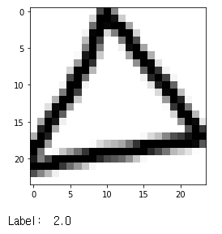

```python
y_train = to_categorical(y_train)
y_test = to_categorical(y_test)
print(X_train.shape, X_test.shape, y_train.shape, y_test.shape)
```

```python
# 4차원으로 변경
X_train =  X_train.reshape(-1, 24,24,1)
X_test =  X_test.reshape(-1, 24,24,1)
print(X_train.shape)
print(X_test.shape)
print(y_train.shape)
print(y_test.shape)
```

```python
plt.imshow(X_train[2,:,:,0], cmap="gray")  
plt.show()
```

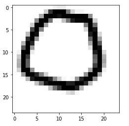


```python
# 모델 구성하기
model = Sequential()
model.add(Conv2D(32, kernel_size=(3, 3),input_shape=(24,24,1)))
model.add(BatchNormalization())
model.add(Activation('relu'))
model.add(MaxPooling2D(pool_size=(2, 2)))
    
model.add(Conv2D(64, (3, 3))) 
model.add(BatchNormalization())
model.add(Activation('relu'))
model.add(MaxPooling2D(pool_size=(2, 2)))

model.add(Flatten())

model.add(Dense(128)) 
model.add(BatchNormalization())
model.add(Activation('relu'))

model.add(Dense(64)) 
model.add(BatchNormalization())
model.add(Activation('relu'))


model.add(Dense(3, activation='softmax'))

# 모델 엮기
model.compile(loss='categorical_crossentropy', optimizer='adam', metrics=['accuracy'])
```

```python
# 모델 학습시키기 #1
history = model.fit(X_train, y_train, batch_size = 100, epochs = 100, validation_data =(X_test, y_test), verbose = 0)
```

```python
plt.plot(history.history['accuracy'])
plt.plot(history.history['val_accuracy'])
plt.legend(['training', 'validation'], loc = 'upper left')
plt.show()
results = model.evaluate(X_test, y_test)
print(results)
```

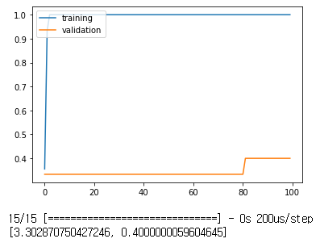


```python
model.summary()
```

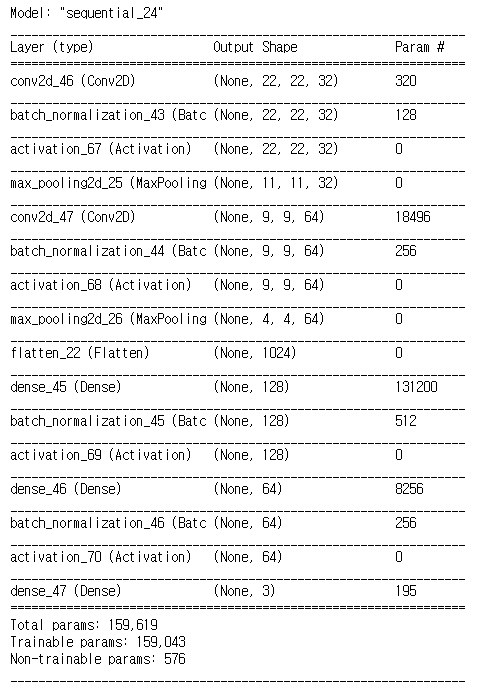


```python
for l in model.layers:
    print(l.name)
    print(l.trainable)
```

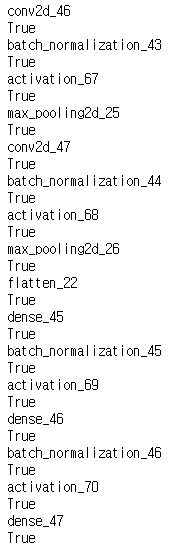


```python
w = model.layers[0].get_weights()
print(w[0].shape)
print(w[1].shape)

print(w[0][:,:,0,0])
print(w[1][0])
```

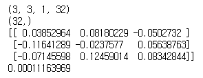

```python
model.layers[0].output
```

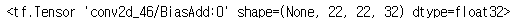

```python
model.summary()
```

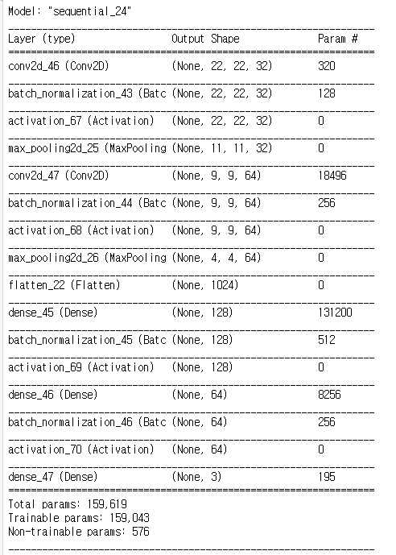

```python
plt.imshow(w[0][:,:,0,0], cmap="gray")
```

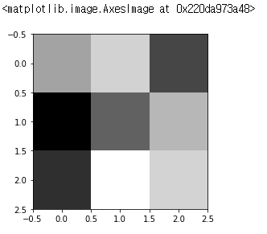

```python
from keras.models import Model

my_layer_model = Model(inputs=model.input, 
                       outputs=model.layers[0].output)
output = my_layer_model.predict(X_test)    # predict는 예측함수가 아님 forward 함수임
print(output.shape)

iFilter = 5
iImg = 1

# 1번 원본 이미지
plt.imshow(X_test[iImg,:,:,0], cmap="gray")
plt.show()

# filter
w = model.layers[0].get_weights()
w = w[0]
f = w[:,:,0,iFilter]
plt.imshow(f, cmap="gray")
plt.show()

# 출력
plt.imshow(output[iImg,:,:,iFilter], cmap="gray")  # :,: 는 n by n
plt.show()
```

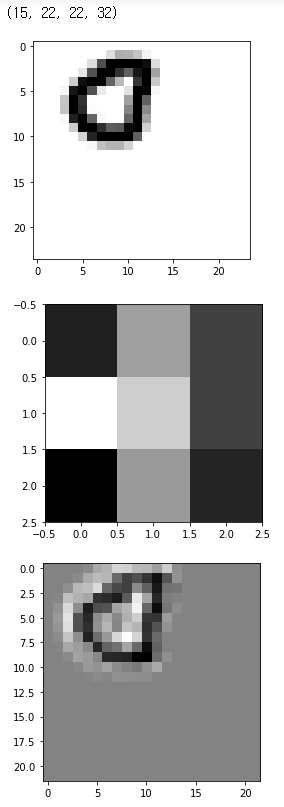

```python
# flastten 을 구하기위해 get_layer라는 함수를 사용

from keras.models import Model

my_layer_model = Model(inputs=model.input, 
                       outputs=model.get_layer("flatten_22").output)
output = my_layer_model.predict(X_test)
print(output.shape)

# 나온 output이 학습데이터임
```

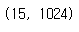

```python
my_layer_model = Model(inputs=model.input, 
                       outputs=model.get_layer("dense_47").output)
output = my_layer_model.predict(X_test)
print(output.shape)
#print(output)
p = np.argmax(output, axis=1)
T = np.argmax(y_test, axis = 1)

print(p)
print(T)
print(sum(p == T)*1)
print(sum((p == T)*1)/len(p))
```

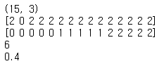

