# OCR


```python
import cv2, numpy as np
import time
from matplotlib import pyplot as plt
%matplotlib inline

def imshow(tit, image) :
    plt.title(tit)    
    if len(image.shape) == 3 :
        plt.imshow(cv2.cvtColor(image, cv2.COLOR_BGR2RGB))
    else :
        plt.imshow(image, cmap="gray")
    plt.show()
```


```python
image = cv2.imread('ocr-text.png',0)   
#img_blur = cv2.GaussianBlur(image, (3,3), 0)
binary = cv2.adaptiveThreshold(image, 255,
          cv2.ADAPTIVE_THRESH_GAUSSIAN_C, 
          cv2.THRESH_BINARY, 21, 5)
imshow("", binary)
cv2.imwrite("out.png", binary)
```

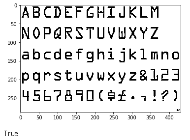


```python
import pytesseract
pytesseract.pytesseract.tesseract_cmd = r'C:\Program Files\Tesseract-OCR\tesseract'

str = pytesseract.image_to_string('out.png')

print(str)
```

    ABCDEFGHIJKLM
    NOPARSTUVUXYZ
    abcdefghi jklmno
    parstuvwxyz&led
    HSE7AAWOCs£.4!7)


```python
image = cv2.imread('mart5.jpg',0)   
#img_blur = cv2.GaussianBlur(image, (3,3), 0)
binary = cv2.adaptiveThreshold(image, 255,
          cv2.ADAPTIVE_THRESH_GAUSSIAN_C, 
          cv2.THRESH_BINARY, 21, 5)
imshow("", binary)
cv2.imwrite("out2.png", binary)
```

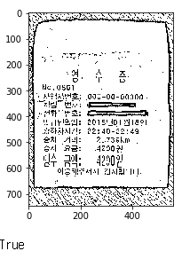


```python
str = pytesseract.image_to_string('mart5.jpg', lang = 'kor')
img = cv2.imread("mart5.jpg")
imshow("", img)
print(str)
```

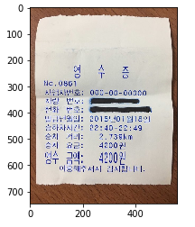


    여
    ㅇ
    10.0861
    
    사업지번로:
    
    그ㅋ  1ㅎㆍ
    진량. 먼오:
    
    2:40-22:
    2.7390
    4200원
    420(원
    
    감사합니다.


# 외각선(canny edged)


```python
image = cv2.imread("book.jpg")
gray = cv2.cvtColor(image, cv2.COLOR_BGR2GRAY)
gray = cv2.GaussianBlur(gray, (3, 3), 0)
edged = cv2.Canny(gray, 10, 250)
imshow("canny", edged)

kernel = cv2.getStructuringElement(cv2.MORPH_RECT, (7, 7))
closed = cv2.morphologyEx(edged, cv2.MORPH_CLOSE, kernel)
imshow("", closed)

cnts, _ = cv2.findContours(closed.copy(), cv2.RETR_EXTERNAL, cv2.CHAIN_APPROX_SIMPLE)
total = 0

for c in cnts:
    peri = cv2.arcLength(c, True)
    approx = cv2.approxPolyDP(c, 0.02 * peri, True)

    if len(approx) == 4:
        cv2.drawContours(image, [approx], -1, (0, 255, 0), 4)
        total += 1
print("I found {0} books in that image".format(total))
imshow("Output", image)
```

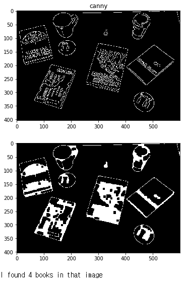

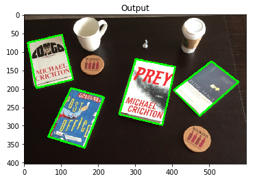


# 바둑알 외각선 찾고 흰색 검은색 분류


```python
from collections import Counter

def detect_weiqi(img):  
    txt = 'black'
    gray = cv2.cvtColor(img, cv2.COLOR_BGR2GRAY)
    _, threshold = cv2.threshold(gray, 100, 255, cv2.THRESH_BINARY)

    c = Counter(list(threshold.flatten()))
    print(c.most_common())
    if c.most_common()[0][0] != 0:
        txt = 'white'
    return txt, threshold
```


```python
img = cv2.imread('stone.png')

img = cv2.medianBlur(img, 5)
gray = cv2.cvtColor(img, cv2.COLOR_BGR2GRAY)

# 해상도,  원간 최소 거리      edge threshold       circle 중심점 histogram수,
# 1,        20,             param1=100,  param2=30, minRadius=10, maxRadius=50
# param1 : edge threshold low ->  edge가 검출되어 같은 원이 검출됨
# param2 : 중심점 histogram 수가 작으면 많은 원이 검출됨

circles = cv2.HoughCircles(gray, cv2.HOUGH_GRADIENT, 
                           1, 20, param1=100, param2=30, minRadius=10, maxRadius=50)
print(circles)
```

    [[[295.5 257.5  28.4]
      [359.5 338.5  28.6]
      [301.5 138.5  27.9]
      [356.5 272.5  29.1]
      [239.5 273.5  28.6]
      [176.5 262.5  28.1]
      [256.5 329.5  29.4]
      [176.5 132.5  28. ]
      [426.5 272.5  28.5]
      [240.5 136.5  28.8]
      [308.5  77.5  27.5]
      [263.5 387.5  29.2]
      [241.5 199.5  28. ]
      [179.5 203.5  28. ]
      [ 83.5 132.5  27.2]
      [324.5 382.5  29.4]
      [367.5 148.5  28.4]
      [249.5  69.5  29.1]]]


```python
circles = np.uint16(np.around(circles))
print(circles)

font = cv2.FONT_HERSHEY_SIMPLEX
for i in circles[0, :]:
    x, y, r = i
    cv2.circle(img, (x,y), r, (0, 0, 255), 5)
    
    crop_img = img[y - r:y + r, x - r:x + r]    
    txt, threshold = detect_weiqi(crop_img)
    
    if txt == 'black' :  
        cv2.circle(img, (x, y),int(r*0.7), (0, 0, 0), -1)
    else :
        cv2.circle(img, (x, y), int(r*0.7), (255, 255, 255), -1)            


imshow("", img)
```

    [[[296 258  28]
      [360 338  29]
      [302 138  28]
      [356 272  29]
      [240 274  29]
      [176 262  28]
      [256 330  29]
      [176 132  28]
      [426 272  28]
      [240 136  29]
      [308  78  28]
      [264 388  29]
      [242 200  28]
      [180 204  28]
      [ 84 132  27]
      [324 382  29]
      [368 148  28]
      [250  70  29]]]
    [(255, 2164), (0, 972)]
    [(0, 2865), (255, 499)]
    [(255, 2166), (0, 970)]
    [(255, 2362), (0, 1002)]
    [(255, 2255), (0, 1109)]
    [(255, 2121), (0, 1015)]
    [(255, 2258), (0, 1106)]
    [(0, 2869), (255, 267)]
    [(0, 2749), (255, 387)]
    [(255, 2366), (0, 998)]
    [(0, 2893), (255, 243)]
    [(0, 3025), (255, 339)]
    [(0, 2881), (255, 255)]
    [(0, 2914), (255, 222)]
    [(255, 1962), (0, 954)]
    [(255, 2255), (0, 1109)]
    [(0, 2808), (255, 328)]
    [(0, 3038), (255, 326)]

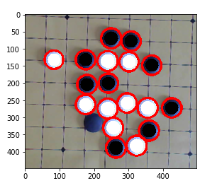


```python
img = cv2.imread('stone2.jpg')

img = cv2.medianBlur(img, 5)
gray = cv2.cvtColor(img, cv2.COLOR_BGR2GRAY)

# 해상도,  원간 최소 거리      edge threshold       circle 중심점 histogram수,
# 1,        20,             param1=100,  param2=30, minRadius=10, maxRadius=50
# param1 : edge threshold low ->  edge가 검출되어 같은 원이 검출됨
# param2 : 중심점 histogram 수가 작으면 많은 원이 검출됨

circles = cv2.HoughCircles(gray, cv2.HOUGH_GRADIENT, 
                           1, 20, param1=100, param2=30, minRadius=10, maxRadius=50)
circles = np.uint16(np.around(circles))
print(circles)

font = cv2.FONT_HERSHEY_SIMPLEX
for i in circles[0, :]:
    x, y, r = i
    cv2.circle(img, (x,y), r, (0, 0, 255), 5)
    
    crop_img = img[y - r:y + r, x - r:x + r]    
    txt, threshold = detect_weiqi(crop_img)
    
    if txt == 'black' :  
        cv2.circle(img, (x, y),int(r*0.7), (0, 0, 0), -1)
    else :
        cv2.circle(img, (x, y), int(r*0.7), (255, 255, 255), -1)            


imshow("", img)
```

    [[[514 124  26]
      [332 258  26]
      [208 136  27]
      [384 322  27]
      [440 316  27]
      [258 452  27]
      [382  82  27]
      [432 136  27]
      [378 136  27]
      [318 314  27]
      [322 438  27]
      [328  74  26]
      [196 328  27]
      [266 178  26]
      [316 382  27]
      [390 260  27]
      [260 392  29]
      [196 256  27]
      [448 378  27]
      [500 450  27]
      [390 200  29]
      [388 386  27]
      [504 324  27]
      [440 196  27]
      [382 448  26]
      [204 192  27]
      [322 134  29]
      [448 250  26]
      [262 246  30]
      [250 316  28]
      [266  72  25]
      [504 204  27]
      [198 386  28]
      [140 136  28]
      [314 206  28]
      [440  74  27]
      [194  50  31]]]
    [(255, 1821), (0, 883)]
    [(255, 1777), (0, 927)]
    [(0, 2647), (255, 269)]
    [(255, 2006), (0, 910)]
    [(0, 2684), (255, 232)]
    [(0, 2674), (255, 242)]
    [(0, 2663), (255, 253)]
    [(0, 2694), (255, 222)]
    [(255, 1926), (0, 990)]
    [(0, 2677), (255, 239)]
    [(255, 2011), (0, 905)]
    [(255, 1783), (0, 921)]
    [(255, 2001), (0, 915)]
    [(255, 1778), (0, 926)]
    [(0, 2649), (255, 267)]
    [(0, 2660), (255, 256)]
    [(255, 2278), (0, 1086)]
    [(0, 2641), (255, 275)]
    [(255, 1997), (0, 919)]
    [(0, 2648), (255, 268)]
    [(0, 3031), (255, 333)]
    [(255, 2005), (0, 911)]
    [(0, 2645), (255, 271)]
    [(255, 1864), (0, 1052)]
    [(0, 2482), (255, 222)]
    [(255, 2012), (0, 904)]
    [(0, 3084), (255, 280)]
    [(255, 1757), (0, 947)]
    [(255, 2481), (0, 1119)]
    [(255, 2134), (0, 1002)]
    [(255, 1652), (0, 848)]
    [(0, 2647), (255, 269)]
    [(0, 2866), (255, 270)]
    [(0, 2849), (255, 287)]
    [(0, 2988), (255, 148)]
    [(255, 2009), (0, 907)]
    [(255, 2706), (0, 1138)]

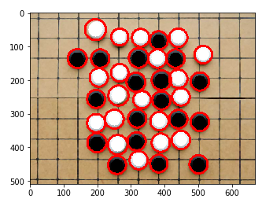


# flip (반전)


```python
img = cv2.imread("lena.jpg")
img2 = cv2.flip(img, 0)# 1은 좌우반전, 0은 상하반전
imshow("", img2)
```

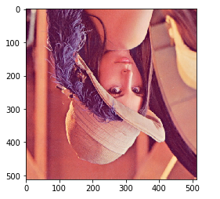

# resize


```python
img = cv2.imread("lena.jpg")
zoom1 = cv2.resize(img, (200, 100), interpolation = cv2.INTER_CUBIC)
# interpolation = cv2.INTER_AREA
imshow("", zoom1)
```

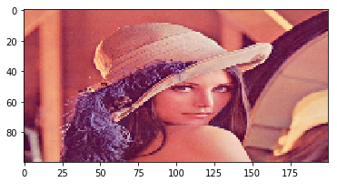


```python
img = cv2.imread("lena.jpg")
print(img.shape)
res = cv2.resize(img, None, fx = 0.5, fy = 0.5, interpolation = cv2.INTER_CUBIC)
# interpolation = cv2.INTER_AREA
imshow("", res)
```

    (512, 512, 3)


# cropping


```python
cropping = img[100:300, 120:410]
print(cropping.shape)
imshow("cropping", cropping)
```

    (200, 290, 3)

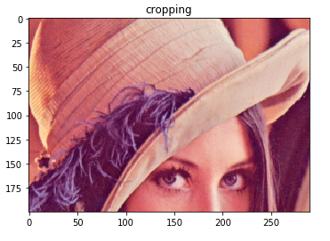


# 이동


```python
# 변환 행렬, X축으로 10, Y축으로 20 이동
height, width = img.shape[:2]
M = np.float32([[1, 0, 50], [0, 1, 20]])
c = img[0,0]
print(c)
dst = cv2.warpAffine(img, M, (width, height), borderValue = (255, 255, 255))
imshow("", dst)
```

    [128 138 225]

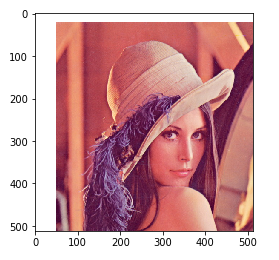


# 내가해본 실습


```python
import random

for _ in range(10):
    

    dx = np.random.randint(-50, 50)
    dy = np.random.randint(-50, 50)

    for i in range(1):
        height, width = img.shape[:2]
        M = np.float32([[1, 0, dx], [0, 1, dy]])
        c = img[0,0]
        dst = cv2.warpAffine(img, M, (width, height), borderValue = (255, 255, 255))
        imshow("", dst)
```


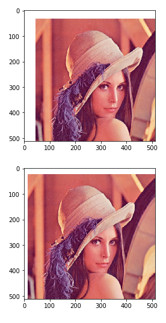

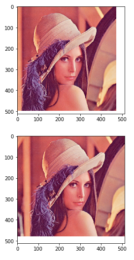


# 실습 정답


```python
img = cv2.imread("lena.jpg")
height, width = img.shape[:2]

dx = 50
r = np.random.randint(dx*2, size=(5,2))-dx

M = np.float32([[1, 0, dx], [0, 1, dy]])

c = img[0,0]

for p in r.tolist():
    M[:,2] = p
    dst = cv2.warpAffine(img, M, (width, height), borderValue = (int(c[0]), int(c[1]), int(c[2])))
    imshow("", dst)
```


# 회전


```python
height, width = img.shape[:2]
img_center = (width / 2, height / 2)
M = cv2.getRotationMatrix2D(img_center, 45, 1.0)  # 3번째는 회전중심
print(M)
rotated_image = cv2.warpAffine(img, M, (width, height), borderValue = (255, 255, 255))

print(rotated_image.shape)
imshow("", rotated_image)
```

    [[   0.70710678    0.70710678 -106.03867197]
     [  -0.70710678    0.70710678  256.        ]]
    (512, 512, 3)

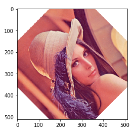


# 변형


```python
img = cv2.imread("namecard.png")

height, width = img.shape[:2]

# 좌표 순서 - 상단왼쪽 끝, 상단오른쪽 끝, 하단왼쪽 끝, 하단오른쪽 끝
point_list = [[27, 179], [611,36], [118,534], [754,325]]

pts1 = np.array([[27, 179], [611,36], [118,534], [754,325]], dtype="float32")
print(pts1)

pts2 = np.float32([[0,0],[width,0],[0,height],[width,height]])
print(pts2)

pts2 = np.float32([[0,0],[width,0],[0,height],[width,height]])
#pts2 = np.float32([[0,0],[width/2,0],[0,height/2],[width/2,height/2]])

M = cv2.getPerspectiveTransform(pts1,pts2)
print(M)


img_result = cv2.warpPerspective(img, M, (width,height))
#img_result = cv2.warpPerspective(img, M, (int(width/2),int(height/2)))
imshow("", img)
imshow("", img_result)
```

    [[ 37 175]
     [615  47]
     [114 529]
     [744 329]]
    [[ 27. 179.]
     [611.  36.]
     [118. 534.]
     [754. 325.]]
    [[  0.   0.]
     [811.   0.]
     [  0. 577.]
     [811. 577.]]
    [[ 1.22316837e+00 -3.13544568e-01  2.30989317e+01]
     [ 4.53502840e-01  1.85206754e+00 -3.43764667e+02]
     [-1.29571760e-04  4.23781663e-04  1.00000000e+00]]

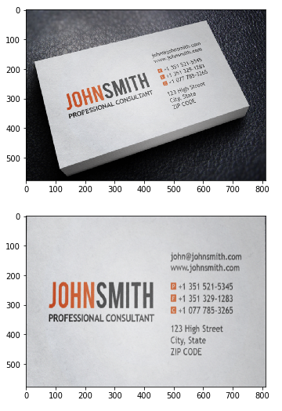

```python
import pytesseract
pytesseract.pytesseract.tesseract_cmd = r'C:\Program Files\Tesseract-OCR\tesseract'

str = pytesseract.image_to_string(img_result)

print(str)
```

    john@johnsmith.com
    www.johnsmith.com
    
    @ +1 351 521-5345
    +1 351 329-1283
    
    +1 077 785-3265
    PROFESSIONAL CONSULTANT
    
    123 High Street
    
    City, State
    
    ZIP CODE


# 좌표위치 구하기


```python
# 뭔지 잘모르겟음

idx = [1, 0, 2, 3]
pts = np.array(approx[idx, 0, :])
print(pts)
```

    [[ 37 175]
     [615  47]
     [114 529]
     [744 329]]


# 새로 다시 해본것들


```python
img = cv2.imread('namecard.png')
gray = cv2.cvtColor(img, cv2.COLOR_BGR2GRAY) 
thr, mask = cv2.threshold(gray, 0, 255,
        cv2.THRESH_BINARY+cv2.THRESH_OTSU)
imshow("", mask)
contours, _ = cv2.findContours(mask, 
    cv2.RETR_EXTERNAL, cv2.CHAIN_APPROX_SIMPLE)

print(  f"shape = {len(contours)}"  )

for con in contours :    
    
    peri = cv2.arcLength(con, True)
    approx = cv2.approxPolyDP(con, 0.02 * peri, True)
    
    print(  f"shape={len(con)}  length={peri}  approx={len(approx)} "  )    
    #x = con[1][0][0]
    #y = con[1][0][1]    
    p = tuple(con[0][0])
    cv2.drawContours(img, [approx], -1, (255, 0, 255), 20)
    cv2.circle(img, p, 5, (255,0,0), -1)
imshow("", img)
```


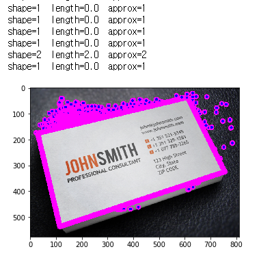


```python
img = cv2.imread('namecard.png')
gray = cv2.cvtColor(img, cv2.COLOR_BGR2GRAY) 
gray = cv2.medianBlur(gray, 21)
thr, mask = cv2.threshold(gray, 0, 255,
        cv2.THRESH_BINARY+cv2.THRESH_OTSU)


kernel = np.ones((5, 5),np.uint8)
opened = cv2.morphologyEx(mask, cv2.MORPH_OPEN, kernel, iterations=5)


contours, _ = cv2.findContours(opened, 
    cv2.RETR_EXTERNAL, cv2.CHAIN_APPROX_SIMPLE)

maxArea = 0

for i in range(len(contours)):
    con = contours[i]
    peri = cv2.arcLength(con, True)
    area = cv2.contourArea(con)
    approx = cv2.approxPolyDP(con, 0.02 * peri, True)
    print(  f"shape={len(con)}  length={peri}  approx={len(approx)} "  )      
    if area > maxArea  :
        maxArea = area
        maxContour = approx
        
cv2.drawContours(img, [maxContour], -1, (255, 0, 255), 10)
imshow("", img)
```

    shape=1029  length=2077.716940164566  approx=4 

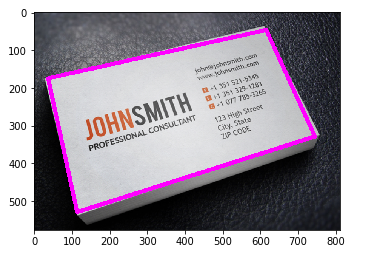


```python
img = cv2.imread("namecard2.png")

height, width = img.shape[:2]

# 좌표 순서 - 상단왼쪽 끝, 상단오른쪽 끝, 하단왼쪽 끝, 하단오른쪽 끝
point_list = [[86, 205], [1060,66], [316,969], [1249,550]]

pts1 = np.array([[86, 205], [1060,66], [316,969], [1249,550]], dtype="float32")
print(pts1)

pts2 = np.float32([[0,0],[width,0],[0,height],[width,height]])
print(pts2)

pts2 = np.float32([[0,0],[width,0],[0,height],[width,height]])
#pts2 = np.float32([[0,0],[width/2,0],[0,height/2],[width/2,height/2]])

M = cv2.getPerspectiveTransform(pts1,pts2)
print(M)


img_result = cv2.warpPerspective(img, M, (width,height))
#img_result = cv2.warpPerspective(img, M, (int(width/2),int(height/2)))
imshow("", img)
imshow("", img_result)
```

    [[  86.  205.]
     [1060.   66.]
     [ 316.  969.]
     [1249.  550.]]
    [[   0.    0.]
     [1295.    0.]
     [   0.  971.]
     [1295.  971.]]
    [[ 8.44531316e-01 -2.54243721e-01 -2.05097304e+01]
     [ 1.87316734e-01  1.31256474e+00 -2.85185012e+02]
     [-3.30071219e-04  1.87225245e-04  1.00000000e+00]]

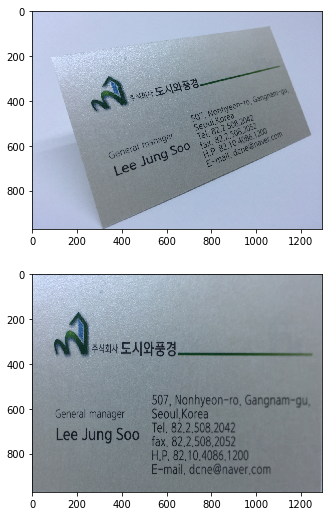


```python
import pytesseract
pytesseract.pytesseract.tesseract_cmd = r'C:\Program Files\Tesseract-OCR\tesseract'

str = pytesseract.image_to_string(img_result)

print(str)
```

    i EAIEZ
    
    507, Nonhyeon-ro, Gangnam-gu,
    General manager Seoul,Korea
    
    Tel, 82.2,508.2042
    Lee Jung S00 ¢,,' 39'7'508 2052
    
    H.P. 82.10.4086. 1200
    
    E-mail. dcne@naver.com


