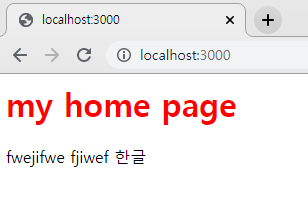
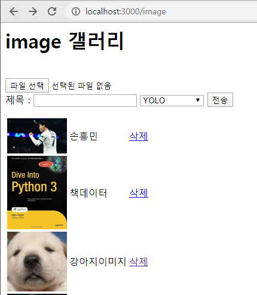
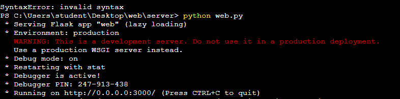

# web 만들기

## HTML

### home.html

```html
<font color=red><h1> {{title}} </h1> </font>
fwejifwe    fjiwef  한글
```



### image.html

```html
<head>
<meta charset="utf-8">
<meta name="viewport" content="width=device-width, initialscale=1.0">
</head>


<h1> image 갤러리 </h1>  <br>

<form action = "/fileUpload" method = "POST"
        enctype = "multipart/form-data">
    <input type = "file" name = "file1" /> <br>
    제목 : <input type = text name = title>
    <select name=algorithm>
        <option value=0>YOLO</option>
        <option value=1>face detection</option>
    </select>
    <input type = "submit" value="전송"/>
</form>

<table>
         
    <tr>        
        <td> <a href=/view?id={{s.id}}>  </a> </td>
           <td> {{s.title}}    </td>
        <td> <a href=/deleteimage?id={{s.id}}>삭제</a> </td>
    </tr>    
    
</table>
```

### upload.html

```html
<script>
    alert("업로드가 성공했습니다.")
    
    window.location.href = "/image"
    
</script>
```

### view.html

```html
<head>
<meta charset="utf-8">
<meta name="viewport" content="width=device-width, initialscale=1.0">
</head>

<font size=20 > {{s.title}}  </font>   <br>

<br>
<a href=/image> 목록으로 </a>
```

## 파이썬 파일

### web.py

```python
from flask import Flask, render_template, request
import yolo
app = Flask(__name__)


listData = [{"id":0, "img":"son7.jpg", "title":"손흥민"}, 
            {"id":1, "img":"book2.jpg", "title":"책데이터"}, 
            {"id":2, "img":"dog.jpg", "title":"강아지이미지"}]

@app.route('/')
def index():
    return render_template('home.html', title="my home page")

@app.route('/image')
def image(): 
    return render_template('image.html', listData=listData)

@app.route('/view')   # /view?id=0
def view():    
    id = int(request.args.get("id"))
    
    idx = -1
    for i in range(len(listData)) :
        if id == listData[i]["id"] :
            idx = i            
    return render_template('view.html', s = listData[idx] )


def goURL(msg, url) :
   html = """        
<script>    
      alert("@msg");        
      window.location.href = "@url";
</script>
    """
   
   html = html.replace("@msg", msg)
   html = html.replace("@url", url)
   return html    

@app.route('/fileUpload', methods = ['POST'])
def fileUpload():
    f = request.files['file1']
    f.save("./static/" + f.filename)
    title = request.form.get("title")    
    
    id = listData[len(listData)-1]["id"] + 1    
    listData.append({"id":id, "img":f.filename, "title":title})   
    yolo.detectObject("./static/" + f.filename)
    return goURL("업로드가 성공했습니다.",  "/image")

@app.route('/deleteimage')  # /deleteage?id=0
def deleteimage():        
    idx = -1
    id = int(request.args.get("id"))   
    for i in range(len(listData)) :
        if id == listData[i]["id"] :
            idx = i            
    if idx >= 0 : del listData[idx]                
        
    return goURL("자료를 삭제했습니다.",  "/image")


if __name__ == '__main__':
    app.run(host='0.0.0.0', port=3000, debug=True)
```



### yolo.py

```python
import cv2 as cv
import argparse
import numpy as np

confThreshold = 0.5  #Confidence threshold
nmsThreshold = 0.4   #Non-maximum suppression threshold
inpWidth = 416       #Width of network's input image
inpHeight = 416      #Height of network's input image

# Load names of classes
classesFile = "coco.names"
classes = None
with open(classesFile, 'rt') as f:
    classes = f.read().rstrip('\n').split('\n')
# Give the configuration and weight files for the model and load the network using them.
modelConfiguration = "yolov3.cfg"
modelWeights = "yolov3.weights"

net = cv.dnn.readNetFromDarknet(modelConfiguration, modelWeights)
net.setPreferableBackend(cv.dnn.DNN_BACKEND_OPENCV)
net.setPreferableTarget(cv.dnn.DNN_TARGET_CPU)


# Get the names of the output layers
def getOutputsNames(net):
    # Get the names of all the layers in the network
    layersNames = net.getLayerNames()
    # Get the names of the output layers, i.e. the layers with unconnected outputs
    return [layersNames[i[0] - 1] for i in net.getUnconnectedOutLayers()]

# Draw the predicted bounding box
def drawPred(frame, classId, conf, left, top, right, bottom):
    # Draw a bounding box.
    cv.rectangle(frame, (left, top), (right, bottom), (255, 178, 50), 3)
    
    label = '%.2f' % conf
        
    # Get the label for the class name and its confidence
    if classes:
        assert(classId < len(classes))
        label = '%s:%s' % (classes[classId], label)

    #Display the label at the top of the bounding box
    labelSize, baseLine = cv.getTextSize(label, cv.FONT_HERSHEY_SIMPLEX, 0.5, 1)
    top = max(top, labelSize[1])
    cv.rectangle(frame, (left, top - round(1.5*labelSize[1])), (left + round(1.5*labelSize[0]), top + baseLine), (255, 255, 255), cv.FILLED)
    cv.putText(frame, label, (left, top), cv.FONT_HERSHEY_SIMPLEX, 0.75, (0,0,0), 1)

# Remove the bounding boxes with low confidence using non-maxima suppression
def postprocess(frame, outs):
    frameHeight = frame.shape[0]
    frameWidth = frame.shape[1]

    # Scan through all the bounding boxes output from the network and keep only the
    # ones with high confidence scores. Assign the box's class label as the class with the highest score.
    classIds = []
    confidences = []
    boxes = []
    for out in outs:
        for detection in out:
            scores = detection[5:]
            classId = np.argmax(scores)
            confidence = scores[classId]
            if confidence > confThreshold:
                center_x = int(detection[0] * frameWidth)
                center_y = int(detection[1] * frameHeight)
                width = int(detection[2] * frameWidth)
                height = int(detection[3] * frameHeight)
                left = int(center_x - width / 2)
                top = int(center_y - height / 2)
                classIds.append(classId)
                confidences.append(float(confidence))
                boxes.append([left, top, width, height])

    # Perform non maximum suppression to eliminate redundant overlapping boxes with
    # lower confidences.
    indices = cv.dnn.NMSBoxes(boxes, confidences, confThreshold, nmsThreshold)
    for i in indices:
        i = i[0]
        box = boxes[i]
        left = box[0]
        top = box[1]
        width = box[2]
        height = box[3]
        drawPred(frame, classIds[i], confidences[i], left, top, left + width, top + height)  
        
        
def detectObject(filename) :
    frame = cv.imread(filename)
    blob = cv.dnn.blobFromImage(frame, 1/255, (inpWidth, inpHeight), [0,0,0], 1, crop=False)
    net.setInput(blob)
    outs = net.forward(getOutputsNames(net))
    postprocess(frame, outs)
    cv.imwrite(filename, frame)   
    print(filename)
```


## 터미널

> 쥬피터 노트북에서 터미널로 들어가서
>
> python web.py



